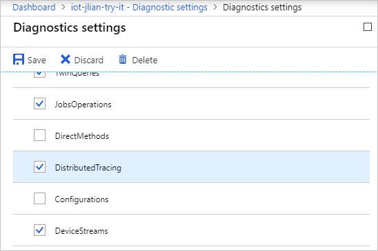
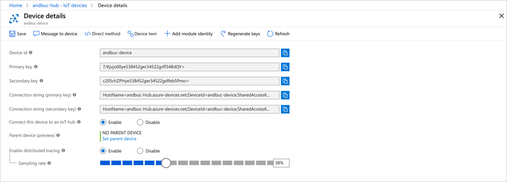
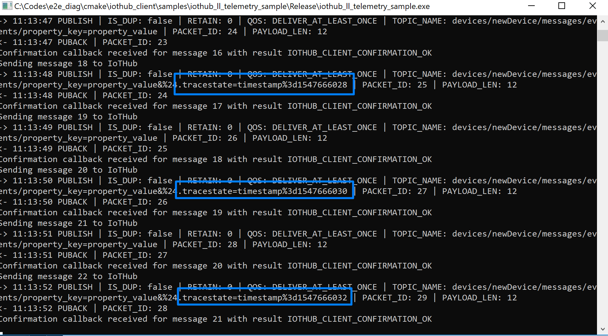
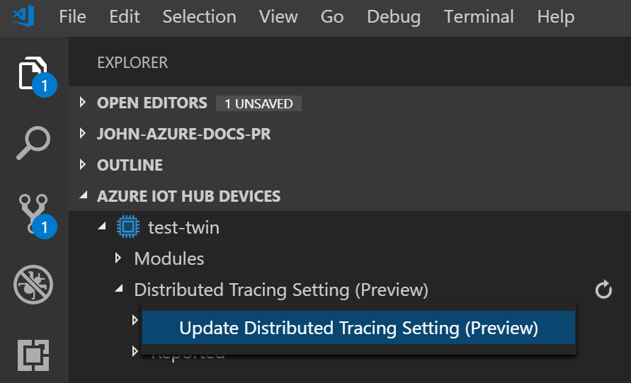
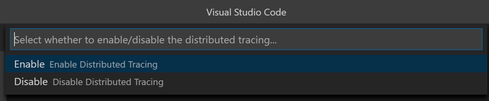
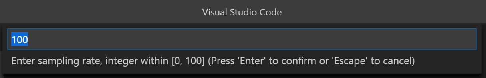
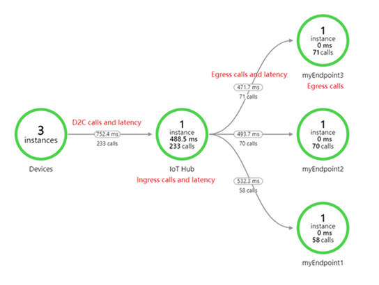

# Trace Azure IoT device-to-cloud messages with distributed tracing (preview)

Microsoft Azure IoT Hub currently supports distributed tracing as a [preview feature](https://azure.microsoft.com/support/legal/preview-supplemental-terms/).

IoT Hub is one of the first Azure services to support distributed tracing. As more Azure services support distributed tracing, you'll be able trace IoT messages throughout the Azure services involved in your solution. For a background on distributed tracing, see [Distributed Tracing](../azure-monitor/app/distributed-tracing.md).

Enabling distributed tracing for IoT Hub gives you the ability to:

- Precisely monitor the flow of each message through IoT Hub using [trace context](https://github.com/w3c/trace-context). This trace context includes correlation IDs that allow you to correlate events from one component with events from another component. It can be applied for a subset or all IoT device messages using [device twin](iot-hub-devguide-device-twins.md).
- Automatically log the trace context to [Azure Monitor diagnostic logs](iot-hub-monitor-resource-health.md).
- Measure and understand message flow and latency from devices to IoT Hub and routing endpoints.
- Start considering how you want to implement distributed tracing for the non-Azure services in your IoT solution.

In this article, you use the [Azure IoT device SDK for C](./iot-hub-device-sdk-c-intro.md) with distributed tracing. Distributed tracing support is still in progress for the other SDKs.

## Prerequisites

- The preview of distributed tracing is currently only supported for IoT Hubs created in the following regions:

  - **North Europe**
  - **Southeast Asia**
  - **West US 2**

- This article assumes that you're familiar with sending telemetry messages to your IoT hub. Make sure you've completed the [Send telemetry C Quickstart](./quickstart-send-telemetry-c.md).

- Register a device with your IoT hub (steps available in each Quickstart) and note down the connection string.

- Install the latest version of [Git](https://git-scm.com/download/).

## Configure IoT Hub

In this section, you configure an IoT Hub to log distributed tracing attributes (correlation IDs and timestamps).

1. Navigate to your IoT hub in the [Azure portal](https://portal.azure.com/).

1. In the left pane for your IoT hub, scroll down to the **Monitoring** section and click **Diagnostics settings**.

1. If diagnostic settings aren't already turned on, click **Turn on diagnostics**. If you have already enabled diagnostic settings, click **Add diagnostic setting**.

1. In the **Name** field, enter a name for a new diagnostic setting. For example, **DistributedTracingSettings**.

1. Choose one or more of the following options that determine where the logging will be sent:

    - **Archive to a storage account**: Configure a storage account to contain the logging information.
    - **Stream to an event hub**: Configure an event hub to contain the logging information.
    - **Send to Log Analytics**: Configure a log analytics workspace to contain the logging information.

1. In the **Log** section, select the operations that you want logging information for.

    Make sure to include **DistributedTracing**, and configure a **Retention** for how many days you want the logging retained. Log retention does affect storage costs.

    

1. Click **Save** for the new setting.

1. (Optional) To see the messages flow to different places, set up [routing rules to at least two different endpoints](iot-hub-devguide-messages-d2c.md).

Once the logging is turned on, IoT Hub records a log when a message containing valid trace properties is encountered in any of the following situations:

- The messages arrives at IoT Hub's gateway.
- The message is processed by the IoT Hub.
- The message is routed to custom endpoints. Routing must be enabled.

To learn more about these logs and their schemas, see [Distributed tracing in IoT Hub diagnostic logs](iot-hub-monitor-resource-health.md#distributed-tracing-preview).

## Set up device

In this section, you prepare a development environment for use with the [Azure IoT C SDK](https://github.com/Azure/azure-iot-sdk-c). Then, you modify one of samples to enable distributed tracing on your device's telemetry messages.

These instructions are for building the sample on Windows. For other environments, see [Compile the C SDK](https://github.com/Azure/azure-iot-sdk-c/blob/master/iothub_client/readme.md#compile) or [Prepackaged C SDK for Platform Specific Development](https://github.com/Azure/azure-iot-sdk-c/blob/master/iothub_client/readme.md#prepackaged-c-sdk-for-platform-specific-development).

### Clone the source code and initialize

1. Install ["Desktop development with C++" workload](https://docs.microsoft.com/cpp/build/vscpp-step-0-installation?view=vs-2017) for either Visual Studio 2015 or 2017.

1. Install [CMake](https://cmake.org/). Make sure it is in your `PATH` by typing `cmake -version` from a command prompt.

1. Open a command prompt or Git Bash shell. Execute the following command to clone the [Azure IoT C SDK](https://github.com/Azure/azure-iot-sdk-c) GitHub repository:

    ```cmd
    git clone https://github.com/Azure/azure-iot-sdk-c.git --recursive -b public-preview
    ```

    You should expect this operation to take several minutes to complete.

1. Create a `cmake` subdirectory in the root directory of the git repository, and navigate to that folder.

    ```cmd
    cd azure-iot-sdk-c    
    mkdir cmake
    cd cmake
    cmake ..
    ```

    If `cmake` can't find your C++ compiler, you might get build errors while running the above command. If that happens, try running this command in the [Visual Studio command prompt](https://docs.microsoft.com/dotnet/framework/tools/developer-command-prompt-for-vs). 

    Once the build succeeds, the last few output lines will look similar to the following output:

    ```cmd
    $ cmake ..
    -- Building for: Visual Studio 15 2017
    -- Selecting Windows SDK version 10.0.16299.0 to target Windows 10.0.17134.
    -- The C compiler identification is MSVC 19.12.25835.0
    -- The CXX compiler identification is MSVC 19.12.25835.0

    ...

    -- Configuring done
    -- Generating done
    -- Build files have been written to: E:/IoT Testing/azure-iot-sdk-c/cmake
    ```

### Edit the send telemetry sample to enable distributed tracing

1. Use an editor to open the `azure-iot-sdk-c/iothub_client/samples/iothub_ll_telemetry_sample/iothub_ll_telemetry_sample.c` source file.

1. Find the declaration of the `connectionString` constant:

    [!code-c[](~/samples-iot-distributed-tracing/iothub_ll_telemetry_sample-c/iothub_ll_telemetry_sample.c?name=snippet_config&highlight=2)]

    Replace the value of the `connectionString` constant with the device connection string you made a note of in the [register a device](./quickstart-send-telemetry-c.md#register-a-device) section of the [Send telemetry C Quickstart](./quickstart-send-telemetry-c.md).

1. Change the `MESSAGE_COUNT` define to `5000`:

    [!code-c[](~/samples-iot-distributed-tracing/iothub_ll_telemetry_sample-c/iothub_ll_telemetry_sample.c?name=snippet_config&highlight=3)]

1. Find the line of code that calls `IoTHubDeviceClient_LL_SetConnectionStatusCallback` to register a connection status callback function before the send message loop. Add code under that line as shown below to call `IoTHubDeviceClient_LL_EnablePolicyConfiguration` enabling distributed tracing for the device:

    [!code-c[](~/samples-iot-distributed-tracing/iothub_ll_telemetry_sample-c/iothub_ll_telemetry_sample.c?name=snippet_tracing&highlight=5)]

    The `IoTHubDeviceClient_LL_EnablePolicyConfiguration` function enables policies for specific IoTHub features that are configured via [device twins](./iot-hub-devguide-device-twins.md). Once `POLICY_CONFIGURATION_DISTRIBUTED_TRACING` is enabled with the line of code above, the tracing behavior of the device will reflect distributed tracing changes made on the device twin.

1. To keep the sample app running without using up all your quota, add a one-second delay at the end of the send message loop:

    [!code-c[](~/samples-iot-distributed-tracing/iothub_ll_telemetry_sample-c/iothub_ll_telemetry_sample.c?name=snippet_sleep&highlight=8)]

### Compile and run

1. Navigate to the *iothub_ll_telemetry_sample* project directory from the CMake directory (`azure-iot-sdk-c/cmake`) you created earlier, and compile the sample:

    ```cmd
    cd iothub_client/samples/iothub_ll_telemetry_sample
    cmake --build . --target iothub_ll_telemetry_sample --config Debug
    ```

1. Run the application. The device sends telemetry supporting distributed tracing.

    ```cmd
    Debug/iothub_ll_telemetry_sample.exe
    ```

1. Keep the app running. Optionally observe the message being sent to IoT Hub by looking at the console window.

<!-- For a client app that can receive sampling decisions from the cloud, check out [this sample](https://aka.ms/iottracingCsample).  -->

### Workaround for third-party clients

It's **not trivial** to preview the distributed tracing feature without using the C SDK. Thus, this approach is not recommended.

First, you must implement all the IoT Hub protocol primitives in your messages by following the dev guide [Create and read IoT Hub messages](iot-hub-devguide-messages-construct.md). Then, edit the protocol properties in the MQTT/AMQP messages to add `tracestate` as **system property**. Specifically,

* For MQTT, add `%24.tracestate=timestamp%3d1539243209` to the message topic, where `1539243209` should be replaced with the creation time of the message in the unix timestamp format. As an example, refer to the implementation [in the C SDK](https://github.com/Azure/azure-iot-sdk-c/blob/6633c5b18710febf1af7713cf1a336fd38f623ed/iothub_client/src/iothubtransport_mqtt_common.c#L761)
* For AMQP, add `key("tracestate")` and `value("timestamp=1539243209")` as message annotation. For a reference implementation, see [here](https://github.com/Azure/azure-iot-sdk-c/blob/6633c5b18710febf1af7713cf1a336fd38f623ed/iothub_client/src/uamqp_messaging.c#L527).

To control the percentage of messages containing this property, implement logic to listen to cloud-initiated events such as twin updates.

## Update sampling options 

To change the percentage of messages to be traced from the cloud, you must update the device twin. You can accomplish this multiple ways including the JSON editor in portal and the IoT Hub service SDK. The following subsections provide examples.

### Update using the portal

1. Navigate to your IoT hub in [Azure portal](https://portal.azure.com/), then click **IoT devices**.

1. Click your device.

1. Look for **Enable distributed tracing (preview)**, then select **Enable**.

    

1. Choose a **Sampling rate** between 0% and 100%.

1. Click **Save**.

1. Wait a few seconds, and hit **Refresh**, then if successfully acknowledged by device, a sync icon with a checkmark appears.

1. Go back to the console window for the telemetry message app. You will see messages being sent with `tracestate` in the application properties.

    

1. (Optional) Change the sampling rate to a different value, and observe the change in frequency that messages include `tracestate` in the application properties.

### Update using Azure IoT Hub Toolkit for VS Code

1. Install VS Code, then install the latest version of Azure IoT Hub Toolkit for VS Code from [here](https://marketplace.visualstudio.com/items?itemName=vsciot-vscode.azure-iot-tools).

1. Open VS Code and [set up IoT Hub connection string](https://marketplace.visualstudio.com/items?itemName=vsciot-vscode.azure-iot-toolkit#user-content-prerequisites).

1. Expand the device and look for **Distributed Tracing Setting (Preview)**. Under it, click **Update Distributed Tracing Setting (Preview)** of sub node.

    

1. In the popup window, select **Enable**, then press Enter to confirm 100 as sampling rate.

    

    

### Bulk update for multiple devices

To update the distributed tracing sampling configuration for multiple devices, use [automatic device configuration](iot-hub-auto-device-config.md). Make sure you follow this twin schema:

```json
{
    "properties": {
        "desired": {
            "azureiot*com^dtracing^1": {
                "sampling_mode": 1,
                "sampling_rate": 100
            }
        }
    }
}
```

| Element name | Required | Type | Description |
|-----------------|----------|---------|-----------------------------------------------------|
| `sampling_mode` | Yes | Integer | Two mode values are currently supported to turn sampling on and off. `1` is On and, `2` is Off. |
| `sampling_rate` | Yes | Integer | This value is a percentage. Only values from `0` to `100` (inclusive) are permitted.  |

## Query and visualize

To see all the traces logged by an IoT Hub, query the log store that you selected in diagnostic settings. This section walks through a couple different options.

### Query using Log Analytics

If you've set up [Log Analytics with diagnostic logs](../azure-monitor/platform/diagnostic-logs-stream-log-store.md), query by looking for logs in the `DistributedTracing` category. For example, this query shows all the traces logged:

```Kusto
// All distributed traces 
AzureDiagnostics 
| where Category == "DistributedTracing" 
| project TimeGenerated, Category, OperationName, Level, CorrelationId, DurationMs, properties_s 
| order by TimeGenerated asc  
```

Example logs as shown by Log Analytics:

| TimeGenerated | OperationName | Category | Level | CorrelationId | DurationMs | Properties |
|--------------------------|---------------|--------------------|---------------|---------------------------------------------------------|------------|------------------------------------------------------------------------------------------------------------------------------------------|
| 2018-02-22T03:28:28.633Z | DiagnosticIoTHubD2C | DistributedTracing | Informational | 00-8cd869a412459a25f5b4f31311223344-0144d2590aacd909-01 |  | {"deviceId":"AZ3166","messageSize":"96","callerLocalTimeUtc":"2018-02-22T03:27:28.633Z","calleeLocalTimeUtc":"2018-02-22T03:27:28.687Z"} |
| 2018-02-22T03:28:38.633Z | DiagnosticIoTHubIngress | DistributedTracing | Informational | 00-8cd869a412459a25f5b4f31311223344-349810a9bbd28730-01 | 20 | {"isRoutingEnabled":"false","parentSpanId":"0144d2590aacd909"} |
| 2018-02-22T03:28:48.633Z | DiagnosticIoTHubEgress | DistributedTracing | Informational | 00-8cd869a412459a25f5b4f31311223344-349810a9bbd28730-01 | 23 | {"endpointType":"EventHub","endpointName":"myEventHub", "parentSpanId":"0144d2590aacd909"} |

To understand the different types of logs, see [Azure IoT Hub diagnostic logs](iot-hub-monitor-resource-health.md#distributed-tracing-preview).

### Application Map

To visualize the flow of IoT messages, set up the Application Map sample app. The sample app sends the distributed tracing logs to [Application Map](../application-insights/app-insights-app-map.md) using an Azure Function and an Event Hub.

> [!div class="button"]
> <a href="https://github.com/Azure-Samples/e2e-diagnostic-provision-cli" target="_blank">Get the sample on Github</a>

This image below shows distributed tracing in App Map with three routing endpoints:



## Understand Azure IoT distributed tracing

### Context

Many IoT solutions, including our own [reference architecture](https://aka.ms/iotrefarchitecture) (English only), generally follow a variant of the [microservice architecture](https://docs.microsoft.com/azure/architecture/microservices/). As an IoT solution grows more complex, you end up using a dozen or more microservices. These microservices may or may not be from Azure. Pinpointing where IoT messages are dropping or slowing down can become challenging. For example, you have an IoT solution that uses 5 different Azure services and 1500 active devices. Each device sends 10 device-to-cloud messages/second (for a total of 15,000 messages/second), but you notice that your web app sees only 10,000 messages/second. Where is the issue? How do you find the culprit?

### Distributed tracing pattern in microservice architecture

To reconstruct the flow of an IoT message across different services, each service should propagate a *correlation ID* that uniquely identifies the message. Once collected in a centralized system, correlation IDs enable you to see message flow. This method is called the [distributed tracing pattern](https://docs.microsoft.com/azure/architecture/microservices/logging-monitoring#distributed-tracing).

To support wider adoption for distributed tracing, Microsoft is contributing to [W3C standard proposal for distributed tracing](https://w3c.github.io/trace-context/).

### IoT Hub support

Once enabled, distributed tracing support for IoT Hub will follow this flow:

1. A message is generated on the IoT device.
1. The IoT device decides (with help from cloud) that this message should be assigned with a trace context.
1. The SDK adds a `tracestate` to the message application property, containing the message creation timestamp.
1. The IoT device sends the message to IoT Hub.
1. The message arrives at IoT hub gateway.
1. IoT Hub looks for the `tracestate` in the message application properties, and checks to see if it's in the correct format.
1. If so, IoT Hub generates and logs the `trace-id` and `span-id` to Azure Monitor diagnostic logs under the category `DiagnosticIoTHubD2C`.
1. Once the message processing is finished, IoT Hub generates another `span-id` and logs it along with the existing `trace-id` under the category `DiagnosticIoTHubIngress`.
1. If routing is enabled for the message, IoT Hub writes it to the custom endpoint, and logs another `span-id` with the same `trace-id` under the category `DiagnosticIoTHubEgress`.
1. The steps above are repeated for each message generated.

## Public preview limits and considerations

- Proposal for W3C Trace Context standard is currently a working draft.
- Currently, the only development language supported by client SDK is C.
- Cloud-to-device twin capability isn't available for [IoT Hub basic tier](iot-hub-scaling.md#basic-and-standard-tiers). However, IoT Hub will still log to Azure Monitor if it sees a properly composed trace context header.
- To ensure efficient operation, IoT Hub will impose a throttle on the rate of logging that can occur as part of distributed tracing.

## Next steps

- To learn more about the general distributed tracing pattern in microservices, see [Microservice architecture pattern: distributed tracing](https://microservices.io/patterns/observability/distributed-tracing.html).
- To set up configuration to apply distributed tracing settings to a large number of devices, see [Configure and monitor IoT devices at scale](iot-hub-auto-device-config.md).
- To learn more about Azure Monitor, see [What is Azure Monitor?](../azure-monitor/overview.md).
