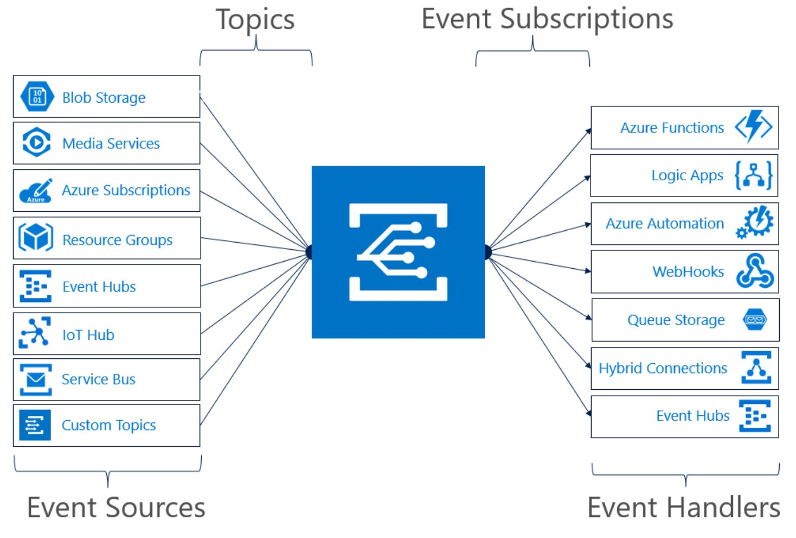

# React to IoT Hub events by using Event Grid to trigger actions

Azure IoT Hub integrates with Azure Event Grid so that you can send event notifications to other services and trigger downstream processes. Configure your business applications to listen for IoT Hub events so that you can react to critical events in a reliable, scalable, and secure manner. For example, build an application to perform multiple actions like updating a database, creating a ticket, and delivering an email notification every time a new IoT device is registered to your IoT hub. 

[Azure Event Grid](../event-grid/overview.md) is a fully managed event routing service that uses a publish-subscribe model. Event Grid has built-in support for Azure services like [Azure Functions](../azure-functions/functions-overview.md) and [Azure Logic Apps](../logic-apps/logic-apps-what-are-logic-apps.md), and can deliver event alerts to non-Azure services using webhooks. For a complete list of the event handlers that Event Grid supports, see [An introduction to Azure Event Grid](../event-grid/overview.md). 



## Regional availability

The Event Grid integration is available for IoT hubs located in the regions where Event Grid is supported. For the latest list of regions, see [An introduction to Azure Event Grid](../event-grid/overview.md). 

## Event types

IoT Hub publishes the following event types: 

| Event type | Description |
| ---------- | ----------- |
| Microsoft.Devices.DeviceCreated | Published when a device is registered to an IoT hub. |
| Microsoft.Devices.DeviceDeleted | Published when a device is deleted from an IoT hub. |
| Microsoft.Devices.DeviceConnected | Published when a device is connected to an IoT hub. |
| Microsoft.Devices.DeviceDisconnected | Published when a device is disconnected from an IoT hub. |

Use either the Azure portal or Azure CLI to configure which events to publish from each IoT hub. For an example, try the tutorial [Send email notifications about Azure IoT Hub events using Logic Apps](../event-grid/publish-iot-hub-events-to-logic-apps.md).

## Event schema

IoT Hub events contain all the information you need to respond to changes in your device lifecycle. You can identify an IoT Hub event by checking that the eventType property starts with **Microsoft.Devices**. For more information about how to use Event Grid event properties, see the [Event Grid event schema](../event-grid/event-schema.md).

### Device connected schema

The following example shows the schema of a device connected event: 

```json
[{  
  "id": "f6bbf8f4-d365-520d-a878-17bf7238abd8", 
  "topic": "/SUBSCRIPTIONS/<subscription ID>/RESOURCEGROUPS/<resource group name>/PROVIDERS/MICROSOFT.DEVICES/IOTHUBS/<hub name>", 
  "subject": "devices/LogicAppTestDevice", 
  "eventType": "Microsoft.Devices.DeviceConnected", 
  "eventTime": "2018-06-02T19:17:44.4383997Z", 
  "data": {
      "deviceConnectionStateEventInfo": {
        "sequenceNumber":
          "000000000000000001D4132452F67CE200000002000000000000000000000001"
      },
    "hubName": "egtesthub1",
    "deviceId": "LogicAppTestDevice",
    "moduleId" : "DeviceModuleID",
  }, 
  "dataVersion": "1", 
  "metadataVersion": "1" 
}]
```

### Device created schema

The following example shows the schema of a device created event: 

```json
[{
  "id": "56afc886-767b-d359-d59e-0da7877166b2",
  "topic": "/SUBSCRIPTIONS/<subscription ID>/RESOURCEGROUPS/<resource group name>/PROVIDERS/MICROSOFT.DEVICES/IOTHUBS/<hub name>",
  "subject": "devices/LogicAppTestDevice",
  "eventType": "Microsoft.Devices.DeviceCreated",
  "eventTime": "2018-01-02T19:17:44.4383997Z",
  "data": {
    "twin": {
      "deviceId": "LogicAppTestDevice",
      "etag": "AAAAAAAAAAE=",
      "deviceEtag":"null",
      "status": "enabled",
      "statusUpdateTime": "0001-01-01T00:00:00",
      "connectionState": "Disconnected",
      "lastActivityTime": "0001-01-01T00:00:00",
      "cloudToDeviceMessageCount": 0,
      "authenticationType": "sas",
      "x509Thumbprint": {
        "primaryThumbprint": null,
        "secondaryThumbprint": null
      },
      "version": 2,
      "properties": {
        "desired": {
          "$metadata": {
            "$lastUpdated": "2018-01-02T19:17:44.4383997Z"
          },
          "$version": 1
        },
        "reported": {
          "$metadata": {
            "$lastUpdated": "2018-01-02T19:17:44.4383997Z"
          },
          "$version": 1
        }
      }
    },
    "hubName": "egtesthub1",
    "deviceId": "LogicAppTestDevice"
  },
  "dataVersion": "1",
  "metadataVersion": "1"
}]
```

For a detailed description of each property, see [Azure Event Grid event schema for IoT Hub](../event-grid/event-schema-iot-hub.md)

## Filter events

IoT Hub event subscriptions can filter events based on event type and device name. Subject filters in Event Grid work based on **Begins With** (prefix) and **Ends With** (suffix) matches. The filter uses an `AND` operator, so events with a subject that match both the prefix and suffix are delivered to the subscriber. 

The subject of IoT Events uses the format:

```json
devices/{deviceId}
```
## Limitations for device connected and device disconnected events

To receive device connected and device disconnected events, you must open the D2C link or C2D link for your device. If your device is using MQTT protocol, IoT Hub will keep the C2D link open. For AMQP you can open the C2D link by calling the [Receive Async API](https://docs.microsoft.com/dotnet/api/microsoft.azure.devices.client.deviceclient.receiveasync?view=azure-dotnet). 

The D2C link is open if you are sending telemetry. If the device connection is flickering, i.e. the device connects and disconnects frequently, we will not send every single connection state, but will publish the connection state that is snapshotted every minute. In case of an IoT Hub outage, we will publish the device connection state as soon as the outage is over. If the device disconnects during that outage, the device disconnected event will be published within 10 minutes.

## Tips for consuming events

Applications that handle IoT Hub events should follow these suggested practices:

* Multiple subscriptions can be configured to route events to the same event handler, so it's important not to assume that events are from a particular source. Always check the message topic to ensure that it comes from the IoT hub that you expect. 

* Don't assume that all events you receive are the types that you expect. Always check the eventType before processing the message.

* Messages can arrive out of order or after a delay. Use the etag field to understand if your information about objects is up-to-date.

## Next steps

* [Try the IoT Hub events tutorial](../event-grid/publish-iot-hub-events-to-logic-apps.md)
* [Learn how to order device connected and disconnected events](iot-hub-how-to-order-connection-state-events.md)
* [Learn more about Event Grid](../event-grid/overview.md)
* [Compare the differences between routing IoT Hub events and messages](iot-hub-event-grid-routing-comparison.md)
