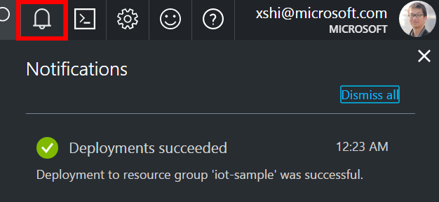
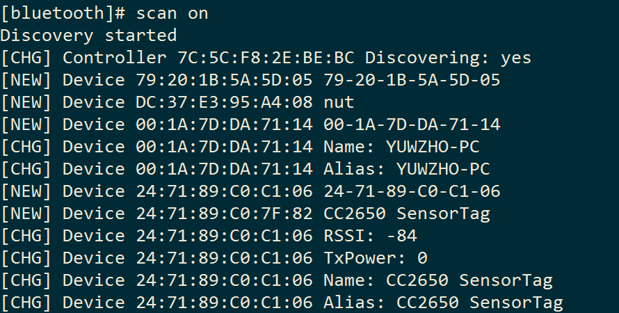
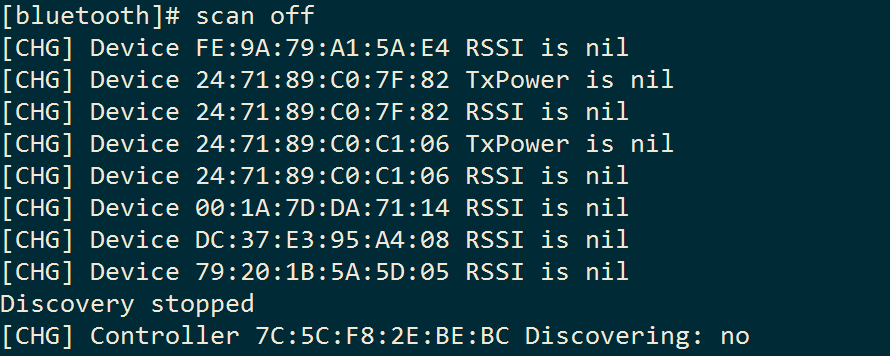
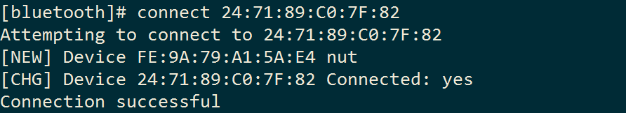
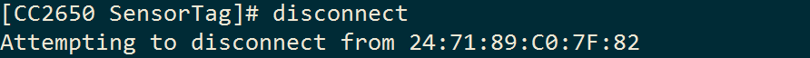
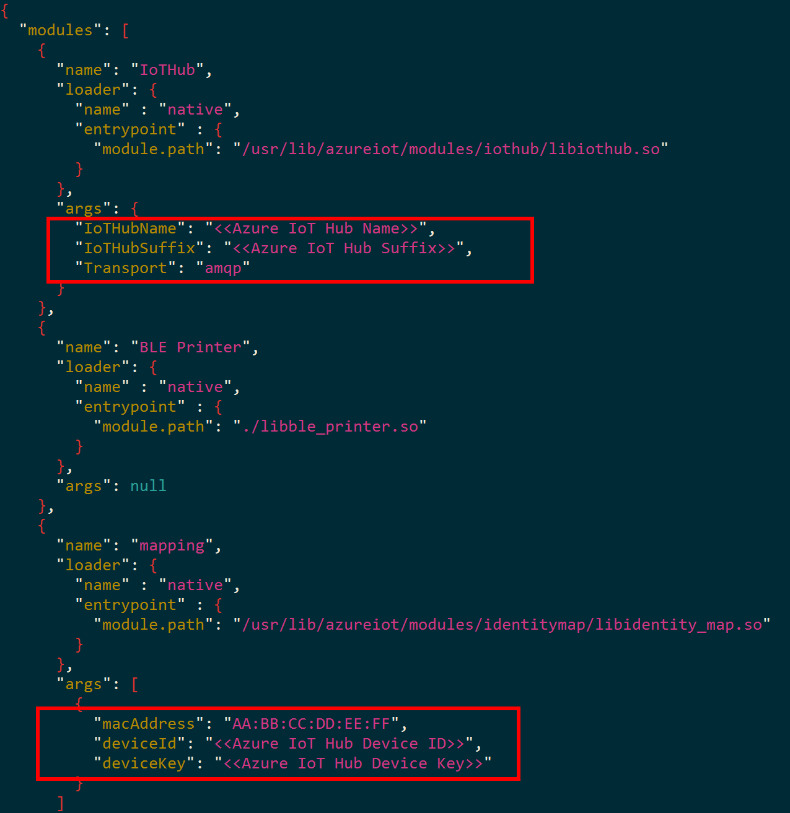

# Use IoT gateway to connect things to the cloud - SensorTag to Azure IoT Hub

> [!NOTE]
> Before you start this tutorial, make sure you’ve completed [Set up Intel NUC as an IoT gateway](iot-hub-gateway-kit-c-lesson1-set-up-nuc.md). In [Set up Intel NUC as an IoT gateway](iot-hub-gateway-kit-c-lesson1-set-up-nuc.md), you set up the Intel NUC device as an IoT gateway.

## What you will learn

You learn how to use an IoT gateway to connect a Texas Instruments SensorTag (CC2650STK) to Azure IoT Hub. The IoT gateway sends temperature and humidity data collected from the SensorTag to Azure IoT Hub.

## What you will do

- Create an IoT hub.
- Register a device in the IoT hub for the SensorTag.
- Enable the connection between the IoT gateway and the SensorTag.
- Run a BLE sample application to send SensorTag data to your IoT hub.

## What you need

- Tutorial [Set up Intel NUC as an IoT gateway](iot-hub-gateway-kit-c-lesson1-set-up-nuc.md) completed in which you set up Intel NUC as an IoT gateway.
- An SSH client that runs on your host computer. PuTTY is recommended on Windows. Linux and macOS already come with an SSH client.
- The IP address and the username and password to access the gateway from the SSH client.
- An Internet connection.

## Create an IoT hub

1. In the [Azure portal](https://portal.azure.com/), click **New** > **Internet of Things** > **IoT Hub**.

   
1. In the **IoT hub** pane, enter the following information for your IoT hub:

   **Name**: It is the name for your IoT hub. If the name you enter is valid, a green check mark appears.

   **Pricing and scale tier**: Select the free F1 tier. This option is sufficient for this demo. See [pricing and scale tier](https://azure.microsoft.com/pricing/details/iot-hub/).

   **Resource group**: Create a resource group to host the IoT hub or use an existing one. See [Using resource groups to manage your Azure resources](../azure-resource-manager/resource-group-portal.md).

   **Location**: Select the closest location to you where the IoT hub is created.

   **Pin the dashboard**: Check this option for easy access to your IoT hub from the dashboard.

   

1. Click **Create**. It could take a few minutes for your IoT hub to be created. You can see progress in the **Notifications** pane.

   

1. Once your IoT hub is created, click it from the dashboard. Make a note of the **Hostname**, and then click **Shared access policies**.

   

1. In the **Shared access policies** pane, click the **iothubowner** policy, and then copy and make a note of the **Connection string** of your IoT hub. For more information, see [Control access to IoT Hub](iot-hub-devguide-security.md).

   

## Register a device in the IoT hub for the SensorTag

1. In the [Azure portal](https://portal.azure.com/), open your IoT hub.
1. Click **Device Explorer**.
1. In the Device Explorer pane, click **Add** to add a device to your IoT hub.

   **Device ID**: The ID of the new device.

   **Authentication Type**: Select **Symmetric Key**.

   **Auto Generate Keys**: Check this field.

   **Connect device to IoT Hub**: Click **Enable**.

   

1. Click **Save**.
1. After the device is created, open the device in the **Device Explorer** pane.
1. Make a note of the primary key of the connection string.

   

## Enable the connection between the IoT gateway and the SensorTag

In this section, you perform the following tasks:

- Get the MAC address of the SensorTag for Bluetooth connection.
- Initiate a Bluetooth connection from the IoT gateway to the SensorTag.

### Get the MAC address of the SensorTag for Bluetooth connection

1. On the host computer, run the SSH client and connect to the IoT gateway.
1. Unblock Bluetooth by running the following command:

   ```bash
   sudo rfkill unblock bluetooth
   ```

1. Start the Bluetooth service on the IoT gateway and enter a Bluetooth shell to configure Bluetooth by running the following commands:

   ```bash
   sudo systemctl start bluetooth
   bluetoothctl
   ```

1. Power on the Bluetooth controller by running the following command at the Bluetooth shell:

   ```bash
   power on
   ```

   

1. Start scanning for nearby Bluetooth devices by running the following command:

   ```bash
   scan on
   ```

   

1. Press the pairing button on the SensorTag. The green LED on the SensorTag flashes.
1. At the Bluetooth shell, you should see the SensorTag is found. Make a note of the MAC address of the SensorTag. In this example, the MAC address of the SensorTag is `24:71:89:C0:7F:82`.
1. Turn off the scan by running the following command:

   ```bash
   scan off
   ```

   

### Initiate a Bluetooth connection from the IoT gateway to the SensorTag

1. Connect to the SensorTag by running the following command:

   ```bash
   connect <MAC address>
   ```

   

1. Disconnect from the SensorTag and exit the Bluetooth shell by running the following commands:

   ```bash
   disconnect
   exit
   ```

   

You've successfully enabled the connection between the SensorTag and the IoT gateway.

## Run a BLE sample application to send SensorTag data to your IoT hub

The Bluetooth Low Energy (BLE) sample application is provided by the Azure IoT gateway SDK. The sample application collects data from BLE connection and send the data to you IoT hub. To run the sample application, you need to:

1. Configure the sample application.
1. Run the sample application on the IoT gateway.

### Configure the sample application

1. Go to the folder of the sample application by running the following command:

   ```bash
   cd /user/share/azureiotgatewaysdk/samples
   ```

1. Open the configuration file by running the following command:

   ```bash
   vi ble_gateway.json
   ```

1. In the configuration file, fill in the following values:

   **IoTHubName**: The name of your IoT hub.

   **IoTHubSuffix**: Get IoTHubSuffix from the primary key of the device connection string that you noted down. Ensure that you get the primary key of the device connection string, not the primary key of your IoT hub connection string. The primary key of the device connection string is in the format of `HostName=IOTHUBNAME.IOTHUBSUFFIX;DeviceId=DEVICEID;SharedAccessKey=SHAREDACCESSKEY`.

   **Transport**: The default value is `amqp`. This value shows the protocol during transpotation. It could be `http`, `amqp`, or `mqtt`.

   **macAddress**: The MAC address of the SensorTag that you noted down.

   **deviceID**: ID of the device that you created in your IoT hub.

   **deviceKey**: The primary key of the device connection string.

   

1. Press `ESC` and type `:wq` to save the file.

### Run the sample application

1. Make sure the SensorTag is powered on.
1. Run the following command:

   ```bash
   ./ble_gateway ble_gateway.json
   ```

## Next steps

[Use IoT gateway for sensor data transformation with Azure IoT Gateway SDK](iot-hub-gateway-kit-c-use-iot-gateway-for-data-conversion.md)
