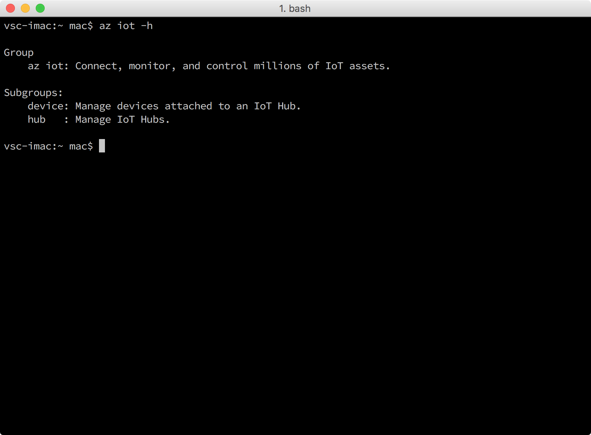

# Get the tools (MacOS)
> [!div class="op_single_selector"]
> * [Windows 7 or later](iot-hub-gateway-kit-c-lesson2-get-the-tools-win32.md)
> * [Ubuntu 16.04](iot-hub-gateway-kit-c-lesson2-get-the-tools-ubuntu.md)
> * [macOS 10.10](iot-hub-gateway-kit-c-lesson2-get-the-tools-mac.md)

## What you will do

- Install Git, Node.js, Gulp, Python.
- Install the Azure command-line interface (Azure CLI). 

If you have any problems, look for solutions on the [troubleshooting page](iot-hub-gateway-kit-c-troubleshooting.md).

## What you will learn

In this lesson, you will learn:

- How to install [Git](https://git-scm.com/) and [Node.js](https://nodejs.org/en/).
  - Git is an open source distributed version control system. The sample application for this lesson is stored on Git.
  - Node.js is a JavaScript runtime with a rich package ecosystem.
- How to use [NPM](https://www.npmjs.com/) to install Node.js development tools.
  - The minimum required version of Node.js is 4.5 LTS.
  - NPM is one of the package managers for Node.js.
- How to install Visual Studio Code.
  - Visual Studio Code is a cross platform, lightweight but powerful source code editor for Windows, Linux, and macOS. It has great support for debugging, embedded Git control, syntax highlighting, intelligent code completion, snippets, and code refactoring as well.
- How to install Python.
  - Python is a widely used high-level, general-purpose, interpreted and dynamic programming language.
- How to install the Azure CLI.
  - The Azure CLI provides a multiplatform command-line experience for Azure. You work directly from a command line to provision and manage resources.
- How to use the Azure CLI to create an IoT hub.

## What you need

- An Internet connection to download the tools and software.
- A Mac computer that’s running OS X Yosemite (10.10) or later.

## Install Git and Node.js

To install Git and Node.js, use the Homebrew package management utility by following these steps:

1. [Download](http://brew.sh/) and install Homebrew. If you’ve already installed Homebrew, go to step 2.
   1. Press `Cmd + Space` and enter `Terminal` to open a terminal.
   2. Run the following command:

      ```bash
      /usr/bin/ruby -e "$(curl -fsSL https://raw.githubusercontent.com/Homebrew/install/master/install)"
      ```

2. Install Git and Node.js by running the following command:

    ```bash
    brew install node git
    ```

## Install Node.js development tools

You use [gulp.js](http://gulpjs.com/) to automate deployment and execution of scripts.

To install gulp, run the following command in the terminal:

```bash
npm install -g gulp
```

If you experience issues with the installation, see the [troubleshooting guide](iot-hub-gateway-kit-c-troubleshooting.md) for solutions to common problems.

> [!Note]
> Node, NPM and Gulp are required to run automation scripts developed in Node.js.

## Install Python

Although Mac OS X comes with Python 2.7, we recommend that you install Python through Homebrew. See [Installing Python on Mac OS X](http://docs.python-guide.org/en/latest/starting/install/osx/).

Install Python and pip by running the following command:

```bash
brew install python
```

## Install the Azure CLI

To install the Azure CLI, follow these steps:

1. Run the following commands in the terminal:
   ```bash
   pip install --upgrade azure-cli
   pip install --upgrade azure-cli-iot
   ```
   The installation might take 5 minutes.

2. Verify the installation by running the following command:
   ```bash
   az iot -h
   ```
   You should see the following output if the installation is successful.

   

## Install Visual Studio Code

You use Visual Studio Code later in the tutorial to edit configuration files.

[Download](https://code.visualstudio.com/docs/setup/osx) and install Visual Studio Code.

## Summary

You’ve installed all the required tools and software on your Mac computer. Your next task is to use the Azure CLI to create an IoT hub and register your device in your IoT hub.

## Next steps
[Create an IoT hub and register Device](iot-hub-gateway-kit-c-lesson2-register-device.md)
