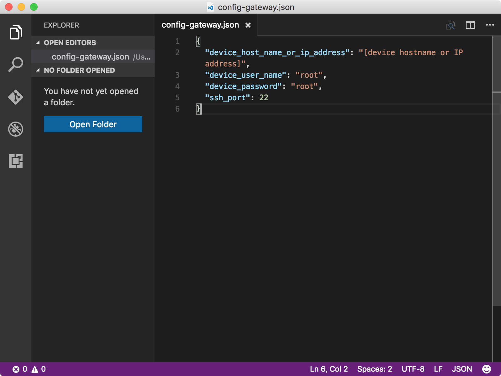
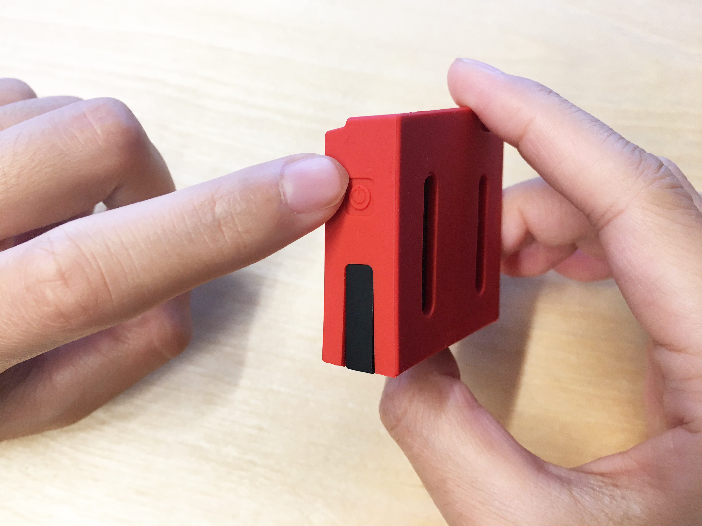
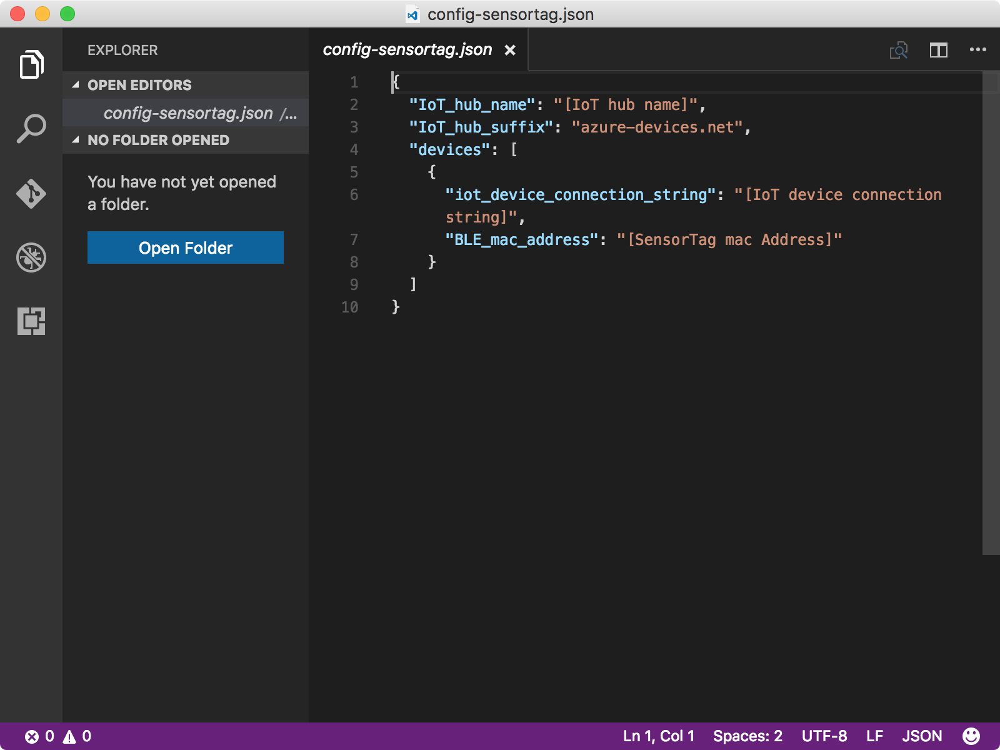
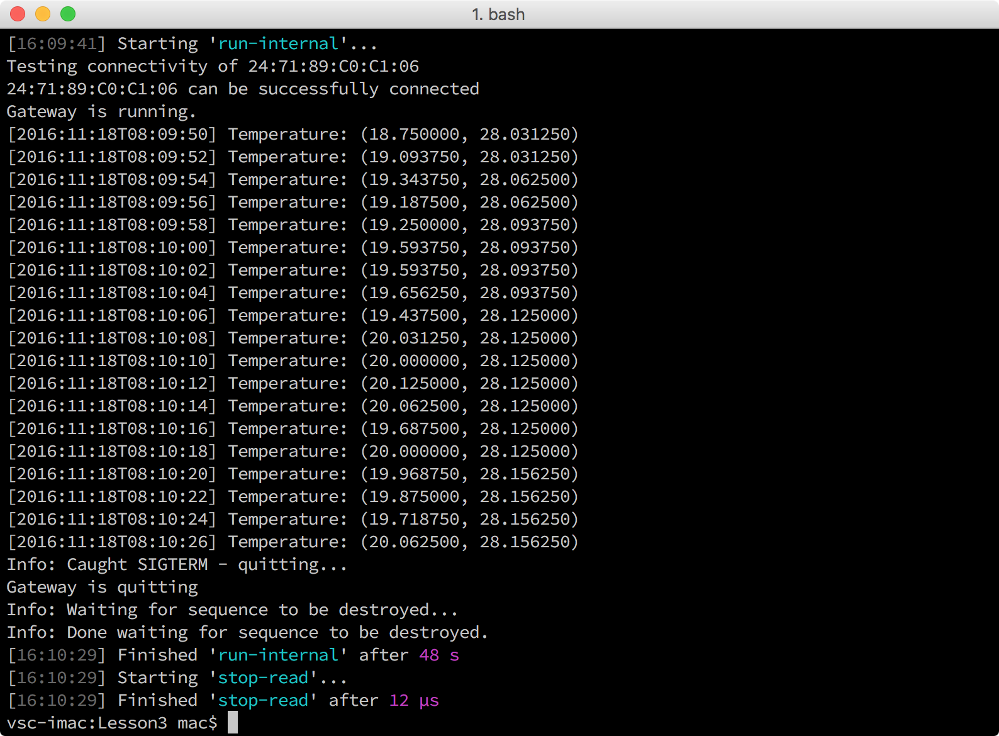

# Configure and run a BLE sample application

## What you will do

- Clone the sample repository. 
- Set up the connectivity between SensorTag and Intel NUC. 
- Use the Azure CLI to get your IoT hub and SensorTag information for a BLE(Bluetooth Low Energy) sample application. And configure and run the BLE sample application. 

If you have any problems, look for solutions on the [troubleshooting page](iot-hub-gateway-kit-c-troubleshooting.md).

## What you will learn

In this article, you will learn:

- How to configure and run the BLE sample application.

## What you need

You must have successfully completed

- [Create an IoT hub and register SensorTag](iot-hub-gateway-kit-c-lesson2-register-device.md)

## Clone the sample repository to the host computer

To clone the sample repository, follow these steps on the host computer:

1. Open a Command Prompt window in Windows or open a terminal in macOS or Ubuntu.
2. Run the following commands:

   ```bash
   git clone https://github.com/Azure-samples/iot-hub-c-intel-nuc-gateway-getting-started
   cd iot-hub-c-intel-nuc-gateway-getting-started
   ```

## Set up the connectivity between SensorTag and Intel NUC

To set up the connectivity, follow these steps on the host computer:

1. Initialize the configuration file by running the following commands:

   ```bash
   cd Lesson3
   npm install
   gulp init
   ```

2. Open `config-gateway.json` in Visual Studio Code by running the following command:

   ```bash
   # For Windows command prompt
   code %USERPROFILE%\.iot-hub-getting-started\config-gateway.json
   # For macOS or Ubuntu
   code ~/.iot-hub-getting-started/config-gateway.json
   ```

3. Locate the following line of code and replace `[device hostname or IP address]` with the IP address or host name of Intel NUC.
   

4. Install helper tools on Intel NUC by running the following command:

   ```bash
   gulp install-tools
   ```

5. Turn on SensorTag by pressing the power button as the following picture, and the green LED should blink.

   

6. Scan SensorTag devices by running the following commands:

   ```bash
   gulp discover-sensortag
   ```

7. Test the connectivity between the SensorTag and Intel NUC by running the following command:

   ```bash
   gulp test-connectivity --mac {mac address}
   ```

   Replace `{mac address}` with the MAC address that you obtained in the previous step.

## Get the connection string of SensorTag

To get the Azure IoT hub connection string of SensorTag, run the following command on the host computer:

```bash
az iot device show-connection-string --hub-name {IoT hub name} --device-id mydevice --resource-group iot-gateway
```

`{IoT hub name}` is the IoT hub name that you used. Use iot-gateway as the value of `{resource group name}` and use mydevice as the value of `{device id}` if you didn't change the value in Lesson 2.

## Configure the BLE sample application

To configure and run the BLE sample application, follow these steps on the host computer:

1. Open `config-sensortag.json` in Visual Studio Code by running the following command:

   ```bash
   # For Windows command prompt
   code %USERPROFILE%\.iot-hub-getting-started\config-sensortag.json
   # For macOS or Ubuntu
   code ~/.iot-hub-getting-started/config-sensortag.json
   ```

   

2. Make the following replacements in the code:
   - Replace `[IoT hub name]` with the IoT hub name that you used.
   - Replace `[IoT device connection string]` with the connection string of SensorTag that you obtained.
   - Replace `[device_mac_address]` with the MAC address of the SensorTag that you obtained.

3. Run the BLE sample application.

   To run the BLE sample application, follow these steps on the host computer:

   1. Turn on SensorTag.

   2. Deploy and run the BLE sample application on Intel NUC by running the following command:
   
      ```bash
      gulp run
      ```

## Verify that the BLE sample application works

You should now see an output like the following:



The sample application keeps collecting temperature data and sent it to your IoT hub. The sample application terminates automatically after sending 40 seconds.

## Summary

You've successfully set up the connectivity between SensorTag and Intel NUC, and run a BLE sample application which collects and sends data from SensorTag to your IoT hub. You're ready to learn how to verify that your IoT hub has received the data.

## Next steps
[Read messages from your IoT hub](iot-hub-gateway-kit-c-lesson3-read-messages-from-hub.md)