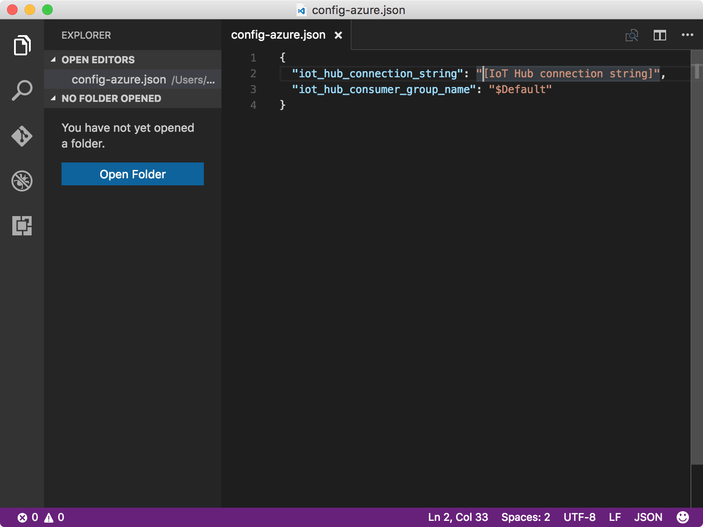
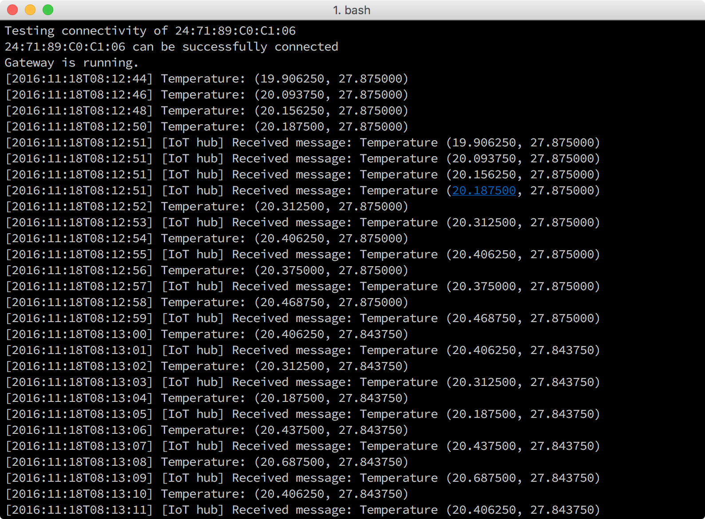

# Read messages from your IoT hub

## What you will do

- Run sample code on your host computer to read messages from your IoT hub.

If you have any problems, look for solutions on the [troubleshooting page](iot-hub-gateway-kit-c-troubleshooting.md).

## What you will learn

How to use the gulp tool to read messages from your IoT hub.

## What you need

- The BLE sample application that you ran successfully in Lesson 3.

## Get your IoT hub and device connection strings

The device connection string is used by your device (TI SensorTag or simulated device) to connect to your IoT hub. The IoT hub connection string is used to connect to the identity registry in your IoT hub to manage the devices that are allowed to connect to your IoT hub.

- List all your IoT hubs in your resource group by running the following command:

   ```bash
   az iot hub list -g iot-gateway --query [].name
   ```

   Use `iot-gateway` as the value of `{resource group name}` if you didn't change the value.
- Get the IoT hub connection string by running the following command:

   ```bash
   az iot hub show-connection-string --name {my hub name} -g iot-gateway
   ```

   `{my hub name}` is the name that you specified in Lesson 2.

## Configure the device connection for the sample code

Update the device configuration file `config-azure.json` so that you can read messages from your IoT hub on your host computer. To do this, follow these steps:

1. Open `config-azure.json` in Visual Studio Code by running the following command in a console window:

   ```bash
   # For Windows command prompt
   code %USERPROFILE%\.iot-hub-getting-started\config-azure.json
   # For MacOS or Ubuntu
   code ~/.iot-hub-getting-started/config-azure.json
   ```

2. Make the following replacements in the `config-azure.json` file:

   

   Replace `[IoT hub connection string]` with the IoT hub connection string that you obtained.

## Read messages from your IoT hub

If you have a TI SensorTag, make sure you have already powered on your SensorTag. Run the gateway sample application and read IoT Hub messages by the following command:

```bash
gulp run --iot-hub
```

The command runs the BLE sample application that reads and packages temperature data from your SensorTag or simulated device and sends the message to your IoT hub every 2 seconds. It also spawns a child process to receive the message.

The messages that are being sent and received are all displayed instantly on the same console window in the host machine. The sample application instance will terminate automatically in 40 seconds.



## Summary

You've run a sample code to read messages from your IoT hub. You're ready to read the messages that are stored in your Azure table storage.

## Next steps
[Create an Azure function app and Azure Storage account](iot-hub-gateway-kit-c-lesson4-deploy-resource-manager-template.md)


