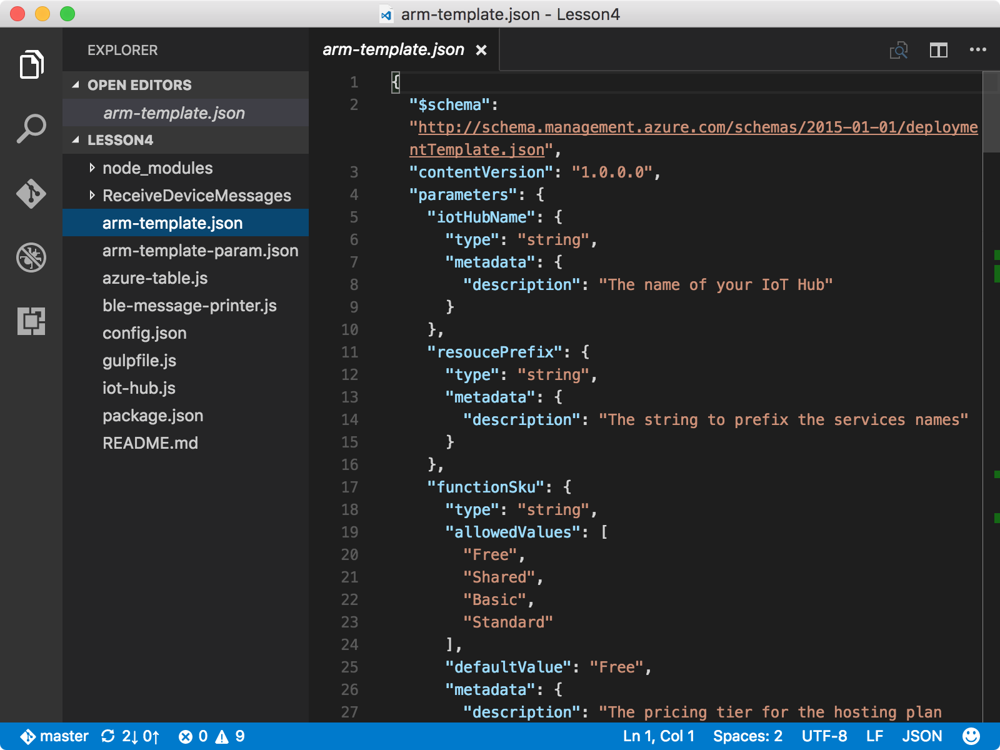
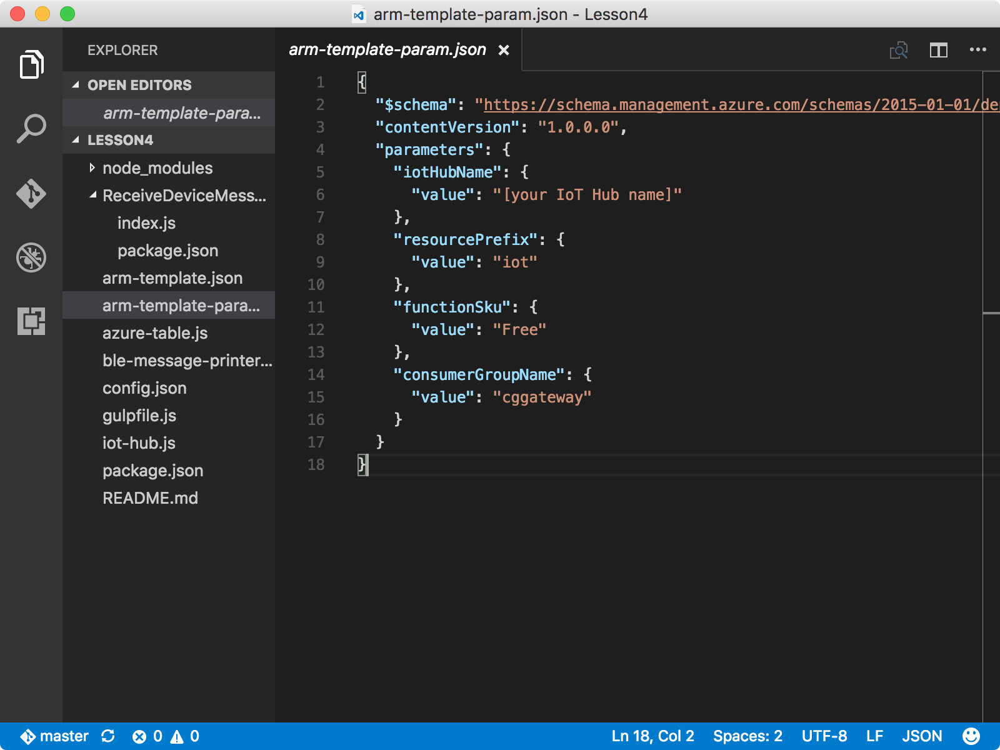

# Create an Azure function app and storage account

Azure Functions is a solution for easily running _functions_ (small pieces of code) in the cloud. An Azure function app hosts the execution of your functions in Azure. 

## What you will do

- Use an Azure Resource Manager template to create an Azure function app and an Azure storage account. The Azure function app listens to Azure IoT hub events, processes incoming messages, and writes them to Azure Table storage.

If you have any problems, look for solutions on the [troubleshooting page](iot-hub-gateway-kit-c-troubleshooting.md).


## What you will learn

In this lesson, you will learn:

- How to use Azure Resource Manager to deploy Azure resources.
- How to use an Azure function app to process IoT Hub messages and write them to a table in Azure Table storage.

## What you need

You must have successfully completed the previous lessons:

- [Lesson 1: Set up your Intel NUC as an IoT gateway](iot-hub-gateway-kit-c-lesson1-set-up-nuc.md)
- [Lesson 2: Get your host computer and Azure IoT hub ready](iot-hub-gateway-kit-c-lesson2-get-the-tools-win32.md)
- [Lesson 3: Receive messages from SensorTag and read messages from IoT hub](iot-hub-gateway-kit-c-lesson3-configure-ble-app.md)

## Open a sample app

Go to your `iot-hub-c-intel-nuc-gateway-getting-started` repo folder, initialize the configuration files, and then open the sample project in Visual Studio Code by running the following command:

```bash
cd Lesson4
npm install
gulp init
code .
```



- The `arm-template.json` file is the Azure Resource Manager template that contains an Azure function app and an Azure storage account.
- The `arm-template-param.json` file is the configuration file used by the Azure Resource Manager template.
- The `ReceiveDeviceMessages` subfolder contains the Node.js code for the Azure function.

## Configure Azure Resource Manager templates and create resources in Azure

Update the `arm-template-param.json` file in Visual Studio Code.



- Replace `[your IoT Hub name]` with `{my hub name}` that you specified in Lesson 2.

After you update the `arm-template-param.json` file, deploy the resources to Azure by running the following command:

```bash
az group deployment create --template-file arm-template.json --parameters @arm-template-param.json -g iot-gateway
```

Use `iot-gateway` as the value of `{resource group name}` if you didn't change the value in Lesson 2.

## Summary

You've created your Azure function app to process IoT hub messages and an Azure storage account to store these messages. You can now read messages that are sent by your gateway to your IoT hub.

## Next steps
[Read messages persisted in Azure Storage](iot-hub-gateway-kit-c-lesson4-read-table-storage.md).
