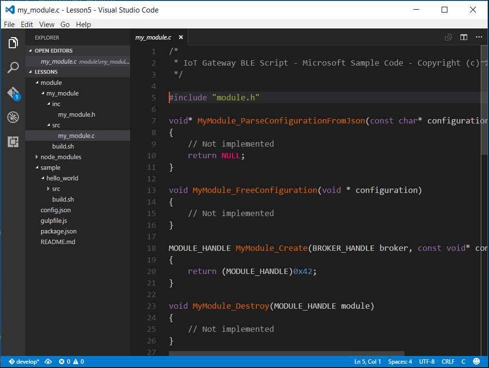
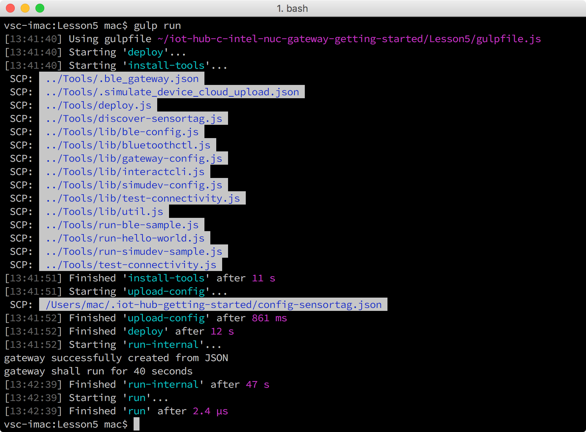
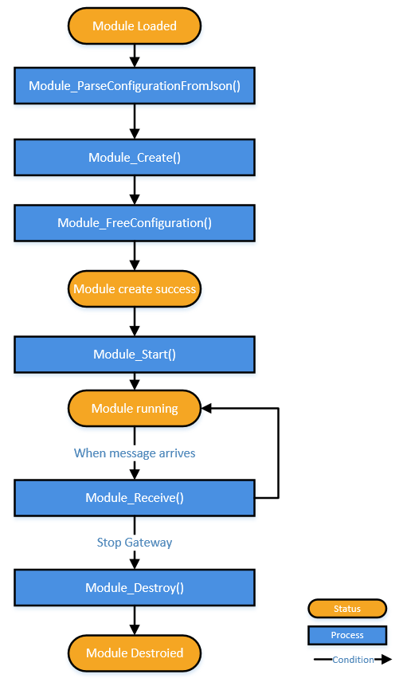
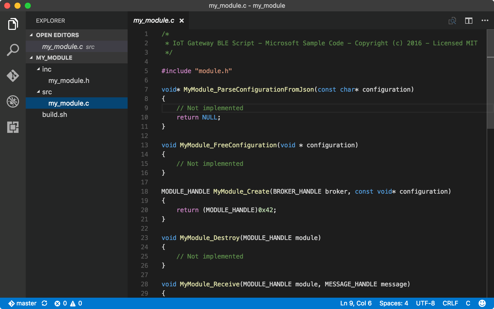
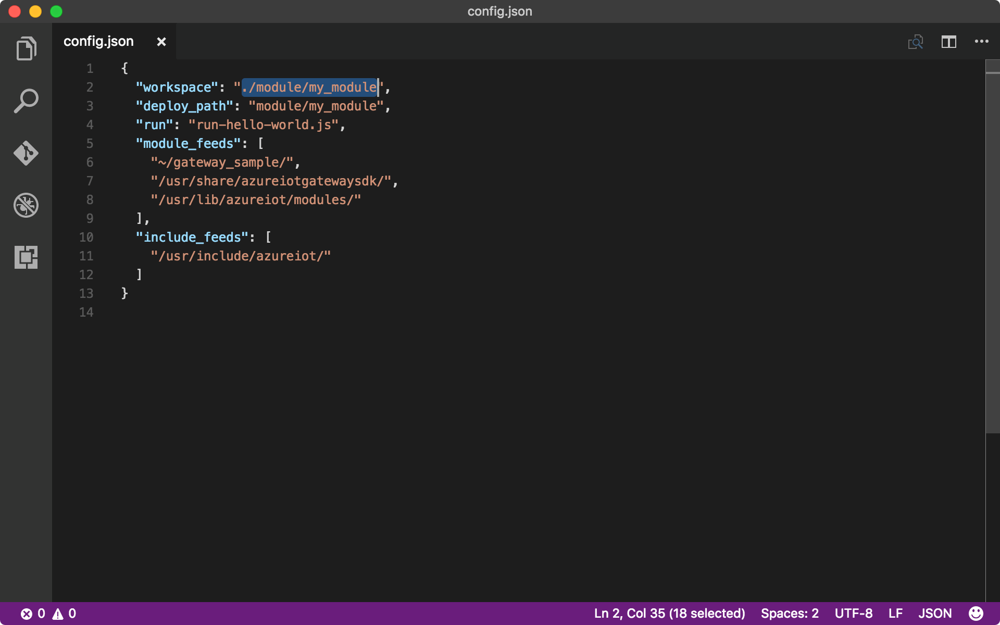
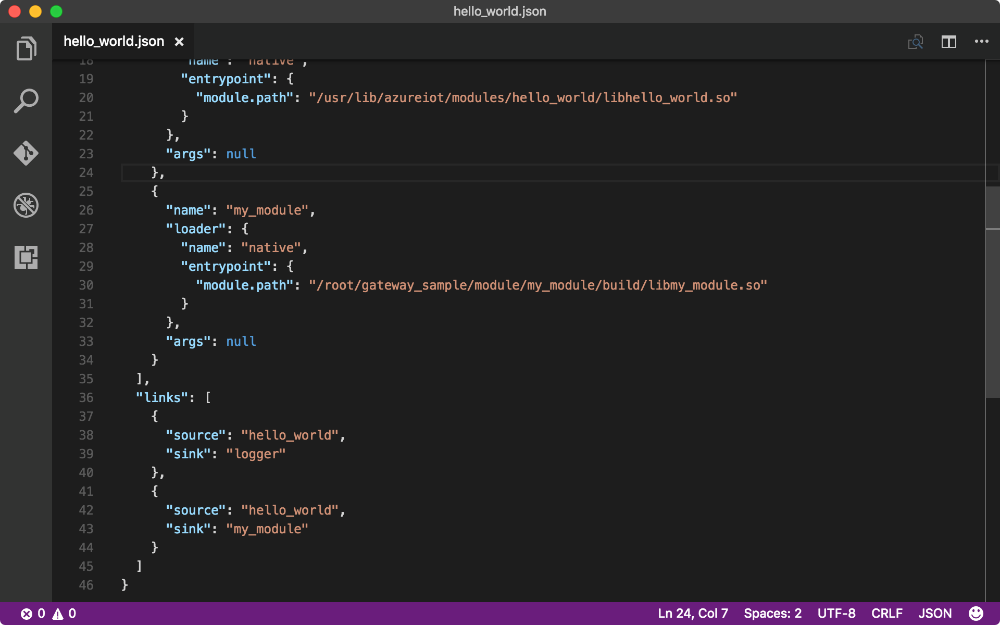
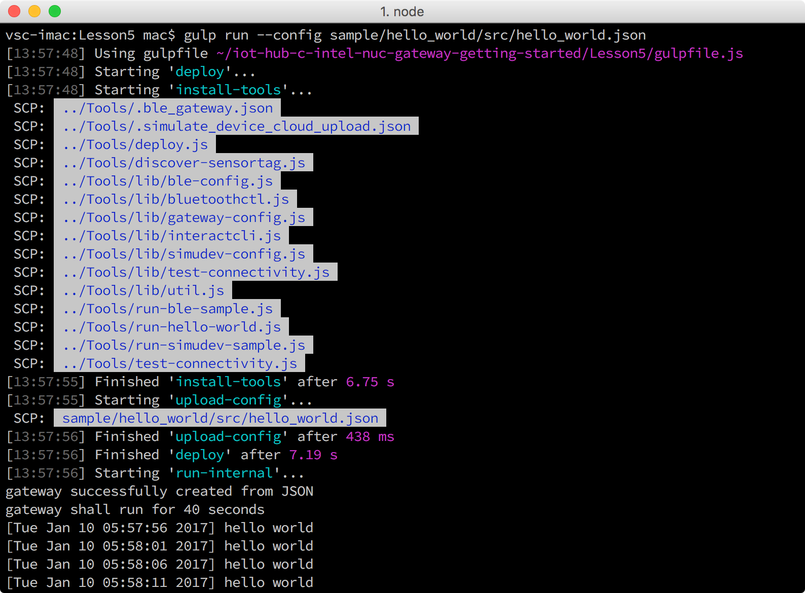

# Lesson 5: Create your first Azure IoT Gateway module
While Azure IoT Edge allows you to build modules written in Java, .NET, or Node.js, this tutorial walks you through the steps for building a module in C.

## What you will do

- Compile and run the hello_world sample app on Intel NUC.
- Create a module and compile it on Intel NUC.
- Add the new module to the hello_world sample app and then run the sample on Intel NUC. The new module prints out "hello_world" messages with a timestamp.

## What you will learn

- How to compile and run a sample app on Intel NUC.
- How to create a module.
- How to add module to a sample app.

## What you need

Azure IoT Edge that has been installed on your host computer.

## Folder structure

In the Lesson 5 subfolder of the sample code which you cloned in lesson 1, there is a `module` folder and a `sample` folder.



- The `module/my_module` folder contains the source code and script to build the module.
- The `sample` folder contains the source code and script to build the sample app.

## Compile and run the hello_world sample app on Intel NUC

The `hello_world` sample creates a gateway based on the `hello_world.json` file which specifies the two predefined modules associated with the app. The gateway logs a "hello world" message to a file every 5 seconds. In this section, you compile and run the `hello_world` app with its default module.

To compile and run the `hello_world` app, follow these steps on your host computer:

1. Initialize the configuration files by running the following commands:

   ```bash
   cd iot-hub-c-intel-nuc-gateway-getting-started
   cd Lesson5
   npm install
   gulp init
   ```

1. Update the gateway configuration file with the MAC address of Intel NUC. Skip this step if you have gone through the lesson to [configure and run a BLE sample application][config_ble].

   1. Open the gateway configuration file by running the following command:

      ```bash
      # For Windows command prompt
      code %USERPROFILE%\.iot-hub-getting-started\config-gateway.json

      # For MacOS or Ubuntu
      code ~/.iot-hub-getting-started/config-gateway.json
      ```

   1. Update the gateway's MAC address when you [set up Intel NUC as a IoT gateway][setup_nuc], and then save the file.

1. Compile the sample source code by running the following command:

   ```bash
   gulp compile
   ```

   The command transfers the sample source code to Intel NUC and runs `build.sh` to compile it.

1. Run the `hello_world` app on Intel NUC by running the following command:

   ```bash
   gulp run
   ```

   The command runs `../Tools/run-hello-world.js` that is specified in `config.json` to start the sample app on Intel NUC.

   

## Create a new module and compile it on Intel NUC

The steps below walk you through creating a new module and compile it on Intel NUC. The module prints out messages with a timestamp upon receiving them. You will create your first customized gateway module in this section.

Any Azure IoT Edge module must implement the following interfaces:

   ```C
   pfModule_ParseConfigurationFromJson Module_ParseConfigurationFromJson
   pfModule_FreeConfiguration Module_FreeConfiguration
   pfModule_Create Module_Create
   pfModule_Destroy Module_Destroy
   pfModule_Receive Module_Receive
   ```

You can optionally implement the following interface:

   ```C
   pfModule_Start Module_Start
   ```

The following diagram shows the important state paths of a module. The square rectangles represent methods you implement to perform operations when the module moves between states. The ovals are major states the module can be in.



Now let’s create a module based on the template:

1. Open the template folder by running the following command:

   ```bash
   code module/my_module
   ```

   

   - `src/my_module.c` serves as a template that facilitates the creation of a module. The template declares the interfaces. All you need to do is to add logic to the `MyModule_Receive` function.
   - `build.sh` is the build script to compile the module on Intel NUC.
1. Open the `src/my_module.c` file and include two header files:

   ```C
   #include <stdio.h>
   #include "azure_c_shared_utility/xlogging.h"
   ```

1. Add the following code to the `MyModule_Receive` function:

   ```C
   if (message == NULL)
   {
      LogError("invalid arg message");
   }
   else
   {
      // get the message content
      const CONSTBUFFER * content = Message_GetContent(message);
      // get the local time and format it
      time_t temp = time(NULL);
      if (temp == (time_t)-1)
      {
          LogError("time function failed");
      }
      else
      {
          struct tm* t = localtime(&temp);
          if (t == NULL)
          {
              LogError("localtime failed");
          }
          else
          {
              char timetemp[80] = { 0 };
              if (strftime(timetemp, sizeof(timetemp) / sizeof(timetemp[0]), "%c", t) == 0)
              {
                  LogError("unable to strftime");
              }
              else
              {
                  printf("[%s] %.*s\r\n", timetemp, (int)content->size, content->buffer);
              }
          }
      }
   }
   ```

1. Update the `config.json` file to specify the `workspace` folder on your host computer and the deployment path on Intel NUC. During compiling, the files in the `workspace` folder will be transferred to the deployment path.

   1. Open the `config.json` file by running the following command:

      ```bash
      code config.json
      ```

   1. Update `config.json` with the following configuration:

      ```json
      "workspace": "./module/my_module",
      "deploy_path": "module/my_module"
      ```

      

1. Compile the module by running the following command:

   ```bash
   gulp compile
   ```

   The command transfers the source code to Intel NUC and runs `build.sh` to compile the module.

## Add the module to the hello_world sample app and run the app on Intel NUC

To perform this task, follow these steps:

1. List all the available module binaries (.so files) on Intel NUC by running the following command:

   ```bash
   gulp modules --list
   ```

   The binary path of `my_module` that you compiled should be listed as below:

   ```path
   /root/gateway_sample/module/my_module/build/libmy_module.so
   ```

   If you change the default login username in `config-gateway.json`, the binary path will start with `home/<your username>` instead of `root`.

1. Add `my_module` to the `hello_world` sample app:

   1. Open the `hello_world.json` file by running the following command:

      ```bash
      code sample/hello_world/src/hello_world.json
      ```

   1. Add the following code to the `modules` section:

      ```json
      {
       "name": "my_module",
       "loader": {
       "name": "native",
       "entrypoint": {
       "module.path": "/root/gateway_sample/module/my_module/build/libmy_module.so"
         }
        },
       "args": null
      }
      ```

      The value of `module.path` should be `/root/gateway_sample/module/my_module/build/libmy_module.so`. The code declares `my_module` to be associated with the gateway as well as the location of the module binary specified in `module.path`.
   1. Add the following code to the `links` section:

      ```json
      {
        "source": "hello_world",
        "sink": "my_module"
      }
      ```

      This code specifies that messages are transferred from the `hello_world` module to `my_module`.

      

1. Run the `hello_world` sample app by running the following command:

   ```bash
   gulp run --config sample/hello_world/src/hello_world.json
   ```

   The `--config` parameter forces the `run-hello-world.js` script to run by using the `hello_world.json` file.

   

Congratulations. You can now see the behavior of this new module, it simply prints out "hello world" messages with a timestamp, a different result from the original "hello_world" module.

## Next Steps

You’ve created a new module, added it to the hello_world sample, and get the sample app to run with the new module on your gateway. If you want to learn more about Azure IoT gateway modules, you can find more module samples here: [https://github.com/Azure/azure-iot-gateway-sdk/tree/master/modules](https://github.com/Azure/azure-iot-gateway-sdk/tree/master/modules).

<!-- Images and links -->

[config_ble]: iot-hub-gateway-kit-c-lesson3-configure-ble-app.md
[setup_nuc]: iot-hub-gateway-kit-c-lesson1-set-up-nuc.md
