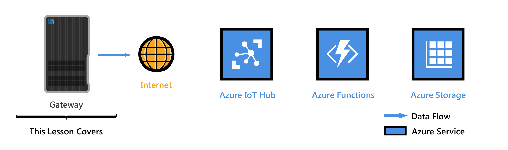
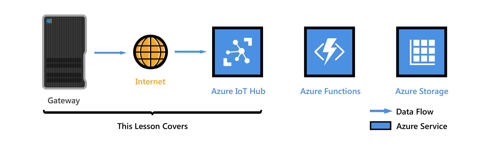
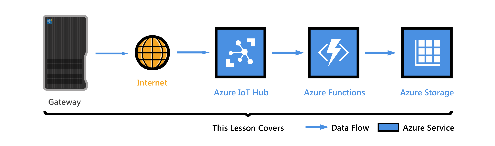

# Get started with IoT Gateway Starter Kit with a simulated device

> [!div class="op_single_selector"]
> * [SensorTag](iot-hub-gateway-kit-c-get-started.md)
> * [Simulated Device](iot-hub-gateway-kit-c-sim-get-started.md)

In this tutorial, you begin by learning the basics of working with [IoT Gateway Starter Kit](https://aka.ms/gateway-kit). You will be working with Intel NUC that's running Wind River Linux. You will learn how to seamleesly connect your devices to the cloud by using Azure IoT Hub.

***
**Don't have a kit yet?:** Click [here](https://aka.ms/gateway-kit).
***

## Lesson 1: Configure your NUC

In this lesson, you set up Intel NUC (Next Unit of Computing) in the Kit as an Azure IoT gateway, install the Azure IoT Gateway SDK package on NUC, and run a sample app to verify the gateway functionality.

*Estimated time to complete: 15 minutes*

Go to [Set up Intel NUC as an IoT gateway](iot-hub-gateway-kit-c-sim-lesson1-set-up-nuc.md)

## Lesson 2: Create your IoT Hub

In this lesson, you install the tools and software on your host computer. Then you create your free Azure account, provision your Azure IoT hub and create your first device in the IoT hub.

Complete Lesson 1 before you start this lesson.

### Get the tools
Install the tools and software on your host computer.

*Estimated time to complete: 20 minutes*

Go to [Get the tools](iot-hub-gateway-kit-c-sim-lesson2-get-the-tools-win32.md)

### Create an IoT hub and register your device
Create your resource group, provision your first Azure IoT hub, and add your first device to the IoT hub using the Azure CLI.

*Estimated time to complete: 10 minutes*

Go to [Create an IoT hub and register your device](iot-hub-gateway-kit-c-sim-lesson2-register-device.md)

## Lesson 3: Receive messages from the simulated device and read messages from your IoT hub
In this lesson, you will use scripts to automate the configuration and execution of a simulated device app in your gateway. The simulated device app generates sample temperature data and sends it to an IoT hub module. The IoT hub module packages the data received and sends it to your IoT hub through the gateway framework provided in the Azure IoT Gateway SDK.

### Configure and run a simulated device
Prepare the sample codes. Then configure and run the simulated device sample application.

*Estimated time to complete: 15 minutes*

Go to [Configure and run a simulated device](iot-hub-gateway-kit-c-sim-lesson3-configure-simulated-device-app.md)

### Read messages from your IoT hub
Run a sample code on your host computer to read the messages from your IoT hub.

*Estimated time to complete: 15 minutes*

Go to [Read messages from your IoT hub](iot-hub-gateway-kit-c-sim-lesson3-read-messages-from-hub.md)

## Lesson 4: Save messages to Azure Table storage
Create an Azure function app that gets incoming messages from your IoT hub and writes them to Azure Table storage.

### Create an Azure function app and Azure Storage account
Use an Azure Resource Manager template to create an Azure function app and an Azure Storage account.

*Estimated time to complete: 10 minutes*

Go to [Create an Azure function app and Azure Storage account](iot-hub-gateway-kit-c-sim-lesson4-deploy-resource-manager-template.md)

### Read messages persisted in Azure Table storage
Monitor the gateway-to-cloud messages as they are written to Azure Table storage.

*Estimated time to complete: 5 minutes*

Go to [Read messages persisted in Azure Table storage](iot-hub-gateway-kit-c-sim-lesson4-read-table-storage.md).

## Troubleshooting
If you have any problems during the lessons, look for solutions in the [Troubleshooting](iot-hub-gateway-kit-c-sim-troubleshooting.md) article.

## Explore more
Visit the [Intel IoT Gateway Kit developer zone](https://software.intel.com/en-us/iot/hardware/gateways/dev-kit) to learn more.