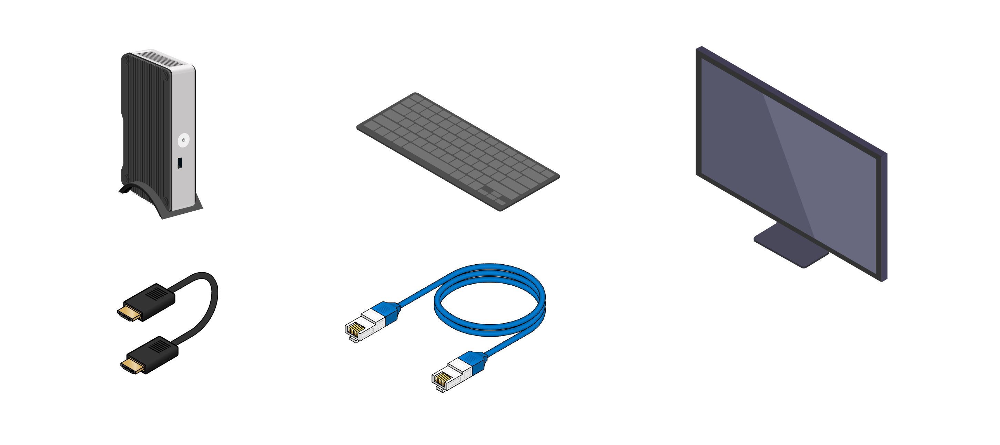

# Set up Intel NUC as an IoT gateway

## What you will do

- Set up Intel NUC as an IoT gateway.
- Install the Azure IoT Gateway SDK package on Intel NUC.
- Run a "hello_world" sample application on Intel NUC to verify the gateway functionality.
If you have any problems, look for solutions on the [troubleshooting page](iot-hub-gateway-kit-c-sim-troubleshooting.md).

## What you will learn

In this lesson, you will learn:

- How to connect Intel NUC with peripherals.
- How to install and update the required packages on Intel NUC using the Smart Package Manager.
- How to run the "hello_world" sample application to verify the gateway functionality.

## What you need

- An Intel NUC Kit DE3815TYKE with the Intel IoT Gateway Software Suite (Wind River Linux *7.0.0.13) preinstalled.
- An Ethernet cable.
- A keyboard.
- An HDMI or VGA cable.
- A monitor with an HDMI or VGA port.



## Connect Intel NUC with the peripherals

The image below is an example of Intel NUC that is connected with various peripherals:

1. Connected to a keyboard.
2. Connected to the monitor by a VGA cable or HDMI cable.
3. Connected to a wired network by an Ethernet cable.
4. Connected to the power supply with a power cable.


## Connect to the Intel NUC system from host computer via Secure Shell (SSH)

Here you need keyboard and monitor to get the IP address of your NUC device. If you already know the IP address, you can skip to step 3 in this section.

1. Turn on Intel NUC by pressing the Power button and log in the system.

   The default user name and password are both `root`.

2. Get the IP address of NUC by running the `ifconfig` command. This step is done on the NUC device.

   Here is an example of the command output.

   

   In this example, the value that follows `inet addr:` is the IP address that you need when you plan to connect remotely from a host computer to Intel NUC.

3. Use one of the following SSH clients from your host machine to connect to Intel NUC.

   - [PuTTY](http://www.putty.org/) for Windows.
   - The build-in SSH client on Ubuntu or macOS.

   It is more efficient and productive to operate on Intel NUC from a host computer. You need the the IP address, user name and password to connect the NUC via SSH client. Here is the example use SSH client on macOS.
   

## Install the Azure IoT Gateway SDK package

The Azure IoT Gateway SDK package contains the pre-compiled binaries of the SDK and its dependencies. These binaries are the Azure IoT Gateway SDK, the Azure IoT SDK and the corresponding tools. The package also contains a "hello_world" sample application that is used to validate the gateway functionality. The SDK is the core part of the gateway. To install the package, follow these steps:

1. Add the IoT cloud repository by running the following commands in a terminal window:

   ```bash
   rpm --import http://iotdk.intel.com/misc/iot_pub.key
   smart channel --add IoT_Cloud type=rpm-md name="IoT_Cloud" baseurl=http://iotdk.intel.com/repos/iot-cloud/wrlinux7/rcpl13/ -y
   ```

   The `rpm` command imports the rpm key. The `smart channel` command adds the rpm channel to the Smart Package Manager. Before you run the `smart update` command, you see an output like below.

   

   ```bash
   smart update
   ```

2. Install the package by running the following command:

   ```bash
   smart install packagegroup-cloud-azure -y
   ```

   `packagegroup-cloud-azure` is the name of the package. The `smart install` command is used to install the package.

   After the package is installed, Intel NUC is expected to work as a gateway.

## Run the Azure IoT Gateway SDK "hello_world" sample application

Go to `azureiotgatewaysdk/samples` and run the sample "hello_world" sample application. This sample application creates a gateway from the `hello_world.json` file and uses the fundamental components of the Azure IoT Gateway SDK architecture to log a hello world message to a file every 5 seconds.

You can run the sample "hello_world" sample application by running the following command:

```bash
cd /usr/share/azureiotgatewaysdk/samples/hello_world/
./hello_world hello_world.json
```

The sample application produces the following output if the gateway functionality is working correctly:


If you have any problems, look for solutions on the [troubleshooting page](iot-hub-gateway-kit-c-troubleshooting.md).

## Summary

Congratulations! You've finished setting up Intel NUC as a gateway. Now you're ready to move on to the next lesson to set up your host computer, create an Azure IoT hub and register your Azure IoT hub logical device.

## Next steps
[Get your host computer and Azure IoT hub ready](iot-hub-gateway-kit-c-sim-lesson2-get-the-tools-win32.md)
