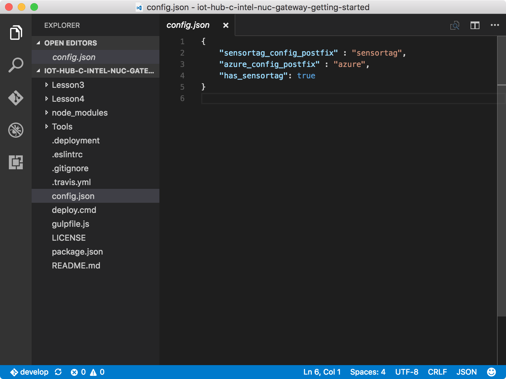
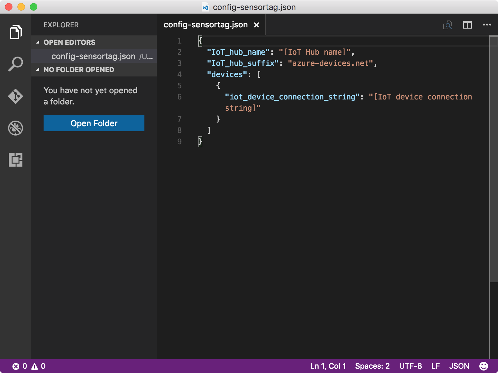
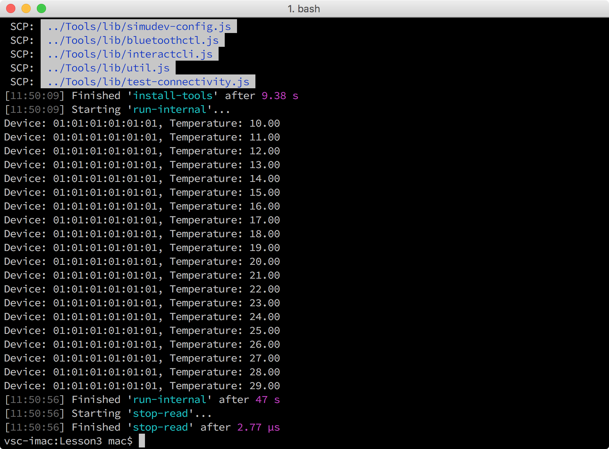

# Configure and run a simulated device sample app

## What you will do

- Clone the sample repository.
- Use the Azure CLI to get your IoT hub and logical device information for simulated device sample application. Configure and run the simulated device sample application.

If you have any problems, look for solutions on the [troubleshooting page](iot-hub-gateway-kit-c-sim-troubleshooting.md).

## What you will learn

In this article, you will learn:

- How to configure and run the simulated device sample application.

## What you need

You must have successfully completed

- [Create an IoT hub and register your device](iot-hub-gateway-kit-c-sim-lesson2-register-device.md)

## Clone the sample repository to the host computer

To clone the sample repository, follow these steps on the host computer:

1. Open a Command Prompt in Windows or open a terminal in macOS or Ubuntu.
2. Run the following commands:

   ```bash
   git clone https://github.com/Azure-samples/iot-hub-c-intel-nuc-gateway-getting-started
   cd iot-hub-c-intel-nuc-gateway-getting-started
   ```

## Configure the simulated device and your NUC

1. Open the configuration file `config.json` in Visual Studio Code by running the following command:

   ```bash
   code config.json
   ```

2. Replace `"has_sensortag": true` with `"has_sensortag": false`

   

3. Initialize the configuration file by running the following commands:

   ```bash
   cd Lesson3
   npm install
   gulp init
   ```

4. Open `config-gateway.json` in Visual Studio Code by running the following command:

   ```bash
   # For Windows command prompt
   code %USERPROFILE%\.iot-hub-getting-started\config-gateway.json
   # For macOS or Ubuntu
   code ~/.iot-hub-getting-started/config-gateway.json
   ```

5. Locate the following line of code and replace `[device hostname or IP address]` with IP address or host name of the Intel NUC.
   

## Get the connection string of your IoT hub logical device

To get the Azure IoT hub connection string of your logical device, run the following command on the host computer:

```bash
az iot device show-connection-string --hub-name {IoT hub name} --device-id mydevice --resource-group iot-gateway
```

`{IoT hub name}` is the IoT hub name that you used. Use iot-gateway as the value of `{resource group name}` and use mydevice as the value of `{device id}` if you didn't change the value in Lesson 2.

## Configure the simulated device cloud upload sample application

To configure and run the simulated device cloud upload sample application, follow these steps on the host computer:

1. Open `config-sensortag.json` in Visual Studio Code by running the following command:

   ```bash
   # For Windows command prompt
   code %USERPROFILE%\.iot-hub-getting-started\config-sensortag.json
   # For macOS or Ubuntu
   code ~/.iot-hub-getting-started/config-sensortag.json
   ```

   

2. Make the following replacements in the code:
   - Replace `[IoT hub name]` with the IoT hub name.
   - Replace `[IoT device connection string]` with the connection string of your IoT hub logical device.

3. Run the application.

   Deploy and run the application by running the following command:

   ```bash
   gulp run
   ```

## Verify the sample application works

You should now see output like the following:



The application sends temperature data to your IoT hub, which lasts for 40 seconds.

## Summary

You've successfully configured and run the simulated device cloud upload sample application which sends data to your IoT hub with simulated device.

## Next steps
[Read messages from your IoT hub](iot-hub-gateway-kit-c-sim-lesson3-read-messages-from-hub.md)