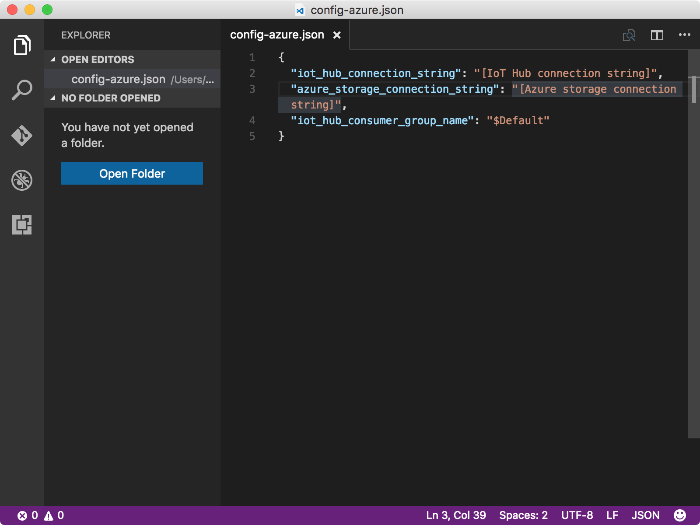
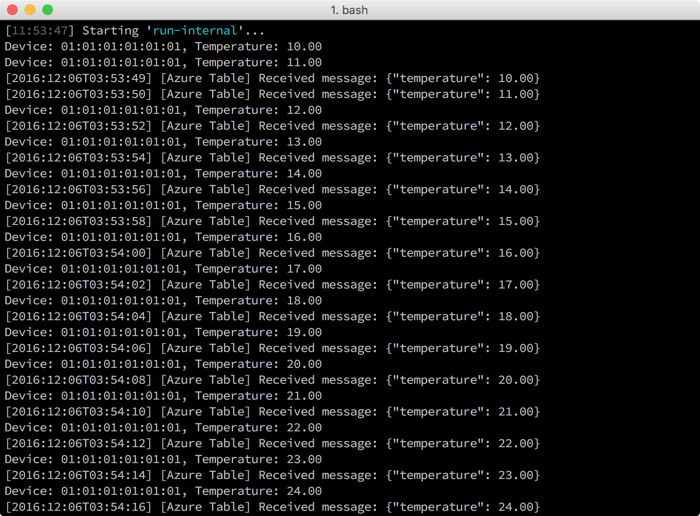

# Read messages persisted in Azure Table storage

## What you will do

- Run the gateway sample application on your gateway that sends messages to your IoT hub.
- Run sample code on your host computer to read messages in your Azure Table storage.

If you have any problems, look for solutions on the [troubleshooting page](iot-hub-gateway-kit-c-sim-troubleshooting.md).

## What you will learn

How to use the gulp tool to run the sample code to read messages in your Azure Table storage.

## What you need

You have have successfully done the following tasks:

- [Created the Azure function app and the Azure storage account](iot-hub-gateway-kit-c-sim-lesson4-deploy-resource-manager-template.md).
- [Run the gateway sample application](iot-hub-gateway-kit-c-sim-lesson3-configure-simulated-device-app.md).
- [Read messages from your IoT hub](iot-hub-gateway-kit-c-sim-lesson3-read-messages-from-hub.md).

## Get your Azure storage connection strings

Early in this lesson, you successfully created an Azure storage account. To get the connection string of the Azure storage account, run the following commands:

* List all your storage accounts.

```bash
az storage account list -g iot-gateway --query [].name
```

* Get azure storage connection string.

```bash
az storage account show-connection-string -g iot-gateway -n {storage name}
```

Use `iot-gateway` as the value of `{resource group name}` if you didn't change the value in Lesson 2.

## Configure the device connection

Update the `config-azure.json` file so that the sample code that runs on the host computer can read message in your Azure Table storage. To configure the device connection, follow these steps:

1. Open the device configuration file `config-azure.json` by running the following commands:

   ```bash
   # For Windows command prompt
   code %USERPROFILE%\.iot-hub-getting-started\config-azure.json
   # For MacOS or Ubuntu
   code ~/.iot-hub-getting-started/config-azure.json
   ```

   

2. Replace `[Azure storage connection string]` with the Azure storage connection string that you obtained.

   `[IoT hub connection string]` should already be replaced in section [Read messages from Azure IoT Hub](iot-hub-gateway-kit-c-sim-lesson3-read-messages-from-hub.md) in Lesson3.

## Read messages in your Azure Table storage

Run the gateway sample application and read Azure Table storage messages by the following command:

```bash
gulp run --table-storage
```

Your IoT hub triggers your Azure Function application to save message into your Azure Table storage when new message arrives.
The `gulp run` command runs gateway sample application that sends messages to your IoT hub. With `table-storage` parameter, it also spawns a child process to receive the saved message in your Azure Table storage.

The messages that are being sent and received are all displayed instantly on the same console window in the host machine. The sample application instance will terminate automatically in 40 seconds.

   


## Summary

You've run the sample code to read the messages in your Azure Table storage saved by your Azure Function application.
