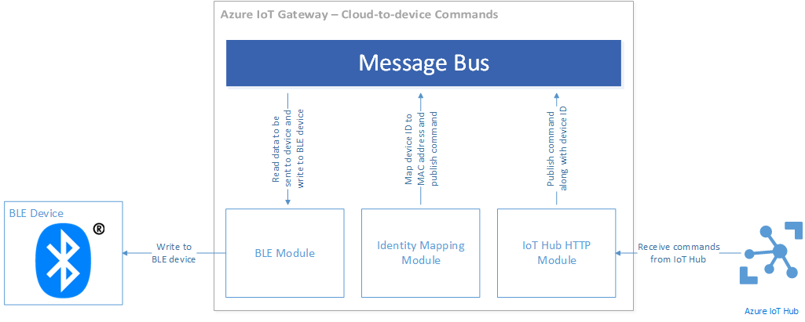

<properties
	pageTitle="Use a real device with the Gateway SDK | Microsoft Azure"
	description="Azure IoT Hub Gateway SDK walkthrough using a Texas Instruments SensorTag to send data to IoT Hub through a gateway running on an Intel Edison Compute Module"
	services="iot-hub"
	documentationCenter=""
	authors="chipalost"
	manager="timlt"
	editor=""/>

<tags
     ms.service="iot-hub"
     ms.devlang="cpp"
     ms.topic="article"
     ms.tgt_pltfrm="na"
     ms.workload="na"
     ms.date="05/31/2016"
     ms.author="cstreet"/>


# IoT Gateway SDK (beta) – send device-to-cloud messages with a real device using Linux

This walkthrough of the [Bluetooth low energy sample][lnk-ble-samplecode] shows you how to use the [Microsoft Azure IoT Gateway SDK][lnk-sdk] to forward device-to-cloud telemetry to IoT Hub from a physical device and how to route commands from IoT Hub to a physical device.

This walkthrough covers:

* **Architecture**: important architectural information about the Bluetooth low energy sample.

* **Build and run**: the steps required to build and run the sample.

## Architecture

The walkthrough shows you how to build and run an IoT Gateway on an Intel Edison Compute Module that runs Linux. The gateway is built using the IoT Gateway SDK. The sample uses a Texas Instruments SensorTag Bluetooth Low Energy (BLE) device to collect temperature data.

When you run the gateway it:

- Connects to a SensorTag device using the Bluetooth Low Energy (BLE) protocol.
- Connects to IoT Hub using the AMQP protocol.
- Forwards telemetry from the SensorTag device to IoT Hub.
- Routes commands from IoT Hub to the SensorTag device.

The gateway contains the following modules:

- A *BLE module* that interfaces with a BLE device to receive temperature data from the device and send commands to the device.
- A *logger module* that produces message bus diagnostics.
- An *identity mapping module* that translates between BLE device MAC addresses and Azure IoT Hub device identities.
- An *IoT Hub HTTP module* that uploads telemetry data to an IoT hub and receives device commands from an IoT hub.
- A *BLE printer module* that interprets telemetry from the BLE device and prints formatted data to the console to enable troubleshooting and debugging.

### How data flows through the Gateway

The following block diagram illustrates the telemetry upload data flow pipeline:


The steps that an item of telemetry takes travelling from a BLE device to IoT Hub are:

1. The BLE device generates a temperature sample and sends it over Bluetooth to the BLE module in the gateway.
2. The BLE module receives the sample and publishes it to the message bus along with the MAC address of the device.
3. The identity mapping module picks up this message from the message bus and uses an internal table to translate the MAC address of the device into an IoT Hub device identity (a device ID and device key). It then publishes a new message to the message bus that contains the temperature sample data, the MAC address of the device, the device ID, and the device key.
4. The IoT Hub HTTP module receives this new message (generated by the identity mapping module) from the message bus and publishes it to the IoT bub.
5. The logger module logs all messages from the message bus into a disk file.

The following block diagram illustrates the device command data flow pipeline:



1. The IoT Hub HTTP module periodically polls the IoT hub for new command messages.
2. When the IoT Hub HTTP module receives a new command message, it publishes it to the message bus.
3. The identity mapping module picks up the command message from the message bus and uses an internal table to translate the IoT Hub device ID to a device MAC address. It then publishes a new message to the message bus that includes the MAC address of the target device in the properties map of the message.
4. The BLE module picks up this message and executes the I/O instruction by communicating with the BLE device.
5. The logger module logs all messages from the message bus into a disk file.

## Prepare your hardware

This tutorial assumes you are using a [Texas Instruments SensorTag](http://www.ti.com/ww/en/wireless_connectivity/sensortag2015/index.html) device connected to an Intel Edison board.

### Set up the Edison board

Before you get started you should make sure that you can connect your Edison device to your wireless network. To set up your Edison device, you need to connect it to a host computer. Intel provides getting started guides for the following operating systems:

- [Get Started with the Intel Edison Development Board on Windows 64-bit][lnk-setup-win64].
- [Get Started with the Intel Edison Development Board on Windows 32-bit][lnk-setup-win32].
- [Get Started with the Intel Edison Development Board on Mac OS X][lnk-setup-osx].
- [Getting Started with the Intel® Edison Board on Linux][lnk-setup-linux].

To set up your Edison device and familiarize yourself with it, you should complete all the steps in these "Get started" articles except for the last step, "Choose IDE", which is unnecessary for the current tutorial. At the end of the Edison setup process you have:

- Flashed your Edison with the latest firmware.
- Established a serial connection from your host to the Edison.
- Run the **configure_edison** script to set a password and enable WiFi on your Edison.

### Enable connectivity to the SensorTag device from your Edison board

Before running the sample, you need to verify that your Edison board can connect to the SensorTag device.

First you need to update the version of the BlueZ software on your Edison. Note that even if you already have version 5.37 installed you should complete the following steps to ensure that the installation is complete:

1. Stop the currently running bluetooth daemon.
    
    ```
    systemctl stop bluetooth
    ```

2. Download and extract the [source code](http://www.kernel.org/pub/linux/bluetooth/bluez-5.37.tar.xz) for BlueZ version 5.37.
    
    ```
    wget http://www.kernel.org/pub/linux/bluetooth/bluez-5.37.tar.xz
    tar -xvf bluez-5.37.tar.xz
    cd bluez-5.37
    ```

3. Build and install BlueZ.
    
    ```
    ./configure --disable-udev --disable-systemd --enable-experimental
    make
    make install
    ```

4. Change the *systemd* service configuration for bluetooth so that it points to the new bluetooth daemon by editing the file **/lib/systemd/system/bluetooth.service**. Replace the value of the  **ExecStart** attribute so that it looks like this:
    
    ```
    ExecStart=/usr/local/libexec/bluetooth/bluetoothd -E
    ```

5. Reboot your Edison.

Next you need to verify that your Edison can connect to the SensorTag device.

1. Unblock bluetooth on the Edison and check that the version number is **5.37**.
    
    ```
    rfkill unblock bluetooth
    bluetoothctl --version
    ```

2. Execute the **bluetoothctl** command. You should see output similar to:
    
    ```
    [NEW] Controller 98:4F:EE:04:1F:DF edison [default]
    ```

3. You are now in an interactive bluetooth shell. Enter the command **scan on** to scan for bluetooth devices. You should see output similar to:
    
    ```
    Discovery started
    [CHG] Controller 98:4F:EE:04:1F:DF Discovering: yes
    ```

4. Make the SensorTag device discoverable by pressing the small button (the green LED should flash). The Edison should discover the SensorTag device:
    
    ```
    [NEW] Device A0:E6:F8:B5:F6:00 CC2650 SensorTag
    [CHG] Device A0:E6:F8:B5:F6:00 TxPower: 0
    [CHG] Device A0:E6:F8:B5:F6:00 RSSI: -43
    ```
    
    In this example, you can see that the MAC address of the SensorTag device is **A0:E6:F8:B5:F6:00**.

5. Turn off scanning by entering the **scan off** command.
    
    ```
    [CHG] Controller 98:4F:EE:04:1F:DF Discovering: no
    Discovery stopped
    ```

6. Connect to your SensorTag device using its MAC address by entering **connect <MAC address>**. Note that the sample output below is abbreviated:
    
    ```
    Attempting to connect to A0:E6:F8:B5:F6:00
    [CHG] Device A0:E6:F8:B5:F6:00 Connected: yes
    Connection successful
    [CHG] Device A0:E6:F8:B5:F6:00 UUIDs: 00001800-0000-1000-8000-00805f9b34fb
    ...
    [NEW] Primary Service
            /org/bluez/hci0/dev_A0_E6_F8_B5_F6_00/service000c
            Device Information
    ...
    [CHG] Device A0:E6:F8:B5:F6:00 GattServices: /org/bluez/hci0/dev_A0_E6_F8_B5_F6_00/service000c
    ...
    [CHG] Device A0:E6:F8:B5:F6:00 Name: SensorTag 2.0
    [CHG] Device A0:E6:F8:B5:F6:00 Alias: SensorTag 2.0
    [CHG] Device A0:E6:F8:B5:F6:00 Modalias: bluetooth:v000Dp0000d0110
    ```
    
    Note: You can list the GATT characteristics of the device again using the **list-attributes** command.

7. You can now disconnect from the device using the **disconnect** command and then exit from the bluetooth shell using the **quit** command:
    
    ```
    Attempting to disconnect from A0:E6:F8:B5:F6:00
    Successful disconnected
    [CHG] Device A0:E6:F8:B5:F6:00 Connected: no
    ```

You're now ready to run the BLE Gateway sample on your Edison device.

## Run the BLE Gateway sample

To run the BLE sample on your Edison, you need to complete three tasks:

- Configure two sample devices in your IoT Hub.
- Build the Gateway SDK on your Edison device.
- Configure and run the BLE sample on your Edison device.

At the time of writing, the Gateway SDK only supports gateways that use BLE modules on Linux.

### Configure two sample devices in your IoT Hub

- [Create an IoT hub][lnk-create-hub] in your Azure subscription, you will need the name of your hub to complete this walkthrough. If you don't already have an Azure subscription, you can get a [free account][lnk-free-trial].
- Add one device called **SensorTag_01** to your IoT hub and make a note of its id and device key. You can use the [Device Explorer or iothub-explorer][lnk-explorer-tools] tools to add this device to the IoT hub you created in the previous step and to retrieve its key. You will map this device to the SensorTag device when you configure the gateway.

### Build the Gateway SDK on your Edison device

The version of **git** on the Edsion does not support submodules. To download the full source for the Gateway SDK to the Edison you have two options:

- Option #1: Clone the [Microsoft Azure IoT Gateway SDK][lnk-sdk] repository on your Edison and then manually clone the repository for each submodule.
- Option #2: Clone the [Microsoft Azure IoT Gateway SDK][lnk-sdk] repository on a desktop device where **git** supports submodules and then copy the complete repository with submodules onto your Edison.

If you choose option #2, use the following **git** commands to clone the Gateway SDK and all its submodules:

```
git clone --recursive https://github.com/Azure/azure-iot-gateway-sdk.git 
git submodule update --init --recursive
```

You should then zip the entire local repository into a single archive file before you copy it to the Edison. You can use a utility such as **pscp** which is included with **Putty** to copy the archive file to the Edison. For example:

```
pscp .\gatewaysdk.zip root@192.168.0.45:/home/root
```

When you have a complete copy of the Gateway SDK repository on your Edison, you can build it using the following command from the folder that contains the SDK:

```
./tools/build.sh
```

### Configure and run the BLE sample on your Edison device

To bootstrap and run the sample, you need to configure each module that participates in the gateway. This configuration is provided in a JSON file and you need to configure all five participating modules. There is a sample JSON file provided in the repository called **gateway_sample.json** which you can use as the starting point for building your own configuration file. This file is in the **samples/ble_gateway_hl/src** folder in local copy of the Gateway SDK repository.

The following sections describe how to edit this configuration file for the BLE sample and assume that the gateway SDK repository is in the **/home/root/azure-iot-gateway-sdk/** folder on your Edison device. If the repository is elsewhere, you should adjust the paths accordingly:

#### Logger configuration

Assuming the gateway repository is located in the folder **/home/root/azure-iot-gateway-sdk/**, configure the logger module as follows:

```json
{
    "module name": "logger",
    "module path": "/home/root/azure-iot-gateway-sdk/build/modules/logger/liblogger_hl.so",
    "args":
    {
        "filename":"/home/root/gw_logger.log"
    }
}
```

#### BLE module configuration

The sample configuration for the BLE device assumes a Texas Instruments SensorTag device. Any standard BLE device that can operate as a GATT peripheral should work but you will need to update the GATT characteristic IDs and data (for write instructions). Add the MAC address of your SensorTag device: 

```json
{
  "module name": "SensorTag",
  "module path": "/home/root/azure-iot-gateway-sdk/build/modules/ble/libble_hl.so",
  "args": {
    "controller_index": 0,
    "device_mac_address": "<<AA:BB:CC:DD:EE:FF>>",
    "instructions": [
      {
        "type": "read_once",
        "characteristic_uuid": "00002A24-0000-1000-8000-00805F9B34FB"
      },
      {
        "type": "read_once",
        "characteristic_uuid": "00002A25-0000-1000-8000-00805F9B34FB"
      },
      {
        "type": "read_once",
        "characteristic_uuid": "00002A26-0000-1000-8000-00805F9B34FB"
      },
      {
        "type": "read_once",
        "characteristic_uuid": "00002A27-0000-1000-8000-00805F9B34FB"
      },
      {
        "type": "read_once",
        "characteristic_uuid": "00002A28-0000-1000-8000-00805F9B34FB"
      },
      {
        "type": "read_once",
        "characteristic_uuid": "00002A29-0000-1000-8000-00805F9B34FB"
      },
      {
        "type": "write_at_init",
        "characteristic_uuid": "F000AA02-0451-4000-B000-000000000000",
        "data": "AQ=="
      },
      {
        "type": "read_periodic",
        "characteristic_uuid": "F000AA01-0451-4000-B000-000000000000",
        "interval_in_ms": 1000
      },
      {
        "type": "write_at_exit",
        "characteristic_uuid": "F000AA02-0451-4000-B000-000000000000",
        "data": "AA=="
      }
    ]
  }
}
```

#### IoT Hub HTTP module

Add the name of your IoT Hub. The suffix value is typically **azure-devices.net**:

```json
{
  "module name": "IoTHub",
  "module path": "/home/root/azure-iot-gateway-sdk/build/modules/iothubhttp/libiothubhttp_hl.so",
  "args": {
    "IoTHubName": "<<Azure IoT Hub Name>>",
    "IoTHubSuffix": "<<Azure IoT Hub Suffix>>"
  }
}
```

#### Identity mapping module configuration

Add the MAC address of your SensorTag device and the device Id and key of the **SensorTag_01** device you added to your IoT Hub:

```json
{
  "module name": "mapping",
  "module path": "/home/root/azure-iot-gateway-sdk/build/modules/identitymap/libidentity_map_hl.so",
  "args": [
    {
      "macAddress": "<<AA:BB:CC:DD:EE:FF>>",
      "deviceId": "<<Azure IoT Hub Device ID>>",
      "deviceKey": "<<Azure IoT Hub Device Key>>"
    }
  ]
}
```

#### BLE Printer module configuration

```json
{
    "module name": "BLE Printer",
    "module path": "/home/root/azure-iot-gateway-sdk/build/samples/ble_gateway_hl/ble_printer/libble_printer.so",
    "args": null
}
```

To run the sample you run the **ble_gateway_hl** binary passing the path to the JSON configuration file. If you used the **gateway_sample.json** file, the command to execute looks like this:

```
./build/samples/ble_gateway_hl/ble_gateway_hl ./samples/ble_gateway_hl/src/gateway_sample.json
```

You may need to press the small button on the SensorTag to make it discoverable before you run the sample.

When you run the sample, you can use the [Device Explorer or iothub-explorer][lnk-explorer-tools] tool to monitor the messages the gateway forwards from the SensorTag device.

## Send cloud-to-device messages

The BLE module also supports sending instructions from the Azure IoT Hub to the device. You can use the [Azure IoT Hub Device Explorer](https://github.com/Azure/azure-iot-sdks/blob/master/tools/DeviceExplorer/doc/how_to_use_device_explorer.md) or the [IoT Hub Explorer] https://github.com/Azure/azure-iot-sdks/tree/master/tools/iothub-explorer) to send JSON messages that the BLE gateway module passes on to the BLE device. For example, if you are using the Texas Instruments SensorTag device then you can send the following JSON messages to the device from IoT Hub.

- Reset all LEDs and the buzzer (turn them off)

    ```json
    {
      "type": "write_once",
      "characteristic_uuid": "F000AA65-0451-4000-B000-000000000000",
      "data": "AA=="
    }
    ```

- Configure I/O as 'remote'

    ```json
    {
      "type": "write_once",
      "characteristic_uuid": "F000AA66-0451-4000-B000-000000000000",
      "data": "AQ=="
    }
    ```

- Turn on the red LED

    ```json
    {
      "type": "write_once",
      "characteristic_uuid": "F000AA65-0451-4000-B000-000000000000",
      "data": "AQ=="
    }
    ```

- Turn on the green LED

    ```json
    {
      "type": "write_once",
      "characteristic_uuid": "F000AA65-0451-4000-B000-000000000000",
      "data": "Ag=="
    }
    ```

- Turn on the buzzer

    ```json
    {
      "type": "write_once",
      "characteristic_uuid": "F000AA65-0451-4000-B000-000000000000",
      "data": "BA=="
    }
    ```

The default behavior for a device using the HTTP protocol to connect to IoT Hub is to check every 25 minutes for a new command. Therefore, if you send several separate commands you need to wait 25 minutes for the device to receive each command.

> [AZURE.NOTE] The gateway also checks for new commands whenever it starts so you can force it to process a command by stopping and starting the gateway.

## Next steps

If you want to gain a more advanced understanding of the Gateway SDK and experiment with some code examples, visit the following developer tutorials and resources:

- [Manage a gateway device][lnk-manage-devices]
- [Azure IoT Gateway SDK][lnk-gateway-sdk]

To further explore the capabilities of IoT Hub, see:

- [Designing your solution][lnk-design]
- [Developer guide][lnk-devguide]
- [Exploring device management using the sample UI][lnk-dmui]
- [Using the Azure Portal to manage IoT Hub][lnk-portal]

<!-- Links -->
[lnk-ble-samplecode]: https://github.com/Azure/azure-iot-gateway-sdk/blob/master/samples/ble_gateway_hl
[lnk-setupdevbox]: https://github.com/Azure/azure-iot-gateway-sdk/blob/master/doc/devbox_setup.md
[lnk-create-hub]: iot-hub-manage-through-portal.md
[lnk-free-trial]: https://azure.microsoft.com/pricing/free-trial/
[lnk-explorer-tools]: https://github.com/Azure/azure-iot-sdks/blob/master/doc/manage_iot_hub.md
[lnk-gateway-sdk]: https://github.com/Azure/azure-iot-gateway-sdk/
[lnk-setup-win64]: https://software.intel.com/get-started-edison-windows
[lnk-setup-win32]: https://software.intel.com/get-started-edison-windows-32
[lnk-setup-osx]: https://software.intel.com/get-started-edison-osx
[lnk-setup-linux]: https://software.intel.com/get-started-edison-linux
[lnk-sdk]: https://github.com/Azure/azure-iot-gateway-sdk/

[lnk-manage-devices]: iot-hub-gateway-sdk-device-management.md

[lnk-design]: iot-hub-guidance.md
[lnk-devguide]: iot-hub-devguide.md
[lnk-dmui]: iot-hub-device-management-ui-sample.md
[lnk-portal]: iot-hub-manage-through-portal.md