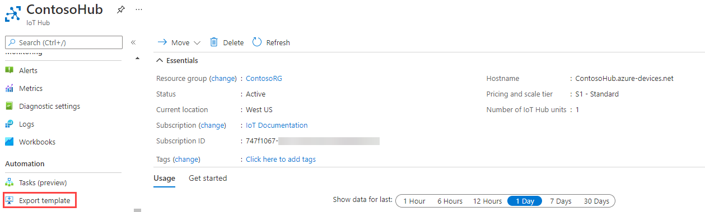
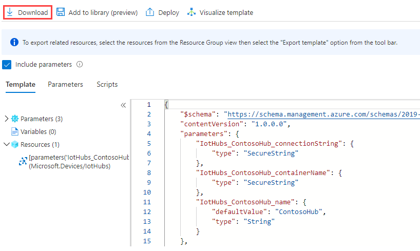
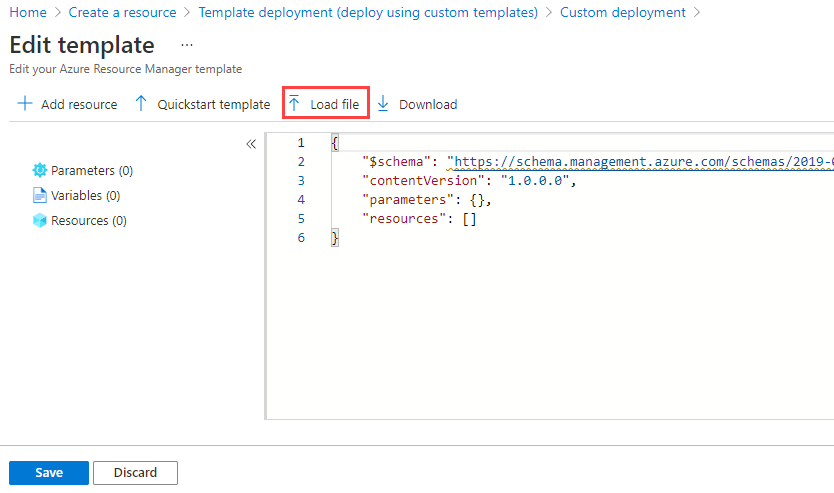
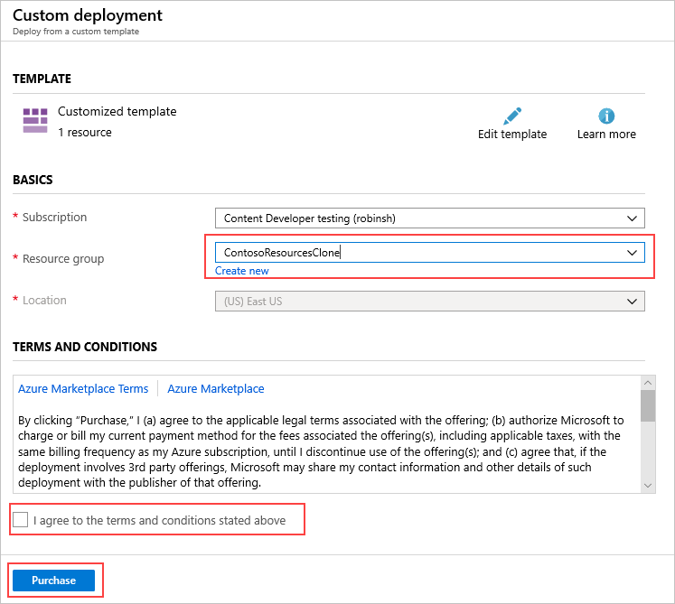

# How to clone an Azure IoT hub to another region

This article explores ways to clone an IoT Hub and provides some questions you need to answer before you start. Here are several reasons you might want to clone an IoT hub:
 
* You are moving your company from one region to another, such as from Europe to North America (or vice versa), and you want your resources and data to be geographically close to your new location, so you need to move your hub.

* You are setting up a hub for a development versus production environment.

* You want to do a custom implementation of multi-hub high availability. For more information, see the [How to achieve cross region HA section of IoT Hub high availability and disaster recovery](iot-hub-ha-dr.md#achieve-cross-region-ha).

* You want to increase the number of [partitions](iot-hub-scaling.md#partitions) configured for your hub. This is set when you first create your hub, and can't be changed. You can use the information in this article to clone your hub and when the clone is created, increase the number of partitions.

To clone a hub, you need a subscription with administrative access to the original hub. You can put the new hub in a new resource group and region, in the same subscription as the original hub, or even in a new subscription. You just can't use the same name because the hub name has to be globally unique.

> [!NOTE]
> At this time, there's no feature available for cloning an IoT hub automatically. It's primarily a manual process, and thus is fairly error-prone. The complexity of cloning a hub is directly proportional to the complexity of the hub. For example, cloning an IoT hub with no message routing is fairly simple. If you add message routing as just one complexity, cloning the hub becomes at least an order of magnitude more complicated. If you also move the resources used for routing endpoints, it's another order of magniture more complicated. 

## Things to consider

There are several things to consider before cloning an IoT hub.

* Make sure that all of the features available in the original location are also available in the new location. Some services are in preview, and not all features are available everywhere.

* Do not remove the original resources before creating and verifying the cloned version. Once you remove a hub, it's gone forever, and there is no way to recover it to check the settings or data to make sure the hub is replicated correctly.

* Many resources require globally unique names, so you must use different names for the cloned versions. You also should use a different name for the resource group to which the cloned hub belongs. 

* Data for the original IoT hub is not migrated. This includes telemetry messages, cloud-to-device (C2D) commands, and job-related information such as schedules and history. Metrics and logging results are also not migrated. 

* For data or messages routed to Azure Storage, you can leave the data in the original storage account, transfer that data to a new storage account in the new region, or leave the old data in place and create a new storage account in the new location for the new data. For more information on moving data in Blob storage, see [Get started with AzCopy](../storage/common/storage-use-azcopy-v10.md).

* Data for Event Hubs and for Service Bus Topics and Queues can't be migrated. This is point-in-time data and is not stored after the messages are processed.

* You need to schedule downtime for the migration. Cloning the devices to the new hub takes time. If you are using the Import/Export method, benchmark testing has revealed that it could take around two hours to move 500,000 devices, and four hours to move a million devices. 

* You can copy the devices to the new hub without shutting down or changing the devices. 

    * If the devices were originally provisioned using DPS, re-provisioning them updates the connection information stored in each device. 
    
    * Otherwise, you have to use the Import/Export method to move the devices, and then the devices have to be modified to use the new hub. For example, you can set up your device to consume the IoT Hub host name from the twin desired properties. The device will take that IoT Hub host name, disconnect the device from the old hub, and reconnect it to the new one.
    
* You need to update any certificates you are using so you can use them with the new resources. Also, you probably have the hub defined in a DNS table somewhere — you will need to update that DNS information.

## Methodology

This is the general method we recommend for moving an IoT hub from one region to another. For message routing, this assumes the resources are not being moved to the new region. For more information, see the [section on Message Routing](#how-to-handle-message-routing).

   1. Export the hub and its settings to a Resource Manager template. 
   
   1. Make the necessary changes to the template, such as updating all occurrences of the name and the location for the cloned hub. For any resources in the template used for message routing endpoints, update the key in the template for that resource.
   
   1. Import the template into a new resource group in the new location. This creates the clone.

   1. Debug as needed. 
   
   1. Add anything that wasn't exported to the template. 
   
       For example, consumer groups are not exported to the template. You need to add the consumer groups to the template manually or use the [Azure portal](https://portal.azure.com) after the hub is created. There is an example of adding one consumer group to a template in the article [Use an Azure Resource Manager template to configure IoT Hub message routing](tutorial-routing-config-message-routing-rm-template.md).
       
   1. Copy the devices from the original hub to the clone. This is covered in the section [Managing the devices registered to the IoT hub](#managing-the-devices-registered-to-the-iot-hub).

## How to handle message routing

If your hub uses [custom routing](iot-hub-devguide-messages-read-custom.md), exporting the template for the hub includes the routing configuration, but it does not include the resources themselves. You must choose whether to move the routing resources to the new location or to leave them in place and continue to use them "as is". 

For example, say you have a hub in West US that is routing messages to a storage account (also in West US), and you want to move the hub to East US. You can move the hub and have it still route messages to the storage account in West US, or you can move the hub and also move the storage account. There may be a small performance hit from routing messages to endpoint resources in a different region.

You can move a hub that uses message routing pretty easily if you do not also move the resources used for the routing endpoints. 

If the hub uses message routing, you have two choices. 

1. Move the resources used for the routing endpoints to the new location.

    * You must create the new resources yourself either manually in the [Azure portal](https://portal.azure.com) or through the use of Resource Manager templates. 

    * You must rename all of the resources when you create them in the new location, as they have globally unique names. 
     
    * You must update the resource names and the resource keys in the new hub's template, before creating the new hub. The resources should be present when the new hub is created.

1. Don't move the resources used for the routing endpoints. Use them "in place".

   * In the step where you edit the template, you will need to retrieve the keys for each routing resource and put them in the template before you create the new hub. 

   * The hub still references the original routing resources and routes messages to them as configured.

   * You will have a small performance hit because the hub and the routing endpoint resources are not in the same location.

## Prepare to migrate the hub to another region

This section provides specific instructions for migrating the hub.

### Find the original hub and export it to a resource template.

1. Sign into the [Azure portal](https://portal.azure.com). 

1. Go to **Resource Groups** and select the resource group that contains the hub you want to move. You can also go to **Resources** and find the hub that way. Select the hub.

1. Select **Export template** from the list of properties and settings for the hub. 

   

1. Select **Download** to download the template. Save the file somewhere you can find it again. 

   

### View the template 

1. Go to the Downloads folder (or to whichever folder you used when you exported the template) and find the zip file. Open the zip file and find the file called `template.json`. Select it, then select Ctrl+C to copy the template. Go to a different folder that's not in the zip file and paste the file (Ctrl+V). Now you can edit it.
 
    The following example is for a generic hub with no routing configuration. It is an S1 tier hub (with 1 unit) called **ContosoTestHub29358** in region **westus**. Here is the exported template.

    ``` json
    {
        "$schema": "https://schema.management.azure.com/schemas/2015-01-01/deploymentTemplate.json#",
        "contentVersion": "1.0.0.0",
        "parameters": {
            "IotHubs_ContosoTestHub29358_name": {
                "defaultValue": "ContosoTestHub29358",
                "type": "String"
            }
        },
        "variables": {},
        "resources": [
            {
                "type": "Microsoft.Devices/IotHubs",
                "apiVersion": "2018-04-01",
                "name": "[parameters('IotHubs_ContosoTestHub29358_name')]",
                "location": "westus",
                "sku": {
                    "name": "S1",
                    "tier": "Standard",
                    "capacity": 1
                },
                "properties": {
                    "operationsMonitoringProperties": {
                        "events": {
                            "None": "None",
                            "Connections": "None",
                            "DeviceTelemetry": "None",
                            "C2DCommands": "None",
                            "DeviceIdentityOperations": "None",
                            "FileUploadOperations": "None",
                            "Routes": "None"
                        }
                    },
                    "ipFilterRules": [],
                    "eventHubEndpoints": {
                        "events": {
                            "retentionTimeInDays": 1,
                            "partitionCount": 2,
                            "partitionIds": [
                                "0",
                                "1"
                            ],
                            "path": "contosotesthub29358",
                            "endpoint": "sb://iothub-ns-contosotes-2227755-92aefc8b73.servicebus.windows.net/"
                        },
                        "operationsMonitoringEvents": {
                            "retentionTimeInDays": 1,
                            "partitionCount": 2,
                            "partitionIds": [
                                "0",
                                "1"
                            ],
                            "path": "contosotesthub29358-operationmonitoring",
                            "endpoint": "sb://iothub-ns-contosotes-2227755-92aefc8b73.servicebus.windows.net/"
                        }
                    },
                    "routing": {
                        "endpoints": {
                            "serviceBusQueues": [],
                            "serviceBusTopics": [],
                            "eventHubs": [],
                            "storageContainers": []
                        },
                        "routes": [],
                        "fallbackRoute": {
                            "name": "$fallback",
                            "source": "DeviceMessages",
                            "condition": "true",
                            "endpointNames": [
                                "events"
                            ],
                            "isEnabled": true
                        }
                    },
                    "storageEndpoints": {
                        "$default": {
                            "sasTtlAsIso8601": "PT1H",
                            "connectionString": "",
                            "containerName": ""
                        }
                    },
                    "messagingEndpoints": {
                        "fileNotifications": {
                            "lockDurationAsIso8601": "PT1M",
                            "ttlAsIso8601": "PT1H",
                            "maxDeliveryCount": 10
                        }
                    },
                    "enableFileUploadNotifications": false,
                    "cloudToDevice": {
                        "maxDeliveryCount": 10,
                        "defaultTtlAsIso8601": "PT1H",
                        "feedback": {
                            "lockDurationAsIso8601": "PT1M",
                            "ttlAsIso8601": "PT1H",
                            "maxDeliveryCount": 10
                        }
                    },
                    "features": "None"
                }
            }
        ]
    }
    ```

### Edit the template 

You have to make some changes before you can use the template to create the new hub in the new region. Use [VS Code](https://code.visualstudio.com) or a text editor to edit the template.

#### Edit the hub name and location

1. Remove the parameters section at the top -- it is much simpler to just use the hub name because we're not going to have multiple parameters. 

    ``` json
        "parameters": {
            "IotHubs_ContosoTestHub29358_name": {
                "defaultValue": "ContosoTestHub29358",
                "type": "String"
            }
        },
    ```

1. Change the name to use the actual (new) name rather than retrieving it from a parameter (which you removed in the previous step). 

    For the new hub, use the name of the original hub plus the string *clone* to make up the new name. Start by cleaning up the hub name and location.
    
    Old version:

    ``` json 
    "name": "[parameters('IotHubs_ContosoTestHub29358_name')]",
    "location": "westus",
    ```
    
    New version: 

    ``` json 
    "name": "ContosoTestHub29358clone",
    "location": "eastus",
    ```

    Next, you'll find that the values for **path** contain the old hub name. Change them to use the new one. These are the path values under **eventHubEndpoints** called **events** and **OperationsMonitoringEvents**.

    When you're done, your event hub endpoints section should look like this:

    ``` json
    "eventHubEndpoints": {
        "events": {
            "retentionTimeInDays": 1,
            "partitionCount": 2,
            "partitionIds": [
                "0",
                "1"
            ],
            "path": "contosotesthub29358clone",
            "endpoint": "sb://iothub-ns-contosotes-2227755-92aefc8b73.servicebus.windows.net/"
        },
        "operationsMonitoringEvents": {
            "retentionTimeInDays": 1,
            "partitionCount": 2,
            "partitionIds": [
                "0",
                "1"
            ],
            "path": "contosotesthub29358clone-operationmonitoring",
            "endpoint": "sb://iothub-ns-contosotes-2227755-92aefc8b73.servicebus.windows.net/"
        }
    ```

#### Update the keys for the routing resources that are not being moved

When you export the Resource Manager template for a hub that has routing configured, you will see that the keys for those resources are not provided in the exported template -- their placement is denoted by asterisks. You must fill them in by going to those resources in the portal and retrieving the keys **before** you import the new hub's template and create the hub. 

1. Retrieve the keys required for any of the routing resources and put them in the template. You can retrieve the key(s) from the resource in the [Azure portal](https://portal.azure.com). 

   For example, if you are routing messages to a storage container, find the storage account in the portal. Under the Settings section, select **Access keys**, then copy one of the keys. Here's what the key looks like when you first export the template:

   ```json
   "connectionString": "DefaultEndpointsProtocol=https;
   AccountName=fabrikamstorage1234;AccountKey=****",
   "containerName": "fabrikamresults",
   ```

1. After you retrieve the account key for the storage account, put it in the template in the clause `AccountKey=****` in the place of the asterisks. 

1. For service bus queues, get the Shared Access Key matching the SharedAccessKeyName. Here is the key and the `SharedAccessKeyName` in the json:

   ```json
   "connectionString": "Endpoint=sb://fabrikamsbnamespace1234.servicebus.windows.net:5671/;
   SharedAccessKeyName=iothubroutes_FabrikamResources;
   SharedAccessKey=****;
   EntityPath=fabrikamsbqueue1234",
   ```

1. The same applies for the Service Bus Topics and Event Hub connections.

#### Create the new routing resources in the new location

This section only applies if you are moving the resources used by the hub for the routing endpoints.

If you want to move the routing resources, you must manually set up the resources in the new location. You can create the routing resources using the [Azure portal](https://portal.azure.com), or by exporting the Resource Manager template for each of the resources used by the message routing, editing them, and importing them. After the resources are set up, you can import the hub's template (which includes the routing configuration).

1. Create each resource used by the routing. You can do this manually using the [Azure portal](https://portal.azure.com), or create the resources using Resource Manager templates. If you want to use templates, these are the steps to follow:

    1. For each resource used by the routing, export it to a Resource Manager template.
    
    1. Update the name and location of the resource. 

    1. Update any cross-references between the resources. For example, if you create a template for a new storage account, you need to update the storage account name in that template and any other template that references it. In most cases, the routing section in the template for the hub is the only other template that references the resource. 

    1. Import each of the templates, which deploys each resource.

    Once the resources used by the routing are set up and running, you can continue.

1. In the template for the IoT hub, change the name of each of the routing resources to its new name, and update the location if needed. 

Now you have a template that will create a new hub that looks almost exactly like the old hub, depending on how you decided to handle the routing.

## Move -- create the new hub in the new region by loading the template

Create the new hub in the new location using the template. If you have routing resources that are going to move, the resources should be set up in the new location and the references in the template updated to match. If you are not moving the routing resources, they should be in the template with the updated keys.

1. Sign into the [Azure portal](https://portal.azure.com).

1. Select **Create a resource**. 

1. In the search box, put in "template deployment" and select Enter.

1. Select **template deployment (deploy using custom templates)**. This takes you to a screen for the Template deployment. Select **Create**. You see this screen:

   

1. Select **Build your own template in the editor**, which enables you to upload your template from a file. 

1. Select **Load file**. 

   

1. Browse for the new template you edited and select it, then select **Open**. It loads your template in the edit window. Select **Save**. 

   

1. Fill in the following fields.

   **Subscription**: select the subscription to use.

   **Resource group**: create a new resource group in a new location. If you already have a new one set up, you can select it instead of creating a new one.

   **Location**: If you selected an existing resource group, this is filled in for you to match the location of the resource group. If you created a new resource group, this will be its location.

   **I agree checkbox**: this basically says that you agree to pay for the resource(s) you're creating.

1. Select the **Purchase** button.

The portal now validates your template and deploys your cloned hub. If you have routing configuration data, it will be included in the new hub, but will point at the resources in the prior location.

## Managing the devices registered to the IoT hub

Now that you have your clone up and running, you need to copy all of the devices from the original hub to the clone. 

There are multiple ways to accomplish this. You either originally used [Device Provisioning Service (DPS)](/azure/iot-dps/about-iot-dps)to provision the devices, or you didn't. If you did, this is not difficult. If you did not, this can be very complicated. 

If you did not use DPS to provision your devices, you can skip the next section and start with [Using Import/Export to move the devices to the new hub](#using-import-export-to-move-the-devices-to-the-new-hub).

## Using DPS to re-provision the devices in the new hub

To use DPS to move the devices to the new location, see [How to re-provision devices](../iot-dps/how-to-reprovision.md). When you're finished, you can view the devices in the [Azure portal](https://portal.azure.com) and verify they are in the new location.

Go to the new hub using the [Azure portal](https://portal.azure.com). Select your hub, then select **IoT Devices**. You see the devices that were re-provisioned to the cloned hub. You can also view the properties for the cloned hub. 

If you have implemented routing, test and make sure your messages are routed to the resources correctly.

### Committing the changes after using DPS

This change has been committed by the DPS service.

### Rolling back the changes after using DPS. 

If you want to roll back the changes, re-provision the devices from the new hub to the old one.

You are now finished migrating your hub and its devices. You can skip to [Clean-up](#clean-up).

## Using Import-Export to move the devices to the new hub

The application targets .NET Core, so you can run it on either Windows or Linux. You can download the sample, retrieve your connection strings, set the flags for which bits you want to run, and run it. You can do this without ever opening the code.

### Downloading the sample

1. Use the IoT C# samples from this page: [Azure IoT Samples for C#](https://azure.microsoft.com/resources/samples/azure-iot-samples-csharp/). Download the zip file and unzip it on your computer. 

1. The pertinent code is in ./iot-hub/Samples/service/ImportExportDevicesSample. You don't need to view or edit the code in order to run the application.

1. To run the application, specify three connection strings and five options. You pass this data in as command-line arguments or use environment variables, or use a combination of the two. We're going to pass the options in as command line arguments, and the connection strings as environment variables. 

   The reason for this is because the connection strings are long and ungainly, and unlikely to change, but you might want to change the options and run the application more than once. To change the value of an environment variable, you have to close the command window and Visual Studio or VS Code, whichever you are using. 

### Options

Here are the five options you specify when you run the application. We'll put these on the command line in a minute.

*   **addDevices** (argument 1) -- set this to true if you want to add virtual devices that are generated for you. These are added to the source hub. Also, set **numToAdd** (argument 2) to specify how many devices you want to add. The maximum number of devices you can register to a hub is one million.The purpose of this option is for testing -- you can generate a specific number of devices, and then copy them to another hub.

*   **copyDevices** (argument 3) -- set this to true to copy the devices from one hub to another. 

*   **deleteSourceDevices** (argument 4) -- set this to true to delete all of the devices registered to the source hub. We recommending waiting until you are certain all of the devices have been transferred before you run this. Once you delete the devices, you can't get them back.

*   **deleteDestDevices** (argument 5) -- set this to true to delete all of the devices registered to the destination hub (the clone). You might want to do this if you want to copy the devices more than once. 

The basic command will be *dotnet run* -- this tells .NET to build the local csproj file and then run it. You add your command-line arguments to the end before you run it. 

Your command-line will look like these examples:

``` console 
    // Format: dotnet run add-devices num-to-add copy-devices delete-source-devices delete-destination-devices

    // Add 1000 devices, don't copy them to the other hub, or delete them. 
    // The first argument is true, numToAdd is 50, and the other arguments are false.
    dotnet run true 1000 false false false 

    // Copy the devices you just added to the other hub; don't delete anything.
    // The first argument is false, numToAdd is 0, copy-devices is true, and the delete arguments are both false
    dotnet run false 0 true false false 
```

### Using environment variables for the connection strings

1. To run the sample, you need the connection strings to the old and new IoT hubs, and to a storage account you can use for temporary work files. We will store the values for these in environment variables.

1. To get the connection string values, sign in to the [Azure portal](https://portal.azure.com). 

1. Put the connection strings somewhere you can retrieve them, such as NotePad. If you copy the following, you can paste the connection strings in directly where they go. Don't add spaces around the equal sign, or it changes the variable name. Also, you do not need double-quotes around the connection strings. If you put quotes around the storage account connection string, it won't work.

   For Windows, this is how you set the environment variables:

   ``` console  
   SET IOTHUB_CONN_STRING=<put connection string to original IoT Hub here>
   SET DEST_IOTHUB_CONN_STRING=<put connection string to destination or clone IoT Hub here>
   SET STORAGE_ACCT_CONN_STRING=<put connection string to the storage account here>
   ```
 
   For Linux, this is how you define the environment variables:

   ``` console  
   export IOTHUB_CONN_STRING="<put connection string to original IoT Hub here>"
   export DEST_IOTHUB_CONN_STRING="<put connection string to destination or clone IoT Hub here>"
   export STORAGE_ACCT_CONN_STRING="<put connection string to the storage account here>"
   ```

1. For the IoT hub connection strings, go to each hub in the portal. You can search in **Resources** for the hub. If you know the Resource Group, you can go to **Resource groups**, select your resource group, and then select the hub from the list of assets in that resource group. 

1. Select **Shared access policies** from the Settings for the hub, then select **iothubowner** and copy one of the connection strings. Do the same for the destination hub. Add them to the appropriate SET commands.

1. For the storage account connection string, find the storage account in **Resources** or under its **Resource group** and open it. 
   
1. Under the Settings section, select **Access keys** and copy one of the connection strings. Put the connection string in your text file for the appropriate SET command. 

Now you have the environment variables in a file with the SET commands, and you know what your command-line arguments are. Let's run the sample.

### Running the sample application and using command-line arguments

1. Open a command prompt window. Select Windows and type in `command prompt` to get the command prompt window.

1. Copy the commands that set the environment variables, one at a time, and paste them into the command prompt window and select Enter. When you're finished, type `SET` in the command prompt window to see your environment variables and their values. Once you've copied these into the command prompt window, you don't have to copy them again, unless you open a new command prompt window.

1. In the command prompt window, change directories until you are in ./ImportExportDevicesSample (where the ImportExportDevicesSample.csproj file exists). Then type the following, and include your command-line arguments.

    ``` console
    // Format: dotnet run add-devices num-to-add copy-devices delete-source-devices delete-destination-devices
    dotnet run arg1 arg2 arg3 arg4 arg5
    ```

    The dotnet command builds and runs the application. Because you are passing in the options when you run the application, you can change the values of them each time you run the application. For example, you may want to run it once and create new devices, then run it again and copy those devices to a new hub, and so on. You can also perform all the steps in the same run, although we recommend not deleting any devices until you are certain you are finished with the cloning. Here is an example that creates 1000 devices and then copies them to the other hub.

    ``` console
    // Format: dotnet run add-devices num-to-add copy-devices delete-source-devices delete-destination-devices

    // Add 1000 devices, don't copy them to the other hub or delete them. 
    dotnet run true 1000 false false false 

    // Do not add any devices. Copy the ones you just created to the other hub; don't delete anything.
    dotnet run false 0 true false false 
    ```

    After you verify that the devices were copied successfully, you can remove the devices from the source hub like this:

   ``` console
   // Format: dotnet run add-devices num-to-add copy-devices delete-source-devices delete-destination-devices
   // Delete the devices from the source hub.
   dotnet run false 0 false true false 
   ```

### Running the sample application using Visual Studio

1. If you want to run the application in Visual Studio, change your current directory to the folder where the IoTHubServiceSamples.sln file resides. Then run this command in the command prompt window to open the solution in Visual Studio. You must do this in the same command window where you set the environment variables, so those variables are known.

   ``` console       
   IoTHubServiceSamples.sln
   ```
    
1. Right-click on the project *ImportExportDevicesSample* and select **Set as startup project**.    
    
1. Set the variables at the top of Program.cs in the ImportExportDevicesSample folder for the five options.

   ``` csharp
   // Add randomly created devices to the source hub.
   private static bool addDevices = true;
   //If you ask to add devices, this will be the number added.
   private static int numToAdd = 0; 
   // Copy the devices from the source hub to the destination hub.
   private static bool copyDevices = false;
   // Delete all of the devices from the source hub. (It uses the IoTHubConnectionString).
   private static bool deleteSourceDevices = false;
   // Delete all of the devices from the destination hub. (Uses the DestIotHubConnectionString).
   private static bool deleteDestDevices = false;
   ```

1. Select F5 to run the application. After it finishes running, you can view the results.

### View the results 

You can view the devices in the [Azure portal](https://portal.azure.com) and verify they are in the new location.

1. Go to the new hub using the [Azure portal](https://portal.azure.com). Select your hub, then select **IoT Devices**. You see the devices you just copied from the old hub to the cloned hub. You can also view the properties for the cloned hub. 

1. Check for import/export errors by going to the Azure storage account in the [Azure portal](https://portal.azure.com) and looking in the `devicefiles` container for the `ImportErrors.log`. If this file is empty (the size is 0), there were no errors. If you try to import the same device more than once, it rejects the device the second time and adds an error message to the log file.

### Committing the changes 

At this point, you have copied your hub to the new location and migrated the devices to the new clone. Now you need to make changes so the devices work with the cloned hub.

To commit the changes, here are the steps you need to perform: 

* Update each device to change the IoT Hub host name to point the IoT Hub host name to the new hub. You should do this using the same method you used when you first provisioned the device.

* Change any applications you have that refer to the old hub to point to the new hub.

* After you're finished, the new hub should be up and running. The old hub should have no active devices and be in a disconnected state. 

### Rolling back the changes

If you decide to roll back the changes, here are the steps to perform:

* Update each device to change the IoT Hub Hostname to point the IoT Hub Hostname for the old hub. You should do this using the same method you used when you first provisioned the device.

* Change any applications you have that refer to the new hub to point to the old hub. For example, if you are using Azure Analytics, you may need to reconfigure your [Azure Stream Analytics input](../stream-analytics/stream-analytics-define-inputs.md#stream-data-from-iot-hub).

* Delete the new hub. 

* If you have routing resources, the configuration on the old hub should still point to the correct routing configuration, and should work with those resources after the hub is restarted.

### Checking the results 

To check the results, change your IoT solution to point to your hub in the new location and run it. In other words, perform the same actions with the new hub that you performed with the previous hub and make sure they work correctly. 

If you have implemented routing, test and make sure your messages are routed to the resources correctly.

## Clean-up

Don't clean up until you are really certain the new hub is up and running and the devices are working correctly. Also be sure to test the routing if you are using that feature. When you're ready, clean up the old resources by performing these steps:

* If you haven't already, delete the old hub. This removes all of the active devices from the hub.

* If you have routing resources that you moved to the new location, you can delete the old routing resources.

## Next steps

You have cloned an IoT hub into a new hub in a new region, complete with the devices. For more information about performing bulk operations against the identity registry in an IoT Hub, see [Import and export IoT Hub device identities in bulk](iot-hub-bulk-identity-mgmt.md).

For more information about IoT Hub and development for the hub, please see the following articles.

* [IoT Hub developer's guide](iot-hub-devguide.md)

* [IoT Hub routing tutorial](tutorial-routing.md)

* [IoT Hub device management overview](iot-hub-device-management-overview.md)

* If you want to deploy the sample application, please see [.NET Core application deployment](https://docs.microsoft.com/dotnet/core/deploying/index).
