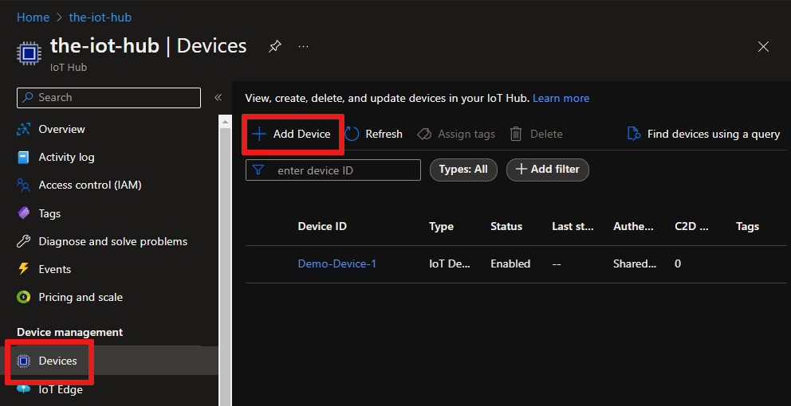
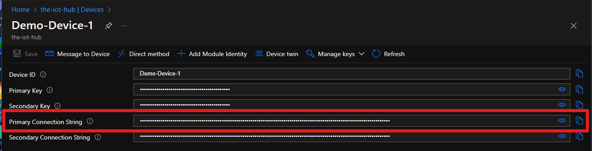

# Order device connection events from Azure IoT Hub using Azure Cosmos DB

Azure Event Grid helps you build event-based applications and easily integrate IoT events in your business solutions. This article walks you through a setup which can be used to track and store the latest device connection state in Cosmos DB. We will use the sequence number available in the Device Connected and Device Disconnected events and store the latest state in Cosmos DB. We are going to use a stored procedure, which is an application logic that is executed against a collection in Cosmos DB.

The sequence number is a string representation of a hexadecimal number. You can use string compare to identify the larger number. If you are converting the string to hex, then the number will be a 256-bit number. The sequence number is strictly increasing, and the latest event will have a higher number than other events. This is useful if you have frequent device connects and disconnects, and want to ensure only the latest event is used to trigger a downstream action, as Azure Event Grid doesn’t support ordering of events.

## Prerequisites

* An active Azure Cosmos DB SQL API account. If you haven't created one yet, see [Create a database account](../cosmos-db/create-sql-api-java.md#create-a-database-account) for a walkthrough.

* A collection in your database. See [Add a collection](../cosmos-db/create-sql-api-java.md#add-a-container) for a walkthrough. When you create your collection, use `/id` for the partition key.

* An IoT Hub in Azure. If you haven't created one yet, see [Get started with IoT Hub](../iot-develop/quickstart-send-telemetry-iot-hub.md?pivots=programming-language-csharp) for a walkthrough.

## Create a stored procedure

Let's create a stored procedure and configure it to compare sequence numbers of incoming events and to record the latest event per device in the database.

1. In your Cosmos DB SQL API, select **Data Explorer** > **Items** > **New Stored Procedure**.

   :::image type="content" source="media/iot-hub-how-to-order-connection-state-events/create-stored-procedure.png" alt-text="Screenshot of how to create a new stored procedure in the Azure portal." lightbox="media/iot-hub-how-to-order-connection-state-events/create-stored-procedure.png":::

2. Enter **LatestDeviceConnectionState** for the stored procedure ID and paste the following in the **Stored Procedure body**. Note that this code should replace any existing code in the stored procedure body. This code maintains one row per device ID and records the latest connection state of that device ID by identifying the highest sequence number.

    ```javascript
    // SAMPLE STORED PROCEDURE
    function UpdateDevice(deviceId, moduleId, hubName, connectionState, connectionStateUpdatedTime, sequenceNumber) {
      var collection = getContext().getCollection();
      var response = {};

      var docLink = getDocumentLink(deviceId, moduleId);

      var isAccepted = collection.readDocument(docLink, function(err, doc) {
        if (err) {
          console.log('Cannot find device ' + docLink + ' - ');
          createDocument();
        } else {
          console.log('Document Found - ');
          replaceDocument(doc);
        }
      });

      function replaceDocument(document) {
        console.log(
          'Old Seq :' +
            document.sequenceNumber +
            ' New Seq: ' +
            sequenceNumber +
            ' - '
        );
        if (sequenceNumber > document.sequenceNumber) {
          document.connectionState = connectionState;
          document.connectionStateUpdatedTime = connectionStateUpdatedTime;
          document.sequenceNumber = sequenceNumber;

          console.log('replace doc - ');

          isAccepted = collection.replaceDocument(docLink, document, function(
            err,
            updated
          ) {
            if (err) {
              getContext()
                .getResponse()
                .setBody(err);
            } else {
              getContext()
                .getResponse()
                .setBody(updated);
            }
          });
        } else {
          getContext()
            .getResponse()
            .setBody('Old Event - current: ' + document.sequenceNumber + ' Incoming: ' + sequenceNumber);
        }
      }
      function createDocument() {
        document = {
          id: deviceId + '-' + moduleId,
          deviceId: deviceId,
          moduleId: moduleId,
          hubName: hubName,
          connectionState: connectionState,
          connectionStateUpdatedTime: connectionStateUpdatedTime,
          sequenceNumber: sequenceNumber
        };
        console.log('Add new device - ' + collection.getAltLink());
        isAccepted = collection.createDocument(
          collection.getAltLink(),
          document,
          function(err, doc) {
            if (err) {
              getContext()
                .getResponse()
                .setBody(err);
            } else {
              getContext()
                .getResponse()
                .setBody(doc);
            }
          }
        );
      }

      function getDocumentLink(deviceId, moduleId) {
        return collection.getAltLink() + '/docs/' + deviceId + '-' + moduleId;
      }
    }
    ```

3. Save the stored procedure:

   :::image type="content" source="media/iot-hub-how-to-order-connection-state-events/save-stored-procedure.png" alt-text="Screenshot of how to save a stored procedure in a Cosmos DB service in the Azure portal." lightbox="media/iot-hub-how-to-order-connection-state-events/save-stored-procedure.png":::

## Create a logic app

Let's create a logic app and add an Event grid trigger that monitors the resource group for your virtual machine.

### Create a logic app resource

1. In the [Azure portal](https://portal.azure.com), select **+Create a resource**, select **Integration** and then **Logic App**.

   :::image type="content" source="media/iot-hub-how-to-order-connection-state-events/select-logic-app.png" alt-text="Screenshot of how to find and select a logic app in the Azure portal." lightbox="media/iot-hub-how-to-order-connection-state-events/select-logic-app.png":::

1. Complete the form to create a new Logic App that includes:
   - Your subscription
   - Your resource group (or create a new one)
   - A Logic App name that's unique in your subscription
   - The region of your IoT hub
   - A *No* for enabling log analytics
   - A plan type of *Consumption*

     >[!NOTE] 
     > The *Consumption* plan type is the option that enables the Logic Apps Designer in the UI. If you choose *Standard* (the default), then you must create a new workflow in order for the Logic Apps Designer to become available.

   :::image type="content" source="media/iot-hub-how-to-order-connection-state-events/new-logic-app.png" alt-text="Screenshot of how to create a logic app in the Azure portal." lightbox="media/iot-hub-how-to-order-connection-state-events/new-logic-app.png":::

1. Select **Review + Create** to review your configuration, then select **Create** to create the logic app.

1. You've now created an Azure resource for your logic app. After Azure deploys your logic app, select **Go to resource**. Logic Apps Designer shows you templates for common patterns so you can get started faster.
 
1. In the Logic Apps Designer, scroll until you see the **Templates** section, then choose **Blank Logic App** so that you can build your logic app from scratch.

### Select a trigger

A trigger is a specific event that starts your logic app. For this tutorial, the trigger that sets off the workflow is receiving a request over HTTP.

1. In the connectors and triggers search bar, type **HTTP** and hit Enter.

2. Select the request **When a HTTP request is received** as the trigger.

   :::image type="content" source="media/iot-hub-how-to-order-connection-state-events/http-request-trigger.png" alt-text="Screenshot of how to find select HTTP request trigger." lightbox="media/iot-hub-how-to-order-connection-state-events/http-request-trigger.png":::

3. Select **Use sample payload to generate schema**.

   :::image type="content" source="media/iot-hub-how-to-order-connection-state-events/sample-payload.png" alt-text="Screenshot of how to use a sample payload to generate a schema." lightbox="media/iot-hub-how-to-order-connection-state-events/sample-payload.png":::


4. Paste the following sample JSON code into the text box, then select **Done**:

   ```json
   [{
    "id": "fbfd8ee1-cf78-74c6-dbcf-e1c58638ccbd",
    "topic":
      "/SUBSCRIPTIONS/DEMO5CDD-8DAB-4CF4-9B2F-C22E8A755472/RESOURCEGROUPS/EGTESTRG/PROVIDERS/MICROSOFT.DEVICES/IOTHUBS/MYIOTHUB",
    "subject": "devices/Demo-Device-1",
    "eventType": "Microsoft.Devices.DeviceConnected",
    "eventTime": "2018-07-03T23:20:11.6921933+00:00",
    "data": {
      "deviceConnectionStateEventInfo": {
        "sequenceNumber":
          "000000000000000001D4132452F67CE200000002000000000000000000000001"
      },
      "hubName": "MYIOTHUB",
      "deviceId": "48e44e11-1437-4907-83b1-4a8d7e89859e",
      "moduleId": ""
    },
    "dataVersion": "1",
    "metadataVersion": "1"
   }]
   ```

   :::image type="content" source="media/iot-hub-how-to-order-connection-state-events/paste-sample-payload.png" alt-text="Screenshot of the sample JSON payload pasted into the text box in Azure." lightbox="media/iot-hub-how-to-order-connection-state-events/paste-sample-payload.png":::

5. You may receive a pop-up notification that says, **Remember to include a Content-Type header set to application/json in your request.** You can safely ignore this suggestion, and move on to the next section.

### Create a condition

In your logic app workflow, conditions help run specific actions after passing that specific condition. Once the condition is met, a desired action can be defined. For this tutorial, the condition is to check whether eventType is device connected or device disconnected. The action will be to execute the stored procedure in your database.

1. Select **+ New step**, then the **Built-in** tab, then find and select the control called **Condition**. 

1. Select inside the **Choose a value** box and a pop up appears, showing the **Dynamic content** — the fields that can be selected. 

   * Choose **eventType**. The popup closes and you see **Body** is placed in **Select an output from previous steps**, automatically. Select **Condition** to reopen it.
   * Change **is equal to** to **ends with**.
   * Type in **nected** as the value to end with. This is a search term that will include both "connected" and "disconnected" when parsed.

   :::image type="content" source="media/iot-hub-how-to-order-connection-state-events/condition-detail.png" alt-text="Screenshot of the full For Each condition." lightbox="media/iot-hub-how-to-order-connection-state-events/condition-detail.png":::

1. In the **if true** dialog, click on **Add an action**.
  
   :::image type="content" source="media/iot-hub-how-to-order-connection-state-events/action-if-true.png" alt-text="Screenshot of the 'If true' box in Azure." lightbox="media/iot-hub-how-to-order-connection-state-events/action-if-true.png":::

1. Search for Cosmos DB and select **Azure Cosmos DB — Execute stored procedure (V2)**

   :::image type="content" source="media/iot-hub-how-to-order-connection-state-events/cosmosDB-search.png" alt-text="Screenshot of the search for Azure Cosmos DB." lightbox="media/iot-hub-how-to-order-connection-state-events/cosmosDB-search.png":::

1. Fill in **cosmosdb-connection** for the **Connection Name** and choose an [authentication type](/azure/connectors/connectors-create-api-cosmos-db?tabs=consumption.md#connect-to-azure-cosmos-db), then select **Create**. 

1. You see the **Execute stored procedure (V2)** panel. Enter the values for the fields:

   **Azure Cosmos DB account name**: {Add your account name}
   
   **Database ID**: ToDoList

   **Collection ID**: Items

   **Sproc ID**: LatestDeviceConnectionState

1. For the final field, select **Add new parameter**. In the dropdown that appears, check the boxes next to **Partition key value** and **Parameters for the stored procedure**, then click anywhere else on the screen to process your entry; it adds a field for **Partition key value** and a field for **Parameters for the stored procedure**.

   :::image type="content" source="media/iot-hub-how-to-order-connection-state-events/logicapp-stored-procedure.jpg" alt-text="Screenshot shows an Execute stored procedure (V2) item with 'Add new parameter' selected." lightbox="media/iot-hub-how-to-order-connection-state-events/logicapp-stored-procedure.jpg":::

1. Now enter the partition key value and parameters as shown. Add the dash, brackets, double-quotes, and commas around your values. You may have to select **Add dynamic content** to get these valid values.

   :::image type="content" source="media/iot-hub-how-to-order-connection-state-events/logicapp-stored-procedure-2.jpg" alt-text="Screenshot shows an 'Execute stored procedure' item with parameters entered." lightbox="media/iot-hub-how-to-order-connection-state-events/logicapp-stored-procedure-2.jpg":::

1. Save your logic app.

### Copy the HTTP URL

Before you leave the Logic Apps Designer, copy the URL that your logic app is listening to for a trigger. You use this URL to configure Event Grid.

1. Expand the **When a HTTP request is received** trigger configuration box by clicking on it.

1. Copy the value of **HTTP POST URL** by selecting the copy button next to it.

   :::image type="content" source="media/iot-hub-how-to-order-connection-state-events/copy-url.png" alt-text="Screenshot of where to find the HTTP URL to copy." lightbox="media/iot-hub-how-to-order-connection-state-events/copy-url.png":::

1. Save this URL so that you can use it in the next section.

## Configure subscription for IoT Hub events

In this section, you configure your IoT Hub to publish events as they occur.

1. In the Azure portal, navigate to your IoT hub.

1. Select **Events**.

   :::image type="content" source="media/iot-hub-how-to-order-connection-state-events/event-grid.jpg" alt-text="Screenshot of where the Events button is located in the IoT Hub menu." lightbox="media/iot-hub-how-to-order-connection-state-events/event-grid.jpg":::

1. Select **+ Event subscription**.

   

1. Fill in **Event Subscription Details**: provide a descriptive **Name** and select **Event Grid Schema** as the **Event Schema**.

1. Create a **System Topic Name** for your IoT hub resource.

1. Fill in the **Event Types** fields. In the dropdown list, select only **Device Connected** and **Device Disconnected** from the menu. Click anywhere else on the screen to close the list and save your selections.

   

1. For **Endpoint Details**, select Endpoint Type as **Web Hook** and click on select endpoint and paste the URL that you copied from your logic app and confirm selection.

   

1. The form should now look similar to the following example:

   :::image type="content" source="media/iot-hub-how-to-order-connection-state-events/subscription-form.jpg" alt-text="Screenshot of the form to create an event subscription." lightbox="media/iot-hub-how-to-order-connection-state-events/subscription-form.jpg":::

   Select **Create** to save the event subscription.

## Observe events

Now that your event subscription is set up, let's test by connecting a device.

### Register a device in IoT Hub

1. From your IoT hub, select **Devices**.

1. Select **+ Add Device** at the top of the pane.

1. For **Device ID**, enter `Demo-Device-1`.

1. Select **Save**.

   

1. Click on the device again; now the connection strings and keys will be filled in. Copy and save the **Primary Connection String** for later use.

   

### Start Raspberry Pi simulator

Let's use the Raspberry Pi web simulator to simulate device connection.

[Start Raspberry Pi simulator](https://azure-samples.github.io/raspberry-pi-web-simulator/#Getstarted)

### Run a sample application on the Raspberry Pi web simulator

This will trigger a device connected event.

1. In the coding area, replace the placeholder in Line 15 with your Azure IoT Hub device connection string that you saved at the end of the previous section.

   

2. Run the application by selecting **Run**.

You see something similar to the following output that shows the sensor data and the messages that are sent to your IoT hub.

   

   Select **Stop** to stop the simulator and trigger a **Device Disconnected** event.

You have now run a sample application to collect sensor data and send it to your IoT hub.

### Observe events in Cosmos DB

You can see results of the executed stored procedure in your Cosmos DB document. Here's what it looks like. Each row contains the latest device connection state per device.

   

## Use the Azure CLI

Instead of using the [Azure portal](https://portal.azure.com), you can accomplish the IoT Hub steps using the Azure CLI. For details, see the Azure CLI pages for [creating an event subscription](/cli/azure/eventgrid/event-subscription) and [creating an IoT device](/cli/azure/iot/hub/device-identity#az-iot-hub-device-identity-create).

## Clean up resources

This tutorial used resources that incur charges on your Azure subscription. When you're finished trying out the tutorial and testing your results, disable or delete resources that you don't want to keep.

### Logic app

If you don't want to lose the work on your logic app, disable it instead of deleting it.

1. Navigate to your logic app.

1. On the **Overview** blade, select **Delete** or **Disable**.

   Each subscription can have one free IoT hub. If you created a free hub for this tutorial, then you don't need to delete it to prevent charges.

### IoT hub or Event Grid

1. Navigate to your IoT hub.

1. On the **Overview** blade, select **Delete**.

1. Even if you keep your IoT hub, you may want to delete the event subscription that you created. In your IoT hub, select **Event Grid**.

1. Select the event subscription that you want to remove, then select **Delete**.

### Cosmos DB

To remove an Azure Cosmos DB account from the Azure portal, right-click the account name and click **Delete account**. See detailed instructions for [deleting an Azure Cosmos DB account](../cosmos-db/how-to-manage-database-account.md).

## Next steps

* Learn more about [Reacting to IoT Hub events by using Event Grid to trigger actions](../iot-hub/iot-hub-event-grid.md)

* [Try the IoT Hub events tutorial](../event-grid/publish-iot-hub-events-to-logic-apps.md)

* Learn about what else you can do with [Event Grid](../event-grid/overview.md)

* Learn how to use Event Grid and Azure Monitor to [Monitor, diagnose, and troubleshoot device connectivity to IoT Hub](iot-hub-troubleshoot-connectivity.md)