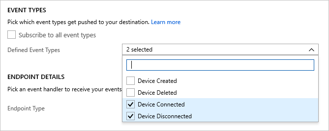

# Order device connection events from Azure IoT Hub using Azure Cosmos DB

[Azure Event Grid](../event-grid/overview.md) helps you build event-based applications and easily integrates IoT events in your business solutions. This article walks you through a setup using Cosmos DB, Logic App, IoT Hub Events, and a simulated Raspberry Pi to collect and store connection and disconnection events of a device.

From the moment your device runs, an order of operations activates:

1. The Pi device, using your IoT hub device key, is started and then stopped
1. An IoT Hub event captures the device activity, then sends an HTTP request to your Logic App
1. The Logic App processes the HTTP request based on a condition you set 
1. The Logic App logs connection or disconnection events into a new document in Cosmos DB

   :::image type="content" source="media/iot-hub-how-to-order-connection-state-events/event-grid-setup.png" alt-text="Screenshot of the setup we'll create for this article. This setup shows how all services and devices are connected." lightbox="media/iot-hub-how-to-order-connection-state-events/event-grid-setup.png":::

<!--
A sequence number is used in the *Device Connected* and *Device Disconnected* to track and order events. 

The sequence number is a string representation of a hexadecimal number. You can use a string comparison to identify the larger number. If you're converting the string to hexadecimal, then the number will be a 256-bit number. The sequence number is strictly increasing, and the latest event will have a higher number than past events. This sequence is useful if you have frequent device connects and disconnects, and want to ensure only the latest event is used to trigger a downstream action, as Azure Event Grid doesn't support the ordering of events.
-->

## Prerequisites

* An active Azure Cosmos DB for NoSQL account. If you haven't created one yet, see [Create a database account](../cosmos-db/create-sql-api-java.md#create-a-database-account) for a walkthrough.

* A collection in your database. See [Add a collection](../cosmos-db/create-sql-api-java.md#add-a-container) for a walkthrough. When you create your collection, use `/id` for the partition key.

* An Azure subscription. If you don't have an Azure subscription, [create one for free](https://azure.microsoft.com/free/?WT.mc_id=A261C142F) before you begin.

* An IoT hub under your Azure subscription. Create one with the [CLI](iot-hub-create-using-cli.md) or the [Azure portal](iot-hub-create-through-portal.md).

## Create a logic app

Let's create a logic app and add an Event Grid trigger that monitors the resource group for your virtual machine.

### Create a logic app resource

1. In the [Azure portal](https://portal.azure.com), select **+Create a resource**, select **Integration** and then **Logic App**.

   :::image type="content" source="media/iot-hub-how-to-order-connection-state-events/select-logic-app.png" alt-text="Screenshot of how to find and select a logic app in the Azure portal." lightbox="media/iot-hub-how-to-order-connection-state-events/select-logic-app.png":::

1. Complete the form to create a new Logic App that includes:
   - Your subscription
   - Your resource group (or create a new one)
   - A Logic App name that's unique in your subscription
   - The region of your IoT hub
   - A *No* for enabling log analytics
   - A plan type of *Consumption*

     >[!NOTE] 
     > The *Consumption* plan type is the option that enables the **Logic app designer** in the UI. If you choose *Standard* (the default), then you must create a new workflow in order for the **Logic app designer** to become available.

   :::image type="content" source="media/iot-hub-how-to-order-connection-state-events/new-logic-app.png" alt-text="Screenshot of how to create a logic app in the Azure portal." lightbox="media/iot-hub-how-to-order-connection-state-events/new-logic-app.png":::

1. Select **Review + Create** to review your configuration, then select **Create** to create the logic app.

1. You've now created an Azure resource for your logic app. After Azure deploys your logic app, select **Go to resource**. **Logic app designer** shows you templates for common patterns so you can get started faster.
 
1. In the **Logic app designer**, scroll until you see the **Templates** section, then choose **Blank Logic App** so that you can build your logic app from scratch.

### Select a trigger

A trigger is a specific event that starts your logic app. For this tutorial, the trigger that sets off the workflow is receiving a request over HTTP.

1. In the connectors and triggers search bar, type **HTTP** and hit Enter.

2. Select the request **When a HTTP request is received** as the trigger.

   :::image type="content" source="media/iot-hub-how-to-order-connection-state-events/http-request-trigger.png" alt-text="Screenshot of how to find select HTTP request trigger." lightbox="media/iot-hub-how-to-order-connection-state-events/http-request-trigger.png":::

3. Select **Use sample payload to generate schema**.

   :::image type="content" source="media/iot-hub-how-to-order-connection-state-events/sample-payload.png" alt-text="Screenshot of how to use a sample payload to generate a schema." lightbox="media/iot-hub-how-to-order-connection-state-events/sample-payload.png":::


4. Paste the following sample JSON code into the text box, then select **Done**. 
   
   This JSON is only used as a template, so the exact values aren't important.

   ```json
   [{
    "id": "fbfd8ee1-cf78-74c6-dbcf-e1c58638ccbd",
    "topic":
      "/SUBSCRIPTIONS/DEMO5CDD-8DAB-4CF4-9B2F-C22E8A755472/RESOURCEGROUPS/EGTESTRG/PROVIDERS/MICROSOFT.DEVICES/IOTHUBS/MYIOTHUB",
    "subject": "devices/Demo-Device-1",
    "eventType": "Microsoft.Devices.DeviceConnected",
    "eventTime": "2018-07-03T23:20:11.6921933+00:00",
    "data": {
      "deviceConnectionStateEventInfo": {
        "sequenceNumber":
          "000000000000000001D4132452F67CE200000002000000000000000000000001"
      },
      "hubName": "MYIOTHUB",
      "deviceId": "48e44e11-1437-4907-83b1-4a8d7e89859e",
      "moduleId": ""
    },
    "dataVersion": "1",
    "metadataVersion": "1"
   }]
   ```

   :::image type="content" source="media/iot-hub-how-to-order-connection-state-events/paste-sample-payload.png" alt-text="Screenshot of the sample JSON payload pasted into the text box in Azure." lightbox="media/iot-hub-how-to-order-connection-state-events/paste-sample-payload.png":::

### Create a condition

Conditions help run specific actions after passing that specific condition. For this article, the condition is to check whether **eventType** is either device connected or device disconnected. The action executed when that **eventType** is true is the creation of a document in Azure Cosmos DB. This condition is created in the **Logic app designer**.

1. Select **+ New step**, then the **Built-in** tab, then find and select the control called **Condition**. 

1. In your condition, change **And** to **Or**, since we want to capture either connection events or disconnection events in a single parse.

1. Select inside the **Choose a value** box and a pop up appears, showing the **Dynamic content** — the fields that can be selected. 

   * Choose **eventType**. The popup closes and you see **Body** is placed in **Select an output from previous steps**, automatically. Select **Condition** to reopen your conditional statement.
   * Keep the **is equal to** value.
   * Type in **Microsoft.Devices.DeviceConnected** as the last value of that row. 
   * Select **+ Add** to add another row.
   * This second row is similar to the first row, except we look for disconnection events.

     Use **eventType**, **is equal to**, and **Microsoft.Devices.DeviceDisconnected** for the row values.

     :::image type="content" source="media/iot-hub-how-to-order-connection-state-events/condition-detail.jpg" alt-text="Screenshot of the full For Each condition." lightbox="media/iot-hub-how-to-order-connection-state-events/condition-detail.jpg":::

1. In the **if true** dialog, click on **Add an action**.
  
   :::image type="content" source="media/iot-hub-how-to-order-connection-state-events/action-if-true.png" alt-text="Screenshot of the 'If true' box in Azure." lightbox="media/iot-hub-how-to-order-connection-state-events/action-if-true.png":::

1. Search for Cosmos DB and select **Azure Cosmos DB — Create or update document (V3)**

   :::image type="content" source="media/iot-hub-how-to-order-connection-state-events/cosmosDB-search.png" alt-text="Screenshot of the search for Azure Cosmos DB." lightbox="media/iot-hub-how-to-order-connection-state-events/cosmosDB-search.png":::

1. You see the **Create or update document (V3)** panel. Enter these values for the fields:

   **Azure Cosmos DB account name**: {Add your account name}
   
   **Database ID**: ToDoList

   **Collection ID**: Items

   **Document**: Choose `Current item` from the dynamic content parameter list

   :::image type="content" source="media/iot-hub-how-to-order-connection-state-events/logic-app-create-or-update-doc.jpg" alt-text="Screenshot shows an Execute stored procedure (V3) item with 'Add new parameter' selected." lightbox="media/iot-hub-how-to-order-connection-state-events/logic-app-create-or-update-doc.jpg":::

1. Save your logic app.

### Copy the HTTP URL

Before you leave the Logic Apps Designer, copy the URL that your logic app is listening to for a trigger. You use this URL to configure Event Grid.

1. Expand the **When a HTTP request is received** trigger configuration box by selecting it.

1. Copy the value of **HTTP POST URL** by selecting the copy button next to it.

   :::image type="content" source="media/iot-hub-how-to-order-connection-state-events/copy-url.jpg" alt-text="Screenshot of where to find the HTTP URL to copy." lightbox="media/iot-hub-how-to-order-connection-state-events/copy-url.jpg":::

1. Save this URL so that you can use it in the next section.

## Configure subscription for IoT Hub events

In this section, you configure your IoT Hub to publish events as they occur.

1. In the Azure portal, navigate to your IoT hub.

1. Select **Events**.

   :::image type="content" source="media/iot-hub-how-to-order-connection-state-events/event-grid.jpg" alt-text="Screenshot of where the Events button is located in the IoT Hub menu." lightbox="media/iot-hub-how-to-order-connection-state-events/event-grid.jpg":::

1. Select **+ Event subscription**.

   

1. Fill in **Event Subscription Details**: provide a descriptive **Name** and select **Event Grid Schema** as the **Event Schema**.

1. Create a **System Topic Name** for your IoT hub resource.

1. Fill in the **Event Types** fields. In the dropdown list, select only **Device Connected** and **Device Disconnected** from the menu. Click anywhere else on the screen to close the list and save your selections.

   

1. For **Endpoint Details**, select Endpoint Type as **Web Hook** and click on select endpoint and paste the URL that you copied from your logic app and confirm selection.

   

1. The form should now look similar to the following example:

   :::image type="content" source="media/iot-hub-how-to-order-connection-state-events/subscription-form.jpg" alt-text="Screenshot of the form to create an event subscription." lightbox="media/iot-hub-how-to-order-connection-state-events/subscription-form.jpg":::

   Select **Create** to save the event subscription. 

   >[!IMPORTANT]
   > Wait a few minutes for your event to process before running your device. Anytime Azure services are created or changed, initiating the next step in your pipeline too soon could result in unnecessary errors. For example, if your IoT hub is not in an active state, it won't be ready to receive events. Check your IoT hub **Overview** page to see if your IoT hub is in an active state or not. If it's not, you'll see a warning at the top of the page.
   >
   > :::image type="content" source="media/iot-hub-how-to-order-connection-state-events/iot-hub-not-active.jpg" alt-text="Screenshot of an IoT Hub error that says it's not in an active state." lightbox="media/iot-hub-how-to-order-connection-state-events/iot-hub-not-active.jpg":::

## Run device and observe events

Now that your event subscription is set up, let's test by connecting a device.

### Register a device in IoT Hub

1. From your IoT hub, select **Devices**.

1. Select **+ Add Device** at the top of the pane.

1. For **Device ID**, enter `Demo-Device-1`.

1. Select **Save**.

   :::image type="content" source="media/iot-hub-how-to-order-connection-state-events/add-iot-device.jpg" alt-text="Screenshot of location of the Add Device button." lightbox="media/iot-hub-how-to-order-connection-state-events/add-iot-device.jpg":::

1. Click on the device again; now the connection strings and keys will be filled in. Copy and save the **Primary Connection String** for later use.

   :::image type="content" source="media/iot-hub-how-to-order-connection-state-events/device-conn-string.jpg" alt-text="Screenshot of location of the Primary Connection String for your device." lightbox="media/iot-hub-how-to-order-connection-state-events/device-conn-string.jpg":::

### Start Raspberry Pi simulator

Let's use the Raspberry Pi web simulator to simulate device connection.

[Start Raspberry Pi simulator](https://azure-samples.github.io/raspberry-pi-web-simulator/#Getstarted)

### Run a sample application on the Raspberry Pi web simulator

This sample app will trigger a device connected event.

1. In the coding area, replace the placeholder in Line 15 with your Azure IoT Hub device connection string that you saved at the end of the previous section.

   :::image type="content" source="media/iot-hub-how-to-order-connection-state-events/raspconnstring.png" alt-text="Screenshot of where to add your primary connection string in the Raspberry Pi script." lightbox="media/iot-hub-how-to-order-connection-state-events/raspconnstring.png":::

1. Run the application by selecting **Run**.

   You see something similar to the following output that shows the sensor data and the messages that are sent to your IoT hub.

   :::image type="content" source="media/iot-hub-how-to-order-connection-state-events/raspmsg.png" alt-text="Screenshot of what to expect in your output console when you run the Raspberry Pi." lightbox="media/iot-hub-how-to-order-connection-state-events/raspmsg.png":::

1. You can check your Logic App **Overview** page to check if your logic is being triggered. It'll say **Succeeded** or **Failed**. Checking here let's you know your logic app state if troubleshooting is needed. Expect a 15-30 second delay from when your trigger runs. If you need to troubleshoot your logic app, view this [Troubleshoot errors](../logic-apps/logic-apps-diagnosing-failures.md?tabs=consumption) article.

   :::image type="content" source="media/iot-hub-how-to-order-connection-state-events/logic-app-log.jpg" alt-text="Screenshot of the status updates on your logic app Overview page." lightbox="media/iot-hub-how-to-order-connection-state-events/logic-app-log.jpg":::

1. Select **Stop** to stop the simulator, which triggers a **Device Disconnected** event. This event will log on the Logic App **Overview** page, just as the connection event logged there.

You have now run a sample application to collect connection and disconnection events of your device, which go to your IoT hub.

### Observe events in Azure Cosmos DB

You can see results of the executed logic app in your Cosmos DB document. The document appears in your **Items** collection when you refresh the page. Each connection state event generates a new document that's assigned a unique `id`. The following image shows the document created when the device was started (connected). The connected event type is listed in the JSON output.

:::image type="content" source="media/iot-hub-how-to-order-connection-state-events/cosmos-db-doc-result.jpg" alt-text="Screenshot of the newly generated connection state event in a Cosmos DB collection.":::

## Use the Azure CLI

Instead of using the [Azure portal](https://portal.azure.com), you can accomplish the IoT Hub steps using the Azure CLI. For details, see the Azure CLI pages for [creating an event subscription](/cli/azure/eventgrid/event-subscription) and [creating an IoT device](/cli/azure/iot/hub/device-identity#az-iot-hub-device-identity-create).

## Clean up resources

This tutorial used resources that incur charges on your Azure subscription. When you're finished trying out the tutorial and testing your results, disable or delete resources that you don't want to keep.

### Logic app

If you don't want to lose the work on your logic app, disable it instead of deleting it.

1. Navigate to your logic app.

1. On the **Overview** blade, select **Delete** or **Disable**.

   Each subscription can have one free IoT hub. If you created a free hub for this tutorial, then you don't need to delete it to prevent charges.

### IoT hub or Event Grid

1. Navigate to your IoT hub.

1. On the **Overview** blade, select **Delete**.

1. Even if you keep your IoT hub, you may want to delete the event subscription that you created. In your IoT hub, select **Event Grid**.

1. Select the event subscription that you want to remove, then select **Delete**.

### Cosmos DB

To remove an Azure Cosmos DB account from the Azure portal, go to your resource and select **Delete account** from the top menu bar. See detailed instructions for [deleting an Azure Cosmos DB account](../cosmos-db/how-to-manage-database-account.md).

## Next steps

* Learn more about [Reacting to IoT Hub events by using Event Grid to trigger actions](../iot-hub/iot-hub-event-grid.md)

* [Try the IoT Hub events tutorial](../event-grid/publish-iot-hub-events-to-logic-apps.md)

* Learn about what else you can do with [Event Grid](../event-grid/overview.md)

* Learn how to use Event Grid and Azure Monitor to [Monitor, diagnose, and troubleshoot device connectivity to IoT Hub](iot-hub-troubleshoot-connectivity.md)
