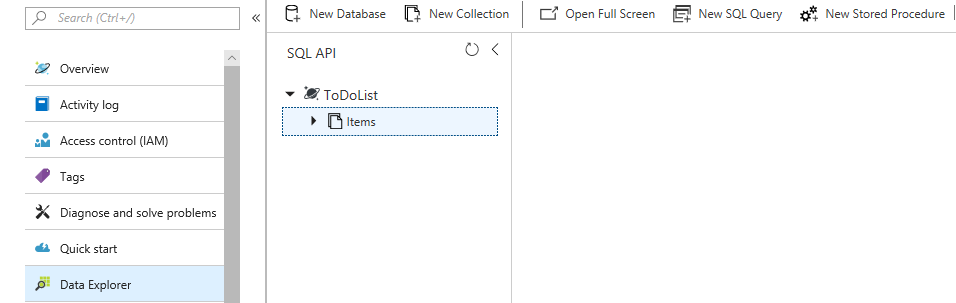
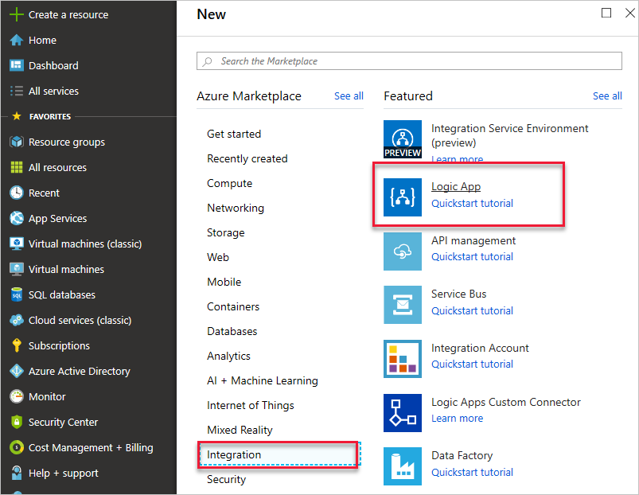
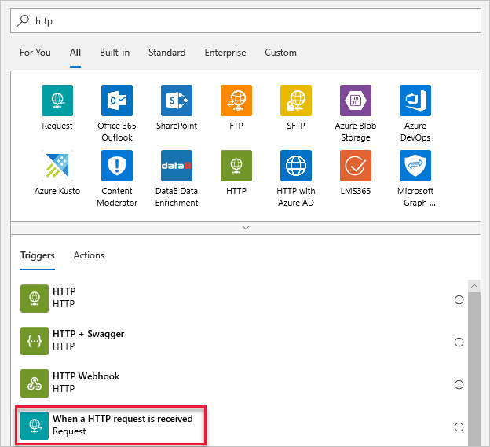
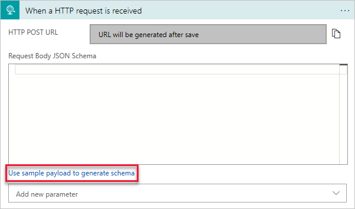
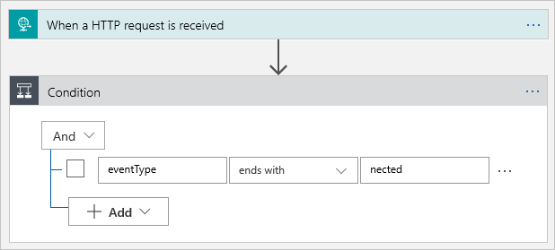
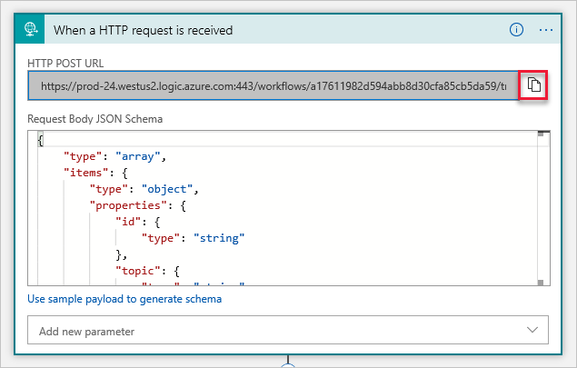
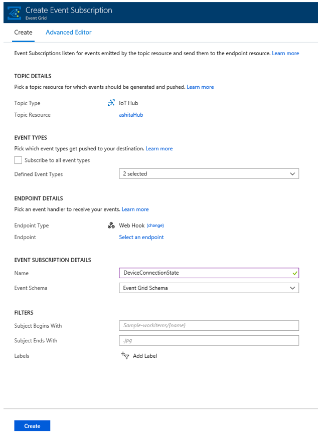
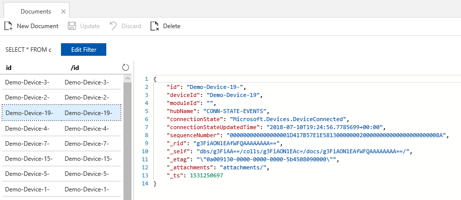

# Order device connection events from Azure IoT Hub using Azure Cosmos DB

Azure Event Grid helps you build event-based applications and easily integrate IoT events in your business solutions. This article walks you through a setup which can be used to track and store the latest device connection state in Cosmos DB. We will use the sequence number available in the Device Connected and Device Disconnected events and store the latest state in Cosmos DB. We are going to use a stored procedure, which is an application logic that is executed against a collection in Cosmos DB.

The sequence number is a string representation of a hexadecimal number. You can use string compare to identify the larger number. If you are converting the string to hex, then the number will be a 256-bit number. The sequence number is strictly increasing, and the latest event will have a higher number than other events. This is useful if you have frequent device connects and disconnects, and want to ensure only the latest event is used to trigger a downstream action, as Azure Event Grid doesn’t support ordering of events.

## Prerequisites

* An active Azure account. If you don't have one, you can [create a free account](http://azure.microsoft.com/pricing/free-trial/).

* An active Azure Cosmos DB SQL API account. If you haven't created one yet, see [Create a database account](https://docs.microsoft.com/azure/cosmos-db/create-sql-api-dotnet#create-a-database-account) for a walkthrough.

* A collection in your database. See [Add a collection](https://docs.microsoft.com/azure/cosmos-db/create-sql-api-dotnet#add-a-collection) for a walkthrough.

* An IoT Hub in Azure. If you haven't created one yet, see [Get started with IoT Hub](../iot-hub/iot-hub-csharp-csharp-getstarted.md) for a walkthrough. 

## Create a stored procedure

First, create a stored procedure and set it up to run a logic that compares sequence numbers of incoming events and records the latest event per device in the database.

1. In your Cosmos DB SQL API, select **Data Explorer** > **Items** > **New Stored Procedure**.

   

2. Enter a stored procedure ID and paste the following in the “Stored Procedure body”. Note that this code should replace any existing code in the stored procedure body. This code maintains one row per device ID and records the latest connection state of that device ID by identifying the highest sequence number. 

    ```javascript
    // SAMPLE STORED PROCEDURE
    function UpdateDevice(deviceId, moduleId, hubName, connectionState, connectionStateUpdatedTime, sequenceNumber) {
      var collection = getContext().getCollection();
      var response = {};
      
      var docLink = getDocumentLink(deviceId, moduleId);

      var isAccepted = collection.readDocument(docLink, function(err, doc) {
        if (err) {
          console.log('Cannot find device ' + docLink + ' - ');
          createDocument();
        } else {
          console.log('Document Found - ');
          replaceDocument(doc);
        }
      });

      function replaceDocument(document) {
        console.log(
          'Old Seq :' +
            document.sequenceNumber +
            ' New Seq: ' +
            sequenceNumber +
            ' - '
        );
        if (sequenceNumber > document.sequenceNumber) {
          document.connectionState = connectionState;
          document.connectionStateUpdatedTime = connectionStateUpdatedTime;
          document.sequenceNumber = sequenceNumber;

          console.log('replace doc - ');

          isAccepted = collection.replaceDocument(docLink, document, function(
            err,
            updated
          ) {
            if (err) {
              getContext()
                .getResponse()
                .setBody(err);
            } else {
              getContext()
                .getResponse()
                .setBody(updated);
            }
          });
        } else {
          getContext()
            .getResponse()
            .setBody('Old Event - current: ' + document.sequenceNumber + ' Incoming: ' + sequenceNumber);
        }
      }
      function createDocument() {
        document = {
          id: deviceId + '-' + moduleId,
          deviceId: deviceId,
          moduleId: moduleId,
          hubName: hubName,
          connectionState: connectionState,
          connectionStateUpdatedTime: connectionStateUpdatedTime,
          sequenceNumber: sequenceNumber
        };
        console.log('Add new device - ' + collection.getAltLink());
        isAccepted = collection.createDocument(
          collection.getAltLink(),
          document,
          function(err, doc) {
            if (err) {
              getContext()
                .getResponse()
                .setBody(err);
            } else {
              getContext()
                .getResponse()
                .setBody(doc);
            }
          }
        );
      }

      function getDocumentLink(deviceId, moduleId) {
        return collection.getAltLink() + '/docs/' + deviceId + '-' + moduleId;
      }
    }
    ```

3. Save the stored procedure: 

    

## Create a logic app

First, create a logic app and add an Event grid trigger that monitors the resource group for your virtual machine. 

### Create a logic app resource

1. In the [Azure portal](https://portal.azure.com), select **New** > **Integration** > **Logic App**.

   

2. Give your logic app a name that's unique in your subscription, then select the same subscription, resource group, and location as your IoT hub. 

3. Select **Pin to dashboard**, then choose **Create**.

   You've now created an Azure resource for your logic app. After Azure deploys your logic app, the Logic Apps Designer shows you templates for common patterns so you can get started faster.

   > [!NOTE] 
   > When you select **Pin to dashboard**, 
   > your logic app automatically opens in the Logic Apps Designer. 
   > Otherwise, you can manually find and open your logic app.

4. In the Logic App Designer under **Templates**, choose **Blank Logic App** so that you can build your logic app from scratch.

### Select a trigger

A trigger is a specific event that starts your logic app. For this tutorial, the trigger that sets off the workflow is receiving a request over HTTP.  

1. In the connectors and triggers search bar, type **HTTP**.

2. Select **Request - When an HTTP request is received** as the trigger. 

   

3. Select **Use sample payload to generate schema**. 

   

4. Paste the following sample JSON code into the text box, then select **Done**:

   ```json
   [{
    "id": "fbfd8ee1-cf78-74c6-dbcf-e1c58638ccbd",
    "topic":
      "/SUBSCRIPTIONS/DEMO5CDD-8DAB-4CF4-9B2F-C22E8A755472/RESOURCEGROUPS/EGTESTRG/PROVIDERS/MICROSOFT.DEVICES/IOTHUBS/MYIOTHUB",
    "subject": "devices/Demo-Device-1",
    "eventType": "Microsoft.Devices.DeviceConnected",
    "eventTime": "2018-07-03T23:20:11.6921933+00:00",
    "data": {
      "deviceConnectionStateEventInfo": {
        "sequenceNumber":
          "000000000000000001D4132452F67CE200000002000000000000000000000001"
      },
      "hubName": "MYIOTHUB",
      "deviceId": "48e44e11-1437-4907-83b1-4a8d7e89859e",
      "moduleId": ""
    },
    "dataVersion": "1",
    "metadataVersion": "1"
   }]
   ```

5. You may receive a pop-up notification that says, **Remember to include a Content-Type header set to application/json in your request.** You can safely ignore this suggestion, and move on to the next section. 

### Create a condition

In your logic app workflow, conditions help run specific actions after passing that specific condition. Once the condition is met, a desired action can be defined. For this tutorial, the condition is to check whether eventType is device connected or device disconnected. The action will be to execute the stored procedure in your database. 

1. Select **New step** then **Built-ins** and **Condition**. 

2. Fill the condition as shown below to only execute this for Device Connected and Device Disconnected events:

  * Choose a value: **eventType**
  * Change "is equal to" to **ends with**
  * Choose a value: **nected**

   

3. If the condition is true, click on **Add an action**.
  
   

4. Search for Cosmos DB and click on **Azure Cosmos DB - Execute stored procedure**

   

5. Populate the form for Execute stored procure by selecting values from your database. Enter the partition key value and parameters as shown below. 

   

6. Save your logic app. 

### Copy the HTTP URL

Before you leave the Logic Apps Designer, copy the URL that your logic app is listening to for a trigger. You use this URL to configure Event Grid. 

1. Expand the **When a HTTP request is received** trigger configuration box by clicking on it. 

2. Copy the value of **HTTP POST URL** by selecting the copy button next to it. 

   

3. Save this URL so that you can refer to it in the next section. 

## Configure subscription for IoT Hub events

In this section, you configure your IoT Hub to publish events as they occur. 

1. In the Azure portal, navigate to your IoT hub. 

2. Select **Events**.

   

3. Select **Event subscription**. 

   

4. Create the event subscription with the following values: 

   * **Event Type**: Uncheck Subscribe to all event types and select **Device Connected** and **Device Disconnected** from the menu.

   * **Endpoint Details**: Select Endpoint Type as **Web Hook** and click on select endpoint and paste the URL that you copied from your logic app and confirm selection.

       

   * **Event Subscription Details**: Provide a descriptive name and select **Event Grid Schema**.
   The form looks similar to the following example: 

       

5. Select **Create** to save the event subscription.

## Observe events

Now that your event subscription is set up, let's test by connecting a device.

### Register a device in IoT Hub

1. From your IoT hub, select **IoT Devices**. 

2. Select **Add**.

3. For **Device ID**, enter `Demo-Device-1`.

4. Select **Save**. 

5. You can add multiple devices with different device IDs.

   

6. Copy the **Connection string -- primary key** for later use.

   

### Start Raspberry Pi simulator

1. Let's use the Raspberry Pi web simulator to simulate device connection.

[Start Raspberry Pi simulator](https://azure-samples.github.io/raspberry-pi-web-simulator/#Getstarted)

### Run a sample application on the Raspberry Pi web simulator

This will trigger a device connected event.

1. In the coding area, replace the placeholder in Line 15 with your Azure IoT Hub device connection string.

   

2. Run the application by clicking on **Run**.

You should see the following output that shows the sensor data and the messages that are sent to your IoT hub.

   

   Click **Stop** to stop the simulator and trigger a **Device Disconnected** event.

You have now run a sample application to collect sensor data and send it to your IoT hub. 

### Observe events in Cosmos DB

You can see results of the executed stored procedure in your Cosmos DB document. Here's what it looks like. Each row contains the latest device connection state per device.

   

## Use the Azure CLI

Instead of using the [Azure portal](http://portal.azure.com), you can accomplish the IoT Hub steps using the Azure CLI. For details, see the Azure CLI pages for [creating an event subscription](https://docs.microsoft.com/cli/azure/eventgrid/event-subscription) and [creating an IoT device](https://docs.microsoft.com/cli/azure/iot/device).

## Clean up resources

This tutorial used resources that incur charges on your Azure subscription. When you're done trying out the tutorial and testing your results, disable or delete resources that you don't want to keep. 

If you don't want to lose the work on your logic app, disable it instead of deleting it. 

1. Navigate to your logic app.

2. On the **Overview** blade, select **Delete** or **Disable**. 

Each subscription can have one free IoT hub. If you created a free hub for this tutorial, then you don't need to delete it to prevent charges.

1. Navigate to your IoT hub. 

2. On the **Overview** blade, select **Delete**. 

Even if you keep your IoT hub, you may want to delete the event subscription that you created. 

1. In your IoT hub, select **Event Grid**.

2. Select the event subscription that you want to remove. 

3. Select **Delete**. 

To remove an Azure Cosmos DB account from the Azure portal, right-click the account name and click **Delete account**. See detailed instructions for [deleting an Azure Cosmos DB account](https://docs.microsoft.com/azure/cosmos-db/manage-account#delete).

## Next steps

* Learn more about [Reacting to IoT Hub events by using Event Grid to trigger actions](../iot-hub/iot-hub-event-grid.md)

* [Try the IoT Hub events tutorial](../event-grid/publish-iot-hub-events-to-logic-apps.md)

* Learn about what else you can do with [Event Grid](../event-grid/overview.md)


