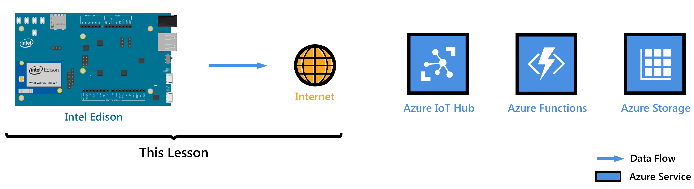
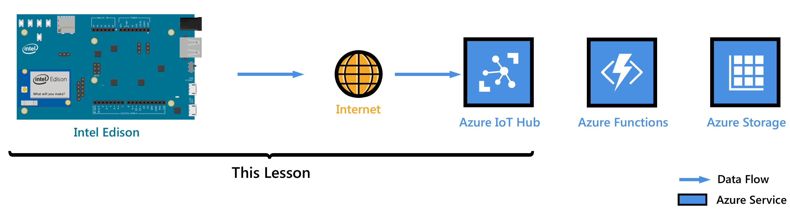
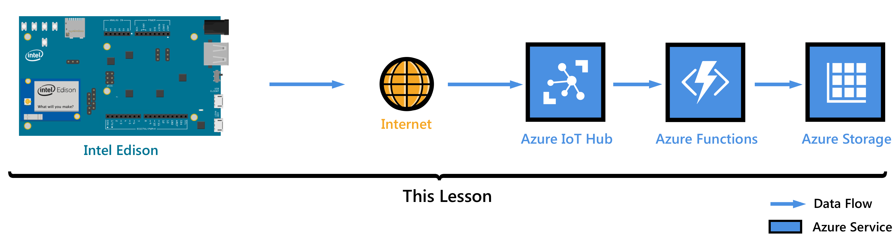
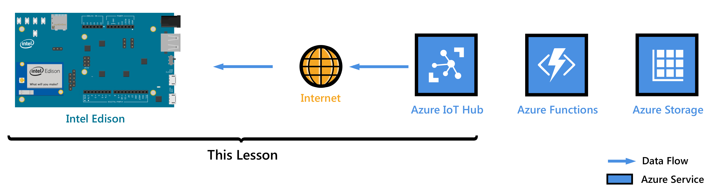

# Get started with Intel Edison (C)
> [!div class="op_single_selector"]
> * [Node.JS](iot-hub-intel-edison-kit-node-get-started.md)
> * [C](iot-hub-intel-edison-kit-c-get-started.md)

In this tutorial, you begin by learning the basics of working with Intel Edison. You then learn how to seamlessly connect your devices to the cloud by using [Azure IoT Hub](iot-hub-what-is-iot-hub.md).

Don't have a kit yet? Start [here](https://azure.microsoft.com/develop/iot/starter-kits)

## Lesson 1: Configure your device

In this lesson, you configure your Intel Edison with an operating system, set up the development environment, and deploy an application to Edison.

### Configure your device
Configure Intel Edison for first-time use by assembling the board, powering it up and installing configuration tool to your desktop OS to flash Edison's firmware, set its password and connect it to Wi-Fi.  

*Estimated time to complete: 30 minutes*

Go to [Configure your device][configure-your-device].

### Get the tools
Download the tools and software to build and deploy your first application for Intel Edison.

*Estimated time to complete: 20 minutes*

Go to [Get the tools][get-the-tools].

### Create and deploy the blink application
Clone the sample blink application from GitHub, and use gulp to deploy this application to your Intel Edison board. This sample application blinks the LED connected to the board every two seconds.

*Estimated time to complete: 5 minutes*

Go to [Create and deploy the blink application][create-and-deploy-the-blink-application].

## Lesson 2: Create your IoT hub

In this lesson, you create your free Azure account, provision your Azure IoT hub and create your first device in the IoT hub.

Complete Lesson 1 before you start this lesson.

### Get the Azure tools
Install the Azure command-line interface (Azure CLI).

*Estimated time to complete: 10 minutes*

Go to [Get Azure tools][get-azure-tools].

### Create your IoT hub and register Intel Edison
Create your resource group, provision your first Azure IoT hub, and add your first device to the IoT hub using Azure CLI.

*Estimated time to complete: 10 minutes*

Go to [Create your IoT hub and register Intel Edison](iot-hub-intel-edison-kit-c-lesson2-prepare-azure-iot-hub.md).

## Lesson 3: Send device-to-cloud messages

In this lesson, you send messages from Edison to your IoT hub. You also create an Azure function app that gets incoming messages from your IoT hub and writes them to Azure Table storage.

Complete Lessons 1 and Lesson 2 before you start this lesson.

### Create an Azure function app and Azure Storage account
Use an Azure Resource Manager template to create an Azure function app and an Azure Storage account.

*Estimated time to complete: 10 minutes*

Go to [Create an Azure function app and Azure Storage account][create-an-azure-function-app-and-azure-storage-account].

### Run a sample application to send device-to-cloud messages
Deploy and run a sample application to your Intel Edison device that sends messages to the IoT hub.

*Estimated time to complete: 10 minutes*

Go to [Run a sample application to send device-to-cloud messages][send-device-to-cloud-messages].

### Read messages persisted in Azure Storage
Monitor the device-to-cloud messages as they are written to Azure Storage.

*Estimated time to complete: 5 minutes*

Go to [Read messages persisted in Azure Storage][read-messages-persisted-in-azure-storage].

## Lesson 4: Send cloud-to-device messages

This lesson shows how to send messages from your Azure IoT hub to Intel Edison. The messages control the on and off behavior of the LED that is connected to Edison. A sample application is prepared for you to achieve this task.

Complete Lessons 1, Lesson 2 and Lesson 3 before you start this lesson.

### Run the sample application to receive cloud-to-device messages
The sample application in Lesson 4 runs on Edison and monitors incoming messages from your IoT hub. A new gulp task sends messages to Edison from your IoT hub to blink the LED.

*Estimated time to complete: 10 minutes*

Go to [Run the sample application to receive cloud-to-device messages][receive-cloud-to-device-messages].

### Optional section: Change the on and off behavior of the LED
Customize the messages to change the LED’s on and off behavior.

*Estimated time to complete: 10 minutes*

Go to [Optional section: Change the on and off behavior of the LED][change-the-on-and-off-behavior-of-the-led].

## Troubleshooting
If you have any problems during the lessons, look for solutions in the [Troubleshooting][troubleshooting] article.
<!-- Images and links -->

[configure-your-device]: iot-hub-intel-edison-kit-c-lesson1-configure-your-device.md
[get-the-tools]: iot-hub-intel-edison-kit-c-lesson1-get-the-tools-win32.md
[create-and-deploy-the-blink-application]: iot-hub-intel-edison-kit-c-lesson1-deploy-blink-app.md
[get-azure-tools]: iot-hub-intel-edison-kit-c-lesson2-get-azure-tools-win32.md
[create-an-azure-function-app-and-azure-storage-account]: iot-hub-intel-edison-kit-c-lesson3-deploy-resource-manager-template.md
[send-device-to-cloud-messages]: iot-hub-intel-edison-kit-c-lesson3-run-azure-blink.md
[read-messages-persisted-in-azure-storage]: iot-hub-intel-edison-kit-c-lesson3-read-table-storage.md
[receive-cloud-to-device-messages]:iot-hub-intel-edison-kit-c-lesson4-send-cloud-to-device-messages.md
[change-the-on-and-off-behavior-of-the-led]: iot-hub-intel-edison-kit-c-lesson4-change-led-behavior.md
[troubleshooting]: iot-hub-intel-edison-kit-c-troubleshooting.md