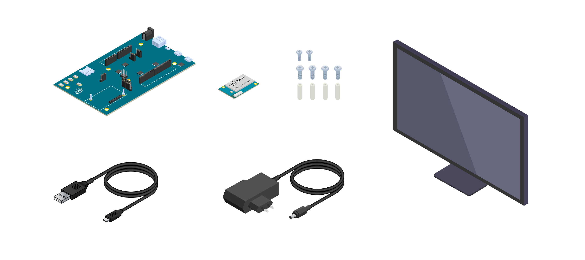
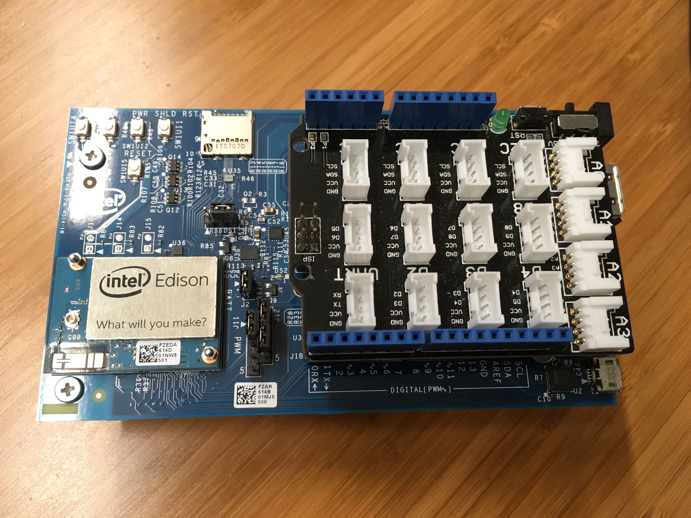
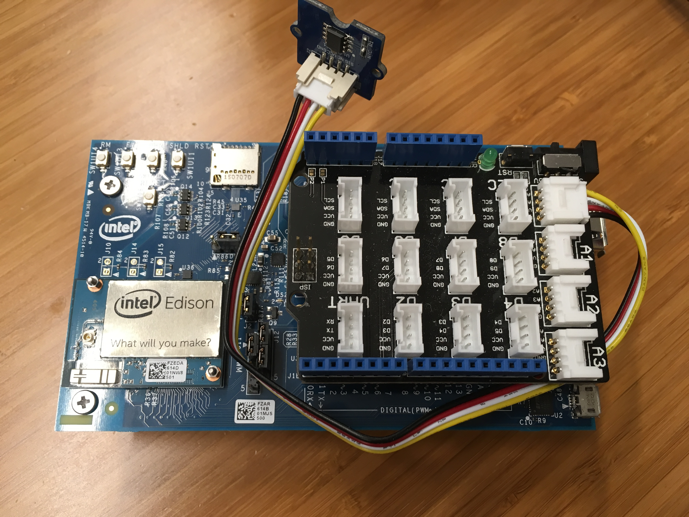
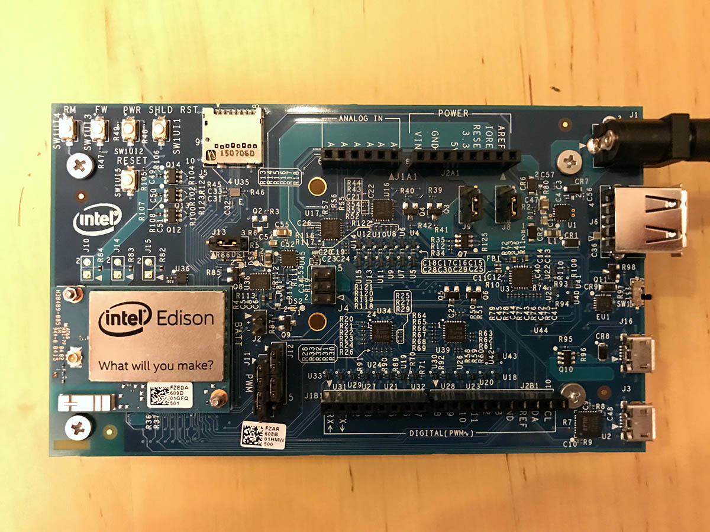
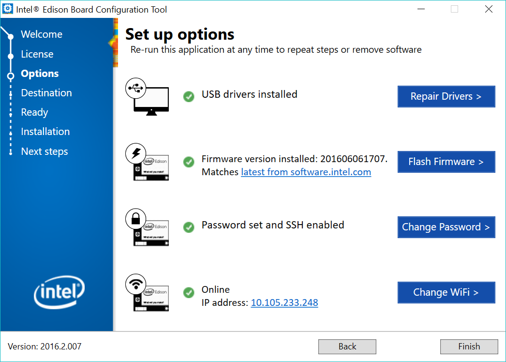
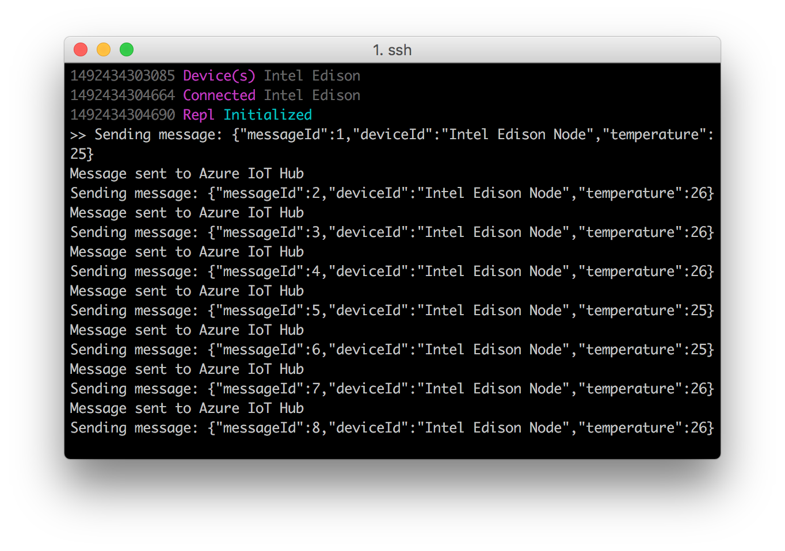

# Connect Intel Edison to Azure IoT Hub (Node.js)

[!INCLUDE [iot-hub-get-started-device-selector](../../includes/iot-hub-get-started-device-selector.md)]

In this tutorial, you begin by learning the basics of working with Intel Edison. You then learn how to seamlessly connect your devices to the cloud by using [Azure IoT Hub](iot-hub-what-is-iot-hub.md).

Don't have a kit yet? Start [here](https://azure.microsoft.com/develop/iot/starter-kits)

## What you do

* Setup Intel Edison and and Grove modules.
* Create an IoT hub.
* Register a device for Edison in your IoT hub.
* Run a sample application on Edison to send sensor data to your IoT hub.

Connect Intel Edison to an IoT hub that you create. Then you run a sample application on Edison to collect temperature and humidity data from a Grove temperature sensor. Finally, you send the sensor data to your IoT hub.

## What you learn

* How to create an Azure IoT hub and get your new device connection string.
* How to connect Edison with a Grove temperature sensor.
* How to collect sensor data by running a sample application on Edison.
* How to send sensor data to your IoT hub.

## What you need



* The Intel Edison board
* Arduino expansion board
* An active Azure subscription. If you don't have an Azure account, [create a free Azure trial account](https://azure.microsoft.com/free/) in just a few minutes.
* A Mac or a PC that is running Windows or Linux.
* An Internet connection.
* A Micro B to Type A USB cable
* A direct current (DC) power supply. Your power supply should be rated as follows:
  - 7-15V DC
  - At least 1500mA
  - The center/inner pin should be the positive pole of the power supply

The following items are optional:

* Grove Base Shield V2
* Grove - Temperature Sensor
* Grove Cable
* Any spacer bars or screws included in the packaging, including two screws to fasten the module to the expansion board and four sets of screws and plastic spacers.

> [!NOTE] 
These items are optional because the code sample support simulated sensor data.

[!INCLUDE [iot-hub-get-started-create-hub-and-device](../../includes/iot-hub-get-started-create-hub-and-device.md)]

## Setup Intel Edison

### Assemble your board

This section contains steps to attach your Intel® Edison module to your expansion board.

1. Place the Intel® Edison module within the white outline on your expansion board, lining up the holes on the module with the screws on the expansion board.

2. Press down on the module just below the words `What will you make?` until you feel a snap.

   

3. Use the two hex nuts (included in the package) to secure the module to the expansion board.

   

4. Insert a screw in one of the four corner holes on the expansion board. Twist and tighten one of the white plastic spacers onto the screw.

   

5. Repeat for the other three corner spacers.

   

Now your board is assembled.

   

### Connect the Grove Base Shield and the temperature sensor

1. Place the Grove Base Shield on to your board. Make sure all pins are tightly plugged into your board.
   
   

2. Use Grove Cable to connect Grove temperature sensor onto the Grove Base Shield **A0** port.

   

   

Now your sensor is ready.

### Power up Edison

1. Plug in the power supply.

   

2. A green LED(labeled DS1 on the Arduino* expansion board) should light up and stay lit.

3. Wait one minute for the board to finish booting up.

   > [!NOTE]
   > If you do not have a DC power supply, you can still power the board through a USB port. See `Connect Edison to your computer` section for details. Powering your board in this fashion may result in unpredictable behavior from your board, especially when using Wi-Fi or driving motors.

### Connect Edison to your computer

1. Toggle down the microswitch towards the two micro USB ports, so that Edison is in device mode. For differences between device mode and host mode, please reference [here](https://software.intel.com/en-us/node/628233#usb-device-mode-vs-usb-host-mode).

   

2. Plug the micro USB cable into the top micro USB port.

   

3. Plug the other end of USB cable into your computer.

   

4. You will know that your board is fully initialized when your computer mounts a new drive (much like inserting a SD card into your computer).

## Download and run the configuration tool
Get the latest configuration tool from [this link](https://software.intel.com/en-us/iot/hardware/edison/downloads) listed under the `Installers` heading. Execute the tool and follow its on-screen instructions, clicking Next where needed

### Flash firmware
1. On the `Set up options` page, click `Flash Firmware`.
2. Select the image to flash onto your board by doing one of the following:
   - To download and flash your board with the latest firmware image available from Intel, select `Download the latest image version xxxx`.
   - To flash your board with an image you already have saved on your computer, select `Select the local image`. Browse to and select the image you want to flash to your board.
3. The setup tool will attempt to flash your board. The entire flashing process may take up to 10 minutes.

### Set password
1. On the `Set up options` page, click `Enable Security`.
2. You can set a custom name for your Intel® Edison board. This is optional.
3. Type a password for your board, then click `Set password`.
4. Mark down the password, which is used later.

### Connect Wi-Fi
1. On the `Set up options` page, click `Connect Wi-Fi`. Wait up to one minute as your computer scans for available Wi-Fi networks.
2. From the `Detected Networks` drop-down list, select your network.
3. From the `Security` drop-down list, select the network's security type.
4. Provide your login and password information, then click `Configure Wi-Fi`.
5. Mark down the IP address, which is used later.

> [!NOTE]
> Make sure that Edison is connected to the same network as your computer. Your computer connects to your Edison by using the IP address.

   

Congratulations! You've successfully configured Edison.

## Run a sample application on Intel Edison

### Prepare the Azure IoT Device SDK

1. Use one of the following SSH clients from your host computer to connect to your Intel Edison. The IP address is from the configuration tool and the password is the one you've set in that tool.
    - [PuTTY](http://www.putty.org/) for Windows.
    - The built-in SSH client on Ubuntu or macOS.

2. Clone the sample client app to your device. 
   
   ```bash
   git clone https://github.com/Azure-Samples/iot-hub-node-intel-edison-client-app
   ```

3. Then navigate to the repo folder to run the following command to install all packages, it may take serval minutes to complete.
   
   ```bash
   npm install
   ```


### Configure and run the sample application

1. Open the config file by running the following commands:

   ```bash
   nano config.json
   ```

   

   There are two macros in this file you can configurate. The first one is `INTERVAL`, which defines the time interval between two messages that send to cloud. The second one `SIMULATED_DATA`,which is a Boolean value for whether to use simulated sensor data or not.

   If you **don't have the sensor**, set the `SIMULATED_DATA` value to `1` to make the sample application create and use simulated sensor data.

1. Save and exit by pressing Control-O > Enter > Control-X.


1. Run the sample application by running the following command:

   ```bash
   sudo node index.js '<your Azure IoT hub device connection string>'
   ```

   > [!NOTE] 
   Make sure you copy-paste the device connection string into the single quotes.

You should see the following output that shows the sensor data and the messages that are sent to your IoT hub.



## Next steps

You’ve run a sample application to collect sensor data and send it to your IoT hub.

[!INCLUDE [iot-hub-get-started-next-steps](../../includes/iot-hub-get-started-next-steps.md)]