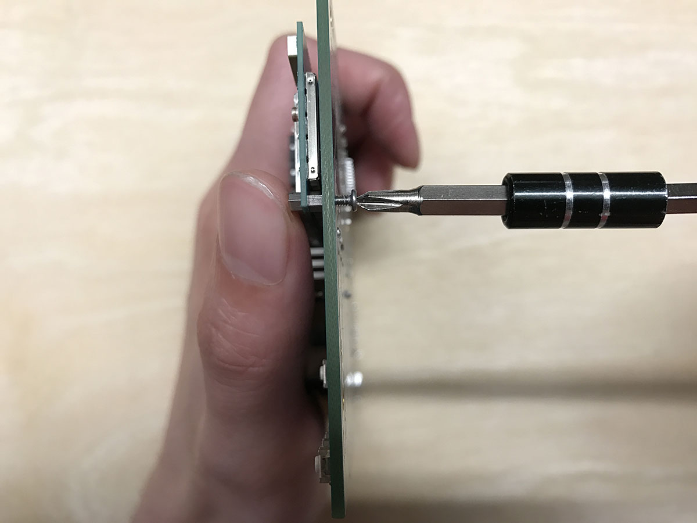
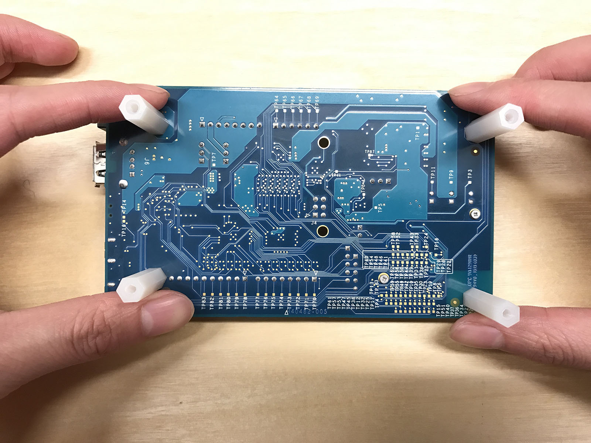
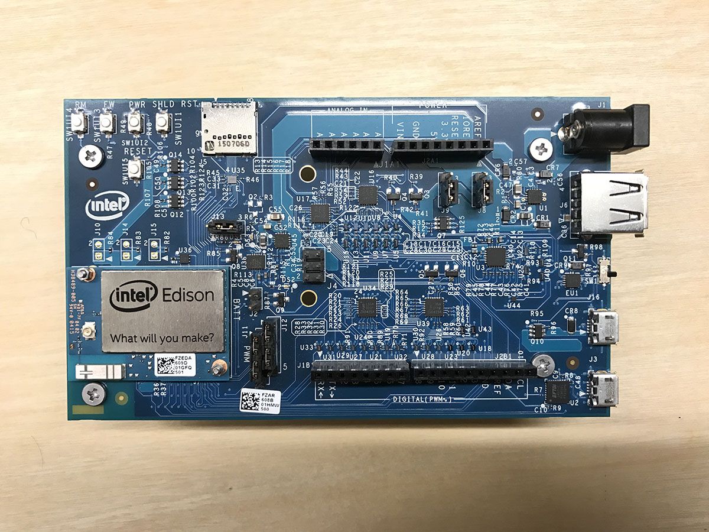
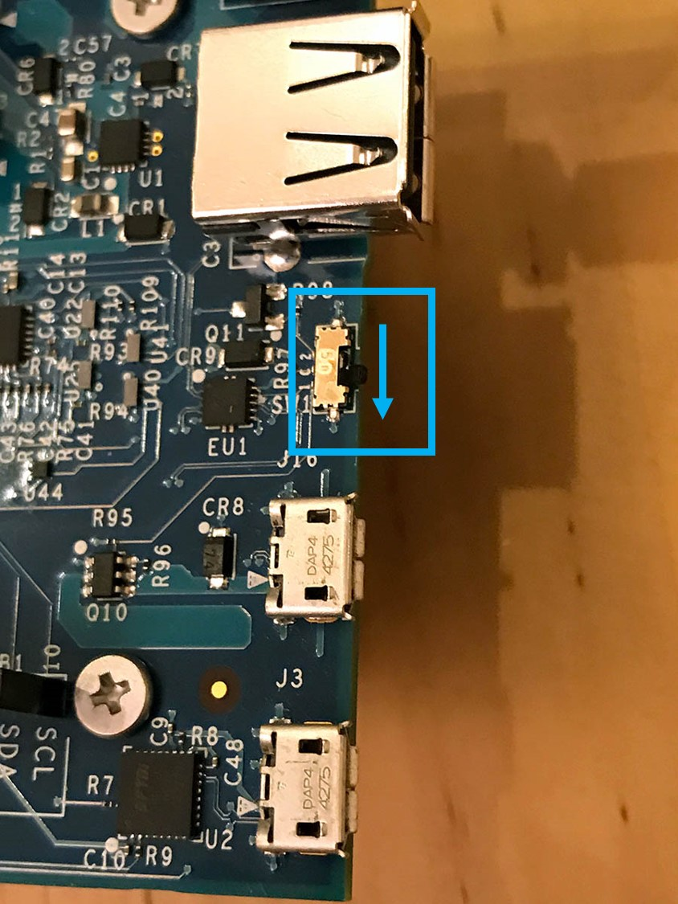
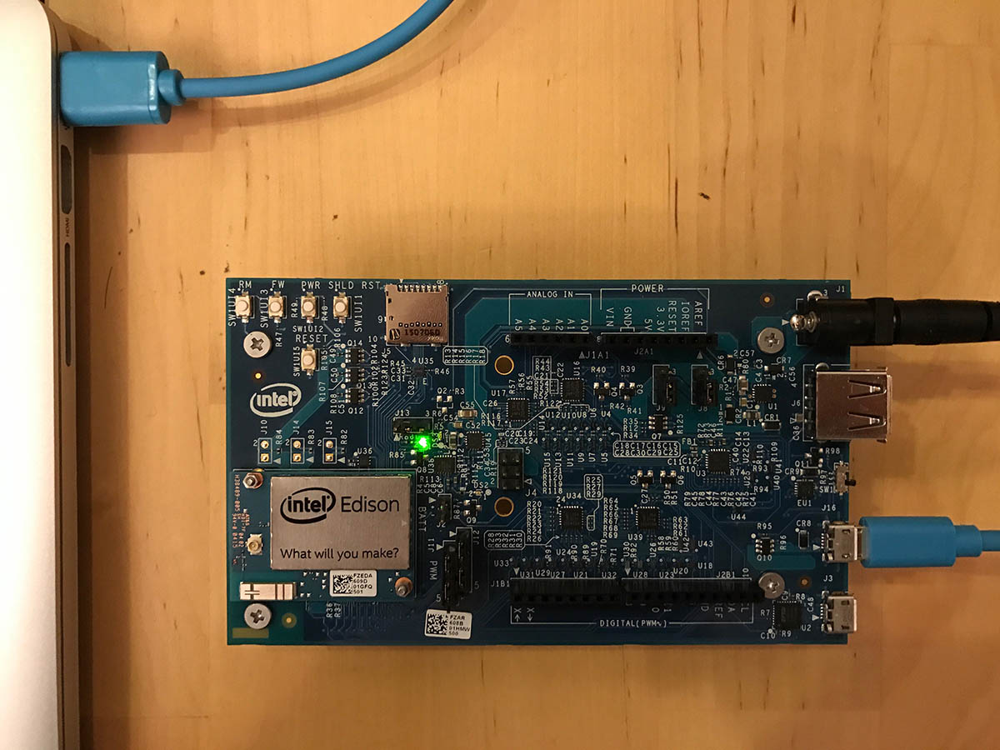

# Configure your Intel Edison
## What you will do
Configure Intel Edison for first-time use by assembling the board, powering it up and installing configuration tool to your desktop OS to flash Edison's firmware, set its password and connect it to Wi-Fi. If you have any problems, look for solutions on the [troubleshooting page][troubleshooting].

## What you will learn
In this article, you will learn:

* How to assemble Edison board and power it up.
* How to flash Edison's firmware, set password and connect Wi-Fi.

## What you need
To complete this operation, you need the following parts from your Intel Edison Starter Kit:

* Intel® Edison module
* Arduino expansion board
* Any spacer bars or screws included in the packaging, including two screws to fasten the module to the expansion board and four sets of screws and plastic spacers.
* A Micro B to Type A USB cable
* A direct current (DC) power supply. Your power supply should be rated as follows:
  - 7-15V DC
  - At least 1500mA
  - The center/inner pin should be the positive pole of the power supply

  

You also need:

* A computer running Windows, Mac, or Linux.
* A wireless connection for Edison to connect to.
* An Internet connection to download configuration tool.

## Assemble your board

This section contains steps to attach your Intel® Edison module to your expansion board.

1. Place the Intel® Edison module within the white outline on your expansion board, lining up the holes on the module with the screws on the expansion board.

2. Press down on the module just below the words `What will you make?` until you feel a snap.

   

3. Use the two hex nuts (included in the package) to secure the module to the expansion board.

   

4. Insert a screw in one of the four corner holes on the expansion board. Twist and tighten one of the white plastic spacers onto the screw.

   

5. Repeat for the other three corner spacers.

   

Now your board is assembled.

   

## Power up Edison

1. Plug in the power supply.

   

2. A green LED(labeled DS1 on the Arduino* expansion board) should light up and stay lit.

3. Wait one minute for the board to finish booting up.

   > [!NOTE]
   > If you do not have a DC power supply, you can still power the board through a USB port. See `Connect Edison to your computer` section for details. Powering your board in this fashion may result in unpredictable behavior from your board, especially when using Wi-Fi or driving motors.

## Connect Edison to your computer

1. Toggle down the microswitch towards the two micro USB ports, so that Edison is in device mode. For differences between device mode and host mode, please reference [here](https://software.intel.com/en-us/node/628233#usb-device-mode-vs-usb-host-mode).

   

2. Plug the micro USB cable into the top micro USB port.

   

3. Plug the other end of USB cable into your computer.

   

4. You will know that your board is fully initialized when your computer mounts a new drive (much like inserting a SD card into your computer).

## Download and run the configuration tool
Get the latest configuration tool from [this link](https://software.intel.com/en-us/iot/hardware/edison/downloads) listed under the `Installers` heading. Execute the tool and follow its on-screen instructions, clicking Next where needed

### Flash firmware
1. On the `Set up options` page, click `Flash Firmware`.
2. Select the image to flash onto your board by doing one of the following:
   - To download and flash your board with the latest firmware image available from Intel, select `Download the latest image version xxxx`.
   - To flash your board with an image you already have saved on your computer, select `Select the local image`. Browse to and select the image you want to flash to your board.
3. The setup tool will attempt to flash your board. The entire flashing process may take up to 10 minutes.

### Set password
1. On the `Set up options` page, click `Enable Security`.
2. You can set a custom name for your Intel® Edison board. This is optional.
3. Type a password for your board, then click `Set password`.
4. Mark down the password, which is used later.

### Connect Wi-Fi
1. On the `Set up options` page, click `Connect Wi-Fi`. Wait up to one minute as your computer scans for available Wi-Fi networks.
2. From the `Detected Networks` drop-down list, select your network.
3. From the `Security` drop-down list, select the network's security type.
4. Provide your login and password information, then click `Configure Wi-Fi`.
5. Mark down the IP address, which is used later.

> [!NOTE]
> Make sure that Edison is connected to the same network as your computer. Your computer connects to your Edison by using the IP address.

Congratulations! You've successfully configured Edison.

## Summary
In this article, you’ve learned how to assemble the Edison board, flash its firmware, setup password and connect it to Wi-Fi by using configuration tool. Note that the LED doesn't yet light up. The next task is to install the necessary tools and software in preparation for running a sample application on Edison.

## Next steps
[Get the tools][get-the-tools]
<!-- Images and links -->

[troubleshooting]: iot-hub-intel-edison-kit-node-troubleshooting.md
[get-the-tools]: iot-hub-intel-edison-kit-node-lesson1-get-the-tools-win32.md