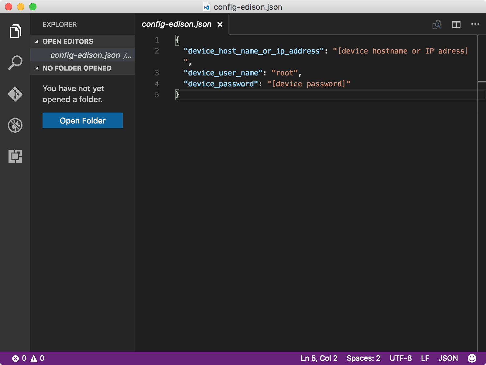

# Create and deploy the blink application
## What you will do
Clone the sample C application from GitHub, and use the gulp tool to deploy the sample application to Intel Edison. The sample application blinks the LED connected to the board every two seconds. If you have any problems, look for solutions on the [troubleshooting page][troubleshooting].

## What you will learn
* How to deploy and run the sample application on Edison.

## What you need
You must have successfully completed the following operations:

* [Configure your device][configure-your-device]
* [Get the tools][get-the-tools]

## Open the sample application
To open the sample application, follow these steps:

1. Clone the sample repository from GitHub by running the following command:

   ```bash
   git clone https://github.com/Azure-Samples/iot-hub-node-edison-getting-started.git
   ```
2. Open the sample application in Visual Studio Code by running the following commands:

   ```bash
   cd iot-hub-node-edison-getting-started
   cd Lesson1
   code .
   ```

   ![Repo structure][repo-structure]

The file in the `app` subfolder is the key source file that contains the code to control the LED.

### Install application dependencies
Install the libraries and other modules you need for the sample application by running the following command:

```bash
npm install
```

## Configure the device connection
To configure the device connection, follow these steps:

1. Generate the device configuration file by running the following command:

   ```bash
   gulp init
   ```

   The configuration file `config-edison.json` contains the user credentials you use to log in to Edison. To avoid the leak of user credentials, the configuration file is generated in the subfolder `.iot-hub-getting-started` of the home folder on your computer.

2. Open the device configuration file in Visual Studio Code by running the following command:

   ```bash
   # For Windows command prompt
   code %USERPROFILE%\.iot-hub-getting-started\config-edison.json

   # For MacOS or Ubuntu
   code ~/.iot-hub-getting-started/config-edison.json
   ```

3. Replace the placeholder `[device hostname or IP address]` and `[device password]` with the IP address and password that you marked down in previous lesson.

   

Congratulations! You've successfully created the first sample application for Edison.

## Deploy and run the sample application

### Deploy and run the sample app
Deploy and run the sample application by running the following command:

```bash
gulp deploy && gulp run
```

### Verify the app works
The sample application terminates automatically after the LED blinks for 20 times. If you don’t see the LED blinking, see the [troubleshooting guide][troubleshooting] for solutions to common problems.

![LED blinking][led-blinking]

## Summary
You've installed the required tools to work with Edison and deployed a sample application to Edison to blink the LED. You can now create, deploy, and run another sample application that connects Edison to Azure IoT Hub to send and receive messages.

## Next steps
[Get the Azure tools][get-the-azure-tools]

<!-- Images and links -->

[troubleshooting]: iot-hub-intel-edison-kit-node-troubleshooting.md
[Configure-your-device]: iot-hub-intel-edison-kit-node-lesson1-configure-your-device.md
[get-the-tools]: iot-hub-intel-edison-kit-node-lesson1-get-the-tools-win32.md
[repo-structure]: media/iot-hub-intel-edison-lessons/lesson1/repo_structure.png
[led-blinking]: media/iot-hub-intel-edison-lessons/lesson1/led_blinking.png
[get-the-azure-tools]: iot-hub-intel-edison-kit-node-lesson2-get-azure-tools-win32.md
