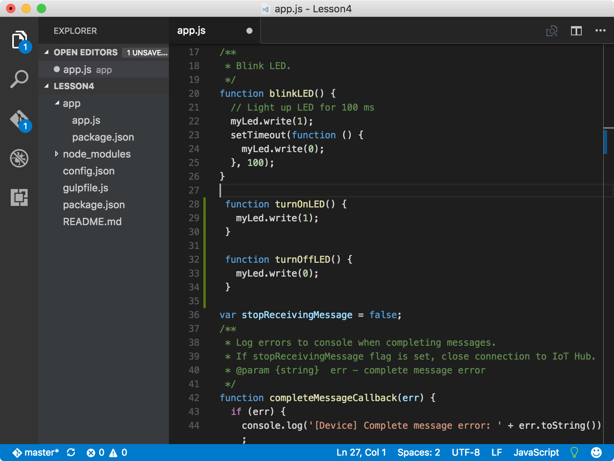

# Change the on and off behavior of the LED
## What you will do
Customize the messages to change the LED’s on and off behavior. If you have any problems, look for solutions on the [troubleshooting page][troubleshooting].

## What you will learn
Use additional functions to change the LED’s on and off behavior.

## What you need
You must have successfully completed [Run a sample application on Intel Edison to receive cloud to device messages][receive-cloud-to-device-messages].

## Add functions to app.js and gulpfile.js
1. Open the sample application in Visual Studio code by running the following commands:

   ```bash
   cd Lesson4
   code .
   ```
2. Open the `app.js` file, and then add the following functions after blinkLED() function:

   ```javascript
   function turnOnLED() {
     myLed.write(1);
   }

   function turnOffLED() {
     myLed.write(0);
   }
   ```

   
3. Add the following conditions before the 'blink' case in the switch-case block of the `receiveMessageCallback` function:

   ```javascript
   case 'on':
     turnOnLED();
     break;
   case 'off':
     turnOffLED();
     break;
   ```

   Now you’ve configured the sample application to respond to more instructions through messages. The "on" instruction turns on the LED, and the "off" instruction turns off the LED.
4. Open the gulpfile.js file, and then add a new function before the function `sendMessage`:

   ```javascript
   var buildCustomMessage = function (messageId) {
     if ((messageId & 1) && (messageId < MAX_MESSAGE_COUNT)) {
       return new Message(JSON.stringify({ command: 'on', messageId: messageId }));
     } else if (messageId < MAX_MESSAGE_COUNT) {
       return new Message(JSON.stringify({ command: 'off', messageId: messageId }));
     } else {
       return new Message(JSON.stringify({ command: 'stop', messageId: messageId }));
     }
   }
   ```

   ![Gulpfile.js file with added function][gulpfile]
5. In the `sendMessage` function, replace the line `var message = buildMessage(sentMessageCount);` with the new line shown in the following snippet:

   ```javascript
   var message = buildCustomMessage(sentMessageCount);
   ```
6. Save all the changes.

### Deploy and run the sample application
Deploy and run the sample application on Edison by running the following command:

```bash
gulp deploy && gulp run
```

You should see the LED turn on for two seconds, and then turn off for another two seconds. The last "stop" message stops the sample application from running.

![on and off][on-and-off]

Congratulations! You’ve successfully customized the messages that are sent to Edison from your IoT hub.

### Summary
This optional section demonstrates how to customize messages so that the sample application can control the on and off behavior of the LED in a different way.

<!-- Images and links -->

[troubleshooting]: iot-hub-intel-edison-kit-node-troubleshooting.md
[receive-cloud-to-device-messages]: iot-hub-intel-edison-kit-node-lesson4-send-cloud-to-device-messages.md
[gulpfile]: media/iot-hub-intel-edison-lessons/lesson4/updated_gulpfile_node.png
[on-and-off]: media/iot-hub-intel-edison-lessons/lesson4/gulp_on_and_off_node.png
