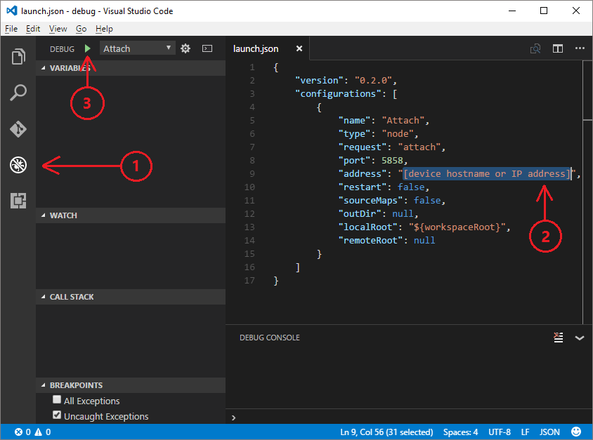

# Troubleshooting
## Hardware issues
For information about solving common problems on Intel Edison, see the [official troubleshooting page](https://software.intel.com/en-us/node/637974).

## Node.js package issues
### No response during gulp tasks
If you encounter problems running gulp tasks, you can add the `--verbose` option for debugging. Try to terminate current gulp tasks by using `Ctrl + C`, and then run the following command in your console window to see debug messages. You might see detailed error messages in your console output. 

```bash
gulp --verbose
```

### NPM issues
Try to update your NPM package with the following command:

```bash
npm install -g npm
```

If the problem still exists, leave your comments at the end of this article or create a GitHub issue in our [sample repository][sample-repository].

## Remote debugging

### Run the sample application in debug mode

```bash
gulp run --debug
```

Once the debug engine is ready, you should be able to see ```Debugger listening on port 5858``` from the console output.

### Configure VS Code to connect to the remote device

Open the **Debug** panel from the left side.

Click the green **Start Debugging** (F5) button. VS Code would open a **launch.json** file, which you need to update.

Update the **launch.json** file with the following content, replace `[device hostname or IP address]` with the actual device IP address or hostname.  

```json
{
    "version": "0.2.0",
    "configurations": [
        {
            "name": "Attach",
            "type": "node",
            "request": "attach",
            "port": 5858,
            "address": "[device hostname or IP address]",
            "restart": false,
            "sourceMaps": false,
            "outDir": null,
            "localRoot": "${workspaceRoot}",
            "remoteRoot": null
        }
    ]
}
```



### Attach to the remote application

Click the green **Start Debugging** (F5) button and enjoy debugging.

You can read [JavaScript in VS Code](https://code.visualstudio.com/docs/languages/javascript#_debugging) to learn more about the debugger.


## Azure-CLI issues
The Azure command-line interface (Azure CLI) is a preview build. Look for solution in the [Preview Install Guide](https://github.com/Azure/azure-cli/blob/master/doc/preview_install_guide.md) to seek solutions. Try to upgrade Azure-cli to latest version when commands don’t work as expected.

If you encounter any bugs with the tool, file an [issue](https://github.com/Azure/azure-cli/issues) in the **Issues** section of the GitHub repo.

For help troubleshooting common problems, check the [readme](https://github.com/Azure/azure-cli/blob/master/README.rst).

If you meet "Could not find a version that satisfies the requirement", please run the following command to upgrade pip to lastest version.

```bash
python -m pip install --upgrade pip
```

## Python installation issues
### Legacy installation issues (macOS)
When you're installing **pip**, a permission error is thrown when older packages that are installed with **su** permissions. This situation occurs because a previous installation of Python using brew (macOS) is not uninstalled completely. Some **pip** packages from a previous installation were created by root, which causes the permission error. The solution is to remove those packages installed by root. Use the following steps to complete this task:

1. Go to: /usr/local/lib/python2.7/site-packages
2. List packages create by root: `ls -l | grep root`
3. Uninstall packages from step 2: `sudo rm -rf {package name}`
4. Reinstall Python.

## Azure IoT Hub issues
If you've successfully provisioned your Azure IoT hub with `azure-cli`, and you need a tool to manage the devices that are connecting to your IoT hub, try the following tools:

### Device Explorer
[Device Explorer](https://github.com/Azure/azure-iot-sdk-csharp/tree/master/tools/DeviceExplorer) runs on your Windows local machine and connects to your IoT hub in Azure. It communicates with the following [IoT Hub endpoints](iot-hub-devguide.md):

- _Device identity management_ to provision and manage devices registered with your IoT hub.
- _Receive device-to-cloud_ so you can monitor messages sent from your device to your IoT hub.
- _Send cloud-to-device_ so you can send messages to your devices from your IoT hub.

Configure your `IoT hub connection string` within this tool to use all its capabilities.

### IoT hub Explorer
[IoT hub Explorer](https://github.com/Azure/iothub-explorer) is a sample multiplatform CLI tool to manage device clients. You can use the tool to manage the devices in the identity registry, monitor device-to-cloud messages, and send cloud-to-device commands.

To install the latest (prerelease) version of the iothub-explorer tool, run the following command in your command-line environment:

```bash
npm install -g iothub-explorer@latest
```

You can use the following command to get additional help about all the iothub-explorer commands and their parameters:

```bash
iothub-explorer help
```

### Azure portal
A full CLI experience helps you create and manage all your Azure resources. You might also want to use the [Azure portal](../azure-portal-overview.md) to help provision, manage, and debug your Azure resources.

## Azure storage issues
[Microsoft Azure Storage Explorer (preview)](http://storageexplorer.com) is a standalone app from Microsoft that you can use to work with [Azure Storage](https://azure.microsoft.com/en-us/services/storage/) data on Windows, macOS, and Linux. By using this tool, you can connect to your table and see the data in it. You can use this tool to troubleshoot your Azure Storage issues.

## Next steps
This page only includes the most common problems of Intel Edison kit. You can also leave bottom comments to report issues for further troubleshooting.

Go back to [Get started with Intel Edison (Node.js)](iot-hub-intel-edison-kit-node-get-started.md)

<!-- Images and links -->

[sample-repository]: https://github.com/Azure-Samples/iot-hub-node-edison-getting-started