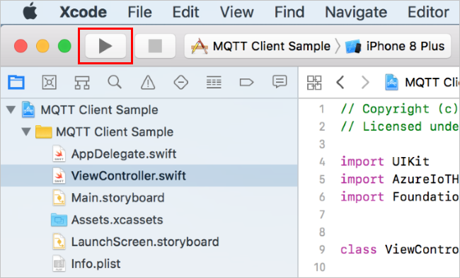
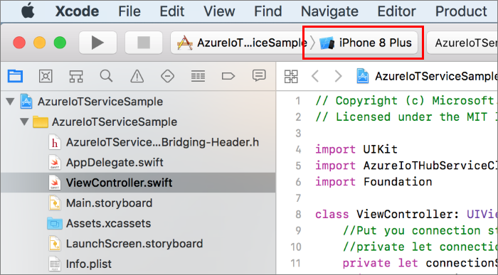
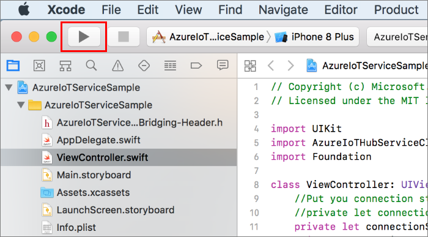
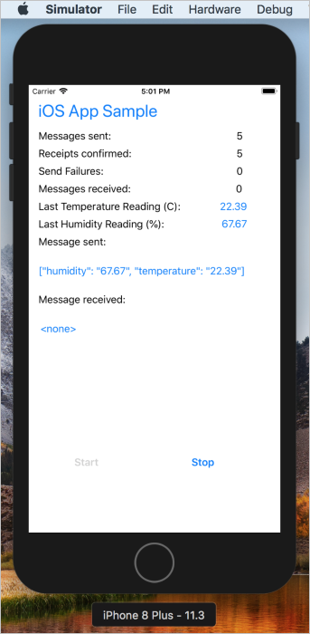
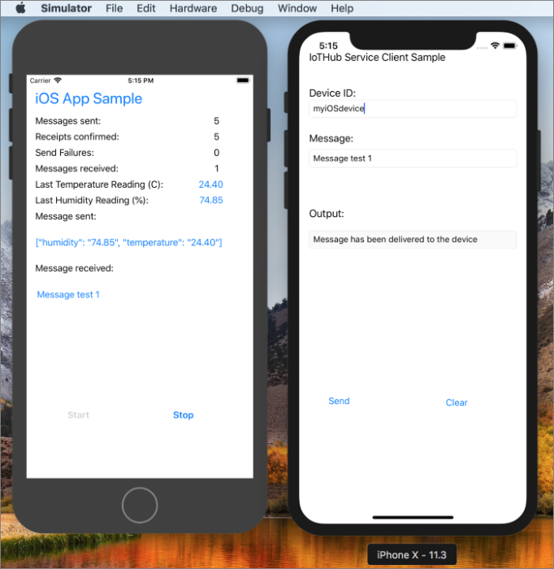

# Send cloud-to-device messages with IoT Hub (iOS)

[!INCLUDE [iot-hub-selector-c2d](../../includes/iot-hub-selector-c2d.md)]

Azure IoT Hub is a fully managed service that helps enable reliable and secure bi-directional communications between millions of devices and a solution back end. The [Send telemetry from a device to an IoT hub](quickstart-send-telemetry-ios.md) quickstart shows how to create an IoT hub, provision a device identity in it, and code a simulated device app that sends device-to-cloud messages.

This tutorial shows you how to:

* From your solution back end, send cloud-to-device messages to a single device through IoT Hub.

* Receive cloud-to-device messages on a device.

* From your solution back end, request delivery acknowledgment (*feedback*) for messages sent to a device from IoT Hub.

You can find more information on cloud-to-device messages in the [messaging section of the IoT Hub developer guide](iot-hub-devguide-messaging.md).

At the end of this article, you run two Swift iOS projects:

* **sample-device**, the same app created in [Send telemetry from a device to an IoT hub](quickstart-send-telemetry-ios.md), which connects to your IoT hub and receives cloud-to-device messages.

* **sample-service**, which sends a cloud-to-device message to the simulated device app through IoT Hub, and then receives its delivery acknowledgment.

> [!NOTE]
> IoT Hub has SDK support for many device platforms and languages (including C, Java, Python, and Javascript) through Azure IoT device SDKs. For step-by-step instructions on how to connect your device to this tutorial's code, and generally to Azure IoT Hub, see the [Azure IoT Developer Center](https://www.azure.com/develop/iot).

## Prerequisites

* An active Azure account. (If you don't have an account, you can create a [free account](https://azure.microsoft.com/pricing/free-trial/) in just a couple of minutes.)

* An active IoT hub in Azure.

* The code sample from [Azure samples](https://github.com/Azure-Samples/azure-iot-samples-ios/archive/master.zip).

* The latest version of [XCode](https://developer.apple.com/xcode/), running the latest version of the iOS SDK. This quickstart was tested with XCode 9.3 and iOS 11.3.

* The latest version of [CocoaPods](https://guides.cocoapods.org/using/getting-started.html).

* Make sure that port 8883 is open in your firewall. The device sample in this article uses MQTT protocol, which communicates over port 8883. This port may be blocked in some corporate and educational network environments. For more information and ways to work around this issue, see [Connecting to IoT Hub (MQTT)](iot-hub-mqtt-support.md#connecting-to-iot-hub).

## Simulate an IoT device

In this section, you simulate an iOS device running a Swift application to receive cloud-to-device messages from the IoT hub. 

This is the sample device that you create in the article [Send telemetry from a device to an IoT hub](quickstart-send-telemetry-ios.md). If you already have that running, you can skip this section.

### Install CocoaPods

CocoaPods manage dependencies for iOS projects that use third-party libraries.

In a terminal window, navigate to the Azure-IoT-Samples-iOS folder that you downloaded in the prerequisites. Then, navigate to the sample project:

```sh
cd quickstart/sample-device
```

Make sure that XCode is closed, then run the following command to install the CocoaPods that are declared in the **podfile** file:

```sh
pod install
```

Along with installing the pods required for your project, the installation command also created an XCode workspace file that is already configured to use the pods for dependencies.

### Run the sample device application

1. Retrieve the connection string for your device. You can copy this string from the [Azure portal](https://portal.azure.com) in the device details blade, or retrieve it with the following CLI command:

    ```azurecli-interactive
    az iot hub device-identity show-connection-string --hub-name {YourIoTHubName} --device-id {YourDeviceID} --output table
    ```

1. Open the sample workspace in XCode.

   ```sh
   open "MQTT Client Sample.xcworkspace"
   ```

2. Expand the **MQTT Client Sample** project and then folder of the same name.  

3. Open **ViewController.swift** for editing in XCode. 

4. Search for the **connectionString** variable and update the value with the device connection string that you copied in the first step.

5. Save your changes. 

6. Run the project in the device emulator with the **Build and run** button or the key combo **command + r**.

   

## Get the IoT hub connection string

In this article you create a backend service to send cloud-to-device messages through the IoT hub you created in [Send telemetry from a device to an IoT hub](quickstart-send-telemetry-ios.md). To send cloud-to-device messages, your service needs the **service connect** permission. By default, every IoT Hub is created with a shared access policy named **service** that grants this permission.

[!INCLUDE [iot-hub-include-find-service-connection-string](../../includes/iot-hub-include-find-service-connection-string.md)]

## Simulate a service device

In this section, you simulate a second iOS device with a Swift app that sends cloud-to-device messages through the IoT hub. This configuration is useful for IoT scenarios where there is one iPhone or iPad functioning as a controller for other iOS devices connected to an IoT hub.

### Install CocoaPods

CocoaPods manage dependencies for iOS projects that use third-party libraries.

Navigate to the Azure IoT iOS Samples folder that you downloaded in the prerequisites. Then, navigate to the sample service project:

```sh
cd quickstart/sample-service
```

Make sure that XCode is closed, then run the following command to install the CocoaPods that are declared in the **podfile** file:

```sh
pod install
```

Along with installing the pods required for your project, the installation command also created an XCode workspace file that is already configured to use the pods for dependencies.

### Run the sample service application

1. Open the sample workspace in XCode.

   ```sh
   open AzureIoTServiceSample.xcworkspace
   ```

2. Expand the **AzureIoTServiceSample** project and then expand the folder of the same name.  

3. Open **ViewController.swift** for editing in XCode. 

4. Search for the **connectionString** variable and update the value with the service connection string that you copied previously in [Get the IoT hub connection string](#get-the-iot-hub-connection-string).

5. Save your changes.

6. In Xcode, change the emulator settings to a different iOS device than you used to run the IoT device. XCode cannot run multiple emulators of the same type.

   

7. Run the project in the device emulator with the **Build and run** button or the key combo **Command + r**.

   

## Send a cloud-to-device message

You are now ready to use the two applications to send and receive cloud-to-device messages.

1. In the **iOS App Sample** app running on the simulated IoT device, click **Start**. The application starts sending device-to-cloud messages, but also starts listening for cloud-to-device messages.

   

2. In the **IoTHub Service Client Sample** app running on the simulated service device, enter the ID for the IoT device that you want to send a message to. 

3. Write a plaintext message, then click **Send**.

    Several actions happen as soon as you click send. The service sample sends the message to your IoT hub, which the app has access to because of the service connection string that you provided. Your IoT hub checks the device ID, sends the message to the destination device, and sends a confirmation receipt to the source device. The app running on your simulated IoT device checks for messages from IoT Hub and prints the text from the most recent one on the screen.

    Your output should look like the following example:

   

## Next steps

In this tutorial, you learned how to send and receive cloud-to-device messages.

To see examples of complete end-to-end solutions that use IoT Hub, see the [Azure IoT Solution Accelerators](https://azure.microsoft.com/documentation/suites/iot-suite/) documentation.

To learn more about developing solutions with IoT Hub, see the [IoT Hub developer guide](iot-hub-devguide.md).
