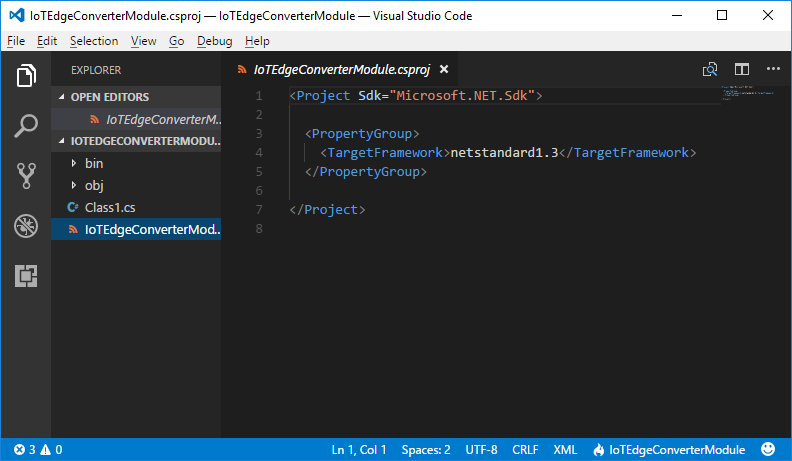
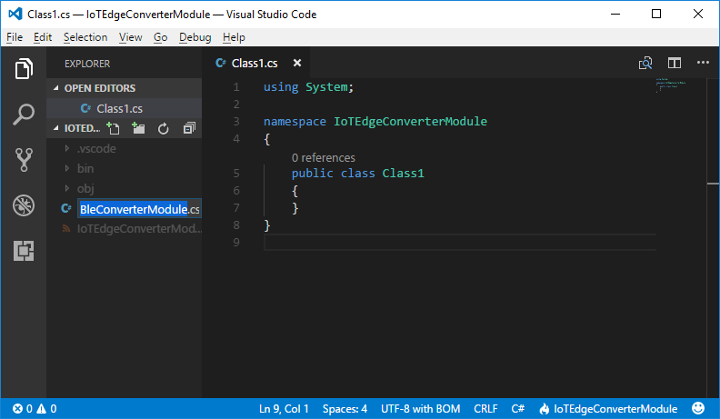
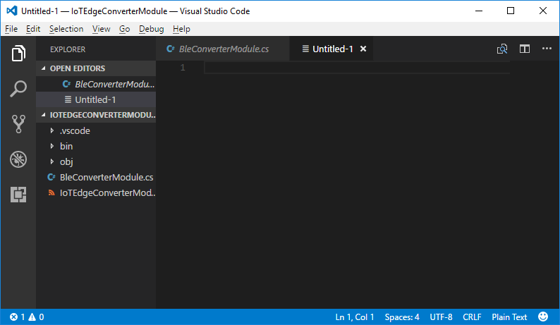
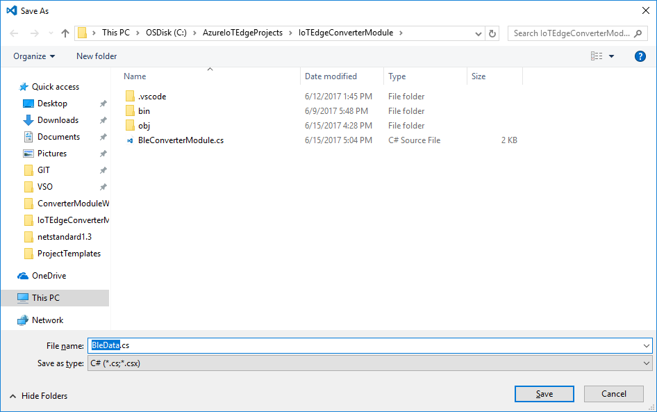
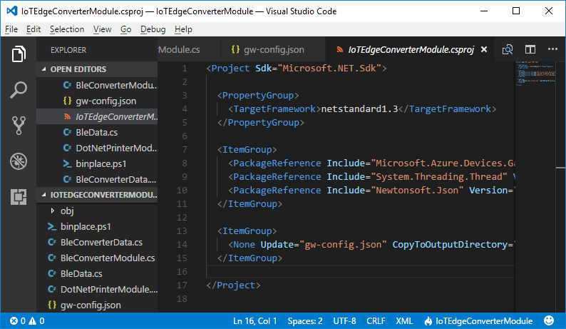
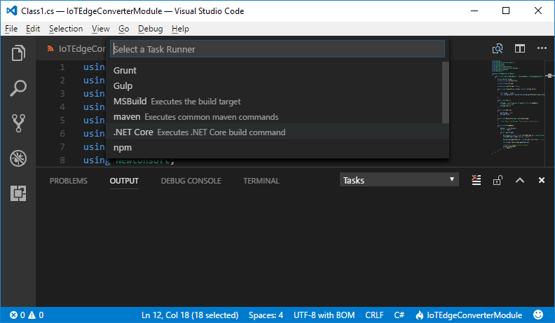
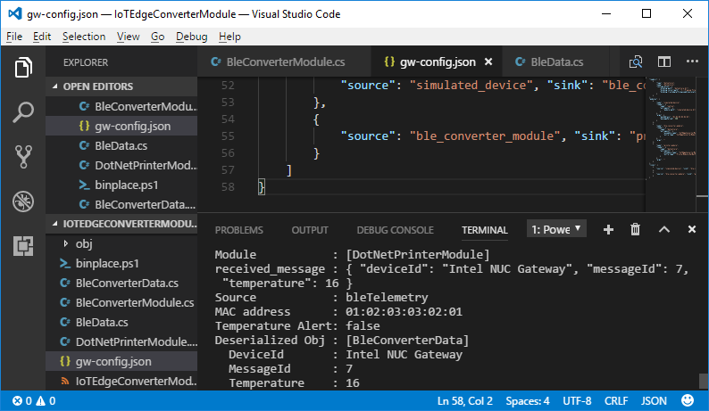

---
title: Azure IoT Edge BLE Data Converter Module with C&#x23; | Microsoft Docs
description: Tutorial on how to build a BLE converter module for Azure IoT Edge with C&#x23; and NuGet packages using Visual Studio Code.
services: iot-hub
documentationcenter: 
author: jeffreyCline
manager: sushi
keywords: 'azure, iot, tutorial, module, nuget, vscode, csharp, edge'

ms.service: iot-hub
ms.devlang: csharp
ms.topic: article
ms.tgt_pltfrm: na
ms.workload: na
ms.date: 06/28/2017
ms.author: jcline
---
# Azure IoT Edge BLE Data Converter Module with C&#x23;

## Overview

This tutorial showcases how to create a module for `Azure IoT Edge` using `Visual Studio Code` and `C#`.

In this tutorial, we will walk through environment setup and how to write a [BLE](https://en.wikipedia.org/wiki/Bluetooth_Low_Energy) data converter module using the latest `Azure IoT Edge NuGet` packages. 

[!NOTE]
This tutorial is using the `.NET Core SDK`, which supports cross-platform compatability, the following tutorial was written using the `Windows 10` operating system. Some of the commands in this tutorial may be different depending on your `development environment`. 

## Prerequisites

In this section, you will setup your environment for `Azure IoT Edge` module development. It applies to both **64-bit Windows** and **64-bit Linux (Ubuntu/Debian 8)** operating systems.

The following software is required:

1. [Git Client](https://https://git-scm.com/downloads)
2. [.NET Core SDK](https://www.microsoft.com/net/core#windowscmd)
3. [Visual Studio Code](https://code.visualstudio.com/)

[!NOTE]
You do not need to clone the repo for this sample, however all of the sample code discussed in this tutorial is located in the `Azure-Samples` repository below.

- `git clone https://github.com/Azure-Samples/iot-edge-samples.git`.
- `cd iot-edge-samples/dotnetcore/simulated_ble`

## Getting Started

1. Install `.NET Core SDK`.
2. Install `Visual Studio Code` and the `C# extension` from the Visual Studio Code Marketplace.

Please view this [quick video tutorial](https://channel9.msdn.com/Blogs/dotnet/Get-started-VSCode-Csharp-NET-Core-Windows) about how to get started using `Visual Studio Code` and the `.NET Core SDK`.

## Creating the Azure IoT Edge Converter Module

1. Initialize a new `.NET Core` class library C# project:
	- Open a command prompt (`Windows + R` -> `cmd` -> `enter`).
	- Navigate to the folder where you'd like to create the `C#` project.
	- Type "**dotnet new classlib -o IoTEdgeConverterModule -f netstandard1.3**". 
	- This creates an empty class called `Class1.cs` in your projects directory.
2. Navigate to the folder where we just created the class library project by typing "**cd IoTEdgeConverterModule**".
3. Open the project in `Visual Studio Code` by typing "**code .**".
4. Once the project is opened in `Visual Studio Code`, in the file view to the left, click on the "**IoTEdgeConverterModule.csproj**". This will open the `IoTEdgeConverterModule.csproj` file in the code editor window to the right of the file view as shown in the image below.

	

5. Insert the `XML` blob shown in the code snippet below between the closing `PropertyGroup` tag and the closing `Project` tag; line six in the above image and save the file (`Ctrl + S`).

**XML:**

```xml
  <ItemGroup>
    <PackageReference Include="Microsoft.Azure.Devices.Gateway.Module.NetStandard" Version="1.0.5" />
    <PackageReference Include="System.Threading.Thread" Version="4.3.0" />
    <PackageReference Include="Newtonsoft.Json" Version="10.0.2" />
  </ItemGroup> 
```
6. Once you save the `.csproj` file `Visual Studio Code` should prompt you with an `unresolved dependencies` dialog as seen in the image below. 

	

	- Click `Restore` to restore all of the references in the projects `.csproj` file including the `PackageReferences` we have just added. 
	- You'll see a new `project.assets.json` file in your projects `obj` folder. This file contains information about your project's dependencies to make subsequent restores quicker.
 
        [!NOTE]
		`.NET Core Tools` are now MSBuild-based. This means a `.csproj` project file will be created instead of a `project.json`.

	If `Visual Studio Code` does not prompt you that is ok, we can do it manually. Open the `Visual Studio Code` integrated terminal window by pressing the `Ctrl` + `backtick` keys or using the menus `View` -> `Integrated Terminal`.
	- In the `Integrated Terminal` window type "**dotnet restore**".
	
7. Rename the `Class1.cs` file to `BleConverterModule.cs` by clicking on the file and pressing the `F2` key then typing **BleConverterModule** as seen in the image below.

    

8. Replace the existing code in the `BleConverterModule.cs` file by copying and pasting the below code snippit into your `BleConverterModule.cs` file.

**C#:**

```csharp
using System;
using System.Collections.Generic;
using System.Globalization;
using System.Linq;
using System.Text;
using System.Threading;
using System.Threading.Tasks;
using Microsoft.Azure.Devices.Gateway;
using Newtonsoft.Json;

namespace IoTEdgeConverterModule
{
    public class BleConverterModule : IGatewayModule, IGatewayModuleStart
    {
        private Broker broker;
        private string configuration;
        private int messageCount;

        public void Create(Broker broker, byte[] configuration)
        {
            this.broker = broker;
            this.configuration = System.Text.Encoding.UTF8.GetString(configuration);
        }

        public void Start()
        {
        }

        public void Destroy()
        {
        }

        public void Receive(Message received_message)
        {
            string recMsg = Encoding.UTF8.GetString(received_message.Content, 0, received_message.Content.Length);
            BleData receivedData = JsonConvert.DeserializeObject<BleData>(recMsg);

            float temperature = float.Parse(receivedData.Temperature, CultureInfo.InvariantCulture.NumberFormat); 
            Dictionary<string, string> receivedProperties = received_message.Properties;
            
            Dictionary<string, string> properties = new Dictionary<string, string>();
            properties.Add("source", receivedProperties["source"]);
            properties.Add("macAddress", receivedProperties["macAddress"]);
            properties.Add("temperatureAlert", temperature > 30 ? "true" : "false");

            String content = String.Format("{0} \"deviceId\": \"Intel NUC Gateway\", \"messageId\": {1}, \"temperature\": {2} {3}", "{", ++this.messageCount, temperature, "}");
            Message messageToPublish = new Message(content, properties);

            this.broker.Publish(messageToPublish);
        }
    }
}
```

11. Save the file by pressing `Ctrl` + `S`.

12. Create a new file by pressing the `Ctrl` + `N` keys, this will create a new file called `Untitled-1` as seen in the image below.

    

13. Copy the below code into the `Untitled-1` file code editor window. This is the class that we will use to deserialize the `JSON` object that we receive from the simulated `BLE` device.

**C#:**

```csharp
using System;
using Newtonsoft.Json;

namespace IoTEdgeConverterModule
{
    public class BleData
    {
        [JsonProperty(PropertyName = "temperature")]
        public string Temperature { get; set; }
    }
}
```

14. Save the file as `BleData.cs` by pressing `Ctrl` + `Shift` + `S` keys.
    - On the save as dialog box, in the `Save as Type` dropdown menu, select `C# (*.cs;*.csx)` as seen in the below image.

    

15. Create a new file by pressing the `Ctrl` + `N` keys, this will create a new file called `Untitled-1`.

16. Copy and paste the below code snippit into the `Untitled-1` file. This class is a `Azure IoT Edge` module which we will use to output the data received from our `BleConverterModule`.

**C#:**

```csharp
using System;
using System.Collections.Generic;
using System.Linq;
using System.Text;
using System.Threading.Tasks;
using Microsoft.Azure.Devices.Gateway;
using Newtonsoft.Json;

namespace PrinterModule
{
    public class DotNetPrinterModule : IGatewayModule
    {
        private string configuration;
        public void Create(Broker broker, byte[] configuration)
        {
            this.configuration = System.Text.Encoding.UTF8.GetString(configuration);
        }

        public void Destroy()
        {
        }

        public void Receive(Message received_message)
        {
            string recMsg = System.Text.Encoding.UTF8.GetString(received_message.Content, 0, received_message.Content.Length);
            Dictionary<string, string> receivedProperties = received_message.Properties;
            
            BleConverterData receivedData = JsonConvert.DeserializeObject<BleConverterData>(recMsg);

            Console.WriteLine();
            Console.WriteLine("Module           : [DotNetPrinterModule]");
            Console.WriteLine("received_message : {0}", recMsg);

            if(received_message.Properties["source"] == "bleTelemetry")
            {
                Console.WriteLine("Source           : {0}", receivedProperties["source"]);
                Console.WriteLine("MAC address      : {0}", receivedProperties["macAddress"]);
                Console.WriteLine("Temperature Alert: {0}", receivedProperties["temperatureAlert"]);
                Console.WriteLine("Deserialized Obj : [BleConverterData]");
                Console.WriteLine("  DeviceId       : {0}", receivedData.DeviceId);
                Console.WriteLine("  MessageId      : {0}", receivedData.MessageId);
                Console.WriteLine("  Temperature    : {0}", receivedData.Temperature);
            }

            Console.WriteLine();
        }
    }
}
```

17. Save the file as `DotNetPrinterModule.cs` by pressing `Ctrl` + `Shift` + `S`.
    - On the save as dialog box, in the `Save as Type` dropdown menu, select `C# (*.cs;*.csx)`.

18. Create a new file by pressing the `Ctrl` + `N` keys.

19. Copy and paste the below code snippit into the `Untitled-1` file. This is the class that we will use to deserialize the `JSON` object that we receive from the `BleConverterModule`.

**C#:**

```csharp
using System;
using Newtonsoft.Json;

namespace PrinterModule
{
    public class BleConverterData
    {
        [JsonProperty(PropertyName = "deviceId")]
        public string DeviceId { get; set; }

        [JsonProperty(PropertyName = "messageId")]
        public string MessageId { get; set; }

        [JsonProperty(PropertyName = "temperature")]
        public string Temperature { get; set; }
    }
}
```

20. Save the file as `BleConverterData.cs` by pressing `Ctrl` + `Shift` + `S`.
    - On the save as dialog box, in the `Save as Type` dropdown menu, select `C# (*.cs;*.csx)`.

21. Create a new file by pressing the `Ctrl` + `N` keys.

22. Copy and paste the below code snippit into the `Untitled-1` file.

**JSON**

```json
{
    "loaders": [
        {
            "type": "dotnetcore",
            "name": "dotnetcore",
            "configuration": {
                "binding.path": "dotnetcore.dll",
                "binding.coreclrpath": "C:\\Program Files\\dotnet\\shared\\Microsoft.NETCore.App\\1.1.1\\coreclr.dll",
                "binding.trustedplatformassemblieslocation": "C:\\Program Files\\dotnet\\shared\\Microsoft.NETCore.App\\1.1.1\\"
            }
        }
    ],
    "modules": [
        {
            "name": "simulated_device",
            "loader": {
                "name": "native",
                "entrypoint": {
                    "module.path": "simulated_device.dll"
                }
            },
            "args": {
                "macAddress": "01:02:03:03:02:01",
                "messagePeriod": 500
            }
        },
        {
            "name": "ble_converter_module",
            "loader": {
                "name": "dotnetcore",
                "entrypoint": {
                    "assembly.name": "IoTEdgeConverterModule",
                    "entry.type": "IoTEdgeConverterModule.BleConverterModule"
                }
            },
            "args": ""
        },
        {
            "name": "printer_module",
            "loader": {
                "name": "dotnetcore",
                "entrypoint": {
                    "assembly.name": "IoTEdgeConverterModule",
                    "entry.type": "PrinterModule.DotNetPrinterModule"
                }
            },
            "args": ""
        }
    ],
    "links": [
        {
            "source": "simulated_device", "sink": "ble_converter_module"
        },
        {
            "source": "ble_converter_module", "sink": "printer_module"
        }
    ]
}
```

23. Save the file as `gw-config.json` by pressing `Ctrl` + `Shift` + `S`.
    - On the save as dialog box, in the `Save as Type` dropdown menu, select `JSON (*.json;*.bowerrc;*.jshintrc;*.jscsrc;*.eslintrc;*.babelrc;*webmanifest)`.

24. Update the `IoTEdgeConverterModule.csproj` with the below XML blob to enable copying of the configuration file to the output directory.

**XML:**

```xml
  <ItemGroup>
    <None Update="gw-config.json" CopyToOutputDirectory="PreserveNewest" />
  </ItemGroup>
```
    
- The updated `IoTEdgeConverterModule.csproj` should look like the image below.

    

25. Create a new file by pressing the `Ctrl` + `N` keys.

26. Copy and paste the below code snippit into the `Untitled-1` file.

**PowerShell:**

```powershell
Copy-Item -Path $env:userprofile\.nuget\packages\microsoft.azure.devices.gateway.native.windows.x64\1.1.3\runtimes\win-x64\native\* -Destination .\bin\Debug\netstandard1.3
Copy-Item -Path $env:userprofile\.nuget\packages\system.runtime.serialization.formatters\4.3.0\lib\netstandard1.4\* -Destination .\bin\Debug\netstandard1.3
Copy-Item -Path $env:userprofile\.nuget\packages\system.runtime.serialization.primitives\4.3.0\lib\netstandard1.3\* -Destination .\bin\Debug\netstandard1.3
Copy-Item -Path $env:userprofile\.nuget\packages\newtonsoft.json\10.0.2\lib\netstandard1.3\* -Destination .\bin\Debug\netstandard1.3
Copy-Item -Path $env:userprofile\.nuget\packages\system.componentmodel.typeconverter\4.3.0\lib\netstandard1.5\* -Destination .\bin\Debug\netstandard1.3
Copy-Item -Path $env:userprofile\.nuget\packages\system.collections.nongeneric\4.3.0\lib\netstandard1.3\* -Destination .\bin\Debug\netstandard1.3
Copy-Item -Path $env:userprofile\.nuget\packages\system.collections.specialized\4.3.0\lib\netstandard1.3\* -Destination .\bin\Debug\netstandard1.3
```

27. Save the file as `binplace.ps1` by pressing `Ctrl` + `Shift` + `S`.
    - On the save as dialog box, in the `Save as Type` dropdown menu, select `PowerShell (*.ps1;*.psm1;*.psd1;*.pssc;*.psrc)`.

28. Buld the project (`Ctrl` + `Shift` + `B`), since this is the first time you have built the project `Visual Studio Code` will prompt you with the `No build task defined.` dialog as seen below.

	

	- Click the `Configure Build Task` button.
	- This will bring up the `Select a Task Runner` dialog dropdown menu. Since this is a `.NET Core` project, select `.Net Core` as seen in the image below. This will create the `tasks.json` file in your `.vscode` directory and open the file in the `code editor` window. There is no need to modify this file, simply close the tab by pressing (`Ctrl` + `F4`) or using the close button on the `tasks.json` tab itself.

	

29.  Open the `Visual Studio Code` integrated terminal window by pressing the `Ctrl` + `backtick` keys or using the menus `View` -> `Integrated Terminal` and type "**.\binplace.ps1**" into the `PowerShell` command prompt. This will copy all our dependencies to the output directory.

30. Navigate to the projects output directory in the `Integrated Terminal` window by typing "**cd .\bin\Debug\netstandard1.3**".


31. Run the sample project by typing "**.\gw.exe gw-config.json**" into the `Integrated Terminal` window prompt. 
    - If you have followed the steps in this tutorial closely you should now be running the `Azure IoT Edge BLE Data Converter Module` sample project as seen in the image below.
    - If you want to terminate the application, press the `<Enter>` key.
    - [!IMPORTANT]
      It is not recommended to use `Ctrl` + `C` to terminate the `IoT Edge` gateway application (i.e. **gw.exe**). As this may cause the process to terminate abnormally.

        


