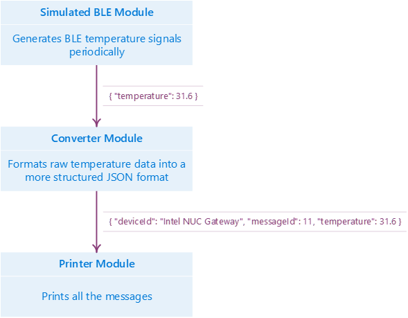

---
title: Creating Azure IoT Edge Module with Java | Microsoft Docs
description: This tutorial showcases how to write a BLE data converter module using the latest Azure IoT Edge Maven packages.
services: iot-hub
author: junyi
manager: sushi

ms.service: iot-hub
ms.workload: na
ms.tgt_pltfrm: na
ms.devlang: Java
ms.topic: article
ms.date: 06/28/2017
ms.author: junyi
---
# Azure IoT Edge BLE Data Converter Module with Java

## Overview

This tutorial showcases how one might build a module for Azure IoT Edge in Java.

In this tutorial, we will walk through environment setup and how to write a [BLE](https://en.wikipedia.org/wiki/Bluetooth_Low_Energy) data converter module using the latest Azure IoT Edge Maven packages.

## Prerequisites

In this section, you will setup your environment for IoT Edge module development. It applies to both *64-bit Windows* and *64-bit Linux (Ubuntu/Debian 8)* operating systems.

The following software is required:

1. [Git Client](https://https://git-scm.com/downloads).
2. [**x64** JDK](http://www.oracle.com/technetwork/java/javase/downloads/jdk8-downloads-2133151.html).
3. [Maven](https://maven.apache.org/install.html).

Open a command line terminal window and navigate to the working directory:

1. `git clone https://github.com/Azure-Samples/iot-edge-samples.git`.
2. `cd iot-edge-samples/java/simulated_ble`

## Overall Architecture

The Azure IoT Edge platform heavily adopts the [Von Neumann architecture](https://en.wikipedia.org/wiki/Von_Neumann_architecture). Which means that the entire Azure IoT Edge architecture is a system which processes input and produces output; and that each individual module is also a tiny input-output subsystem. In this tutorial, we will introduce the following two modules:

1. A module which receives a simulated [BLE](https://en.wikipedia.org/wiki/Bluetooth_Low_Energy) signal and converts it into a formatted [JSON](https://en.wikipedia.org/wiki/JSON) message.
2. A module which prints the received [JSON](https://en.wikipedia.org/wiki/JSON) message.

The below image displays the typical end-to-end dataflow for this project:



## Understanding the Code

### Maven Project Structure

Since Azure IoT Edge packages are based on Maven, we need to create a typical Maven project structure, which contains a `pom.xml` file.

Ths POM inherits from the `com.microsoft.azure.gateway.gateway-module-base` package which declares all of the dependencies needed by a module project which includes the runtime binaries, the gateway configuration file path, and the execution behavior. This will save us lots of time and eliminate the need to write and rewrite hundreds of lines of code over and over again.

We need to update the pom.xml file by declaring the required dependencies/plugins and the name of the configuration file to be used by our module as shown in the code snippet below.

```xml
<project xmlns="http://maven.apache.org/POM/4.0.0"
         xmlns:xsi="http://www.w3.org/2001/XMLSchema-instance"
         xsi:schemaLocation="http://maven.apache.org/POM/4.0.0 http://maven.apache.org/xsd/maven-4.0.0.xsd">
  <modelVersion>4.0.0</modelVersion>

  <!-- Inherit from parent -->
  <parent>
    <groupId>com.microsoft.azure.gateway</groupId>
    <artifactId>gateway-module-base</artifactId>
    <version>1.0.1</version>
  </parent>
  
  <groupId>com.microsoft.azure.gateway</groupId>
  <artifactId>ble-converter</artifactId>
  <version>1.0</version>
  <packaging>jar</packaging>

  <!-- Set the filename of the Azure IoT Edge configuration located
       under ./src/main/resources/gateway/ which is used in parent -->
  <properties>
    <gw.config.fileName>gw-config.json</gw.config.fileName>
  </properties>

  <!-- Re-declare dependencies used in parent -->
  <dependencies>
    <dependency>
      <groupId>com.microsoft.azure.gateway</groupId>
      <artifactId>gateway-java-binding</artifactId>
    </dependency>
    <dependency>
      <groupId>${dependency.runtime.group}</groupId>
      <artifactId>${dependency.runtime.name}</artifactId>
    </dependency>
  </dependencies>

  <!-- Re-declare plugins used in parent -->
  <build>
    <plugins>
      <plugin>
        <groupId>org.apache.maven.plugins</groupId>
        <artifactId>maven-dependency-plugin</artifactId>
      </plugin>
      <plugin>
        <groupId>org.apache.maven.plugins</groupId>
        <artifactId>maven-resources-plugin</artifactId>
      </plugin>
      <plugin>
        <groupId>org.apache.maven.plugins</groupId>
        <artifactId>maven-shade-plugin</artifactId>
      </plugin>
      <plugin>
        <groupId>org.codehaus.mojo</groupId>
        <artifactId>exec-maven-plugin</artifactId>
      </plugin>
    </plugins>
  </build>
</project>
```

### Basic Understanding of an Azure IoT Edge Module

You can treat an Azure IoT Edge module as a data processor whose job is to: receive input, process it, and produce output.

The input might be data from hardware (like a motion detector), a message from other modules, or anything else (like a random number generated periodically by a timer).

The output is similar to the input, it could trigger hardware behavior (like the blinking LED), a message to other modules, or anything else (like printing to the console).

Modules communicate with each other using `com.microsoft.azure.gateway.messaging.Message` class. The **Content** of a `Message` is a byte array which is capable of representing any kind of data you like. **Properties** are also available in the `Message` and are simply a string-to-string mapping. You may think of **Properties** as the headers in a HTTP request, or the metadata of a file.

In order to develop an Azure IoT Edge module in Java, you need to create a new module class which inherits from `com.microsoft.azure.gateway.core.GatewayModule` and implement the required abstract methods `receive()` and `destroy()`. At this point you may also choose to implement the optional `start()` or `create()` methods as well. The following code snippet shows you how to get started authoring an Azure IoT Edge module.

```java
import com.microsoft.azure.gateway.core.Broker;
import com.microsoft.azure.gateway.core.GatewayModule;
import com.microsoft.azure.gateway.messaging.Message;

public class MyEdgeModule extends GatewayModule {
  public MyEdgeModule(long address, Broker broker, String configuration) {
    /* Let the GatewayModule do the dirty work of initialization. It's also
       a good time to parse your own configuration defined in Azure IoT Edge
       configuration file (typically ./src/main/resources/gateway/gw-config.json) */
    super(address, broker, configuration);
  }

  @Override
  public void start() {
    /* Acquire the resources you need. If you don't
       need any resources, you may omit this method. */
  }

  @Override
  public void destroy() {
    /* It's time to release all resources. This method is required. */
  }

  @Override
  public void receive(Message message) {
    /* Logic to process the input message. This method is required. */
    // ...
    /* Use publish() method to do the output. You are
       allowed to publish your new Message instance. */
    this.publish(message);
  }
}
```

### Converter Module

| Input                    | Processor                              | Output                 | Source File            |
| ------------------------ | -------------------------------------- | ---------------------- | ---------------------- |
| Temperature data message | Parse and construct a new JSON message | Structure JSON message | `ConverterModule.java` |

This module is a typical Azure IoT Edge module. It accepts temperature messages from other modules (a hardware module, or in this case our simulated BLE module); and then normalizes the temperature message in to a structured JSON message (including appending the message ID, setting the property of whether we need to trigger the temperature alert, and so on).

```java
@Override
public void receive(Message message) {
  try {
    JSONObject messageFromBle = new JSONObject(new String(message.getContent()));
    double temperature = messageFromBle.getDouble("temperature");
    Map<String, String> inputProperties = message.getProperties();

    HashMap<String, String> properties = new HashMap<>();
    properties.put("source", inputProperties.get("source"));
    properties.put("macAddress", inputProperties.get("macAddress"));
    properties.put("temperatureAlert", temperature > 30 ? "true" : "false");

    String content = String.format(
        "{ \"deviceId\": \"Intel NUC Gateway\", \"messageId\": %d, \"temperature\": %f }",
        ++this.messageCount, temperature);

    this.publish(new Message(content.getBytes(), properties));
  } catch (Exception ex) {
    ex.printStackTrace();
  }
}
```

### Printer Module

| Input                          | Processor | Output                     | Source File          |
| ------------------------------ | --------- | -------------------------- | -------------------- |
| Any message from other modules | N/A       | Log the message to console | `PrinterModule.java` |

This is a very simple, self-explanatory, module which outputs the received messages to the terminal window.

```java
@Override
public void receive(Message message) {
  System.out.println(message.toString());
}
```

### Azure IoT Edge Configuration

The final step before running the modules is to configure the Azure IoT Edge and to establish the connections between modules.

First we need to declare our Java loader (since Azure IoT Edge supports loaders of different languages) which could be referenced by its `name` in the sections afterward.

```json
"loaders": [{
  "type": "java",
  "name": "java",
  "configuration": {
    "jvm.options": {
      "library.path": "./"
    }
  }
}]
```

Once we have declared our loaders we will also need to declare our modules as well. Similar to declaring the loaders, they can also be referenced by their `name` attribute. When declaring a module, we need to specify the loader it should use (which should be the one we defined before) and the entry-point (should be the normalized class name of our module) for each module. The `simulated_device` module is a native module which is included in the Azure IoT Edge core runtime package. You should always include `args` in the JSON file even if it is `null`.

```json
"modules": [
  {
    "name": "simulated_device",
    "loader": {
      "name": "native",
      "entrypoint": {
        "module.path": "simulated_device"
      }
    },
    "args": {
      "macAddress": "01:02:03:03:02:01",
      "messagePeriod": 500
    }
  },
  {
    "name": "converter",
    "loader": {
      "name": "java",
      "entrypoint": {
        "class.name": "com/microsoft/azure/gateway/ConverterModule",
        "class.path": "./ble-converter-1.0-with-deps.jar"
      }
    },
    "args": null
  },
  {
    "name": "print",
    "loader": {
      "name": "java",
      "entrypoint": {
        "class.name": "com/microsoft/azure/gateway/PrinterModule",
        "class.path": "./ble-converter-1.0-with-deps.jar"
      }
    },
    "args": null
  }
]
```

At the end of the configuration, we establish the connections. Each connection is expressed by `source` and `sink`. They should both reference a pre-defined module. The output message of `source` module will be forwarded to the input of `sink` module.

```json
"links": [
  {
    "source": "simulated_device",
    "sink": "converter"
  },
  {
    "source": "converter",
    "sink": "print"
  }
]
```

## Running the Modules

Use `mvn package` to build everything into the `target/` folder. `mvn clean package` is also recommended for a clean build.

Use `mvn exec:exec` to run the Azure IoT Edge and you should observe that the temperature data and all the properties are printed to the console at a fixed rate.

If you want to terminate the application, press `<Enter>` key.

> [!IMPORTANT]
> It is not recommended to use Ctrl + C to terminate the IoT Edge gateway application. As this may cause the process to terminate abnormally.

