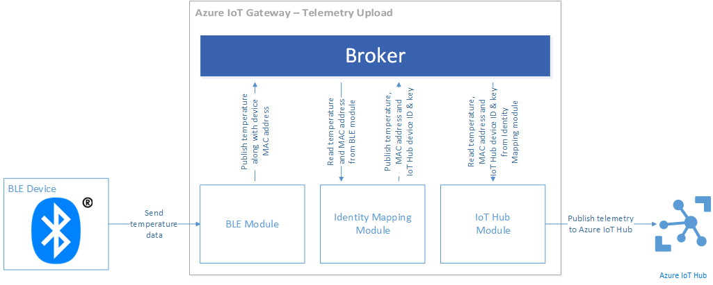
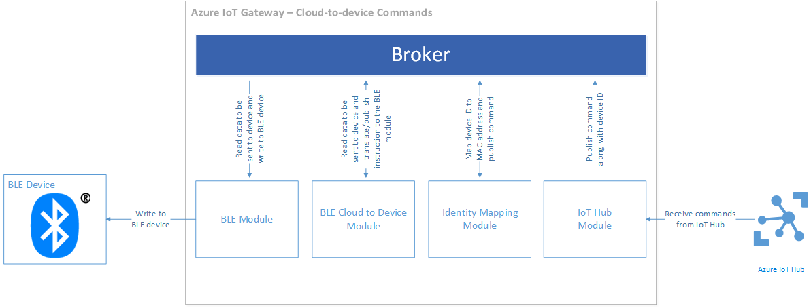

# Use Azure IoT Edge on a Raspberry Pi to forward device-to-cloud messages to IoT Hub

This walkthrough of the [Bluetooth low energy sample][lnk-ble-samplecode] shows you how to use [Azure IoT Edge][lnk-sdk] to:

* Forward device-to-cloud telemetry to IoT Hub from a physical device.
* Route commands from IoT Hub to a physical device.

This walkthrough covers:

* **Architecture**: important architectural information about the Bluetooth low energy sample.
* **Build and run**: the steps required to build and run the sample.

## Architecture

The walkthrough shows you how to build and run an IoT Edge gateway on a Raspberry Pi 3 that runs Raspbian Linux. The gateway is built using IoT Edge. The sample uses a Texas Instruments SensorTag Bluetooth Low Energy (BLE) device to collect temperature data.

When you run the IoT Edge gateway it:

* Connects to a SensorTag device using the Bluetooth Low Energy (BLE) protocol.
* Connects to IoT Hub using the HTTP protocol.
* Forwards telemetry from the SensorTag device to IoT Hub.
* Routes commands from IoT Hub to the SensorTag device.

The gateway contains the following IoT Edge modules:

* A *BLE module* that interfaces with a BLE device to receive temperature data from the device and send commands to the device.
* A *BLE cloud to device module* that translates JSON messages sent from IoT Hub into BLE instructions for the *BLE module*.
* A *logger module* that logs all gateway messages to a local file.
* An *identity mapping module* that translates between BLE device MAC addresses and Azure IoT Hub device identities.
* An *IoT Hub module* that uploads telemetry data to an IoT hub and receives device commands from an IoT hub.
* A *BLE printer module* that interprets telemetry from the BLE device and prints formatted data to the console to enable troubleshooting and debugging.

### How data flows through the gateway

The following block diagram illustrates the telemetry upload data flow pipeline:



The steps that an item of telemetry takes traveling from a BLE device to IoT Hub are:

1. The BLE device generates a temperature sample and sends it over Bluetooth to the BLE module in the gateway.
1. The BLE module receives the sample and publishes it to the broker along with the MAC address of the device.
1. The identity mapping module picks up this message and uses an internal table to translate the MAC address of the device into an IoT Hub device identity. An IoT Hub device identity consists of a device ID and device key.
1. The identity mapping module publishes a new message that contains the temperature sample data, the MAC address of the device, the device ID, and the device key.
1. The IoT Hub module receives this new message (generated by the identity mapping module) and publishes it to IoT Hub.
1. The logger module logs all messages from the broker to a local file.

The following block diagram illustrates the device command data flow pipeline:



1. The IoT Hub module periodically polls the IoT hub for new command messages.
1. When the IoT Hub module receives a new command message, it publishes it to the broker.
1. The identity mapping module picks up the command message and uses an internal table to translate the IoT Hub device ID to a device MAC address. It then publishes a new message that includes the MAC address of the target device in the properties map of the message.
1. The BLE Cloud-to-Device module picks up this message and translates it into the proper BLE instruction for the BLE module. It then publishes a new message.
1. The BLE module picks up this message and executes the I/O instruction by communicating with the BLE device.
1. The logger module logs all messages from the broker to a disk file.

## Prerequisites

To complete this tutorial, you need an active Azure subscription.

> [!NOTE]
> If you don’t have an account, you can create a free trial account in just a couple of minutes. For details, see [Azure Free Trial][lnk-free-trial].

You need SSH client on your desktop machine to enable you to remotely access the command line on the Raspberry Pi.

- Windows does not include an SSH client. We recommend using [PuTTY](http://www.putty.org/).
- Most Linux distributions and Mac OS include the command-line SSH utility. For more information, see [SSH Using Linux or Mac OS](https://www.raspberrypi.org/documentation/remote-access/ssh/unix.md).

## Prepare your hardware

This tutorial assumes you are using a [Texas Instruments SensorTag](http://www.ti.com/ww/en/wireless_connectivity/sensortag2015/index.html) device connected to a Raspberry Pi 3 running Raspbian.

### Install Raspbian

You can use either of the following options to install Raspbian on your Raspberry Pi 3 device.

* To install the latest version of Raspbian, use the [NOOBS][lnk-noobs] graphical user interface.
* Manually [download][lnk-raspbian] and write the latest image of the Raspbian operating system to an SD card.

### Sign in and access the terminal

You have two options to access a terminal environment on your Raspberry Pi:

* If you have a keyboard and monitor connected to your Raspberry Pi, you can use the Raspbian GUI to access a terminal window.

* Access the command line on your Raspberry Pi using SSH from your desktop machine.

#### Use a terminal Window in the GUI

The default credentials for Raspbian are username **pi** and password **raspberry**. In the task bar in the GUI, you can launch the **Terminal** utility using the icon that looks like a monitor.

#### Sign in with SSH

You can use SSH for command-line access to your Raspberry Pi. The article [SSH (Secure Shell)][lnk-pi-ssh] describes how to configure SSH on your Raspberry Pi, and how to connect from [Windows][lnk-ssh-windows] or [Linux & Mac OS][lnk-ssh-linux].

Sign in with username **pi** and password **raspberry**.

### Install BlueZ 5.37

The BLE modules talk to the Bluetooth hardware via the BlueZ stack. You need version 5.37 of BlueZ for the modules to work correctly. These instructions make sure the correct version of BlueZ is installed.

1. Stop the current bluetooth daemon:

    ```sh
    sudo systemctl stop bluetooth
    ```

1. Install the BlueZ dependencies:

    ```sh
    sudo apt-get update
    sudo apt-get install bluetooth bluez-tools build-essential autoconf glib2.0 libglib2.0-dev libdbus-1-dev libudev-dev libical-dev libreadline-dev
    ```

1. Download the BlueZ source code from bluez.org:

    ```sh
    wget http://www.kernel.org/pub/linux/bluetooth/bluez-5.37.tar.xz
    ```

1. Unzip the source code:

    ```sh
    tar -xvf bluez-5.37.tar.xz
    ```

1. Change directories to the newly created folder:

    ```sh
    cd bluez-5.37
    ```

1. Configure the BlueZ code to be built:

    ```sh
    ./configure --disable-udev --disable-systemd --enable-experimental
    ```

1. Build BlueZ:

    ```sh
    make
    ```

1. Install BlueZ once it is done building:

    ```sh
    sudo make install
    ```

1. Change systemd service configuration for bluetooth so it points to the new bluetooth daemon in the file `/lib/systemd/system/bluetooth.service`. Replace the 'ExecStart' line with the following text:

    ```conf
    ExecStart=/usr/local/libexec/bluetooth/bluetoothd -E
    ```

### Enable connectivity to the SensorTag device from your Raspberry Pi 3 device

Before running the sample, you need to verify that your Raspberry Pi 3 can connect to the SensorTag device.

1. Ensure the `rfkill` utility is installed:

    ```sh
    sudo apt-get install rfkill
    ```

1. Unblock bluetooth on the Raspberry Pi 3 and check that the version number is **5.37**:

    ```sh
    sudo rfkill unblock bluetooth
    bluetoothctl --version
    ```

1. To enter the interactive bluetooth shell, start the bluetooth service and execute the **bluetoothctl** command :

    ```sh
    sudo systemctl start bluetooth
    bluetoothctl
    ```

1. Enter the command **power on** to power up the bluetooth controller. The command returns output similar to the following:

    ```sh
    [NEW] Controller 98:4F:EE:04:1F:DF C3 raspberrypi [default]
    ```

1. In the interactive bluetooth shell, enter the command **scan on** to scan for bluetooth devices. The command returns output similar to the following:

    ```sh
    Discovery started
    [CHG] Controller 98:4F:EE:04:1F:DF Discovering: yes
    ```

1. Make the SensorTag device discoverable by pressing the small button (the green LED should flash). The Raspberry Pi 3 should discover the SensorTag device:

    ```sh
    [NEW] Device A0:E6:F8:B5:F6:00 CC2650 SensorTag
    [CHG] Device A0:E6:F8:B5:F6:00 TxPower: 0
    [CHG] Device A0:E6:F8:B5:F6:00 RSSI: -43
    ```

    In this example, you can see that the MAC address of the SensorTag device is **A0:E6:F8:B5:F6:00**.

1. Turn off scanning by entering the **scan off** command:

    ```sh
    [CHG] Controller 98:4F:EE:04:1F:DF Discovering: no
    Discovery stopped
    ```

1. Connect to your SensorTag device using its MAC address by entering **connect \<MAC address\>**. The following sample output is abbreviated for clarity:

    ```sh
    Attempting to connect to A0:E6:F8:B5:F6:00
    [CHG] Device A0:E6:F8:B5:F6:00 Connected: yes
    Connection successful
    [CHG] Device A0:E6:F8:B5:F6:00 UUIDs: 00001800-0000-1000-8000-00805f9b34fb
    ...
    [NEW] Primary Service
            /org/bluez/hci0/dev_A0_E6_F8_B5_F6_00/service000c
            Device Information
    ...
    [CHG] Device A0:E6:F8:B5:F6:00 GattServices: /org/bluez/hci0/dev_A0_E6_F8_B5_F6_00/service000c
    ...
    [CHG] Device A0:E6:F8:B5:F6:00 Name: SensorTag 2.0
    [CHG] Device A0:E6:F8:B5:F6:00 Alias: SensorTag 2.0
    [CHG] Device A0:E6:F8:B5:F6:00 Modalias: bluetooth:v000Dp0000d0110
    ```

    > You can list the GATT characteristics of the device again using the **list-attributes** command.

1. You can now disconnect from the device using the **disconnect** command and then exit from the bluetooth shell using the **quit** command:

    ```sh
    Attempting to disconnect from A0:E6:F8:B5:F6:00
    Successful disconnected
    [CHG] Device A0:E6:F8:B5:F6:00 Connected: no
    ```

You're now ready to run the BLE IoT Edge sample on your Raspberry Pi 3.

## Run the IoT Edge BLE sample

To run the IoT Edge BLE sample, you need to complete three tasks:

* Configure two sample devices in your IoT Hub.
* Build IoT Edge on your Raspberry Pi 3 device.
* Configure and run the BLE sample on your Raspberry Pi 3 device.

At the time of writing, IoT Edge only supports BLE modules in gateways running on Linux.

### Configure two sample devices in your IoT Hub

* [Create an IoT hub][lnk-create-hub] in your Azure subscription, you need the name of your hub to complete this walkthrough. If you don't have an account, you can create a [free account][lnk-free-trial] in just a couple of minutes.
* Add one device called **SensorTag_01** to your IoT hub and make a note of its id and device key. You can use the [device explorer or iothub-explorer][lnk-explorer-tools] tools to add this device to the IoT hub you created in the previous step and to retrieve its key. You map this device to the SensorTag device when you configure the gateway.

### Build Azure IoT Edge on your Raspberry Pi 3

Install dependencies for Azure IoT Edge:

```sh
sudo apt-get install cmake uuid-dev curl libcurl4-openssl-dev libssl-dev
```

Use the following commands to clone IoT Edge and all its submodules to your home directory:

```sh
cd ~
git clone https://github.com/Azure/iot-edge.git
```

When you have a complete copy of the IoT Edge repository on your Raspberry Pi 3, you can build it using the following command from the folder that contains the SDK:

```sh
cd ~/iot-edge
./tools/build.sh  --disable-native-remote-modules
```

### Configure and run the BLE sample on your Raspberry Pi 3

To bootstrap and run the sample, you must configure each IoT Edge module that participates in the gateway. This configuration is provided in a JSON file and you must configure all five participating IoT Edge modules. There is a sample JSON file in the repository called **gateway\_sample.json** that you can use as the starting point for building your own configuration file. This file is in the **samples/ble_gateway/src** folder in local copy of the IoT Edge repository.

The following sections describe how to edit this configuration file for the BLE sample and assume that the IoT Edge repository is in the **/home/pi/iot-edge/** folder on your Raspberry Pi 3. If the repository is elsewhere, adjust the paths accordingly.

#### Logger configuration

Assuming the gateway repository is located in the **/home/pi/iot-edge/** folder, configure the logger module as follows:

```json
{
  "name": "Logger",
  "loader": {
    "name" : "native",
    "entrypoint" : {
      "module.path" : "build/modules/logger/liblogger.so"
    }
  },
  "args":
  {
    "filename": "<</path/to/log-file.log>>"
  }
}
```

#### BLE module configuration

The sample configuration for the BLE device assumes a Texas Instruments SensorTag device. Any standard BLE device that can operate as a GATT peripheral should work but you may need to update the GATT characteristic IDs and data. Add the MAC address of your SensorTag device:

```json
{
  "name": "SensorTag",
  "loader": {
    "name" : "native",
    "entrypoint" : {
      "module.path": "build/modules/ble/libble.so"
    }
  },
  "args": {
    "controller_index": 0,
    "device_mac_address": "<<AA:BB:CC:DD:EE:FF>>",
    "instructions": [
      {
        "type": "read_once",
        "characteristic_uuid": "00002A24-0000-1000-8000-00805F9B34FB"
      },
      {
        "type": "read_once",
        "characteristic_uuid": "00002A25-0000-1000-8000-00805F9B34FB"
      },
      {
        "type": "read_once",
        "characteristic_uuid": "00002A26-0000-1000-8000-00805F9B34FB"
      },
      {
        "type": "read_once",
        "characteristic_uuid": "00002A27-0000-1000-8000-00805F9B34FB"
      },
      {
        "type": "read_once",
        "characteristic_uuid": "00002A28-0000-1000-8000-00805F9B34FB"
      },
      {
        "type": "read_once",
        "characteristic_uuid": "00002A29-0000-1000-8000-00805F9B34FB"
      },
      {
        "type": "write_at_init",
        "characteristic_uuid": "F000AA02-0451-4000-B000-000000000000",
        "data": "AQ=="
      },
      {
        "type": "read_periodic",
        "characteristic_uuid": "F000AA01-0451-4000-B000-000000000000",
        "interval_in_ms": 1000
      },
      {
        "type": "write_at_exit",
        "characteristic_uuid": "F000AA02-0451-4000-B000-000000000000",
        "data": "AA=="
      }
    ]
  }
}
```

If you are not using a SensorTag device, review the documentation for your BLE device to determine whether you need to update the GATT characteristic IDs and data values.

#### IoT Hub module

Add the name of your IoT Hub. The suffix value is typically **azure-devices.net**:

```json
{
  "name": "IoTHub",
  "loader": {
    "name" : "native",
    "entrypoint" : {
      "module.path": "build/modules/iothub/libiothub.so"
    }
  },
  "args": {
    "IoTHubName": "<<Azure IoT Hub Name>>",
    "IoTHubSuffix": "<<Azure IoT Hub Suffix>>",
    "Transport" : "amqp"
  }
}
```

#### Identity mapping module configuration

Add the MAC address of your SensorTag device and the device ID and key of the **SensorTag_01** device you added to your IoT Hub:

```json
{
  "name": "mapping",
  "loader": {
    "name" : "native",
    "entrypoint" : {
      "module.path": "build/modules/identitymap/libidentity_map.so"
    }
  },
  "args": [
    {
      "macAddress": "<<AA:BB:CC:DD:EE:FF>>",
      "deviceId": "<<Azure IoT Hub Device ID>>",
      "deviceKey": "<<Azure IoT Hub Device Key>>"
    }
  ]
}
```

#### BLE Printer module configuration

```json
{
  "name": "BLE Printer",
  "loader": {
    "name" : "native",
    "entrypoint" : {
      "module.path": "build/samples/ble_gateway/ble_printer/libble_printer.so"
    }
  },
  "args": null
}
```

#### BLEC2D Module Configuration

```json
{
  "name": "BLEC2D",
  "loader": {
    "name" : "native",
    "entrypoint" : {
      "module.path": "build/modules/ble/libble_c2d.so"
    }
  },
  "args": null
}
```

#### Routing Configuration

The following configuration ensures the following routing between IoT Edge modules:

* The **Logger** module receives and logs all messages.
* The **SensorTag** module sends messages to both the **mapping** and **BLE Printer** modules.
* The **mapping** module sends messages to the **IoTHub** module to be sent up to your IoT Hub.
* The **IoTHub** module sends messages back to the **mapping** module.
* The **mapping** module sends messages to the **BLEC2D** module.
* The **BLEC2D** module sends messages back to the **Sensor Tag** module.

```json
"links" : [
    {"source" : "*", "sink" : "Logger" },
    {"source" : "SensorTag", "sink" : "mapping" },
    {"source" : "SensorTag", "sink" : "BLE Printer" },
    {"source" : "mapping", "sink" : "IoTHub" },
    {"source" : "IoTHub", "sink" : "mapping" },
    {"source" : "mapping", "sink" : "BLEC2D" },
    {"source" : "BLEC2D", "sink" : "SensorTag"}
 ]
```

To run the sample, pass the path to the JSON configuration file as a parameter to the **ble\_gateway** binary. The following command assumes you are using the **gateway_sample.json** configuration file. Execute this command from the **iot-edge** folder on the Raspberry Pi:

```sh
./build/samples/ble_gateway/ble_gateway ./samples/ble_gateway/src/gateway_sample.json
```

You may need to press the small button on the SensorTag device to make it discoverable before you run the sample.

When you run the sample, you can use the [device explorer](https://github.com/Azure/azure-iot-sdk-csharp/blob/master/tools/DeviceExplorer) or the [iothub-explorer](https://github.com/Azure/iothub-explorer) tool to monitor the messages the IoT Edge gateway forwards from the SensorTag device. For example, using iothub-explorer you can monitor device-to-cloud messages using the following command:

```sh
iothub-explorer monitor-events --login "HostName={Your iot hub name}.azure-devices.net;SharedAccessKeyName=iothubowner;SharedAccessKey={Your IoT Hub key}"
```

## Send cloud-to-device messages

The BLE module also supports sending commands from IoT Hub to the device. You can use the [device explorer](https://github.com/Azure/azure-iot-sdk-csharp/blob/master/tools/DeviceExplorer) or the [iothub-explorer](https://github.com/Azure/iothub-explorer) tool to send JSON messages that the BLE gateway module forwards on to the BLE device.

If you are using the Texas Instruments SensorTag device, you can turn on the red LED, green LED, or buzzer by sending commands from IoT Hub. Before you send commands from IoT Hub, first send the following two JSON messages in order. Then you can send any of the commands to turn on the lights or buzzer.

1. Reset all LEDs and the buzzer (turn them off):

    ```json
    {
      "type": "write_once",
      "characteristic_uuid": "F000AA65-0451-4000-B000-000000000000",
      "data": "AA=="
    }
    ```

1. Configure I/O as 'remote':

    ```json
    {
      "type": "write_once",
      "characteristic_uuid": "F000AA66-0451-4000-B000-000000000000",
      "data": "AQ=="
    }
    ```

Now you can send any of the following commands to turn on the lights or buzzer on the SensorTag device:

* Turn on the red LED:

    ```json
    {
      "type": "write_once",
      "characteristic_uuid": "F000AA65-0451-4000-B000-000000000000",
      "data": "AQ=="
    }
    ```

* Turn on the green LED:

    ```json
    {
      "type": "write_once",
      "characteristic_uuid": "F000AA65-0451-4000-B000-000000000000",
      "data": "Ag=="
    }
    ```

* Turn on the buzzer:

    ```json
    {
      "type": "write_once",
      "characteristic_uuid": "F000AA65-0451-4000-B000-000000000000",
      "data": "BA=="
    }
    ```

## Next Steps

If you want to gain a more advanced understanding of IoT Edge and experiment with some code examples, visit the following developer tutorials and resources:

* [Azure IoT Edge][lnk-sdk]

To further explore the capabilities of IoT Hub, see:

* [IoT Hub developer guide][lnk-devguide]

<!-- Links -->
[lnk-ble-samplecode]: https://github.com/Azure/iot-edge/tree/master/samples/ble_gateway
[lnk-free-trial]: https://azure.microsoft.com/pricing/free-trial/
[lnk-explorer-tools]: https://github.com/Azure/azure-iot-sdks/blob/master/doc/manage_iot_hub.md
[lnk-sdk]: https://github.com/Azure/iot-edge/
[lnk-noobs]: https://www.raspberrypi.org/documentation/installation/noobs.md
[lnk-raspbian]: https://www.raspberrypi.org/downloads/raspbian/
[lnk-devguide]: iot-hub-devguide.md
[lnk-create-hub]: iot-hub-create-through-portal.md 
[lnk-pi-ssh]: https://www.raspberrypi.org/documentation/remote-access/ssh/README.md
[lnk-ssh-windows]: https://www.raspberrypi.org/documentation/remote-access/ssh/windows.md
[lnk-ssh-linux]: https://www.raspberrypi.org/documentation/remote-access/ssh/unix.md
