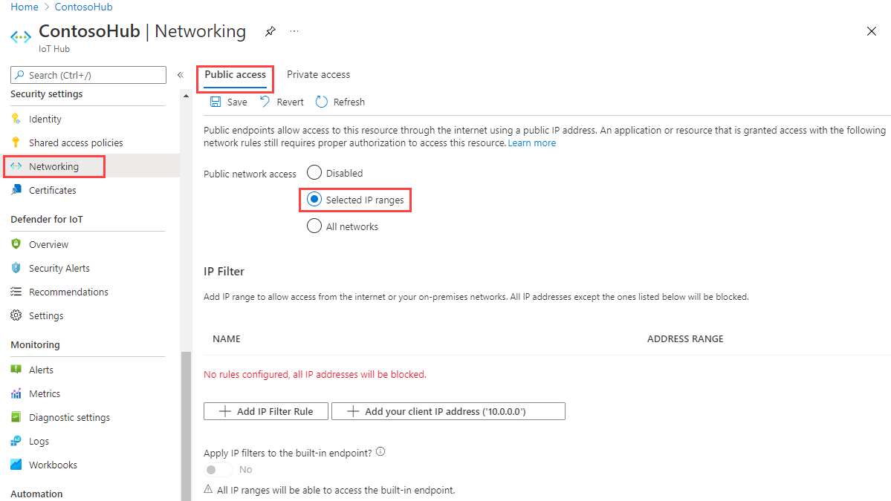
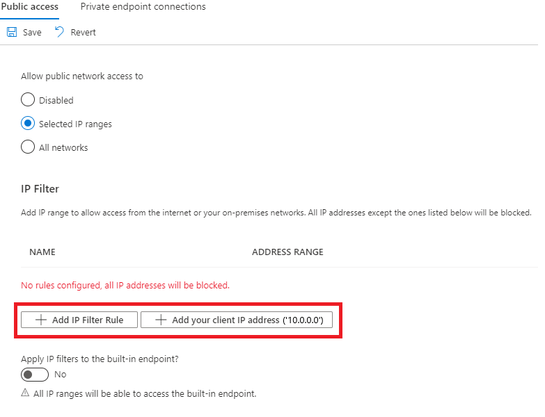
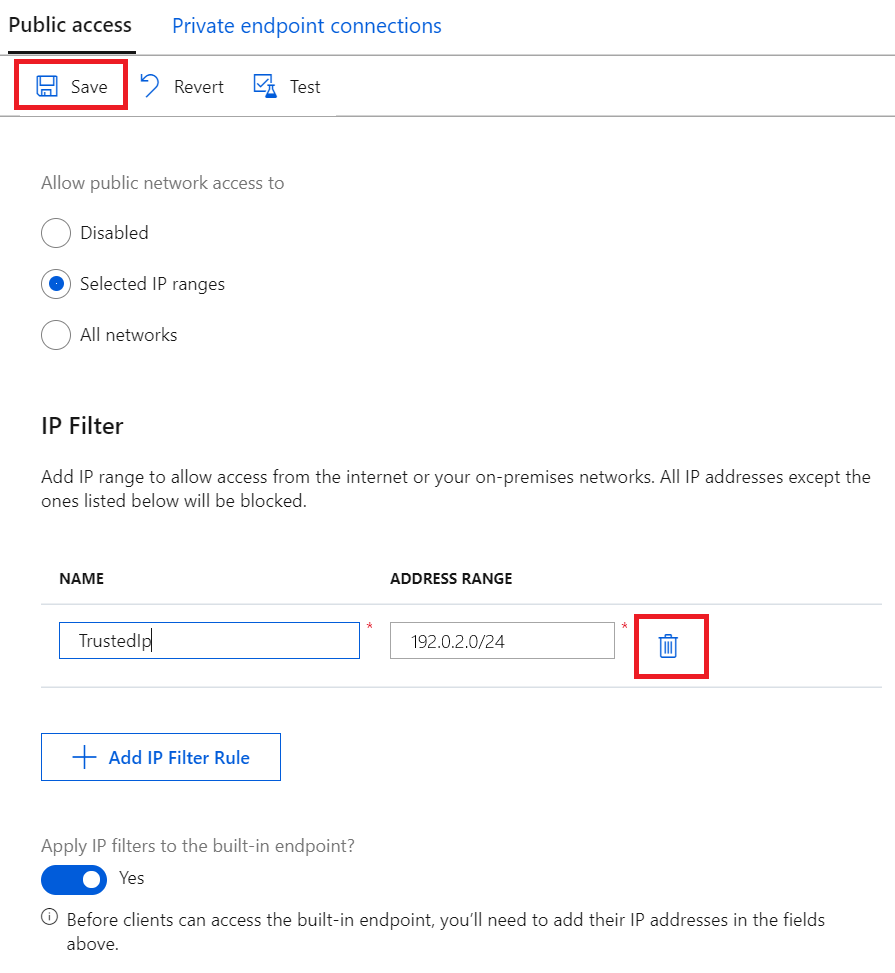

# Use IP filters

Security is an important aspect of any IoT solution based on Azure IoT Hub. Sometimes you need to explicitly specify the IP addresses from which devices can connect as part of your security configuration. The *IP filter* feature enables you to configure rules for rejecting or accepting traffic from specific IPv4 addresses.

## When to use

There are two specific use-cases when it is useful to block the IoT Hub endpoints for certain IP addresses:

* Your IoT hub should receive traffic only from a specified range of IP addresses and reject everything else. For example, you are using your IoT hub with [Azure Express Route](https://azure.microsoft.com/documentation/articles/expressroute-faqs/#supported-services) to create private connections between an IoT hub and your on-premises infrastructure.

* You need to reject traffic from IP addresses that have been identified as suspicious by the IoT hub administrator.

## How filter rules are applied

The IP filter rules are applied at the IoT Hub service level. Therefore the IP filter rules apply to all connections from devices and back-end apps using any supported protocol.

Any connection attempt from an IP address that matches a rejecting IP rule in your IoT hub receives an unauthorized 401 status code and description. The response message does not mention the IP rule.

## Default setting

By default, the **IP Filter** grid in the portal for an IoT hub is empty. This default setting means that your hub accepts connections from any IP address. This default setting is equivalent to a rule that accepts the 0.0.0.0/0 IP address range.



## Add or edit an IP filter rule

When you add an IP filter rule, you are prompted for the following values:

* An **IP filter rule name** that must be a unique, case-insensitive, alphanumeric string up to 128 characters long. Only the ASCII 7-bit alphanumeric characters plus `{'-', ':', '/', '\', '.', '+', '%', '_', '#', '*', '?', '!', '(', ')', ',', '=', '@', ';', '''}` are accepted.

* Select a **reject** or **accept** as the **action** for the IP filter rule.

* Provide a single IPv4 address or a block of IP addresses in CIDR notation. For example, in CIDR notation 192.168.100.0/22 represents the 1024 IPv4 addresses from 192.168.100.0 to 192.168.103.255.



After you save the rule, you see an alert notifying you that the update is in progress.


The **Add** option is disabled when you reach the maximum of 10 IP filter rules.

You can edit an existing rule by double-clicking the row that contains the rule.

> [!NOTE]
> Rejecting IP addresses can prevent other Azure Services (such as Azure Stream Analytics, Azure Virtual Machines, or the Device Explorer in the portal) from interacting with the IoT hub.

> [!WARNING]
> If you use Azure Stream Analytics (ASA) to read messages from an IoT hub with IP filtering enabled, use the Event Hub-compatible name and endpoint of your IoT Hub in the ASA connection string.

## Delete an IP filter rule

To delete an IP filter rule, select one or more rules in the grid and click **Delete**.



## Retrieve and update IP filters using Azure CLI

Your IoT Hub's IP filters can be retrieved and updated through [Azure  CLI](https://docs.microsoft.com/cli/azure/?view=azure-cli-latest). 

To retrieve current IP filters of your IoT Hub, run:

```azurecli-interactive
az resource show -n <iothubName> -g <resourceGroupName> --resource-type Microsoft.Devices/IotHubs
```

This will return a JSON object where your existing IP filters are listed under the `properties.ipFilterRules` key:

```json
{
...
    "properties": {
        "ipFilterRules": [
        {
            "action": "Reject",
            "filterName": "MaliciousIP",
            "ipMask": "6.6.6.6/6"
        },
        {
            "action": "Allow",
            "filterName": "GoodIP",
            "ipMask": "131.107.160.200"
        },
        ...
        ],
    },
...
}
```

To add a new IP filter for your IoT Hub, run:

```azurecli-interactive
az resource update -n <iothubName> -g <resourceGroupName> --resource-type Microsoft.Devices/IotHubs --add properties.ipFilterRules "{\"action\":\"Reject\",\"filterName\":\"MaliciousIP\",\"ipMask\":\"6.6.6.6/6\"}"
```

To remove an existing IP filter in your IoT Hub, run:

```azurecli-interactive
az resource update -n <iothubName> -g <resourceGroupName> --resource-type Microsoft.Devices/IotHubs --add properties.ipFilterRules <ipFilterIndexToRemove>
```

Note that `<ipFilterIndexToRemove>` must correspond to the ordering of IP filters in your IoT Hub's `properties.ipFilterRules`.


## Retrieve and update IP filters using Azure PowerShell

[!INCLUDE [updated-for-az](../../includes/updated-for-az.md)]

Your IoT Hub's IP filters can be retrieved and set through [Azure PowerShell](/powershell/azure/overview). 

```powershell
# Get your IoT Hub resource using its name and its resource group name
$iothubResource = Get-AzResource -ResourceGroupName <resourceGroupNmae> -ResourceName <iotHubName> -ExpandProperties

# Access existing IP filter rules
$iothubResource.Properties.ipFilterRules |% { Write-host $_ }

# Construct a new IP filter
$filter = @{'filterName'='MaliciousIP'; 'action'='Reject'; 'ipMask'='6.6.6.6/6'}

# Add your new IP filter rule
$iothubResource.Properties.ipFilterRules += $filter

# Remove an existing IP filter rule using its name, e.g., 'GoodIP'
$iothubResource.Properties.ipFilterRules = @($iothubResource.Properties.ipFilterRules | Where 'filterName' -ne 'GoodIP')

# Update your IoT Hub resource with your updated IP filters
$iothubResource | Set-AzResource -Force
```

## Update IP filter rules using REST

You may also retrieve and modify your IoT Hub's IP filter using Azure resource Provider's REST endpoint. See `properties.ipFilterRules` in [createorupdate method](https://docs.microsoft.com/rest/api/iothub/iothubresource/createorupdate).


## IP filter rule evaluation

IP filter rules are applied in order and the first rule that matches the IP address determines the accept or reject action.

For example, if you want to accept addresses in the range 192.168.100.0/22 and reject everything else, the first rule in the grid should accept the address range 192.168.100.0/22. The next rule should reject all addresses by using the range 0.0.0.0/0.

You can change the order of your IP filter rules in the grid by clicking the three vertical dots at the start of a row and using drag and drop.

To save your new IP filter rule order, click **Save**.


## Next steps

To further explore the capabilities of IoT Hub, see:

* [Operations monitoring](iot-hub-operations-monitoring.md)
* [IoT Hub metrics](iot-hub-metrics.md)
