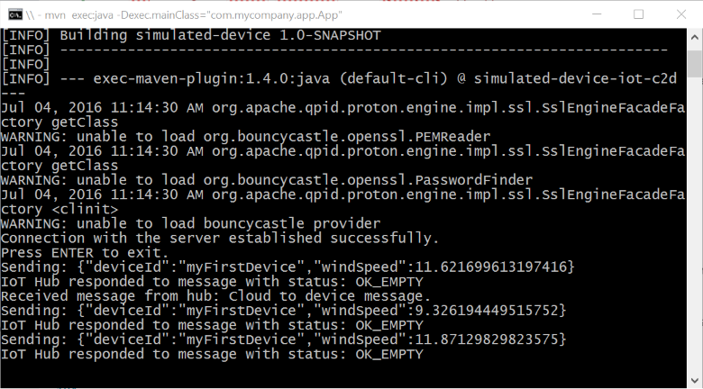
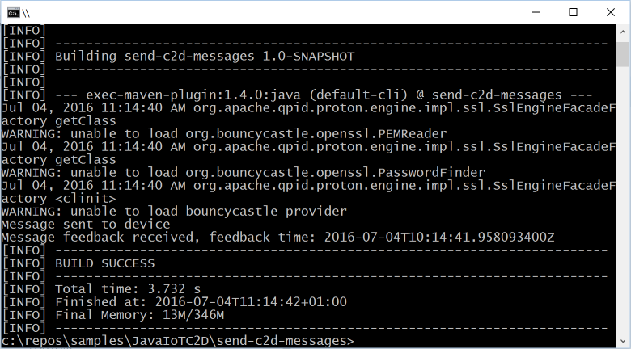

# Send cloud-to-device messages with IoT Hub (Java)

[!INCLUDE [iot-hub-selector-c2d](../../includes/iot-hub-selector-c2d.md)]

Azure IoT Hub is a fully managed service that helps enable reliable and secure bi-directional communications between millions of devices and a solution back end. The [Send telemetry from a device to an IoT hub](quickstart-send-telemetry-java.md) quickstart shows how to create an IoT hub, provision a device identity in it, and code a simulated device app that sends device-to-cloud messages.

[!INCLUDE [iot-hub-basic](../../includes/iot-hub-basic-whole.md)]

This tutorial builds on [Send telemetry from a device to an IoT hub](quickstart-send-telemetry-java.md). It shows you how to do the following:

* From your solution back end, send cloud-to-device messages to a single device through IoT Hub.

* Receive cloud-to-device messages on a device.

* From your solution back end, request delivery acknowledgment (*feedback*) for messages sent to a device from IoT Hub.

You can find more information on [cloud-to-device messages in the IoT Hub developer guide](iot-hub-devguide-messaging.md).

At the end of this tutorial, you run two Java console apps:

* **simulated-device**, a modified version of the app created in [Send telemetry from a device to an IoT hub](quickstart-send-telemetry-java.md), which connects to your IoT hub and receives cloud-to-device messages.

* **send-c2d-messages**, which sends a cloud-to-device message to the simulated device app through IoT Hub, and then receives its delivery acknowledgment.

> [!NOTE]
> IoT Hub has SDK support for many device platforms and languages (including C, Java, Python, and Javascript) through Azure IoT device SDKs. For step-by-step instructions on how to connect your device to this tutorial's code, and generally to Azure IoT Hub, see the [Azure IoT Developer Center](https://azure.microsoft.com/develop/iot).

## Prerequisites

* A complete working version of the [Send telemetry from a device to an IoT hub](quickstart-send-telemetry-java.md) quickstart or the [Configure message routing with IoT Hub](tutorial-routing.md) tutorial.

* [Java SE Development Kit 8](https://docs.microsoft.com/java/azure/jdk/?view=azure-java-stable). Make sure you select **Java 8** under **Long-term support** to get to downloads for JDK 8.

* [Maven 3](https://maven.apache.org/download.cgi)

* An active Azure account. If you don't have an account, you can create a [free account](https://azure.microsoft.com/pricing/free-trial/) in just a couple of minutes.

* Make sure that port 8883 is open in your firewall. The device sample in this article uses MQTT protocol, which communicates over port 8883. This port may be blocked in some corporate and educational network environments. For more information and ways to work around this issue, see [Connecting to IoT Hub (MQTT)](iot-hub-mqtt-support.md#connecting-to-iot-hub).

## Receive messages in the simulated device app

In this section, you modify the simulated device app you created in [Send telemetry from a device to an IoT hub](quickstart-send-telemetry-java.md) to receive cloud-to-device messages from the IoT hub.

1. Using a text editor, open the simulated-device\src\main\java\com\mycompany\app\App.java file.

2. Add the following **MessageCallback** class as a nested class inside the **App** class. The **execute** method is invoked when the device receives a message from IoT Hub. In this example, the device always notifies the IoT hub that it has completed the message:

    ```java
    private static class AppMessageCallback implements MessageCallback {
      public IotHubMessageResult execute(Message msg, Object context) {
        System.out.println("Received message from hub: "
          + new String(msg.getBytes(), Message.DEFAULT_IOTHUB_MESSAGE_CHARSET));

        return IotHubMessageResult.COMPLETE;
      }
    }
    ```

3. Modify the **main** method to create an **AppMessageCallback** instance and call the **setMessageCallback** method before it opens the client as follows:

    ```java
    client = new DeviceClient(connString, protocol);

    MessageCallback callback = new AppMessageCallback();
    client.setMessageCallback(callback, null);
    client.open();
    ```

    > [!NOTE]
    > If you use HTTPS instead of MQTT or AMQP as the transport, the **DeviceClient** instance checks for messages from IoT Hub infrequently (less than every 25 minutes). For more information about the differences between MQTT, AMQP and HTTPS support, and IoT Hub throttling, see the [messaging section of the IoT Hub developer guide](iot-hub-devguide-messaging.md).

4. To build the **simulated-device** app using Maven, execute the following command at the command prompt in the simulated-device folder:

    ```cmd/sh
    mvn clean package -DskipTests
    ```

## Get the IoT hub connection string

In this article you create a backend service to send cloud-to-device messages through the IoT hub you created in [Send telemetry from a device to an IoT hub](quickstart-send-telemetry-java.md). To send cloud-to-device messages, your service needs the **service connect** permission. By default, every IoT Hub is created with a shared access policy named **service** that grants this permission.

[!INCLUDE [iot-hub-include-find-service-connection-string](../../includes/iot-hub-include-find-service-connection-string.md)]

## Send a cloud-to-device message

In this section, you create a Java console app that sends cloud-to-device messages to the simulated device app. You need the device ID of the device you added in the [Send telemetry from a device to an IoT hub](quickstart-send-telemetry-java.md) quickstart. You also need the the IoT hub connection string you copied previously in [Get the IoT hub connection string](#get-the-iot-hub-connection-string).

1. Create a Maven project called **send-c2d-messages** using the following command at your command prompt. Note this command is a single, long command:

    ```cmd/sh
    mvn archetype:generate -DgroupId=com.mycompany.app -DartifactId=send-c2d-messages -DarchetypeArtifactId=maven-archetype-quickstart -DinteractiveMode=false
    ```

2. At your command prompt, navigate to the new send-c2d-messages folder.

3. Using a text editor, open the pom.xml file in the send-c2d-messages folder and add the following dependency to the **dependencies** node. Adding the dependency enables you to use the **iothub-java-service-client** package in your application to communicate with your IoT hub service:

    ```xml
    <dependency>
      <groupId>com.microsoft.azure.sdk.iot</groupId>
      <artifactId>iot-service-client</artifactId>
      <version>1.7.23</version>
    </dependency>
    ```

    > [!NOTE]
    > You can check for the latest version of **iot-service-client** using [Maven search](https://search.maven.org/#search%7Cga%7C1%7Ca%3A%22iot-service-client%22%20g%3A%22com.microsoft.azure.sdk.iot%22).

4. Save and close the pom.xml file.

5. Using a text editor, open the send-c2d-messages\src\main\java\com\mycompany\app\App.java file.

6. Add the following **import** statements to the file:

    ```java
    import com.microsoft.azure.sdk.iot.service.*;
    import java.io.IOException;
    import java.net.URISyntaxException;
    ```

7. Add the following class-level variables to the **App** class, replacing **{yourhubconnectionstring}** and **{yourdeviceid}** with the values you noted earlier:

    ```java
    private static final String connectionString = "{yourhubconnectionstring}";
    private static final String deviceId = "{yourdeviceid}";
    private static final IotHubServiceClientProtocol protocol =    
        IotHubServiceClientProtocol.AMQPS;
    ```

8. Replace the **main** method with the following code. This code connects to your IoT hub, sends a message to your device, and then waits for an acknowledgment that the device received and processed the message:

    ```java
    public static void main(String[] args) throws IOException,
        URISyntaxException, Exception {
      ServiceClient serviceClient = ServiceClient.createFromConnectionString(
        connectionString, protocol);

      if (serviceClient != null) {
        serviceClient.open();
        FeedbackReceiver feedbackReceiver = serviceClient
          .getFeedbackReceiver();
        if (feedbackReceiver != null) feedbackReceiver.open();

        Message messageToSend = new Message("Cloud to device message.");
        messageToSend.setDeliveryAcknowledgement(DeliveryAcknowledgement.Full);

        serviceClient.send(deviceId, messageToSend);
        System.out.println("Message sent to device");

        FeedbackBatch feedbackBatch = feedbackReceiver.receive(10000);
        if (feedbackBatch != null) {
          System.out.println("Message feedback received, feedback time: "
            + feedbackBatch.getEnqueuedTimeUtc().toString());
        }

        if (feedbackReceiver != null) feedbackReceiver.close();
        serviceClient.close();
      }
    }
    ```

    > [!NOTE]
    > For simplicity, this tutorial does not implement any retry policy. In production code, you should implement retry policies (such as exponential backoff), as suggested in the article, [Transient Fault Handling](/azure/architecture/best-practices/transient-faults).

9. To build the **simulated-device** app using Maven, execute the following command at the command prompt in the simulated-device folder:

    ```cmd/sh
    mvn clean package -DskipTests
    ```

## Run the applications

You are now ready to run the applications.

1. At a command prompt in the simulated-device folder, run the following command to begin sending telemetry to your IoT hub and to listen for cloud-to-device messages sent from your hub:

    ```cmd/sh
    mvn exec:java -Dexec.mainClass="com.mycompany.app.App"
    ```

    

2. At a command prompt in the send-c2d-messages folder, run the following command to send a cloud-to-device message and wait for a feedback acknowledgment:

    ```cmd/sh
    mvn exec:java -Dexec.mainClass="com.mycompany.app.App"
    ```

    

## Next steps

In this tutorial, you learned how to send and receive cloud-to-device messages.

To see examples of complete end-to-end solutions that use IoT Hub, see [Azure IoT Solution Accelerators](https://azure.microsoft.com/documentation/suites/iot-suite/).

To learn more about developing solutions with IoT Hub, see the [IoT Hub developer guide](iot-hub-devguide.md).
