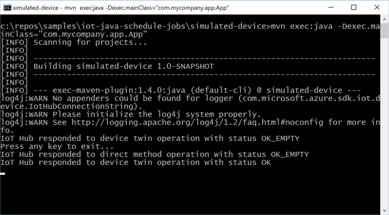
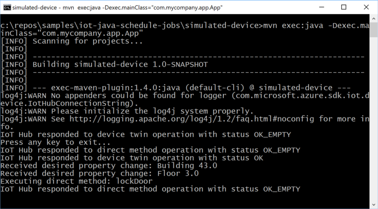

# Schedule and broadcast jobs (Java)

[!INCLUDE [iot-hub-selector-schedule-jobs](../../includes/iot-hub-selector-schedule-jobs.md)]

Use Azure IoT Hub to schedule and track jobs that update millions of devices. Use jobs to:

* Update desired properties
* Update tags
* Invoke direct methods

A job wraps one of these actions and tracks the execution against a set of devices. A device twin query defines the set of devices the job executes against. For example, a back-end app can use a job to invoke a direct method on 10,000 devices that reboots the devices. You specify the set of devices with a device twin query and schedule the job to run at a future time. The job tracks progress as each of the devices receive and execute the reboot direct method.

To learn more about each of these capabilities, see:

* Device twin and properties: [Get started with device twins](iot-hub-java-java-twin-getstarted.md)

* Direct methods: [IoT Hub developer guide - direct methods](iot-hub-devguide-direct-methods.md) and [Tutorial: Use direct methods](quickstart-control-device-java.md)

[!INCLUDE [iot-hub-basic](../../includes/iot-hub-basic-whole.md)]

This tutorial shows you how to:

* Create a device app that implements a direct method called **lockDoor**. The device app also receives desired property changes from the back-end app.

* Create a back-end app that creates a job to call the **lockDoor** direct method on multiple devices. Another job sends desired property updates to multiple devices.

At the end of this tutorial, you have a java console device app and a java console back-end app:

**simulated-device** that connects to your IoT hub, implements the **lockDoor** direct method, and handles desired property changes.

**schedule-jobs** that use jobs to call the **lockDoor** direct method and update the device twin desired properties on multiple devices.

> [!NOTE]
> The article [Azure IoT SDKs](iot-hub-devguide-sdks.md) provides information about the Azure IoT SDKs that you can use to build both device and back-end apps.

## Prerequisites

To complete this tutorial, you need:

* The latest [Java SE Development Kit 8](https://aka.ms/azure-jdks)

* [Maven 3](https://maven.apache.org/install.html)

* An active Azure account. (If you don't have an account, you can create a [free account](https://azure.microsoft.com/pricing/free-trial/) in just a couple of minutes.)

## Create an IoT hub

[!INCLUDE [iot-hub-include-create-hub](../../includes/iot-hub-include-create-hub.md)]

### Retrieve connection string for IoT hub

[!INCLUDE [iot-hub-include-find-connection-string](../../includes/iot-hub-include-find-connection-string.md)]

## Register a new device in the IoT hub

[!INCLUDE [iot-hub-include-create-device](../../includes/iot-hub-include-create-device.md)]

You can also use the [IoT extension for Azure CLI](https://github.com/Azure/azure-iot-cli-extension) tool to add a device to your IoT hub.

## Create the service app

In this section, you create a Java console app that uses jobs to:

* Call the **lockDoor** direct method on multiple devices.

* Send desired properties to multiple devices.

To create the app:

1. On your development machine, create an empty folder called `iot-java-schedule-jobs`.

2. In the `iot-java-schedule-jobs` folder, create a Maven project called **schedule-jobs** using the following command at your command prompt. Note this is a single, long command:

    `mvn archetype:generate -DgroupId=com.mycompany.app -DartifactId=schedule-jobs -DarchetypeArtifactId=maven-archetype-quickstart -DinteractiveMode=false`

3. At your command prompt, navigate to the `schedule-jobs` folder.

4. Using a text editor, open the `pom.xml` file in the `schedule-jobs` folder and add the following dependency to the **dependencies** node. This dependency enables you to use the **iot-service-client** package in your app to communicate with your IoT hub:

    ```xml
    <dependency>
      <groupId>com.microsoft.azure.sdk.iot</groupId>
      <artifactId>iot-service-client</artifactId>
      <version>1.7.23</version>
      <type>jar</type>
    </dependency>
    ```

    > [!NOTE]
    > You can check for the latest version of **iot-service-client** using [Maven search](https://search.maven.org/#search%7Cga%7C1%7Ca%3A%22iot-service-client%22%20g%3A%22com.microsoft.azure.sdk.iot%22).

5. Add the following **build** node after the **dependencies** node. This configuration instructs Maven to use Java 1.8 to build the app:

    ```xml
    <build>
      <plugins>
        <plugin>
          <groupId>org.apache.maven.plugins</groupId>
          <artifactId>maven-compiler-plugin</artifactId>
          <version>3.3</version>
          <configuration>
            <source>1.8</source>
            <target>1.8</target>
          </configuration>
        </plugin>
      </plugins>
    </build>
    ```

6. Save and close the `pom.xml` file.

7. Using a text editor, open the `schedule-jobs\src\main\java\com\mycompany\app\App.java` file.

8. Add the following **import** statements to the file:

    ```java
    import com.microsoft.azure.sdk.iot.service.devicetwin.DeviceTwinDevice;
    import com.microsoft.azure.sdk.iot.service.devicetwin.Pair;
    import com.microsoft.azure.sdk.iot.service.devicetwin.Query;
    import com.microsoft.azure.sdk.iot.service.devicetwin.SqlQuery;
    import com.microsoft.azure.sdk.iot.service.jobs.JobClient;
    import com.microsoft.azure.sdk.iot.service.jobs.JobResult;
    import com.microsoft.azure.sdk.iot.service.jobs.JobStatus;

    import java.util.Date;
    import java.time.Instant;
    import java.util.HashSet;
    import java.util.Set;
    import java.util.UUID;
    ```

9. Add the following class-level variables to the **App** class. Replace `{youriothubconnectionstring}` with your IoT hub connection string you noted in the *Create an IoT Hub* section:

    ```java
    public static final String iotHubConnectionString = "{youriothubconnectionstring}";
    public static final String deviceId = "myDeviceId";

    // How long the job is permitted to run without
    // completing its work on the set of devices
    private static final long maxExecutionTimeInSeconds = 30;
    ```

10. Add the following method to the **App** class to schedule a job to update the **Building** and **Floor** desired properties in the device twin:

    ```java
    private static JobResult scheduleJobSetDesiredProperties(JobClient jobClient, String jobId) {
      DeviceTwinDevice twin = new DeviceTwinDevice(deviceId);
      Set<Pair> desiredProperties = new HashSet<Pair>();
      desiredProperties.add(new Pair("Building", 43));
      desiredProperties.add(new Pair("Floor", 3));
      twin.setDesiredProperties(desiredProperties);
      // Optimistic concurrency control
      twin.setETag("*");

      // Schedule the update twin job to run now
      // against a single device
      System.out.println("Schedule job " + jobId + " for device " + deviceId);
      try {
        JobResult jobResult = jobClient.scheduleUpdateTwin(jobId, 
          "deviceId='" + deviceId + "'",
          twin,
          new Date(),
          maxExecutionTimeInSeconds);
        return jobResult;
      } catch (Exception e) {
        System.out.println("Exception scheduling desired properties job: " + jobId);
        System.out.println(e.getMessage());
        return null;
      }
    }
    ```

11. To schedule a job to call the **lockDoor** method, add the following method to the **App** class:

    ```java
    private static JobResult scheduleJobCallDirectMethod(JobClient jobClient, String jobId) {
      // Schedule a job now to call the lockDoor direct method
      // against a single device. Response and connection
      // timeouts are set to 5 seconds.
      System.out.println("Schedule job " + jobId + " for device " + deviceId);
      try {
        JobResult jobResult = jobClient.scheduleDeviceMethod(jobId,
          "deviceId='" + deviceId + "'",
          "lockDoor",
          5L, 5L, null,
          new Date(),
          maxExecutionTimeInSeconds);
        return jobResult;
      } catch (Exception e) {
        System.out.println("Exception scheduling direct method job: " + jobId);
        System.out.println(e.getMessage());
        return null;
      }
    };
    ```

12. To monitor a job, add the following method to the **App** class:

    ```java
    private static void monitorJob(JobClient jobClient, String jobId) {
      try {
        JobResult jobResult = jobClient.getJob(jobId);
        if(jobResult == null)
        {
          System.out.println("No JobResult for: " + jobId);
          return;
        }
        // Check the job result until it's completed
        while(jobResult.getJobStatus() != JobStatus.completed)
        {
          Thread.sleep(100);
          jobResult = jobClient.getJob(jobId);
          System.out.println("Status " + jobResult.getJobStatus() + " for job " + jobId);
        }
        System.out.println("Final status " + jobResult.getJobStatus() + " for job " + jobId);
      } catch (Exception e) {
        System.out.println("Exception monitoring job: " + jobId);
        System.out.println(e.getMessage());
        return;
      }
    }
    ```

13. To query for the details of the jobs you ran, add the following method:

    ```java
    private static void queryDeviceJobs(JobClient jobClient, String start) throws Exception {
      System.out.println("\nQuery device jobs since " + start);

      // Create a jobs query using the time the jobs started
      Query deviceJobQuery = jobClient
          .queryDeviceJob(SqlQuery.createSqlQuery("*", SqlQuery.FromType.JOBS, "devices.jobs.startTimeUtc > '" + start + "'", null).getQuery());

      // Iterate over the list of jobs and print the details
      while (jobClient.hasNextJob(deviceJobQuery)) {
        System.out.println(jobClient.getNextJob(deviceJobQuery));
      }
    }
    ```

14. Update the **main** method signature to include the following `throws` clause:

    ```java
    public static void main( String[] args ) throws Exception
    ```

15. To run and monitor two jobs sequentially, add the following code to the **main** method:

    ```java
    // Record the start time
    String start = Instant.now().toString();

    // Create JobClient
    JobClient jobClient = JobClient.createFromConnectionString(iotHubConnectionString);
    System.out.println("JobClient created with success");

    // Schedule twin job desired properties
    // Maximum concurrent jobs is 1 for Free and S1 tiers
    String desiredPropertiesJobId = "DPCMD" + UUID.randomUUID();
    scheduleJobSetDesiredProperties(jobClient, desiredPropertiesJobId);
    monitorJob(jobClient, desiredPropertiesJobId);

    // Schedule twin job direct method
    String directMethodJobId = "DMCMD" + UUID.randomUUID();
    scheduleJobCallDirectMethod(jobClient, directMethodJobId);
    monitorJob(jobClient, directMethodJobId);

    // Run a query to show the job detail
    queryDeviceJobs(jobClient, start);

    System.out.println("Shutting down schedule-jobs app");
    ```

16. Save and close the `schedule-jobs\src\main\java\com\mycompany\app\App.java` file

17. Build the **schedule-jobs** app and correct any errors. At your command prompt, navigate to the `schedule-jobs` folder and run the following command:

    `mvn clean package -DskipTests`

## Create a device app

In this section, you create a Java console app that handles the desired properties sent from IoT Hub and implements the direct method call.

1. In the `iot-java-schedule-jobs` folder, create a Maven project called **simulated-device** using the following command at your command prompt. Note this is a single, long command:

    `mvn archetype:generate -DgroupId=com.mycompany.app -DartifactId=simulated-device -DarchetypeArtifactId=maven-archetype-quickstart -DinteractiveMode=false`

2. At your command prompt, navigate to the `simulated-device` folder.

3. Using a text editor, open the `pom.xml` file in the `simulated-device` folder and add the following dependencies to the **dependencies** node. This dependency enables you to use the **iot-device-client** package in your app to communicate with your IoT hub:

    ```xml
    <dependency>
      <groupId>com.microsoft.azure.sdk.iot</groupId>
      <artifactId>iot-device-client</artifactId>
      <version>1.3.32</version>
    </dependency>
    ```

    > [!NOTE]
    > You can check for the latest version of **iot-device-client** using [Maven search](https://search.maven.org/#search%7Cga%7C1%7Ca%3A%22iot-device-client%22%20g%3A%22com.microsoft.azure.sdk.iot%22).

4. Add the following **build** node after the **dependencies** node. This configuration instructs Maven to use Java 1.8 to build the app:

    ```xml
    <build>
      <plugins>
        <plugin>
          <groupId>org.apache.maven.plugins</groupId>
          <artifactId>maven-compiler-plugin</artifactId>
          <version>3.3</version>
          <configuration>
            <source>1.8</source>
            <target>1.8</target>
          </configuration>
        </plugin>
      </plugins>
    </build>
    ```

5. Save and close the `pom.xml` file.

6. Using a text editor, open the `simulated-device\src\main\java\com\mycompany\app\App.java` file.

7. Add the following **import** statements to the file:

    ```java
    import com.microsoft.azure.sdk.iot.device.*;
    import com.microsoft.azure.sdk.iot.device.DeviceTwin.*;

    import java.io.IOException;
    import java.net.URISyntaxException;
    import java.util.Scanner;
    ```

8. Add the following class-level variables to the **App** class. Replacing `{youriothubname}` with your IoT hub name, and `{yourdevicekey}` with the device key value you generated in the *Create a device identity* section:

    ```java
    private static String connString = "HostName={youriothubname}.azure-devices.net;DeviceId=myDeviceID;SharedAccessKey={yourdevicekey}";
    private static IotHubClientProtocol protocol = IotHubClientProtocol.MQTT;
    private static final int METHOD_SUCCESS = 200;
    private static final int METHOD_NOT_DEFINED = 404;
    ```

    This sample app uses the **protocol** variable when it instantiates a **DeviceClient** object.

9. To print device twin notifications to the console, add the following nested class to the **App** class:

    ```java
    // Handler for device twin operation notifications from IoT Hub
    protected static class DeviceTwinStatusCallBack implements IotHubEventCallback {
      public void execute(IotHubStatusCode status, Object context) {
        System.out.println("IoT Hub responded to device twin operation with status " + status.name());
      }
    }
    ```

10. To print direct method notifications to the console, add the following nested class to the **App** class:

    ```java
    // Handler for direct method notifications from IoT Hub
    protected static class DirectMethodStatusCallback implements IotHubEventCallback {
      public void execute(IotHubStatusCode status, Object context) {
        System.out.println("IoT Hub responded to direct method operation with status " + status.name());
      }
    }
    ```

11. To handle direct method calls from IoT Hub, add the following nested class to the **App** class:

    ```java
    // Handler for direct method calls from IoT Hub
    protected static class DirectMethodCallback
        implements DeviceMethodCallback {
      @Override
      public DeviceMethodData call(String methodName, Object methodData, Object context) {
        DeviceMethodData deviceMethodData;
        switch (methodName) {
          case "lockDoor": {
            System.out.println("Executing direct method: " + methodName);
            deviceMethodData = new DeviceMethodData(METHOD_SUCCESS, "Executed direct method " + methodName);
            break;
          }
          default: {
            deviceMethodData = new DeviceMethodData(METHOD_NOT_DEFINED, "Not defined direct method " + methodName);
          }
        }
        // Notify IoT Hub of result
        return deviceMethodData;
      }
    }
    ```

12. Update the **main** method signature to include the following `throws` clause:

    ```java
    public static void main( String[] args ) throws IOException, URISyntaxException
    ```

13. Add the following code to the **main** method to:
    * Create a device client to communicate with IoT Hub.
    * Create a **Device** object to store the device twin properties.

    ```java
    // Create a device client
    DeviceClient client = new DeviceClient(connString, protocol);

    // An object to manage device twin desired and reported properties
    Device dataCollector = new Device() {
      @Override
      public void PropertyCall(String propertyKey, Object propertyValue, Object context)
      {
        System.out.println("Received desired property change: " + propertyKey + " " + propertyValue);
      }
    };
    ```

14. To start the device client services, add the following code to the **main** method:

    ```java
    try {
      // Open the DeviceClient
      // Start the device twin services
      // Subscribe to direct method calls
      client.open();
      client.startDeviceTwin(new DeviceTwinStatusCallBack(), null, dataCollector, null);
      client.subscribeToDeviceMethod(new DirectMethodCallback(), null, new DirectMethodStatusCallback(), null);
    } catch (Exception e) {
      System.out.println("Exception, shutting down \n" + " Cause: " + e.getCause() + " \n" + e.getMessage());
      dataCollector.clean();
      client.closeNow();
      System.out.println("Shutting down...");
    }
    ```

15. To wait for the user to press the **Enter** key before shutting down, add the following code to the end of the **main** method:

    ```java
    // Close the app
    System.out.println("Press any key to exit...");
    Scanner scanner = new Scanner(System.in);
    scanner.nextLine();
    dataCollector.clean();
    client.closeNow();
    scanner.close();
    ```

16. Save and close the `simulated-device\src\main\java\com\mycompany\app\App.java` file.

17. Build the **simulated-device** app and correct any errors. At your command prompt, navigate to the `simulated-device` folder and run the following command:

    `mvn clean package -DskipTests`

## Run the apps

You are now ready to run the console apps.

1. At a command prompt in the `simulated-device` folder, run the following command to start the device app listening for desired property changes and direct method calls:

    `mvn exec:java -Dexec.mainClass="com.mycompany.app.App"`

    

2. At a command prompt in the `schedule-jobs` folder, run the following command to run the **schedule-jobs** service app to run two jobs. The first sets the desired property values, the second calls the direct method:

    `mvn exec:java -Dexec.mainClass="com.mycompany.app.App"`

    

3. The device app handles the desired property change and the direct method call:

    

## Next steps

In this tutorial, you configured a new IoT hub in the Azure portal, and then created a device identity in the IoT hub's identity registry. You created a back-end app to run two jobs. The first job set desired property values, and the second job called a direct method.

Use the following resources to learn how to:

* Send telemetry from devices with the [Get started with IoT Hub](quickstart-send-telemetry-java.md) tutorial.

* Control devices interactively (such as turning on a fan from a user-controlled app) with the [Use direct methods](quickstart-control-device-java.md) tutorial.s