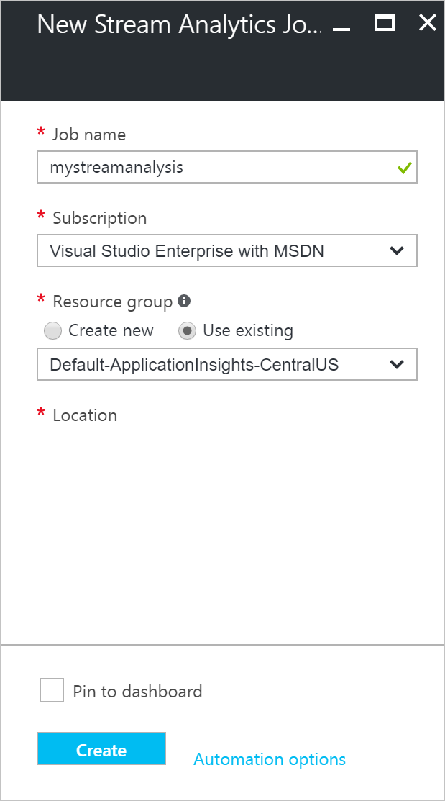
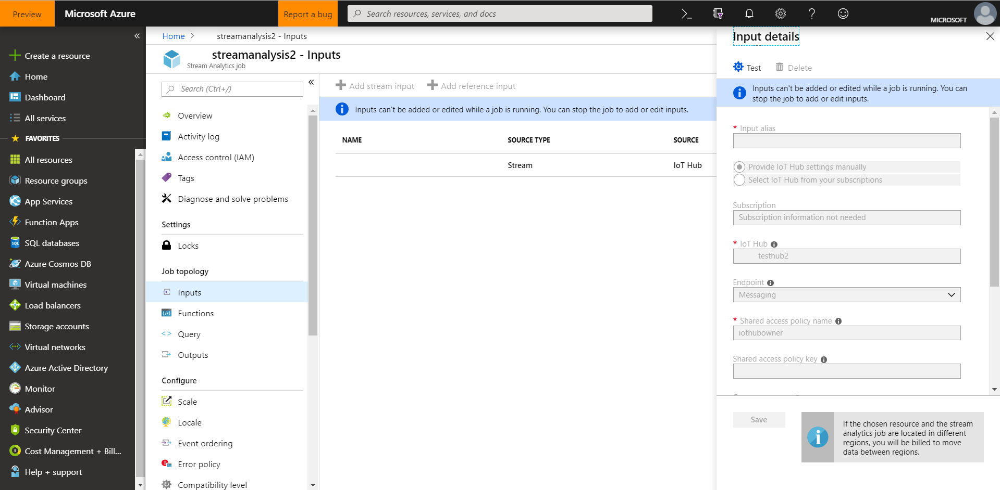
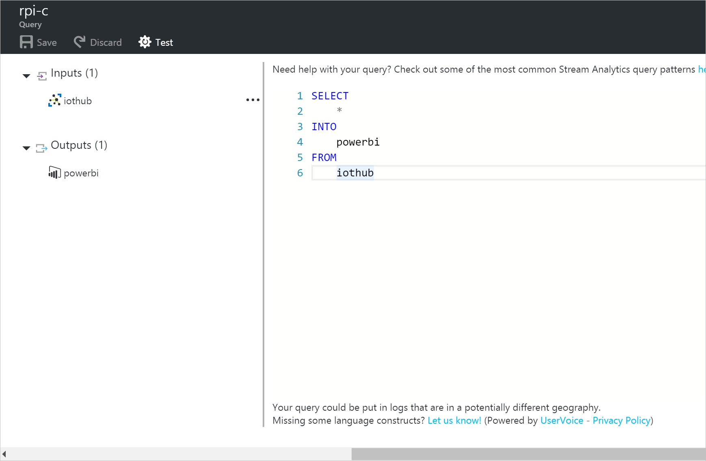
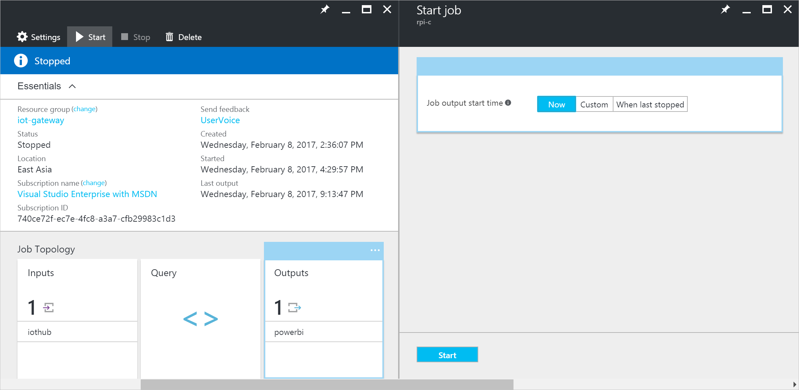
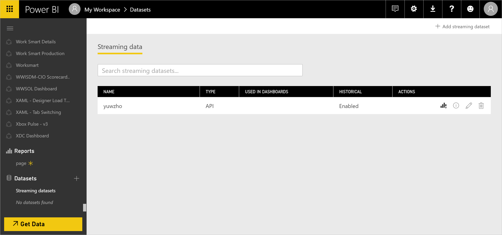
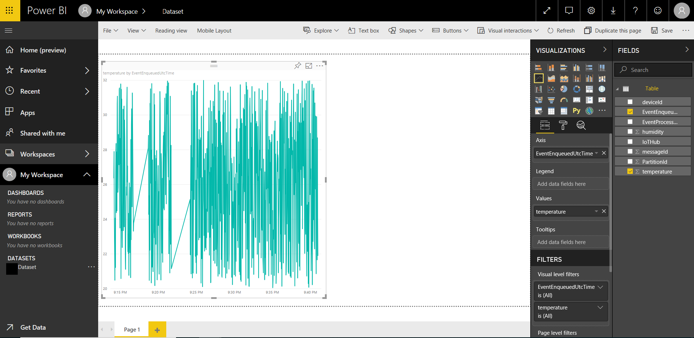
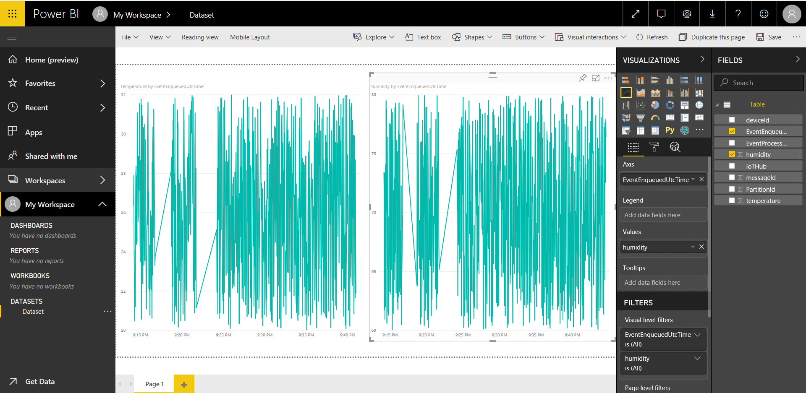
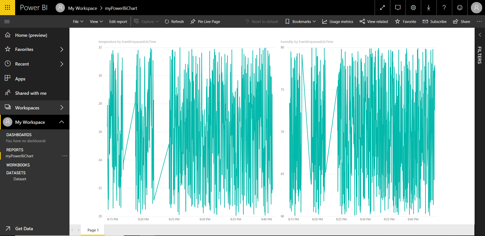

# Visualize real-time sensor data from Azure IoT Hub using Power BI

[!INCLUDE [iot-hub-get-started-note](../../includes/iot-hub-get-started-note.md)]

## What you learn

You learn how to visualize real-time sensor data that your Azure IoT hub receives by Power BI. If you want to try visualize the data in your IoT hub with Web Apps, please see [Use Azure Web Apps to visualize real-time sensor data from Azure IoT Hub](iot-hub-live-data-visualization-in-web-apps.md).

## What you do

- Get your IoT hub ready for data access by adding a consumer group.
- Create, configure and run a Stream Analytics job for data transfer from your IoT hub to your Power BI account.
- Create and publish a Power BI report to visualize the data.

## What you need

- Tutorial [Setup your device](iot-hub-raspberry-pi-kit-node-get-started.md) completed which covers the following requirements:
  - An active Azure subscription.
  - An Azure IoT hub under your subscription.
  - A client application that sends messages to your Azure IoT hub.
- A Power BI account. ([Try Power BI for free](https://powerbi.microsoft.com/))

[!INCLUDE [iot-hub-get-started-create-consumer-group](../../includes/iot-hub-get-started-create-consumer-group.md)]

## Create, configure, and run a Stream Analytics job

### Create a Stream Analytics job

1. In the Azure portal, click New > Internet of Things > Stream Analytics job.
1. Enter the following information for the job.

   **Job name**: The name of the job. The name must be globally unique.

   **Resource group**: Use the same resource group that your IoT hub uses.

   **Location**: Use the same location as your resource group.

   **Pin to dashboard**: Check this option for easy access to your IoT hub from the dashboard.

   

1. Click **Create**.

### Add an input to the Stream Analytics job

1. Open the Stream Analytics job.
1. Under **Job Topology**, click **Inputs**.
1. In the **Inputs** pane, click **Add**, and then enter the following information:

   **Input alias**: The unique alias for the input.

   **Source**: Select **IoT hub**.

   **Consumer group**: Select the consumer group you just created.
1. Click **Create**.

   

### Add an output to the Stream Analytics job

1. Under **Job Topology**, click **Outputs**.
1. In the **Outputs** pane, click **Add**, and then enter the following information:

   **Output alias**: The unique alias for the output.

   **Sink**: Select **Power BI**.
1. Click **Authorize**, and then sign into your Power BI account.
1. Once authorized, enter the following information:

   **Group Workspace**: Select your target group workspace.

   **Dataset Name**: Enter a dataset name.

   **Table Name**: Enter a table name.
1. Click **Create**.

   

### Configure the query of the Stream Analytics job

1. Under **Job Topology**, click **Query**.
1. Replace `[YourInputAlias]` with the input alias of the job.
1. Replace `[YourOutputAlias]` with the output alias of the job.
1. Click **Save**.

   

### Run the Stream Analytics job

In the Stream Analytics job, click **Start** > **Now** > **Start**. Once the job successfully starts, the job status changes from **Stopped** to **Running**.

## Create and publish a Power BI report to visualize the data

1. Ensure the sample application is running on your device. If not, you can refer to the tutorials under [Setup your device](https://docs.microsoft.com/azure/iot-hub/iot-hub-raspberry-pi-kit-node-get-started).
1. Sign in to your [Power BI](https://powerbi.microsoft.com/en-us/) account.
1. Go to the group workspace that you set when you created the output for the Stream Analytics job.
1. Click **Streaming datasets**.

   You should see the listed dataset that you specified when you created the output for the Stream Analytics job.
1. Under **ACTIONS**, click the first icon to create a report.

   

1. Create a line chart to show real-time temperature over time.
   1. On the report creation page, add a line chart.
   1. On the **Fields** pane, expand the table that you specified when you created the output for the Stream Analytics job.
   1. Drag **EventEnqueuedUtcTime** to **Axis** on the **Visualizations** pane.
   1. Drag **temperature** to **Values**.

      Now a line chart is created. The x-axis of chart displays date and time in the UTC time zone. The y-axis displays temperature from the sensor.

      

1. Create another line chart to show real-time humidity over time. To do this, follow the same steps above and place **EventEnqueuedUtcTime** on the x-axis and **humidity** on the y-axis.

   

1. Click **Save** to save the report.
1. Click **File** > **Publish to web**.
1. Click **Create embed code**, and then click **Publish**.

You're provided the report link that you can share with anyone for report access and a code snippet to integrate the report into your blog or website.

Microsoft also offers the [Power BI mobile apps](https://powerbi.microsoft.com/en-us/documentation/powerbi-power-bi-apps-for-mobile-devices/) for viewing and interacting with your Power BI dashboards and reports on your mobile device.

## Next steps

You’ve successfully used Power BI to visualize real-time sensor data from your Azure IoT hub.
There is an alternate way to visualize data from Azure IoT Hub. See [Use Azure Web Apps to visualize real-time sensor data from Azure IoT Hub](iot-hub-live-data-visualization-in-web-apps.md).

[!INCLUDE [iot-hub-get-started-next-steps](../../includes/iot-hub-get-started-next-steps.md)]
