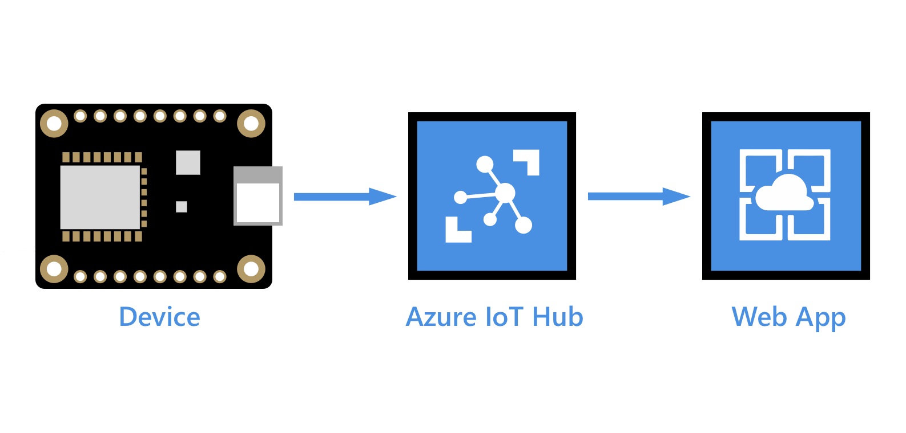
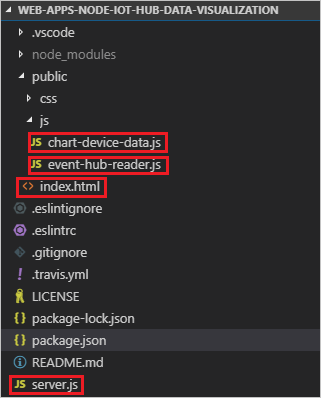
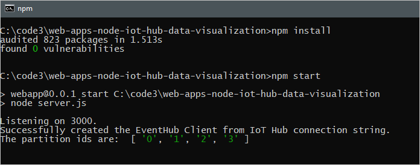
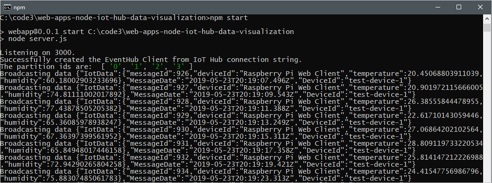

# Visualize real-time sensor data from your Azure IoT hub in a web application



[!INCLUDE [iot-hub-get-started-note](../../includes/iot-hub-get-started-note.md)]

In this article, you learn how to visualize real-time sensor data that your IoT hub receives with a node.js web app running on your local computer. After running the web app locally, you can optionally follow steps to host the web app in Azure App Service. If you want to try to visualize the data in your IoT hub by using Power BI, see [Use Power BI to visualize real-time sensor data from Azure IoT Hub](iot-hub-live-data-visualization-in-power-bi.md).

## Prerequisites

* Complete the [Raspberry Pi online simulator](iot-hub-raspberry-pi-web-simulator-get-started.md) tutorial or one of the device tutorials. For example, you can go to [Raspberry Pi with node.js](iot-hub-raspberry-pi-kit-node-get-started.md) or to one of the [Send telemetry](quickstart-send-telemetry-dotnet.md) quickstarts. These articles cover the following requirements:

  * An active Azure subscription
  * An Iot hub under your subscription
  * A client application that sends messages to your Iot hub

* [Download Git](https://www.git-scm.com/downloads)

* The steps in this article assume a Windows development machine; however, you can easily perform these steps on a Linux system in your preferred shell.

[!INCLUDE [azure-cli-prepare-your-environment.md](../../includes/azure-cli-prepare-your-environment-no-header.md)]

## Add a consumer group to your IoT hub

[Consumer groups](../event-hubs/event-hubs-features.md#event-consumers) provide independent views into the event stream that enable apps and Azure services to independently consume data from the same Event Hub endpoint. In this section, you add a consumer group to your IoT hub's built-in endpoint that the web app will use to read data from.

Run the following command to add a consumer group to the built-in endpoint of your IoT hub:

```azurecli-interactive
az iot hub consumer-group create --hub-name YourIoTHubName --name YourConsumerGroupName
```

Note down the name you choose, you'll need it later in this tutorial.

## Get a service connection string for your IoT hub

IoT hubs are created with several default access policies. One such policy is the **service** policy, which provides sufficient permissions for a service to read and write the IoT hub's endpoints. Run the following command to get a connection string for your IoT hub that adheres to the service policy:

```azurecli-interactive
az iot hub show-connection-string --hub-name YourIotHub --policy-name service
```

The connection string should look similar to the following:

```javascript
"HostName={YourIotHubName}.azure-devices.net;SharedAccessKeyName=service;SharedAccessKey={YourSharedAccessKey}"
```

Note down the service connection string, you'll need it later in this tutorial.

## Download the web app from GitHub

Open a command window, and enter the following commands to download the sample from GitHub and change to the sample directory:

```cmd
git clone https://github.com/Azure-Samples/web-apps-node-iot-hub-data-visualization.git
cd web-apps-node-iot-hub-data-visualization
```

## Examine the web app code

From the web-apps-node-iot-hub-data-visualization directory, open the web app in your favorite editor. The following shows the file structure viewed in VS Code:



Take a moment to examine the following files:

* **Server.js** is a service-side script that initializes the web socket and the Event Hub wrapper class. It provides a callback to the Event Hub wrapper class that the class uses to broadcast incoming messages to the web socket.

* **Event-hub-reader.js** is a service-side script that connects to the IoT hub's built-in endpoint using the specified connection string and consumer group. It extracts the DeviceId and EnqueuedTimeUtc from metadata on incoming messages and then relays the message using the callback method registered by server.js.

* **Chart-device-data.js** is a client-side script that listens on the web socket, keeps track of each DeviceId, and stores the last 50 points of incoming data for each device. It then binds the selected device data to the chart object.

* **Index.html** handles the UI layout for the web page and references the necessary scripts for client-side logic.

## Configure environment variables for the web app

To read data from your IoT hub, the web app needs your IoT hub's connection string and the name of the consumer group that it should read through. It gets these strings from the process environment in the following lines in server.js:

```javascript
const iotHubConnectionString = process.env.IotHubConnectionString;
const eventHubConsumerGroup = process.env.EventHubConsumerGroup;
```

Set the environment variables in your command window with the following commands. Replace the placeholder values with the service connection string for your IoT hub and the name of the consumer group you created previously. Don't quote the strings.

```cmd
set IotHubConnectionString=YourIoTHubConnectionString
set EventHubConsumerGroup=YourConsumerGroupName
```

## Run the web app

1. Make sure that your device is running and sending data.

2. In the command window, run  the following lines to download and install referenced packages and start the website:

   ```cmd
   npm install
   npm start
   ```

3. You should see output in the console that indicates that the web app has successfully connected to your IoT hub and is listening on port 3000:

   

## Open a web page to see data from your IoT hub

Open a browser to `http://localhost:3000`.

In the **Select a device** list, select your device to see a running plot of the last 50 temperature and humidity data points sent by the device to your IoT hub.


You should also see output in the console that shows the messages that your web app is broadcasting to the browser client:  



## Host the web app in App Service

The [Web Apps feature of Azure App Service](../app-service/overview.md) provides a platform as a service (PAAS) for hosting web applications. Web applications hosted in Azure App Service can benefit from powerful Azure features like additional security, load balancing, and scalability as well as Azure and partner DevOps solutions like continuous deployment, package management, and so on. Azure App Service supports web applications developed in many popular languages and deployed on Windows or Linux infrastructure.

In this section, you provision a web app in App Service and deploy your code to it by using Azure CLI commands. You can find details of the commands used in the [az webapp](/cli/azure/webapp) documentation. Before starting, make sure you've completed the steps to [add a resource group to your IoT hub](#add-a-consumer-group-to-your-iot-hub), [get a service connection string for your IoT hub](#get-a-service-connection-string-for-your-iot-hub), and [download the web app from GitHub](#download-the-web-app-from-github).

1. An [App Service plan](../app-service/overview-hosting-plans.md) defines a set of compute resources for an app hosted in App Service to run. In this tutorial, we use the Developer/Free tier to host the web app. With the Free tier, your web app runs on shared Windows resources with other App Service apps, including apps of other customers. Azure also offers App Service plans to deploy web apps on Linux compute resources. You can skip this step if you already have an App Service plan that you want to use.

   To create an App Service plan using the Windows free tier, run the following command. Use the same resource group your IoT hub is in. Your service plan name can contain upper and lower case letters, numbers, and hyphens.

   ```azurecli-interactive
   az appservice plan create --name <app service plan name> --resource-group <your resource group name> --sku FREE
   ```

2. Now provision a web app in your App Service plan. The `--deployment-local-git` parameter enables the web app code to be uploaded and deployed from a Git repository on your local machine. Your web app name must be globally unique and can contain upper and lower case letters, numbers, and hyphens. Be sure to specify Node version 10.6 or later for the `--runtime` parameter, depending on the version of the Node.js runtime you are using. You can use the `az webapp list-runtimes` command to get a list of  supported runtimes.

   ```azurecli-interactive
   az webapp create -n <your web app name> -g <your resource group name> -p <your app service plan name> --runtime "node|10.6" --deployment-local-git
   ```

3. Now add Application Settings for the environment variables that specify the IoT hub connection string and the Event hub consumer group. Individual settings are space delimited in the `-settings` parameter. Use the service connection string for your IoT hub and the consumer group you created previously in this tutorial. Don't quote the values.

   ```azurecli-interactive
   az webapp config appsettings set -n <your web app name> -g <your resource group name> --settings EventHubConsumerGroup=<your consumer group> IotHubConnectionString="<your IoT hub connection string>"
   ```

4. Enable the Web Sockets protocol for the web app and set the web app to receive HTTPS requests only (HTTP requests are redirected to HTTPS).

   ```azurecli-interactive
   az webapp config set -n <your web app name> -g <your resource group name> --web-sockets-enabled true
   az webapp update -n <your web app name> -g <your resource group name> --https-only true
   ```

5. To deploy the code to App Service, you'll use your [user-level deployment credentials](../app-service/deploy-configure-credentials.md). Your user-level deployment credentials are different from your Azure credentials and are used for Git local and FTP deployments to a web app. Once set, they're valid across all of your App Service apps in all subscriptions in your Azure account. If you've previously set user-level deployment credentials, you can use them.

   If you haven't previously set user-level deployment credentials or you can't remember your password, run the following command. Your deployment user name must be unique within Azure, and it must not contain the ‘\@’ symbol for local Git pushes. When you're prompted, enter and confirm your new password. The password must be at least eight characters long, with two of the following three elements: letters, numbers, and symbols.

   ```azurecli-interactive
   az webapp deployment user set --user-name <your deployment user name>
   ```

6. Get the Git URL to use to push your code up to App Service.

   ```azurecli-interactive
   az webapp deployment source config-local-git -n <your web app name> -g <your resource group name>
   ```

7. Add a remote to your clone that references the Git repository for the web app in App Service. For \<Git clone URL\>, use the URL returned in the previous step. Run the following command in your command window.

   ```cmd
   git remote add webapp <Git clone URL>
   ```

8. To deploy the code to App Service, enter the following command in your command window. If you are prompted for credentials, enter the user-level deployment credentials that you created in step 5. Make sure that you push to the main branch of the App Service remote.

    ```cmd
    git push webapp main:main
    ```

9. The progress of the deployment will update in your command window. A successful deployment will end with lines similar to the following output:

    ```cmd
    remote:
    remote: Finished successfully.
    remote: Running post deployment command(s)...
    remote: Deployment successful.
    To https://contoso-web-app-3.scm.azurewebsites.net/contoso-web-app-3.git
    6b132dd..7cbc994  main -> main
    ```

10. Run the following command to query the state of your web app and make sure it is running:

    ```azurecli-interactive
    az webapp show -n <your web app name> -g <your resource group name> --query state
    ```

11. Navigate to `https://<your web app name>.azurewebsites.net` in a browser. A web page similar to the one you saw when you ran the web app locally displays. Assuming that your device is running and sending data, you should see a running plot of the 50 most recent temperature and humidity readings sent by the device.

## Troubleshooting

If you come across any issues with this sample, try the steps in the following sections. If you still have problems, send us feedback at the bottom of this topic.

### Client issues

* If a device does not appear in the list, or no graph is being drawn, make sure the device code is running on your device.

* In the browser, open the developer tools (in many browsers the F12 key will open it), and find the console. Look for any warnings or errors printed there.

* You can debug client-side script in /js/chat-device-data.js.

### Local website issues

* Watch the output in the window where you launched node for console output.

* Debug the server code, specifically server.js and /scripts/event-hub-reader.js.

### Azure App Service issues

* In Azure portal, go to your web app. Under **Monitoring** in the left pane, select **App Service logs**. Turn **Application Logging (File System)** to on, set **Level** to Error, and then select **Save**. Then open **Log stream** (under **Monitoring**).

* From your web app in Azure portal, under **Development Tools**  select  **Console** and validate node and npm versions with `node -v` and `npm -v`.

* If you see an error about not finding a package, you may have run the steps out of order. When the site is deployed (with `git push`) the app service runs `npm install`, which runs based on the current version of node it has configured. If that is changed in configuration later, you'll need to make a meaningless change to the code and push again.

## Next steps

You've successfully used your web app to visualize real-time sensor data from your IoT hub.

For another way to visualize data from Azure IoT Hub, see [Use Power BI to visualize real-time sensor data from your IoT hub](iot-hub-live-data-visualization-in-power-bi.md).

[!INCLUDE [iot-hub-get-started-next-steps](../../includes/iot-hub-get-started-next-steps.md)]
