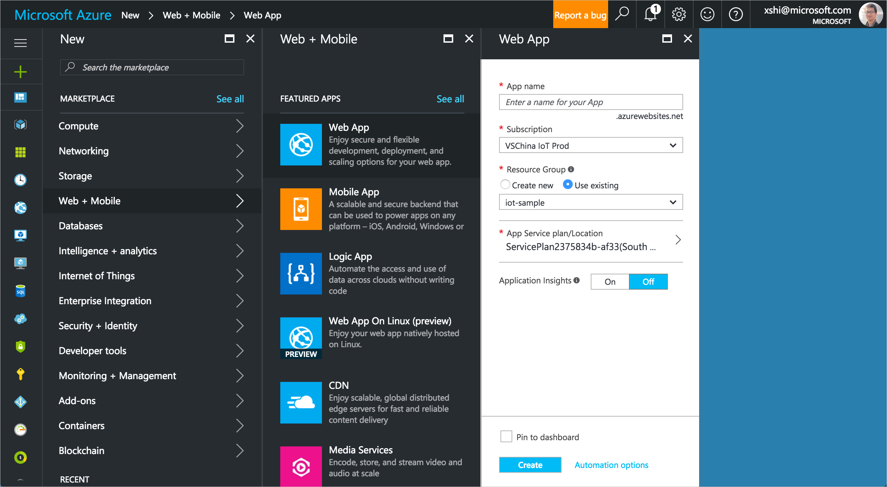
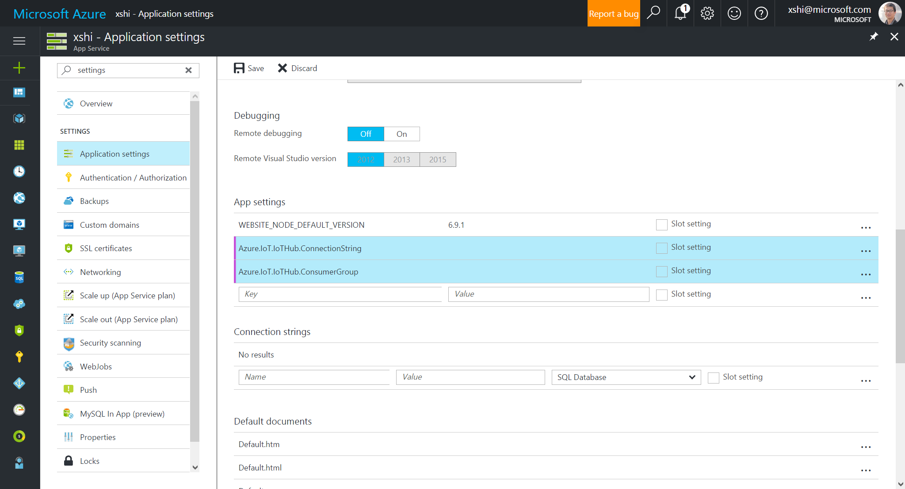
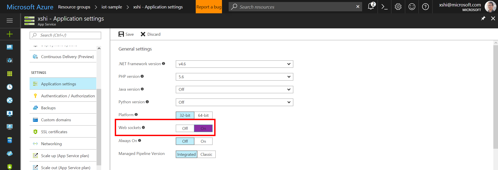
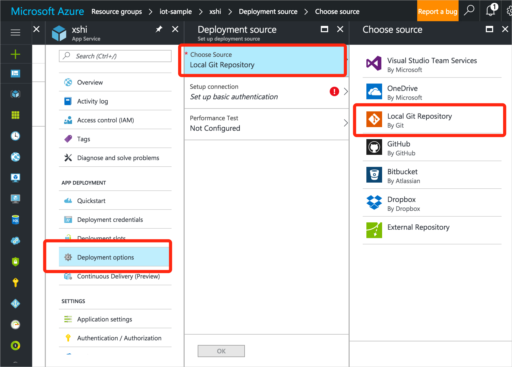
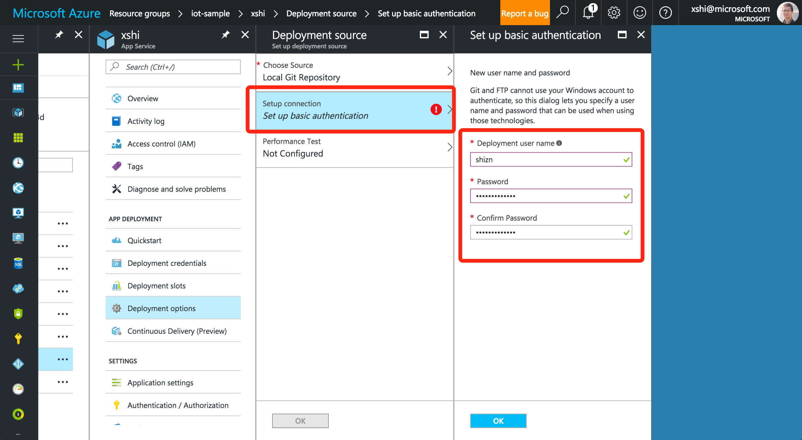
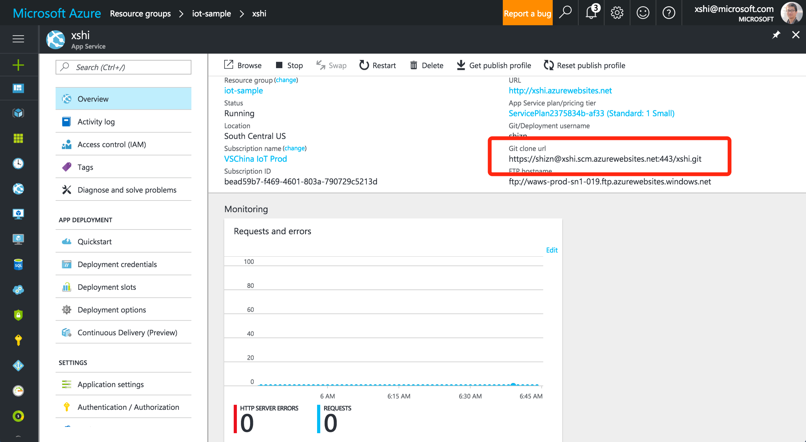
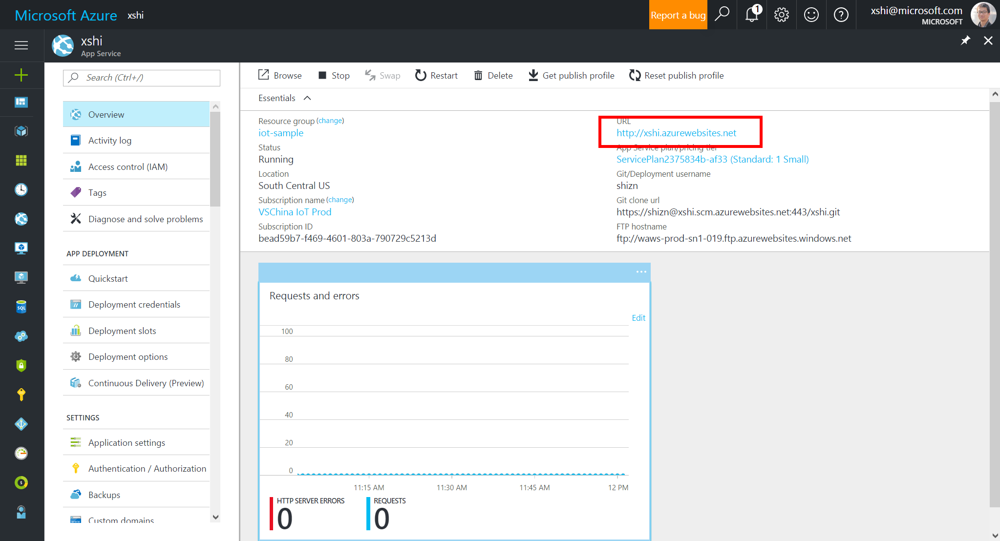
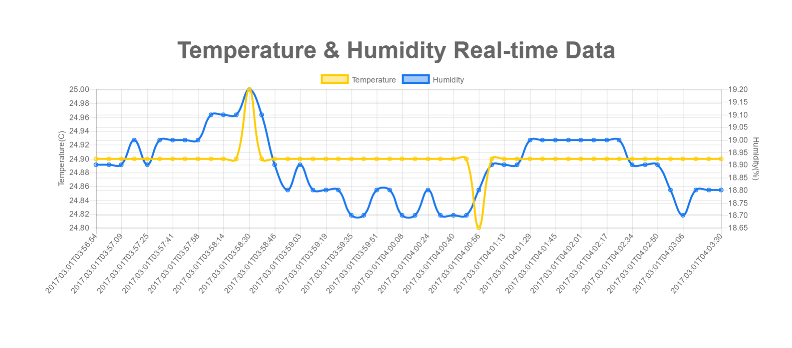

# Visualize real-time sensor data from your Azure IoT hub by using the Web Apps feature of Azure App Service


[!INCLUDE [iot-hub-get-started-note](../../includes/iot-hub-get-started-note.md)]

## What you learn

In this tutorial, you learn how to visualize real-time sensor data that your IoT hub receives by running a web application that is hosted on a web app. If you want to try to visualize the data in your IoT hub by using Power BI, see [Use Power BI to visualize real-time sensor data from Azure IoT Hub](iot-hub-live-data-visualization-in-power-bi.md).

## What you do

- Create a web app in the Azure portal.
- Get your IoT hub ready for data access by adding a consumer group.
- Configure the web app to read sensor data from your IoT hub.
- Upload a web application to be hosted by the web app.
- Open the web app to see real-time temperature and humidity data from your IoT hub.

## What you need

- [Set up your device](iot-hub-raspberry-pi-kit-node-get-started.md), which covers the following requirements:
  - An active Azure subscription
  - An Iot hub under your subscription
  - A client application that sends messages to your Iot hub
- [Download Git](https://www.git-scm.com/downloads)

## Create a web app

1. In the [Azure portal](https://ms.portal.azure.com/), click **New** > **Web + Mobile** > **Web App**.
2. Enter a unique job name, verify the subscription, specify a resource group and a location, select **Pin to dashboard**, and then click **Create**.

   We recommend you select the same location as your resource group. Doing so assists with processing speed and reduces the cost of data transfer.

   

[!INCLUDE [iot-hub-get-started-create-consumer-group](../../includes/iot-hub-get-started-create-consumer-group.md)]

## Configure the web app to read data from your IoT hub

1. Open the web app you’ve just provisioned.
2. Click **Application settings**, and then add the following key/value pairs under **App settings**:

   | Key                                   | Value                                                        |
   |---------------------------------------|--------------------------------------------------------------|
   | Azure.IoT.IoTHub.ConnectionString     | Obtained from iothub-explorer                                |
   | Azure.IoT.IoTHub.DeviceId             | Obtained from iothub-explorer                                |
   | Azure.IoT.IoTHub.ConsumerGroup        | The name of the consumer group that you add to your IoT hub  |

   

3. Click **Application settings**, under **General settings**, toggle the **Web sockets** option, and then click **Save**.

   

## Upload a web application to be hosted by the web app

On GitHub, we've made available a web application that displays real-time sensor data from your IoT hub. All you need to do is configure the web app to work with a Git repository, download the web application from GitHub, and then upload it to Azure for the web app to host.

1. In the web app, click **Deployment Options** > **Choose Source** > **Local Git Repository**.

   

2. Click **Setup connection**, create a user name and password to use to connect to the Git repository in Azure, and then click **OK**.

   

3. Click **OK** to finish the configuration.
4. Click **Overview**, and make a note of the value of **Git clone url**.

   

5. Open a command or terminal window on your local computer.
6. Download the web application from GitHub, and upload it to Azure for the web app to host. To do so, run the following commands:

   ```bash
   git clone https://github.com/Azure-Samples/web-apps-node-iot-hub-data-visualization.git
   cd web-apps-node-iot-hub-data-visualization
   git remote add webapp <Git clone URL>
   git push webapp master:master
   ```

   > [!NOTE]
   > \<Git clone URL\> is the URL of the Git repository found on the **Overview** page of the web app.

## Open the web app to see real-time temperature and humidity data from your IoT hub

On the **Overview** page of your web app, click the URL to open the web app.



You should see the real-time temperature and humidity data from your IoT hub.



## Next steps
You've successfully used your web app to visualize real-time sensor data from your IoT hub.

For an alternative way to visualize data from Azure IoT Hub, see [Use Power BI to visualize real-time sensor data from your IoT hub](iot-hub-live-data-visualization-in-power-bi.md).

[!INCLUDE [iot-hub-get-started-next-steps](../../includes/iot-hub-get-started-next-steps.md)]
