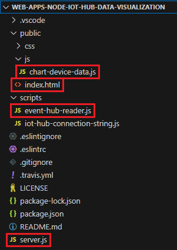

# Tutorial: Visualize real-time sensor data from your Azure IoT hub in a web application

In this article, you learn how to visualize real-time sensor data that your IoT hub receives with a Node.js web app running on your local computer. After running the web app locally, you can host the web app in Azure App Service.


## Prerequisites

The web application sample for this tutorial is written in Node.js. The steps in this article assume a Windows development machine; however, you can also perform these steps on a Linux system in your preferred shell.

* An Azure subscription. If you don't have an Azure subscription, create a [free account](https://azure.microsoft.com/free/?WT.mc_id=A261C142F) before you begin.

* An IoT hub in your Azure subscription. If you don't have a hub yet, you can follow the steps to create an IoT hub using the [CLI](iot-hub-create-using-cli.md) or the [Azure portal](iot-hub-create-through-portal.md).

* A device registered in your IoT hub. If you haven't registered a device yet, register one in the [Azure portal](iot-hub-create-through-portal.md#register-a-new-device-in-the-iot-hub).

* A simulated device that sends telemetry messages to your IoT hub. Use the [Raspberry Pi online simulator](raspberry-pi-get-started.md) to get a simulated device that sends temperature data to IoT Hub.

* [Node.js](https://nodejs.org) version 14 or later. To check your node version run `node --version`.

* [Git](https://www.git-scm.com/downloads).

[!INCLUDE [azure-cli-prepare-your-environment.md](~/reusable-content/azure-cli/azure-cli-prepare-your-environment-no-header.md)]

## Add a consumer group to your IoT hub

[Consumer groups](../event-hubs/event-hubs-features.md#event-consumers) provide independent views into the event stream that enable apps and Azure services to independently consume data from the same Event Hubs endpoint. In this section, you add a consumer group to your IoT hub's built-in endpoint that the web app uses to read data.

Run the following command to add a consumer group to the built-in endpoint of your IoT hub:

```azurecli-interactive
az iot hub consumer-group create --hub-name YOUR_IOT_HUB_NAME --name YOUR_CONSUMER_GROUP_NAME
```

Note down the name you choose, you need it later in this tutorial.

## Get a service connection string for your IoT hub

IoT hubs are created with several default access policies. One such policy is the **service** policy, which provides sufficient permissions for a service to read and write the IoT hub's endpoints. Run the following command to get a connection string for your IoT hub that adheres to the service policy:

```azurecli-interactive
az iot hub connection-string show --hub-name YOUR_IOT_HUB_NAME --policy-name service
```

The service connection string should look similar to the following example:

```javascript
"HostName=YOUR_IOT_HUB_NAME.azure-devices.net;SharedAccessKeyName=service;SharedAccessKey=YOUR_SHARED_ACCESS_KEY"
```

Note down the service connection string, you need it later in this tutorial.

## Download the web app from GitHub

Download or clone the web app sample from GitHub: [web-apps-node-iot-hub-data-visualization](https://github.com/Azure-Samples/web-apps-node-iot-hub-data-visualization.git).

## Examine the web app code

On your development machine, navigate to the **web-apps-node-iot-hub-data-visualization** directory, then open the web app in your favorite editor. The following shows the file structure viewed in Visual Studio Code:



Take a moment to examine the following files:

* **server.js** is a service-side script that initializes the web socket and the Event Hubs wrapper class. It provides a callback to the Event Hubs wrapper class that the class uses to broadcast incoming messages to the web socket.

* **scripts/event-hub-reader.js** is a service-side script that connects to the IoT hub's built-in endpoint using the specified connection string and consumer group. It extracts the DeviceId and EnqueuedTimeUtc from metadata on incoming messages and then relays the message using the callback method registered by server.js.

* **public/js/chart-device-data.js** is a client-side script that listens on the web socket, keeps track of each DeviceId, and stores the last 50 points of incoming data for each device. It then binds the selected device data to the chart object.

* **public/index.html** handles the UI layout for the web page and references the necessary scripts for client-side logic.

## Configure environment variables for the web app

To read data from your IoT hub, the web app needs your IoT hub's connection string and the name of the consumer group that it should read through. It gets these strings from the process environment in the following lines in server.js:

:::code language="javascript" source="~/web-apps-node-iot-hub-data-visualization/server.js" range="7-20" highlight="1,8":::

Set the environment variables in your command window with the following commands. Replace the placeholder values with the service connection string for your IoT hub and the name of the consumer group you created previously. Don't quote the strings.

```cmd
set IotHubConnectionString=YOUR_IOT_HUB_CONNECTION_STRING
set EventHubConsumerGroup=YOUR_CONSUMER_GROUP_NAME
```

## Run the web app

1. Make sure that your device is running and sending data.

2. In the command window, run  the following lines to download and install referenced packages and start the website:

   ```cmd
   npm install
   npm start
   ```

3. You should see output in the console that indicates that the web app has successfully connected to your IoT hub and is listening on port 3000:

   :::image type="content" source="./media/iot-hub-live-data-visualization-in-web-apps/web-app-console-start.png" alt-text="Screenshot showing the web app sample successfully running in the console.":::


## Open a web page to see data from your IoT hub

Open a browser to `http://localhost:3000`.

In the **Select a device** list, select your device to see a running plot of the last 50 temperature and humidity data points sent by the device to your IoT hub.

:::image type="content" source="./media/iot-hub-live-data-visualization-in-web-apps/web-page-output.png" alt-text="Screenshot of the web app running on localhost, showing real-time temperature and humidity.":::

You should also see output in the console that shows the messages that your web app is broadcasting to the browser client:  

:::image type="content" source="./media/iot-hub-live-data-visualization-in-web-apps/web-app-console-broadcast.png" alt-text="Screenshot of the web app output on console.":::

## Host the web app in App Service

The [Azure App Service](../app-service/overview.md) provides a platform as a service (PAAS) for hosting web applications. Web applications hosted in App Service can benefit from powerful Azure features like security, load balancing, and scalability as well as Azure and partner DevOps solutions like continuous deployment, package management, and so on. App Service supports web applications developed in many popular languages and deployed on Windows or Linux infrastructure.

In this section, you provision a web app in App Service and deploy your code to it by using Azure CLI commands. You can find details of the commands used in the [az webapp](/cli/azure/webapp) documentation.

1. An [App Service plan](../app-service/overview-hosting-plans.md) defines a set of compute resources for an app hosted in App Service to run. In this tutorial, we use the Developer/Free tier to host the web app. With the Free tier, your web app runs on shared Windows resources with other App Service apps, including apps of other customers. Azure also offers App Service plans to deploy web apps on Linux compute resources. You can skip this step if you already have an App Service plan that you want to use.

   To create an App Service plan using the Windows free tier, use the [az appservice plan create](/cli/azure/appservice/plan#az-appservice-plan-create) command. Use the same resource group your IoT hub is in. Your service plan name can contain upper and lower case letters, numbers, and hyphens.

   ```azurecli-interactive
   az appservice plan create --name NEW_NAME_FOR_YOUR_APP_SERVICE_PLAN --resource-group YOUR_RESOURCE_GROUP_NAME --sku FREE
   ```

2. Use the [az webapp create](/cli/azure/webapp#az-webapp-create) command to provision a web app in your App Service plan. The `--deployment-local-git` parameter enables the web app code to be uploaded and deployed from a Git repository on your local machine. Your web app name must be globally unique and can contain upper and lower case letters, numbers, and hyphens. Be sure to specify Node version 14 or later for the `--runtime` parameter, depending on the version of the Node.js runtime you're using. You can use the `az webapp list-runtimes` command to get a list of  supported runtimes.

   ```azurecli-interactive
   az webapp create -n NEW_NAME_FOR_YOUR_WEB_APP -g YOUR_RESOURCE_GROUP_NAME -p YOUR_APP_SERVICE_PLAN_NAME --runtime "NODE:14LTS" --deployment-local-git
   ```

3. Use the [az webapp config appsettings set](/cli/azure/webapp/config/appsettings#az-webapp-config-appsettings-set) command to add application settings for the environment variables that specify the IoT hub connection string and the Event hub consumer group. Individual settings are space-delimited in the `-settings` parameter. Use the service connection string for your IoT hub and the consumer group you created previously in this tutorial.

   ```azurecli-interactive
   az webapp config appsettings set -n YOUR_WEB_APP_NAME -g YOUR_RESOURCE_GROUP_NAME --settings EventHubConsumerGroup=YOUR_CONSUMER_GROUP_NAME IotHubConnectionString="YOUR_IOT_HUB_CONNECTION_STRING"
   ```

4. Enable the Web Sockets protocol for the web app and set the web app to receive HTTPS requests only (HTTP requests are redirected to HTTPS).

   ```azurecli-interactive
   az webapp config set -n YOUR_WEB_APP_NAME -g YOUR_RESOURCE_GROUP_NAME --web-sockets-enabled true
   az webapp update -n YOUR_WEB_APP_NAME -g YOUR_RESOURCE_GROUP_NAME --https-only true
   ```

5. To deploy the code to App Service, you use [user-level deployment credentials](../app-service/deploy-configure-credentials.md). Your user-level deployment credentials are different from your Azure credentials and are used for Git local and FTP deployments to a web app. Once set, they're valid across all of your App Service apps in all subscriptions in your Azure account. If you've previously set user-level deployment credentials, you can use them.

   If you haven't previously set user-level deployment credentials or you can't remember your password, run the [az webapp deployment user set](/cli/azure/webapp/deployment/user#az-webapp-deployment-user-set) command. Your deployment user name must be unique within Azure, and it must not contain the ‘\@’ symbol for local Git pushes. When you're prompted, enter and confirm your new password. The password must be at least eight characters long, with two of the following three elements: letters, numbers, and symbols.

   ```azurecli-interactive
   az webapp deployment user set --user-name NAME_FOR_YOUR_USER_CREDENTIALS
   ```

6. Get the Git URL to use to push your code up to App Service.

   ```azurecli-interactive
   az webapp deployment source config-local-git -n YOUR_WEB_APP_NAME -g YOUR_RESOURCE_GROUP_NAME
   ```

7. Add a remote to your clone that references the Git repository for the web app in App Service. Replace the `GIT_ENDPOINT_URL` placeholder with the URL returned in the previous step. Make sure that you're in the sample directory, *web-apps-code-iot-hub-data-visualization*, then run the following command in your command window.

   ```cmd
   git remote add webapp GIT_ENDPOINT_URL
   ```

8. To deploy the code to App Service, enter the following command in your command window. Make sure that you are in the sample directory *web-apps-code-iot-hub-data-visualization*. If you're prompted for credentials, enter the user-level deployment credentials that you created in step 5. Push to the main branch of the App Service remote.

   ```cmd
   git push webapp master:master
   ```

9. The progress of the deployment updates in your command window. A successful deployment ends with lines similar to the following output:

   ```cmd
   remote:
   remote: Finished successfully.
   remote: Running post deployment command(s)...
   remote: Deployment successful.
   To https://contoso-web-app-3.scm.azurewebsites.net/contoso-web-app-3.git
   6b132dd..7cbc994  master -> master
   ```

10. Run the following command to query the state of your web app and make sure it's running:

    ```azurecli-interactive
    az webapp show -n YOUR_WEB_APP_NAME -g YOUR_RESOURCE_GROUP_NAME --query state
    ```

11. Navigate to `https://<your web app name>.azurewebsites.net` in a browser. A web page similar to the one you saw when you ran the web app locally displays. Assuming that your device is running and sending data, you should see a running plot of the 50 most recent temperature and humidity readings sent by the device.

## Troubleshooting

If you come across any issues with this sample, try the steps in the following sections. If you still have problems, send us feedback at the bottom of this article.

### Client issues

* If a device doesn't appear in the list, or no graph is being drawn, make sure the device code is running on your device.

* In the browser, open the developer tools (in many browsers the F12 key opens it), and find the console. Look for any warnings or errors printed there.

* You can debug client-side script in /js/chat-device-data.js.

### Local website issues

* Watch the output in the window where you launched node for console output.

* Debug the server code, specifically server.js and /scripts/event-hub-reader.js.

### Azure App Service issues

* In Azure portal, go to your web app. Under **Monitoring** in the left pane, select **App Service logs**. Turn **Application Logging (File System)** to on, set **Level** to Error, and then select **Save**. Then open **Log stream** (under **Monitoring**).

* From your web app in Azure portal, under **Development Tools**  select  **Console** and validate node and npm versions with `node -v` and `npm -v`.

* If you see an error about not finding a package, you may have run the steps out of order. When the site is deployed (with `git push`) the app service runs `npm install`, which runs based on the current version of node it has configured. If that is changed in configuration later, you need to make a meaningless change to the code and push again.

## Next steps

You've successfully used your web app to visualize real-time sensor data from your IoT hub.

For another way to interact with data from Azure IoT Hub, see the following tutorial:

> [!div class="nextstepaction"]
> [Use Logic Apps for remote monitoring and notifications](./iot-hub-monitoring-notifications-with-azure-logic-apps.md)
