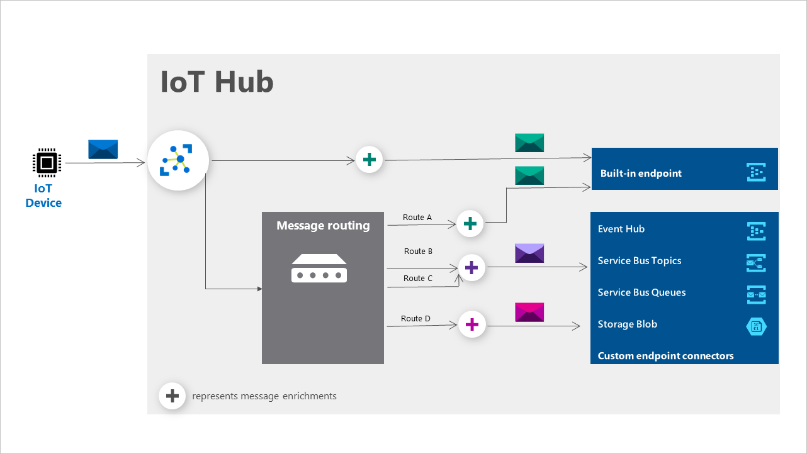

# Message enrichments for device-to-cloud IoT Hub messages

*Message enrichments* is the ability of an IoT hub to *stamp* messages with additional information before the messages are sent to the designated endpoint. One reason to use message enrichments is to include data that can be used to simplify downstream processing. For example, enriching device telemetry messages with a device twin tag can reduce load on customers to make device twin API calls for this information.

A message enrichment has three key elements:

* Enrichment name or key

* A value

* One or more [endpoints](iot-hub-devguide-endpoints.md) for which the enrichment should be applied.

The **key** is a string. A key can only contain alphanumeric characters or these special characters: hyphen (`-`), underscore (`_`), and period (`.`).

The **value** can be any of the following examples:

* Any static string. Dynamic values such as conditions, logic, operations, and functions aren't allowed. For example, if you develop a SaaS application that is used by several customers, you can assign an identifier to each customer and make that identifier available in the application. When the application runs, IoT Hub will stamp the device telemetry messages with the customer's identifier, making it possible to process the messages differently for each customer.

* The name of the IoT hub sending the message. This value is *$iothubname*.

* Information from the device twin, such as its path. Examples would be *$twin.tags.field* and *$twin.tags.latitude*.

   > [!NOTE]
   > At this time, only $iothubname, $twin.tags, $twin.properties.desired, and $twin.properties.reported are supported variables for message enrichment.  Additionally, only primitive types are supported for enrichments. Messages cannot be enriched with object types.

Message Enrichments are added as application properties to messages sent to chosen endpoint(s).  

## Applying enrichments

The messages can come from any data source supported by [IoT Hub message routing](iot-hub-devguide-messages-d2c.md), including the following examples:

* device telemetry, such as temperature or pressure
* device twin change notifications -- changes in the device twin
* device life-cycle events, such as when the device is created or deleted

You can add enrichments to messages that are going to the built-in endpoint of an IoT hub, or to messages that are being routed to custom endpoints such as Azure Blob storage, a Service Bus queue, or a Service Bus topic.

You can also add enrichments to messages that are being published to Event Grid by first creating an Event Grid subscription with the device telemetry message type. Based on this subscription, we will create a default route in Azure IoT Hub for the telemetry. This single route can handle all of your Event Grid subscriptions. You can then configure enrichments for the endpoint by using the **Enrich messages** tab of the IoT Hub **Message routing** section. For information about reacting to events by using Event Grid, see [Iot Hub and Event Grid](iot-hub-event-grid.md).

Enrichments are applied per endpoint. If you specify five enrichments to be stamped for a specific endpoint, all messages going to that endpoint are stamped with the same five enrichments.

Enrichments can be configured using the following methods:

| **Method** | **Command** |
| ----- | -----|
| Portal | [Azure portal](https://portal.azure.com) See the [message enrichments tutorial](tutorial-message-enrichments.md) |
| Azure CLI   | [az iot hub message-enrichment](/cli/azure/iot/hub/message-enrichment) |
| Azure PowerShell | [Add-AzIotHubMessageEnrichment](/powershell/module/az.iothub/add-aziothubmessageenrichment) |

Adding message enrichments doesn't add latency to the message routing.

To try out message enrichments, see the [message enrichments tutorial](tutorial-message-enrichments.md)

## Limitations

* You can add up to 10 enrichments per IoT hub for those hubs in the standard or basic tier. For IoT hubs in the free tier, you can add up to 2 enrichments.

* In some cases, if you're enriching a message with a value set to a tag or property in the device twin, the value will be stamped with the specified device twin path. For example, if an enrichment value is set to $twin.tags.field, the messages will be stamped with the string "$twin.tags.field", rather than the value of that field from the twin. This behavior happens in the following cases:

  * Your IoT hub is in the basic tier. Basic tier IoT hubs don't support device twins.

  * Your IoT hub is in the standard tier, but the device twin path used for the value of the enrichment doesn't exist. For example, if the enrichment value is set to $twin.tags.location, and the device twin does not have a location property under tags, the message is stamped with the string "$twin.tags.location".

  * Your IoT hub is in the standard tier, but the device twin path used for the value of the enrichment resolves to an object, rather than a simple property. For example, if the enrichment value is set to $twin.tags.location, and the location property under tags is an object that contains child properties like `{"building": 43, "room": 503}`, the message is stamped with the string "$twin.tags.location".

* Updates to a device twin can take up to five minutes to be reflected in the corresponding enrichment value.

* The total message size, including the enrichments, can't exceed 256 KB. If a message size exceeds 256 KB, the IoT hub will drop the message. You can use [IoT Hub metrics](monitor-iot-hub-reference.md#metrics) to identify and debug errors when messages are dropped. For example, you can monitor the *telemetry messages incompatible* (*d2c.telemetry.egress.invalid*) metric in the [routing metrics](monitor-iot-hub-reference.md#routing-metrics). To learn more, see [Monitor IoT Hub](monitor-iot-hub.md).

* Message enrichments don't apply to digital twin change events.

* Modules don't inherit twin tags from their corresponding devices. Enrichments for messages originating from device modules (for example from IoT Edge modules) must use the twin tags that are set on the module twin.

## Pricing

Message enrichments are available for no extra charge. Currently, you're charged when you send a message to an IoT hub. You're only charged once for that message, even if the message goes to multiple endpoints.

## Next steps

Check out these articles for more information about routing messages to an IoT hub:

* [Message enrichments tutorial](tutorial-message-enrichments.md)

* [Use IoT Hub message routing to send device-to-cloud messages to different endpoints](iot-hub-devguide-messages-d2c.md)

* [Tutorial: IoT Hub routing](tutorial-routing.md)
