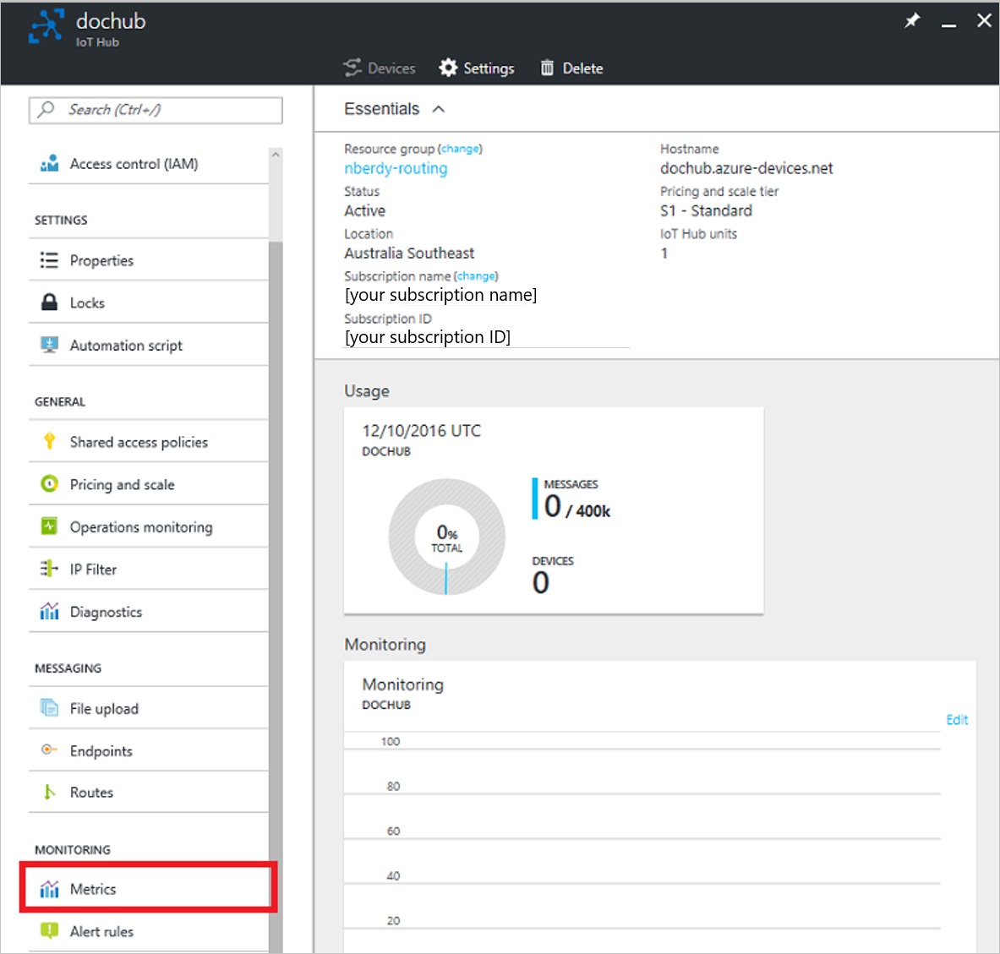
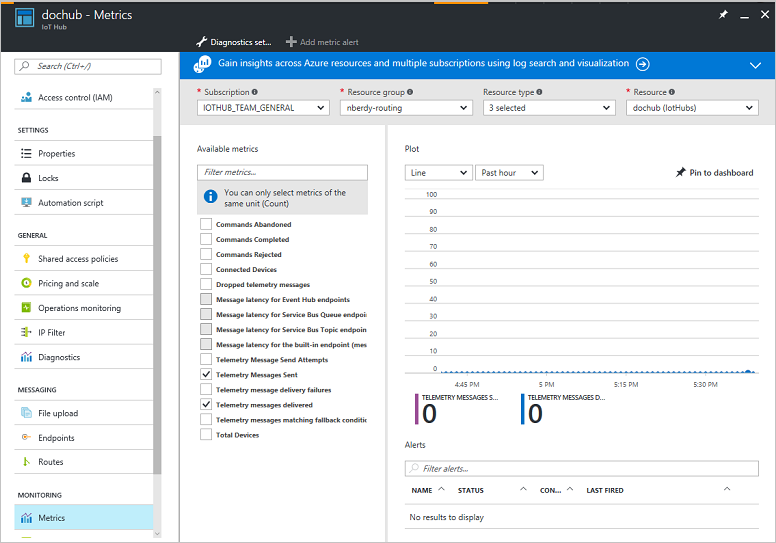
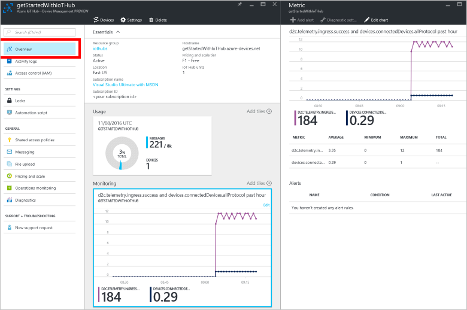

# Understand IoT Hub metrics

IoT Hub metrics give you better data about the state of the Azure IoT resources in your Azure subscription. IoT Hub metrics enable you to assess the overall health of the IoT Hub service and the devices connected to it. User-facing statistics are important because they help you see what is going on with your IoT hub and help root-cause issues without needing to contact Azure support.

Metrics are enabled by default. You can view IoT Hub metrics from the Azure portal.

## How to view IoT Hub metrics

1. Create an IoT hub. You can find instructions on how to create an IoT hub in the [Send telemetry from a device to IoT Hub](quickstart-send-telemetry-dotnet.md) guide.

2. Open the blade of your IoT hub. From there, click **Metrics**.
   
    

3. From the metrics blade, you can view the metrics for your IoT hub and create custom views of your metrics. 
   
    
    
4. You can choose to send your metrics data to an Event Hubs endpoint or an Azure Storage account by clicking **Diagnostics settings**, then **Add diagnostic setting**

   

## IoT Hub metrics and how to use them

IoT Hub provides several metrics to give you an overview of the health of your hub and the total number of connected devices. You can combine information from multiple metrics to paint a bigger picture of the state of the IoT hub. The following table describes the metrics each IoT hub tracks, and how each metric relates to the overall status of the IoT hub.

|Metric|Metric Display Name|Unit|Aggregation Type|Description|Dimensions|
|---|---|---|---|---|---|
|d2c .telemetry .ingress. allProtocol|Telemetry message send attempts|Count|Total|Number of device-to-cloud telemetry messages attempted to be sent to your IoT hub|No Dimensions|
|d2c .telemetry .ingress .success|Telemetry messages sent|Count|Total|Number of device-to-cloud telemetry messages sent successfully to your IoT hub|No Dimensions|
|c2d .commands .egress .complete .success|Commands completed|Count|Total|Number of cloud-to-device commands completed successfully by the device|No Dimensions|
|c2d .commands .egress .abandon .success|Commands abandoned|Count|Total|Number of cloud-to-device commands abandoned by the device|No Dimensions|
|c2d .commands .egress .reject .success|Commands rejected|Count|Total|Number of cloud-to-device commands rejected by the device|No Dimensions|
|devices .totalDevices|Total devices (deprecated)|Count|Total|Number of devices registered to your IoT hub|No Dimensions|
|devices .connectedDevices .allProtocol|Connected devices (deprecated) |Count|Total|Number of devices connected to your IoT hub|No Dimensions|
|d2c .telemetry .egress .success|Routing: telemetry messages delivered|Count|Total|The number of times messages were successfully delivered to all endpoints using IoT Hub routing. If a message is routed to multiple endpoints, this value increases by one for each successful delivery. If a message is delivered to the same endpoint multiple times, this value increases by one for each successful delivery.|No Dimensions|
|d2c .telemetry .egress .dropped|Routing: telemetry messages dropped |Count|Total|The number of times messages were dropped by IoT Hub routing due to dead endpoints. This value does not count messages delivered to fallback route as dropped messages are not delivered there.|No Dimensions|
|d2c .telemetry .egress .orphaned|Routing: telemetry messages orphaned |Count|Total|The number of times messages were orphaned by IoT Hub routing because they didn't match any routing rules (including the fallback rule). |No Dimensions|
|d2c .telemetry .egress .invalid|Routing: telemetry messages incompatible|Count|Total|The number of times IoT Hub routing failed to deliver messages due to an incompatibility with the endpoint. This value does not include retries.|No Dimensions|
|d2c .telemetry .egress .fallback|Routing: messages delivered to fallback|Count|Total|The number of times IoT Hub routing delivered messages to the endpoint associated with the fallback route.|No Dimensions|
|d2c .endpoints .egress .eventHubs|Routing: messages delivered to Event Hub|Count|Total|The number of times IoT Hub routing successfully delivered messages to Event Hub endpoints.|No Dimensions|
|d2c .endpoints .latency .eventHubs|Routing: message latency for Event Hub|Milliseconds|Average|The average latency (milliseconds) between message ingress to IoT Hub and message ingress into an Event Hub endpoint.|No Dimensions|
|d2c .endpoints .egress .serviceBusQueues|Routing: messages delivered to Service Bus Queue|Count|Total|The number of times IoT Hub routing successfully delivered messages to Service Bus queue endpoints.|No Dimensions|
|d2c .endpoints .latency .serviceBusQueues|Routing: message latency for Service Bus Queue|Milliseconds|Average|The average latency (milliseconds) between message ingress to IoT Hub and telemetry message ingress into a Service Bus queue endpoint.|No Dimensions|
|d2c .endpoints .egress .serviceBusTopics|Routing: messages delivered to Service Bus Topic|Count|Total|The number of times IoT Hub routing successfully delivered messages to Service Bus topic endpoints.|No Dimensions|
|d2c .endpoints .latency .serviceBusTopics|Routing: message latency for Service Bus Topic|Milliseconds|Average|The average latency (milliseconds) between message ingress to IoT Hub and telemetry message ingress into a Service Bus topic endpoint.|No Dimensions|
|d2c .endpoints .egress .builtIn .events|Routing: messages delivered to messages/events|Count|Total|The number of times IoT Hub routing successfully delivered messages to the built-in endpoint (messages/events). This metric only starts working when routing is enabled (https://aka.ms/iotrouting) for the IoT hub.|No Dimensions|
|d2c .endpoints .latency .builtIn.events|Routing: message latency for messages/events|Milliseconds|Average|The average latency (milliseconds) between message ingress to IoT Hub and telemetry message ingress into the built-in endpoint (messages/events). This metric only starts working when routing is enabled (https://aka.ms/iotrouting) for the IoT hub.|No Dimensions|
|d2c .endpoints .egress .storage|Routing: messages delivered to storage|Count|Total|The number of times IoT Hub routing successfully delivered messages to storage endpoints.|No Dimensions|
|d2c .endpoints .latency .storage|Routing: message latency for storage|Milliseconds|Average|The average latency (milliseconds) between message ingress to IoT Hub and telemetry message ingress into a storage endpoint.|No Dimensions|
|d2c .endpoints .egress .storage .bytes|Routing: data delivered to storage|Bytes|Total|The amount of data (bytes) IoT Hub routing delivered to storage endpoints.|No Dimensions|
|d2c .endpoints .egress .storage .blobs|Routing: blobs delivered to storage|Count|Total|The number of times IoT Hub routing delivered blobs to storage endpoints.|No Dimensions|
|EventGridDeliveries|Event Grid deliveries (preview)|Count|Total|The number of IoT Hub events published to Event Grid. Use the Result dimension for the number of successful and failed requests. EventType dimension shows the type of event (https://aka.ms/ioteventgrid). To see the where the requests come from, use the EventType dimension.|Result, EventType|
|EventGridLatency|Event Grid latency (preview)|Milliseconds|Average|The average latency (milliseconds) from when the Iot Hub event was generated to when the event was published to Event Grid. This number is an average between all event types. Use the EventType dimension to see latency of a specific type of event.|EventType|
|d2c .twin .read .success|Successful twin reads from devices|Count|Total|The count of all successful device-initiated twin reads.|No Dimensions|
|d2c .twin .read .failure|Failed twin reads from devices|Count|Total|The count of all failed device-initiated twin reads.|No Dimensions|
|d2c .twin .read .size|Response size of twin reads from devices|Bytes|Average|The average, min, and max of all successful device-initiated twin reads.|No Dimensions|
|d2c .twin .update .success|Successful twin updates from devices|Count|Total|The count of all successful device-initiated twin updates.|No Dimensions|
|d2c .twin .update .failure|Failed twin updates from devices|Count|Total|The count of all failed device-initiated twin updates.|No Dimensions|
|d2c .twin .update .size|Size of twin updates from devices|Bytes|Average|The average, min, and max size of all successful device-initiated twin updates.|No Dimensions|
|c2d .methods .success|Successful direct method invocations|Count|Total|The count of all successful direct method calls.|No Dimensions|
|c2d .methods .failure|Failed direct method invocations|Count|Total|The count of all failed direct method calls.|No Dimensions|
|c2d .methods .requestSize|Request size of direct method invocations|Bytes|Average|The average, min, and max of all successful direct method requests.|No Dimensions|
|c2d .methods .responseSize|Response size of direct method invocations|Bytes|Average|The average, min, and max of all successful direct method responses.|No Dimensions|
|c2d .twin .read .success|Successful twin reads from back end|Count|Total|The count of all successful back-end-initiated twin reads.|No Dimensions|
|c2d .twin .read .failure|Failed twin reads from back end|Count|Total|The count of all failed back-end-initiated twin reads.|No Dimensions|
|c2d .twin .read .size|Response size of twin reads from back end|Bytes|Average|The average, min, and max of all successful back-end-initiated twin reads.|No Dimensions|
|c2d .twin .update .success|Successful twin updates from back end|Count|Total|The count of all successful back-end-initiated twin updates.|No Dimensions|
|c2d .twin .update .failure|Failed twin updates from back end|Count|Total|The count of all failed back-end-initiated twin updates.|No Dimensions|
|c2d .twin .update .size|Size of twin updates from back end|Bytes|Average|The average, min, and max size of all successful back-end-initiated twin updates.|No Dimensions|
|twinQueries .success|Successful twin queries|Count|Total|The count of all successful twin queries.|No Dimensions|
|twinQueries .failure|Failed twin queries|Count|Total|The count of all failed twin queries.|No Dimensions|
|twinQueries .resultSize|Twin queries result size|Bytes|Average|The average, min, and max of the result size of all successful twin queries.|No Dimensions|
|jobs .createTwinUpdateJob .success|Successful creations of twin update jobs|Count|Total|The count of all successful creation of twin update jobs.|No Dimensions|
|jobs .createTwinUpdateJob .failure|Failed creations of twin update jobs|Count|Total|The count of all failed creation of twin update jobs.|No Dimensions|
|jobs .createDirectMethodJob .success|Successful creations of method invocation jobs|Count|Total|The count of all successful creation of direct method invocation jobs.|No Dimensions|
|jobs .createDirectMethodJob .failure|Failed creations of method invocation jobs|Count|Total|The count of all failed creation of direct method invocation jobs.|No Dimensions|
|jobs .listJobs .success|Successful calls to list jobs|Count|Total|The count of all successful calls to list jobs.|No Dimensions|
|jobs .listJobs .failure|Failed calls to list jobs|Count|Total|The count of all failed calls to list jobs.|No Dimensions|
|jobs .cancelJob .success|Successful job cancellations|Count|Total|The count of all successful calls to cancel a job.|No Dimensions|
|jobs .cancelJob .failure|Failed job cancellations|Count|Total|The count of all failed calls to cancel a job.|No Dimensions|
|jobs .queryJobs .success|Successful job queries|Count|Total|The count of all successful calls to query jobs.|No Dimensions|
|jobs .queryJobs .failure|Failed job queries|Count|Total|The count of all failed calls to query jobs.|No Dimensions|
|jobs .completed|Completed jobs|Count|Total|The count of all completed jobs.|No Dimensions|
|jobs .failed|Failed jobs|Count|Total|The count of all failed jobs.|No Dimensions|
|d2c .telemetry .ingress .sendThrottle|Number of throttling errors|Count|Total|Number of throttling errors due to device throughput throttles|No Dimensions|
|dailyMessage QuotaUsed|Total number of messages used|Count|Average|Number of total messages used today. This is a cumulative value that is reset to zero at 00:00 UTC every day.|No Dimensions|
|deviceDataUsage|Total device data usage|Bytes|Total|Bytes transferred to and from any devices connected to IotHub|No Dimensions|
|totalDeviceCount|Total devices (preview)|Count|Average|Number of devices registered to your IoT hub|No Dimensions|
|connected DeviceCount|Connected devices (preview)|Count|Average|Number of devices connected to your IoT hub|No Dimensions|
|configurations|Configuration Metrics|Count|Total|Metrics for Configuration Operations|No Dimensions|

## Next steps

Now that you’ve seen an overview of IoT Hub metrics, follow this link to learn more about managing Azure IoT Hub:

* [Operations monitoring](iot-hub-operations-monitoring.md)

To further explore the capabilities of IoT Hub, see:

* [IoT Hub developer guide](iot-hub-devguide.md)

* [Deploying AI to edge devices with Azure IoT Edge](../iot-edge/tutorial-simulate-device-linux.md)
