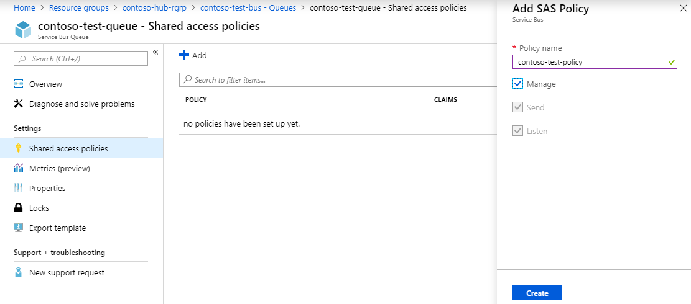
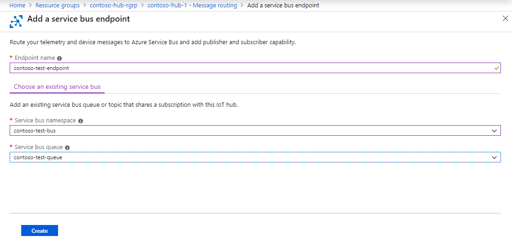
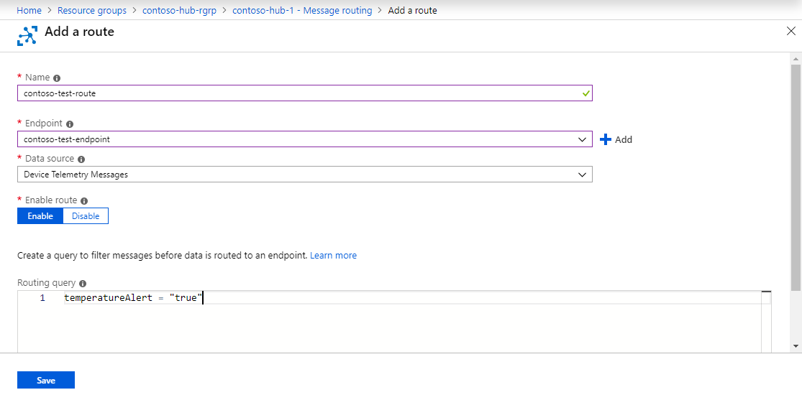
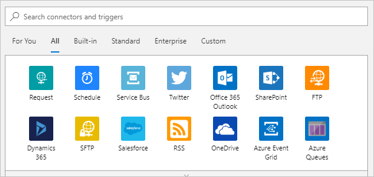
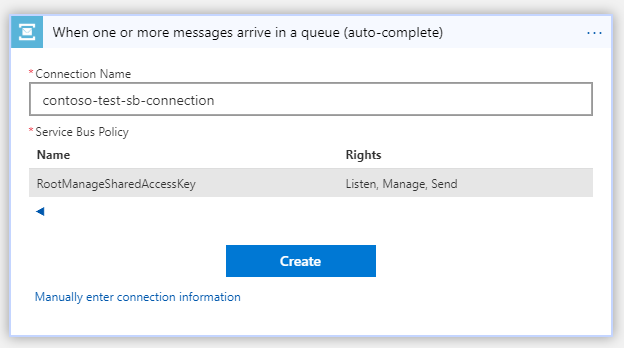
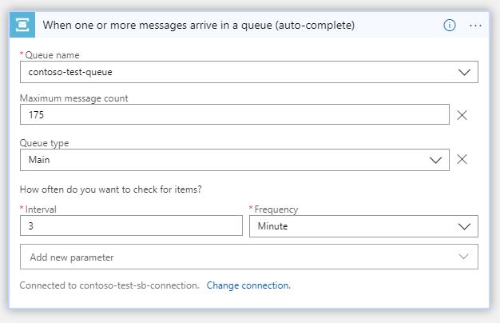
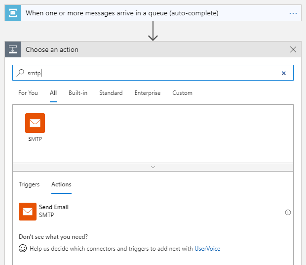
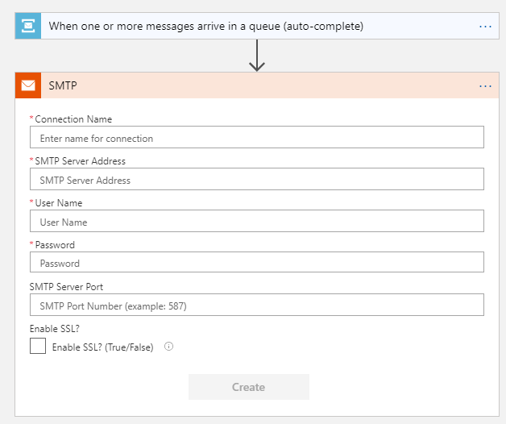

# IoT remote monitoring and notifications with Azure Logic Apps connecting your IoT hub and mailbox

[!INCLUDE [iot-hub-get-started-note](../../includes/iot-hub-get-started-note.md)]

Azure Logic Apps provides a way to automate processes as a series of steps. A logic app can connect across various services and protocols. It begins with a trigger such as 'When an account is added', and followed by a combination of actions, one like 'sending a push notification'. This feature makes Logic Apps a perfect IoT solution for IoT monitoring, such as staying alert for anomalies, among other usage scenarios.

## What you learn

You learn how to create a logic app that connects your IoT hub and your mailbox for temperature monitoring and notifications. When the temperature is above 30 C, the client application marks `temperatureAlert = "true"` in the message it sends to your IoT hub. The message triggers the logic app to send you an email notification.

## What you do

* Create a service bus namespace and add a queue to it.
* Add an endpoint and a routing rule to your IoT hub.
* Create, configure, and test a logic app.

## What you need

* Tutorial [Setup your device](iot-hub-raspberry-pi-kit-node-get-started.md) completed which covers the following requirements:
  * An active Azure subscription.
  * An Azure IoT hub under your subscription.
  * A client application that sends messages to your Azure IoT hub.

## Create service bus namespace and add a queue to it

### Create a service bus namespace

1. On the [Azure portal](https://portal.azure.com/), click **New** > **Enterprise Integration** > **Service Bus**.
1. Provide the following information:

   **Name**: The name of the service bus.

   **Pricing tier**: Click **Basic** > **Select**. The Basic tier is sufficient for this tutorial.

   **Resource group**: Use the same resource group that your IoT hub uses.

   **Location**: Use the same location that your IoT hub uses.
1. Click **Create**.

   

### Add a service bus queue

1. Open the service bus namespace, and then click **+ Queue**.
1. Enter a name for the queue and then click **Create**.
1. Open the service bus queue, and then click **Shared access policies** > **+ Add**.
1. Enter a name for the policy, check **Manage**, and then click **Create**.

   

## Add an endpoint and a routing rule to your IoT hub

### Add an endpoint

1. Open your IoT hub, click Endpoints > + Add.
1. Enter the following information:

   **Name**: The name of the endpoint.

   **Endpoint type**: Select **Service Bus Queue**.

   **Service Bus namespace**: Select the namespace you created.

   **Service Bus queue**: Select the queue you created.
1. Click **OK**.

   

### Add a routing rule

1. In your IoT hub, click **Routes** > **+ Add**.
1. Enter the following information:

   **Name**: The name of the routing rule.

   **Data source**: Select **DeviceMessages**.

   **Endpoint**: Select the endpoint you created.

   **Query string**: Enter `temperatureAlert = "true"`.
1. Click **Save**.

   

## Create and configure a logic app

### Create a logic app

1. In the [Azure portal](https://portal.azure.com/), click **New** > **Enterprise Integration** > **Logic App**.
1. Enter the following information:

   **Name**: The name of the logic app.

   **Resource group**: Use the same resource group that your IoT hub uses.

   **Location**: Use the same location that your IoT hub uses.
1. Click **Create**.

### Configure the logic app

1. Open the logic app that opens into the Logic Apps Designer.
1. In the Logic Apps Designer, click **Blank Logic App**.

   

1. Click **Service Bus**.

   

1. Click **Service Bus – When one or more messages arrive in a queue (auto-complete)**.
1. Create a service bus connection.
   1. Enter a connection name.
   1. Click the service bus namespace > the service bus policy > **Create**.

      

   1. Click **Continue** after the service bus connection is created.
   1. Select the queue that you created and enter `175` for **Maximum message count**

      
   1. Click "Save" button to save the changes.

1. Create an SMTP service connection.
   1. Click **New step** > **Add an action**.
   1. Type `SMTP`, click the **SMTP** service in the search result, and then click **SMTP - Send Email**.

      

   1. Enter the SMTP information of your mailbox, and then click **Create**.

      

      Get the SMTP information for [Hotmail/Outlook.com](https://support.office.com/en-us/article/Add-your-Outlook-com-account-to-another-mail-app-73f3b178-0009-41ae-aab1-87b80fa94970), [Gmail](https://support.google.com/a/answer/176600?hl=en), and [Yahoo Mail](https://help.yahoo.com/kb/SLN4075.html).
   1. Enter your email address for **From** and **To**, and `High temperature detected` for **Subject** and **Body**.
   1. Click **Save**.

The logic app is in working order when you save it.

## Test the logic app

1. Start the client application that you deploy to your device in [Connect ESP8266 to Azure IoT Hub](iot-hub-arduino-huzzah-esp8266-get-started.md).
1. Increase the environment temperature around the SensorTag to be above 30 C. For example, light a candle around your SensorTag.
1. You should receive an email notification sent by the logic app.

   > [!NOTE]
   > Your email service provider may need to verify the sender identity to make sure it is you who sends the email.

## Next steps

You have successfully created a logic app that connects your IoT hub and your mailbox for temperature monitoring and notifications.

[!INCLUDE [iot-hub-get-started-next-steps](../../includes/iot-hub-get-started-next-steps.md)]
