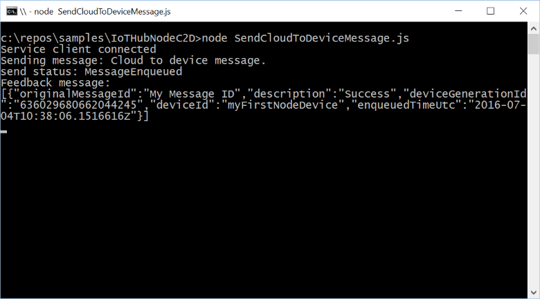

# Send cloud-to-device messages with IoT Hub (Node)

[!INCLUDE [iot-hub-selector-c2d](../../includes/iot-hub-selector-c2d.md)]

## Introduction

Azure IoT Hub is a fully managed service that helps enable reliable and secure bi-directional communications between millions of devices and a solution back end. The [Send telemetry from a device to an IoT hub](quickstart-send-telemetry-node.md) quickstart shows how to create an IoT hub, provision a device identity in it, and code a simulated device app that sends device-to-cloud messages.

[!INCLUDE [iot-hub-basic](../../includes/iot-hub-basic-whole.md)]

This tutorial builds on [Send telemetry from a device to an IoT hub](quickstart-send-telemetry-node.md). It shows you how to:

* From your solution back end, send cloud-to-device messages to a single device through IoT Hub.
* Receive cloud-to-device messages on a device.
* From your solution back end, request delivery acknowledgment (*feedback*) for messages sent to a device from IoT Hub.

You can find more information on cloud-to-device messages in the [IoT Hub developer guide](iot-hub-devguide-messaging.md).

At the end of this tutorial, you run two Node.js console apps:

* **SimulatedDevice**, a modified version of the app created in [Send telemetry from a device to an IoT hub](quickstart-send-telemetry-node.md), which connects to your IoT hub and receives cloud-to-device messages.

* **SendCloudToDeviceMessage**, which sends a cloud-to-device message to the simulated device app through IoT Hub, and then receives its delivery acknowledgment.

> [!NOTE]
> IoT Hub has SDK support for many device platforms and languages (including C, Java, and Javascript) through Azure IoT device SDKs. For step-by-step instructions on how to connect your device to this tutorial's code, and generally to Azure IoT Hub, see the [Azure IoT Developer Center](https://azure.microsoft.com/develop/iot).
>

To complete this tutorial, you need the following:

* Node.js version 10.0.x or later.
* An active Azure account. (If you don't have an account, you can create a [free account](https://azure.microsoft.com/pricing/free-trial) in just a couple of minutes.)

## Receive messages in the simulated device app

In this section, you modify the simulated device app you created in [Send telemetry from a device to an IoT hub](quickstart-send-telemetry-node.md) to receive cloud-to-device messages from the IoT hub.

1. Using a text editor, open the SimulatedDevice.js file.

2. Modify the **connectCallback** function to handle messages sent from IoT Hub. In this example, the device always invokes the **complete** function to notify IoT Hub that it has processed the message. Your new version of the **connectCallback** function looks like the following snippet:

    ```javascript
    var connectCallback = function (err) {
      if (err) {
        console.log('Could not connect: ' + err);
      } else {
        console.log('Client connected');
        client.on('message', function (msg) {
          console.log('Id: ' + msg.messageId + ' Body: ' + msg.data);
          client.complete(msg, printResultFor('completed'));
        });
        // Create a message and send it to the IoT Hub every second
        setInterval(function(){
            var temperature = 20 + (Math.random() * 15);
            var humidity = 60 + (Math.random() * 20);
            var data = JSON.stringify({ deviceId: 'myFirstNodeDevice', temperature: temperature, humidity: humidity });
            var message = new Message(data);
            message.properties.add('temperatureAlert', (temperature > 30) ? 'true' : 'false');
            console.log("Sending message: " + message.getData());
            client.sendEvent(message, printResultFor('send'));
        }, 1000);
      }
    };
    ```
  
   > [!NOTE]
   > If you use HTTPS instead of MQTT or AMQP as the transport, the **DeviceClient** instance checks for messages from IoT Hub infrequently (less than every 25 minutes). For more information about the differences between MQTT, AMQP and HTTPS support, and IoT Hub throttling, see the [IoT Hub developer guide](iot-hub-devguide-messaging.md).
   >

## Send a cloud-to-device message

In this section, you create a Node.js console app that sends cloud-to-device messages to the simulated device app. You need the device ID of the device you added in the [Send telemetry from a device to an IoT hub](quickstart-send-telemetry-node.md) quickstart. You also need the IoT Hub connection string for your hub that you can find in the [Azure portal](https://portal.azure.com).

1. Create an empty folder called **sendcloudtodevicemessage**. In the **sendcloudtodevicemessage** folder, create a package.json file using the following command at your command prompt. Accept all the defaults:

    ```shell
    npm init
    ```

2. At your command prompt in the **sendcloudtodevicemessage** folder, run the following command to install the **azure-iothub** package:

    ```shell
    npm install azure-iothub --save
    ```

3. Using a text editor, create a **SendCloudToDeviceMessage.js** file in the **sendcloudtodevicemessage** folder.

4. Add the following `require` statements at the start of the **SendCloudToDeviceMessage.js** file:

    ```javascript
    'use strict';

    var Client = require('azure-iothub').Client;
    var Message = require('azure-iot-common').Message;
    ```

5. Add the following code to **SendCloudToDeviceMessage.js** file. Replace the "{iot hub connection string}" placeholder value with the IoT Hub connection string for the hub you created in the [Send telemetry from a device to an IoT hub](quickstart-send-telemetry-node.md) quickstart. Replace the "{device id}" placeholder with the device ID of the device you added in the [Send telemetry from a device to an IoT hub](quickstart-send-telemetry-node.md) quickstart:

    ```javascript
    var connectionString = '{iot hub connection string}';
    var targetDevice = '{device id}';

    var serviceClient = Client.fromConnectionString(connectionString);
    ```

6. Add the following function to print operation results to the console:

    ```javascript
    function printResultFor(op) {
      return function printResult(err, res) {
        if (err) console.log(op + ' error: ' + err.toString());
        if (res) console.log(op + ' status: ' + res.constructor.name);
      };
    }
    ```

7. Add the following function to print delivery feedback messages to the console:

    ```javascript
    function receiveFeedback(err, receiver){
      receiver.on('message', function (msg) {
        console.log('Feedback message:')
        console.log(msg.getData().toString('utf-8'));
      });
    }
    ```

8. Add the following code to send a message to your device and handle the feedback message when the device acknowledges the cloud-to-device message:

    ```javascript
    serviceClient.open(function (err) {
      if (err) {
        console.error('Could not connect: ' + err.message);
      } else {
        console.log('Service client connected');
        serviceClient.getFeedbackReceiver(receiveFeedback);
        var message = new Message('Cloud to device message.');
        message.ack = 'full';
        message.messageId = "My Message ID";
        console.log('Sending message: ' + message.getData());
        serviceClient.send(targetDevice, message, printResultFor('send'));
      }
    });
    ```

9. Save and close **SendCloudToDeviceMessage.js** file.

## Run the applications

You are now ready to run the applications.

1. At the command prompt in the **simulateddevice** folder, run the following command to send telemetry to IoT Hub and to listen for cloud-to-device messages:

    ```shell
    node SimulatedDevice.js
    ```

    

2. At a command prompt in the **sendcloudtodevicemessage** folder, run the following command to send a cloud-to-device message and wait for the acknowledgment feedback:

    ```shell
    node SendCloudToDeviceMessage.js
    ```

    

   > [!NOTE]
   > For simplicity, this tutorial does not implement any retry policy. In production code, you should implement retry policies (such as exponential backoff), as suggested in the article, [Transient Fault Handling](/azure/architecture/best-practices/transient-faults).
   >

## Next steps

In this tutorial, you learned how to send and receive cloud-to-device messages.

To see examples of complete end-to-end solutions that use IoT Hub, see [Azure IoT Remote Monitoring solution accelerator](https://azure.microsoft.com/documentation/suites/iot-suite/).

To learn more about developing solutions with IoT Hub, see the [IoT Hub developer guide](iot-hub-devguide.md).
