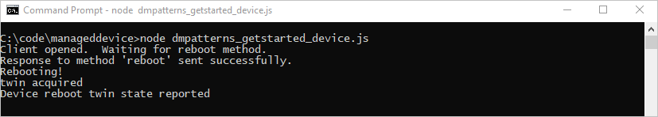
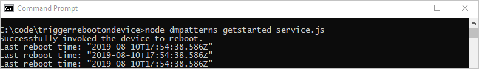

# Get started with device management (Node.js)

[!INCLUDE [iot-hub-selector-dm-getstarted](../../includes/iot-hub-selector-dm-getstarted.md)]

This tutorial shows you how to:

* Use the [Azure portal](https://portal.azure.com) to create an IoT Hub and create a device identity in your IoT hub.

* Create a simulated device app that contains a direct method that reboots that device. Direct methods are invoked from the cloud.

* Create a Node.js console app that calls the reboot direct method in the simulated device app through your IoT hub.

At the end of this tutorial, you have two Node.js console apps:

* **dmpatterns_getstarted_device.js**, which connects to your IoT hub with the device identity created earlier, receives a reboot direct method, simulates a physical reboot, and reports the time for the last reboot.

* **dmpatterns_getstarted_service.js**, which calls a direct method in the simulated device app, displays the response, and displays the updated reported properties.

## Prerequisites

* Node.js version 10.0.x or later. [Prepare your development environment](https://github.com/Azure/azure-iot-sdk-node/tree/master/doc/node-devbox-setup.md) describes how to install Node.js for this tutorial on either Windows or Linux.

* An active Azure account. (If you don't have an account, you can create a [free account](https://azure.microsoft.com/pricing/free-trial/) in just a couple of minutes.)

* Make sure that port 8883 is open in your firewall. The device sample in this article uses MQTT protocol, which communicates over port 8883. This port may be blocked in some corporate and educational network environments. For more information and ways to work around this issue, see [Connecting to IoT Hub (MQTT)](iot-hub-mqtt-support.md#connecting-to-iot-hub).

## Create an IoT hub

[!INCLUDE [iot-hub-include-create-hub](../../includes/iot-hub-include-create-hub.md)]

## Register a new device in the IoT hub

[!INCLUDE [iot-hub-get-started-create-device-identity](../../includes/iot-hub-get-started-create-device-identity.md)]

## Create a simulated device app

In this section, you:

* Create a Node.js console app that responds to a direct method called by the cloud

* Trigger a simulated device reboot

* Use the reported properties to enable device twin queries to identify devices and when they last rebooted

1. Create an empty folder called **manageddevice**.  In the **manageddevice** folder, create a package.json file using the following command at your command prompt.  Accept all the defaults:

    ```cmd/sh
    npm init
    ```

2. At your command prompt in the **manageddevice** folder, run the following command to install the **azure-iot-device** Device SDK package and **azure-iot-device-mqtt** package:

    ```cmd/sh
    npm install azure-iot-device azure-iot-device-mqtt --save
    ```

3. Using a text editor, create a **dmpatterns_getstarted_device.js** file in the **manageddevice** folder.

4. Add the following 'require' statements at the start of the **dmpatterns_getstarted_device.js** file:

    ```javascript
    'use strict';

    var Client = require('azure-iot-device').Client;
    var Protocol = require('azure-iot-device-mqtt').Mqtt;
    ```

5. Add a **connectionString** variable and use it to create a **Client** instance.  Replace the `{yourdeviceconnectionstring}` placeholder value with the device connection string you copied previously in [Register a new device in the IoT hub](#register-a-new-device-in-the-iot-hub).  

    ```javascript
    var connectionString = '{yourdeviceconnectionstring}';
    var client = Client.fromConnectionString(connectionString, Protocol);
    ```

6. Add the following function to implement the direct method on the device

    ```javascript
    var onReboot = function(request, response) {

        // Respond the cloud app for the direct method
        response.send(200, 'Reboot started', function(err) {
            if (err) {
                console.error('An error occurred when sending a method response:\n' + err.toString());
            } else {
                console.log('Response to method \'' + request.methodName + '\' sent successfully.');
            }
        });

        // Report the reboot before the physical restart
        var date = new Date();
        var patch = {
            iothubDM : {
                reboot : {
                    lastReboot : date.toISOString(),
                }
            }
        };

        // Get device Twin
        client.getTwin(function(err, twin) {
            if (err) {
                console.error('could not get twin');
            } else {
                console.log('twin acquired');
                twin.properties.reported.update(patch, function(err) {
                    if (err) throw err;
                    console.log('Device reboot twin state reported')
                });  
            }
        });

        // Add your device's reboot API for physical restart.
        console.log('Rebooting!');
    };
    ```

7. Open the connection to your IoT hub and start the direct method listener:

    ```javascript
    client.open(function(err) {
        if (err) {
            console.error('Could not open IotHub client');
        }  else {
            console.log('Client opened.  Waiting for reboot method.');
            client.onDeviceMethod('reboot', onReboot);
        }
    });
    ```

8. Save and close the **dmpatterns_getstarted_device.js** file.

> [!NOTE]
> To keep things simple, this tutorial does not implement any retry policy. In production code, you should implement retry policies (such as an exponential backoff), as suggested in the article, [Transient Fault Handling](/azure/architecture/best-practices/transient-faults).

## Get the IoT hub connection string

[!INCLUDE [iot-hub-howto-device-management-shared-access-policy-text](../../includes/iot-hub-howto-device-management-shared-access-policy-text.md)]

[!INCLUDE [iot-hub-include-find-service-connection-string](../../includes/iot-hub-include-find-service-connection-string.md)]

## Trigger a remote reboot on the device using a direct method

In this section, you create a Node.js console app that initiates a remote reboot on a device using a direct method. The app uses device twin queries to discover the last reboot time for that device.

1. Create an empty folder called **triggerrebootondevice**. In the **triggerrebootondevice** folder, create a package.json file using the following command at your command prompt. Accept all the defaults:

    ```cmd/sh
    npm init
    ```

2. At your command prompt in the **triggerrebootondevice** folder, run the following command to install the **azure-iothub** Device SDK package and **azure-iot-device-mqtt** package:

    ```cmd/sh
    npm install azure-iothub --save
    ```

3. Using a text editor, create a **dmpatterns_getstarted_service.js** file in the **triggerrebootondevice** folder.

4. Add the following 'require' statements at the start of the **dmpatterns_getstarted_service.js** file:

    ```javascript
    'use strict';

    var Registry = require('azure-iothub').Registry;
    var Client = require('azure-iothub').Client;
    ```

5. Add the following variable declarations and replace the `{iothubconnectionstring}` placeholder value with the IoT hub connection string you copied previously in [Get the IoT hub connection string](#get-the-iot-hub-connection-string):

    ```javascript
    var connectionString = '{iothubconnectionstring}';
    var registry = Registry.fromConnectionString(connectionString);
    var client = Client.fromConnectionString(connectionString);
    var deviceToReboot = 'myDeviceId';
    ```

6. Add the following function to invoke the device method to reboot the target device:

    ```javascript
    var startRebootDevice = function(twin) {

        var methodName = "reboot";

        var methodParams = {
            methodName: methodName,
            payload: null,
            timeoutInSeconds: 30
        };

        client.invokeDeviceMethod(deviceToReboot, methodParams, function(err, result) {
            if (err) {
                console.error("Direct method error: "+err.message);
            } else {
                console.log("Successfully invoked the device to reboot.");  
            }
        });
    };
    ```

7. Add the following function to query for the device and get the last reboot time:

    ```javascript
    var queryTwinLastReboot = function() {

        registry.getTwin(deviceToReboot, function(err, twin){

            if (twin.properties.reported.iothubDM != null)
            {
                if (err) {
                    console.error('Could not query twins: ' + err.constructor.name + ': ' + err.message);
                } else {
                    var lastRebootTime = twin.properties.reported.iothubDM.reboot.lastReboot;
                    console.log('Last reboot time: ' + JSON.stringify(lastRebootTime, null, 2));
                }
            } else 
                console.log('Waiting for device to report last reboot time.');
        });
    };
    ```

8. Add the following code to call the functions that trigger the reboot direct method and query for the last reboot time:

    ```javascript
    startRebootDevice();
    setInterval(queryTwinLastReboot, 2000);
    ```

9. Save and close the **dmpatterns_getstarted_service.js** file.

## Run the apps

You're now ready to run the apps.

1. At the command prompt in the **manageddevice** folder, run the following command to begin listening for the reboot direct method.

    ```cmd/sh
    node dmpatterns_getstarted_device.js
    ```

2. At the command prompt in the **triggerrebootondevice** folder, run the following command to trigger the remote reboot and query for the device twin to find the last reboot time.

    ```cmd/sh
    node dmpatterns_getstarted_service.js
    ```

3. You see the device response to the reboot direct method and the reboot status in the console.

   The following shows the device response to the reboot direct method sent by the service:

   

   The following shows the service triggering the reboot and polling the device twin for the last reboot time:

   

[!INCLUDE [iot-hub-dm-followup](../../includes/iot-hub-dm-followup.md)]
