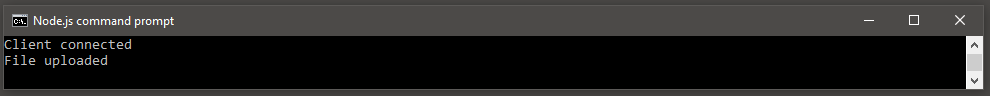
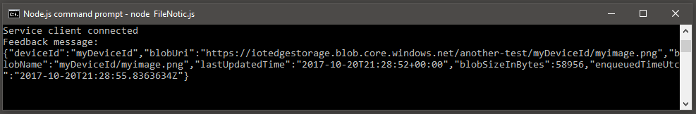
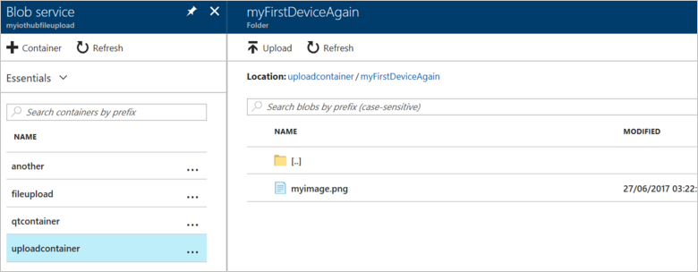

# Upload files from your device to the cloud with IoT Hub (Node.js)

[!INCLUDE [iot-hub-file-upload-language-selector](../../includes/iot-hub-file-upload-language-selector.md)]

This tutorial builds on the code in the [Send cloud-to-device messages with IoT Hub](iot-hub-node-node-c2d.md) tutorial to show you how to use the [file upload capabilities of IoT Hub](iot-hub-devguide-file-upload.md) to upload a file to [Azure blob storage](../storage/index.yml). The tutorial shows you how to:

* Securely provide a device with an Azure blob URI for uploading a file.

* Use the IoT Hub file upload notifications to trigger processing the file in your app back end.

The [Send telemetry from a device to an IoT hub](quickstart-send-telemetry-node.md) quickstart demonstrates the basic device-to-cloud messaging functionality of IoT Hub. However, in some scenarios you cannot easily map the data your devices send into the relatively small device-to-cloud messages that IoT Hub accepts. For example:

* Large files that contain images
* Videos
* Vibration data sampled at high frequency
* Some form of pre-processed data.

These files are typically batch processed in the cloud using tools such as [Azure Data Factory](../data-factory/introduction.md) or the [Hadoop](../hdinsight/index.yml) stack. When you need to upland files from a device, you can still use the security and reliability of IoT Hub.

At the end of this tutorial you run two Node.js console apps:

* **SimulatedDevice.js**, which uploads a file to storage using a SAS URI provided by your IoT hub.

* **ReadFileUploadNotification.js**, which receives file upload notifications from your IoT hub.

> [!NOTE]
> IoT Hub supports many device platforms and languages (including C, .NET, Javascript, Python, and Java) through Azure IoT device SDKs. Refer to the [Azure IoT Developer Center] for step-by-step instructions on how to connect your device to Azure IoT Hub.

## Prerequisites

* Node.js version 10.0.x or later. [Prepare your development environment](https://github.com/Azure/azure-iot-sdk-node/tree/master/doc/node-devbox-setup.md) describes how to install Node.js for this tutorial on either Windows or Linux.

* An active Azure account. (If you don't have an account, you can create a [free account](https://azure.microsoft.com/pricing/free-trial/) in just a couple of minutes.)

* Make sure that port 8883 is open in your firewall. The device sample in this article uses MQTT protocol, which communicates over port 8883. This port may be blocked in some corporate and educational network environments. For more information and ways to work around this issue, see [Connecting to IoT Hub (MQTT)](iot-hub-mqtt-support.md#connecting-to-iot-hub).

[!INCLUDE [iot-hub-associate-storage](../../includes/iot-hub-associate-storage.md)]

## Upload a file from a device app

In this section, you create the device app to upload a file to IoT hub.

1. Create an empty folder called ```simulateddevice```.  In the ```simulateddevice``` folder, create a package.json file using the following command at your command prompt.  Accept all the defaults:

    ```cmd/sh
    npm init
    ```

2. At your command prompt in the ```simulateddevice``` folder, run the following command to install the **azure-iot-device** Device SDK package and **azure-iot-device-mqtt** package:

    ```cmd/sh
    npm install azure-iot-device azure-iot-device-mqtt --save
    ```

3. Using a text editor, create a **SimulatedDevice.js** file in the ```simulateddevice``` folder.

4. Add the following ```require``` statements at the start of the **SimulatedDevice.js** file:

    ```javascript
    'use strict';

    var fs = require('fs');
    var mqtt = require('azure-iot-device-mqtt').Mqtt;
    var clientFromConnectionString = require('azure-iot-device-mqtt').clientFromConnectionString;
    ```

5. Add a `deviceconnectionstring` variable and use it to create a **Client** instance.  Replace `{deviceconnectionstring}` with the name of the device you created in the *Create an IoT Hub* section:

    ```javascript
    var connectionString = '{deviceconnectionstring}';
    var filename = 'myimage.png';
    ```

    > [!NOTE]
    > For the sake of simplicity the connection string is included in the code: this is not a recommended practice and depending on your use-case and architecture you may want to consider more secure ways of storing this secret.

6. Add the following code to connect the client:

    ```javascript
    var client = clientFromConnectionString(connectionString);
    console.log('Client connected');
    ```

7. Create a callback and use the **uploadToBlob** function to upload the file.

    ```javascript
    fs.stat(filename, function (err, stats) {
        const rr = fs.createReadStream(filename);

        client.uploadToBlob(filename, rr, stats.size, function (err) {
            if (err) {
                console.error('Error uploading file: ' + err.toString());
            } else {
                console.log('File uploaded');
            }
        });
    });
    ```

8. Save and close the **SimulatedDevice.js** file.

9. Copy an image file to the `simulateddevice` folder and rename it `myimage.png`.

## Get the IoT hub connection string

In this article you create a backend service to receive file upload notification messages from the IoT hub you created in [Send telemetry from a device to an IoT hub](quickstart-send-telemetry-node.md). To receive file upload notification messages, your service needs the **service connect** permission. By default, every IoT Hub is created with a shared access policy named **service** that grants this permission.

[!INCLUDE [iot-hub-include-find-service-connection-string](../../includes/iot-hub-include-find-service-connection-string.md)]

## Receive a file upload notification

In this section, you create a Node.js console app that receives file upload notification messages from IoT Hub.

You can use the **iothubowner** connection string from your IoT Hub to complete this section. You will find the connection string in the [Azure portal](https://portal.azure.com/) on the **Shared access policy** blade.

1. Create an empty folder called ```fileuploadnotification```.  In the ```fileuploadnotification``` folder, create a package.json file using the following command at your command prompt.  Accept all the defaults:

    ```cmd/sh
    npm init
    ```

2. At your command prompt in the ```fileuploadnotification``` folder, run the following command to install the **azure-iothub** SDK package:

    ```cmd/sh
    npm install azure-iothub --save
    ```

3. Using a text editor, create a **FileUploadNotification.js** file in the `fileuploadnotification` folder.

4. Add the following `require` statements at the start of the **FileUploadNotification.js** file:

    ```javascript
    'use strict';

    var Client = require('azure-iothub').Client;
    ```

5. Add a `iothubconnectionstring` variable and use it to create a **Client** instance.  Replace the `{iothubconnectionstring}` placeholder value with the IoT hub connection string that you copied previously in [Get the IoT hub connection string](#get-the-iot-hub-connection-string):

    ```javascript
    var connectionString = '{iothubconnectionstring}';
    ```

    > [!NOTE]
    > For the sake of simplicity the connection string is included in the code: this is not a recommended practice and depending on your use-case and architecture you may want to consider more secure ways of storing this secret.

6. Add the following code to connect the client:

    ```javascript
    var serviceClient = Client.fromConnectionString(connectionString);
    ```

7. Open the client and use the **getFileNotificationReceiver** function to receive status updates.

    ```javascript
    serviceClient.open(function (err) {
      if (err) {
        console.error('Could not connect: ' + err.message);
      } else {
        console.log('Service client connected');
        serviceClient.getFileNotificationReceiver(function receiveFileUploadNotification(err, receiver){
          if (err) {
            console.error('error getting the file notification receiver: ' + err.toString());
          } else {
            receiver.on('message', function (msg) {
              console.log('File upload from device:')
              console.log(msg.getData().toString('utf-8'));
            });
          }
        });
      }
    });
    ```

8. Save and close the **FileUploadNotification.js** file.

## Run the applications

Now you are ready to run the applications.

At a command prompt in the `fileuploadnotification` folder, run the following command:

```cmd/sh
node FileUploadNotification.js
```

At a command prompt in the `simulateddevice` folder, run the following command:

```cmd/sh
node SimulatedDevice.js
```

The following screenshot shows the output from the **SimulatedDevice** app:



The following screenshot shows the output from the **FileUploadNotification** app:



You can use the portal to view the uploaded file in the storage container you configured:



## Next steps

In this tutorial, you learned how to use the file upload capabilities of IoT Hub to simplify file uploads from devices. You can continue to explore IoT hub features and scenarios with the following articles:

* [Create an IoT hub programmatically](iot-hub-rm-template-powershell.md)

* [Introduction to C SDK](iot-hub-device-sdk-c-intro.md)

* [Azure IoT SDKs](iot-hub-devguide-sdks.md)
