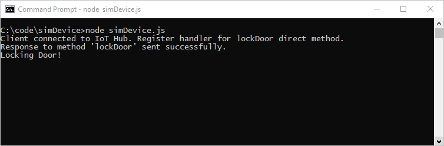
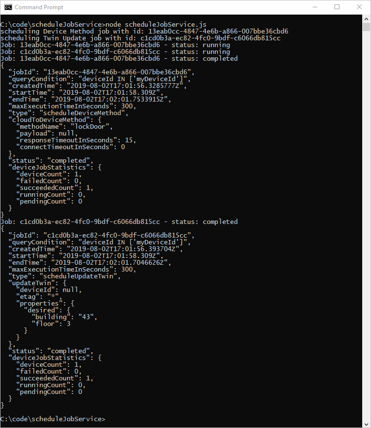

# Schedule and broadcast jobs (Node.js)

[!INCLUDE [iot-hub-selector-schedule-jobs](../../includes/iot-hub-selector-schedule-jobs.md)]

Azure IoT Hub is a fully managed service that enables a back-end app to create and track jobs that schedule and update millions of devices.  Jobs can be used for the following actions:

* Update desired properties
* Update tags
* Invoke direct methods

Conceptually, a job wraps one of these actions and tracks the progress of execution against a set of devices, which is defined by a device twin query.  For example, a back-end app can use a job to invoke a reboot method on 10,000 devices, specified by a device twin query and scheduled at a future time. That application can then track progress as each of those devices receive and execute the reboot method.

Learn more about each of these capabilities in these articles:

* Device twin and properties: [Get started with device twins](iot-hub-node-node-twin-getstarted.md) and [Tutorial: How to use device twin properties](tutorial-device-twins.md)

* Direct methods: [IoT Hub developer guide - direct methods](iot-hub-devguide-direct-methods.md) and [Tutorial: direct methods](quickstart-control-device-node.md)

[!INCLUDE [iot-hub-basic](../../includes/iot-hub-basic-whole.md)]

This tutorial shows you how to:

* Create a Node.js simulated device app that has a direct method, which enables **lockDoor**, which can be called by the solution back end.

* Create a Node.js console app that calls the **lockDoor** direct method in the simulated device app using a job and updates the desired properties using a device job.

At the end of this tutorial, you have two Node.js apps:

* **simDevice.js**, which connects to your IoT hub with the device identity and receives a **lockDoor** direct method.

* **scheduleJobService.js**, which calls a direct method in the simulated device app and updates the device twin's desired properties using a job.

## Prerequisites

* Node.js version 10.0.x or later. [Prepare your development environment](https://github.com/Azure/azure-iot-sdk-node/tree/master/doc/node-devbox-setup.md) describes how to install Node.js for this tutorial on either Windows or Linux.

* An active Azure account. (If you don't have an account, you can create a [free account](https://azure.microsoft.com/pricing/free-trial/) in just a couple of minutes.)

* Make sure that port 8883 is open in your firewall. The device sample in this article uses MQTT protocol, which communicates over port 8883. This port may be blocked in some corporate and educational network environments. For more information and ways to work around this issue, see [Connecting to IoT Hub (MQTT)](iot-hub-mqtt-support.md#connecting-to-iot-hub).

## Create an IoT hub

[!INCLUDE [iot-hub-include-create-hub](../../includes/iot-hub-include-create-hub.md)]

## Register a new device in the IoT hub

[!INCLUDE [iot-hub-get-started-create-device-identity](../../includes/iot-hub-get-started-create-device-identity.md)]

## Create a simulated device app

In this section, you create a Node.js console app that responds to a direct method called by the cloud, which triggers a simulated **lockDoor** method.

1. Create a new empty folder called **simDevice**.  In the **simDevice** folder, create a package.json file using the following command at your command prompt.  Accept all the defaults:

   ```console
   npm init
   ```

2. At your command prompt in the **simDevice** folder, run the following command to install the **azure-iot-device** Device SDK package and **azure-iot-device-mqtt** package:

   ```console
   npm install azure-iot-device azure-iot-device-mqtt --save
   ```

3. Using a text editor, create a new **simDevice.js** file in the **simDevice** folder.

4. Add the following 'require' statements at the start of the **simDevice.js** file:

    ```javascript
    'use strict';

    var Client = require('azure-iot-device').Client;
    var Protocol = require('azure-iot-device-mqtt').Mqtt;
    ```

5. Add a **connectionString** variable and use it to create a **Client** instance. Replace the `{yourDeviceConnectionString}` placeholder value with the device connection string you copied previously.

    ```javascript
    var connectionString = '{yourDeviceConnectionString}';
    var client = Client.fromConnectionString(connectionString, Protocol);
    ```

6. Add the following function to handle the **lockDoor** method.

    ```javascript
    var onLockDoor = function(request, response) {

        // Respond the cloud app for the direct method
        response.send(200, function(err) {
            if (err) {
                console.error('An error occurred when sending a method response:\n' + err.toString());
            } else {
                console.log('Response to method \'' + request.methodName + '\' sent successfully.');
            }
        });

        console.log('Locking Door!');
    };
    ```

7. Add the following code to register the handler for the **lockDoor** method.

   ```javascript
   client.open(function(err) {
        if (err) {
            console.error('Could not connect to IotHub client.');
        }  else {
            console.log('Client connected to IoT Hub. Register handler for lockDoor direct method.');
            client.onDeviceMethod('lockDoor', onLockDoor);
        }
   });
   ```

8. Save and close the **simDevice.js** file.

> [!NOTE]
> To keep things simple, this tutorial does not implement any retry policy. In production code, you should implement retry policies (such as an exponential backoff), as suggested in the article, [Transient Fault Handling](/azure/architecture/best-practices/transient-faults).
>

## Get the IoT hub connection string

[!INCLUDE [iot-hub-howto-schedule-jobs-shared-access-policy-text](../../includes/iot-hub-howto-schedule-jobs-shared-access-policy-text.md)]

[!INCLUDE [iot-hub-include-find-registryrw-connection-string](../../includes/iot-hub-include-find-registryrw-connection-string.md)]

## Schedule jobs for calling a direct method and updating a device twin's properties

In this section, you create a Node.js console app that initiates a remote **lockDoor** on a device using a direct method and update the device twin's properties.

1. Create a new empty folder called **scheduleJobService**.  In the **scheduleJobService** folder, create a package.json file using the following command at your command prompt.  Accept all the defaults:

    ```console
    npm init
    ```

2. At your command prompt in the **scheduleJobService** folder, run the following command to install the **azure-iothub** Device SDK package and **azure-iot-device-mqtt** package:

    ```console
    npm install azure-iothub uuid --save
    ```

3. Using a text editor, create a new **scheduleJobService.js** file in the **scheduleJobService** folder.

4. Add the following 'require' statements at the start of the **scheduleJobService.js** file:

    ```javascript
    'use strict';

    var uuid = require('uuid');
    var JobClient = require('azure-iothub').JobClient;
    ```

5. Add the following variable declarations. Replace the `{iothubconnectionstring}` placeholder value with the value you copied in [Get the IoT hub connection string](#get-the-iot-hub-connection-string). If you registered a device different than **myDeviceId**, be sure to change it in the query condition.

    ```javascript
    var connectionString = '{iothubconnectionstring}';
    var queryCondition = "deviceId IN ['myDeviceId']";
    var startTime = new Date();
    var maxExecutionTimeInSeconds =  300;
    var jobClient = JobClient.fromConnectionString(connectionString);
    ```

6. Add the following function that is used to monitor the execution of the job:

    ```javascript
    function monitorJob (jobId, callback) {
        var jobMonitorInterval = setInterval(function() {
            jobClient.getJob(jobId, function(err, result) {
            if (err) {
                console.error('Could not get job status: ' + err.message);
            } else {
                console.log('Job: ' + jobId + ' - status: ' + result.status);
                if (result.status === 'completed' || result.status === 'failed' || result.status === 'cancelled') {
                clearInterval(jobMonitorInterval);
                callback(null, result);
                }
            }
            });
        }, 5000);
    }
    ```

7. Add the following code to schedule the job that calls the device method:
  
    ```javascript
    var methodParams = {
        methodName: 'lockDoor',
        payload: null,
        responseTimeoutInSeconds: 15 // Timeout after 15 seconds if device is unable to process method
    };

    var methodJobId = uuid.v4();
    console.log('scheduling Device Method job with id: ' + methodJobId);
    jobClient.scheduleDeviceMethod(methodJobId,
                                queryCondition,
                                methodParams,
                                startTime,
                                maxExecutionTimeInSeconds,
                                function(err) {
        if (err) {
            console.error('Could not schedule device method job: ' + err.message);
        } else {
            monitorJob(methodJobId, function(err, result) {
                if (err) {
                    console.error('Could not monitor device method job: ' + err.message);
                } else {
                    console.log(JSON.stringify(result, null, 2));
                }
            });
        }
    });
    ```

8. Add the following code to schedule the job to update the device twin:

    ```javascript
    var twinPatch = {
       etag: '*',
       properties: {
           desired: {
               building: '43',
               floor: 3
           }
       }
    };

    var twinJobId = uuid.v4();

    console.log('scheduling Twin Update job with id: ' + twinJobId);
    jobClient.scheduleTwinUpdate(twinJobId,
                                queryCondition,
                                twinPatch,
                                startTime,
                                maxExecutionTimeInSeconds,
                                function(err) {
        if (err) {
            console.error('Could not schedule twin update job: ' + err.message);
        } else {
            monitorJob(twinJobId, function(err, result) {
                if (err) {
                    console.error('Could not monitor twin update job: ' + err.message);
                } else {
                    console.log(JSON.stringify(result, null, 2));
                }
            });
        }
    });
    ```

9. Save and close the **scheduleJobService.js** file.

## Run the applications

You are now ready to run the applications.

1. At the command prompt in the **simDevice** folder, run the following command to begin listening for the reboot direct method.

    ```console
    node simDevice.js
    ```

2. At the command prompt in the **scheduleJobService** folder, run the following command to trigger the jobs to lock the door and update the twin

    ```console
    node scheduleJobService.js
    ```

3. You see the device response to the direct method and the job status in the console.

   The following shows the device response to the direct method:

   

   The following shows the service scheduling jobs for the direct method and device twin update, and the jobs running to completion:

   

## Next steps

In this tutorial, you used a job to schedule a direct method to a device and the update of the device twin's properties.

To continue getting started with IoT Hub and device management patterns such as remote over the air firmware update, see [Tutorial: How to do a firmware update](tutorial-firmware-update.md).

To continue getting started with IoT Hub, see [Getting started with Azure IoT Edge](../iot-edge/tutorial-simulate-device-linux.md).
