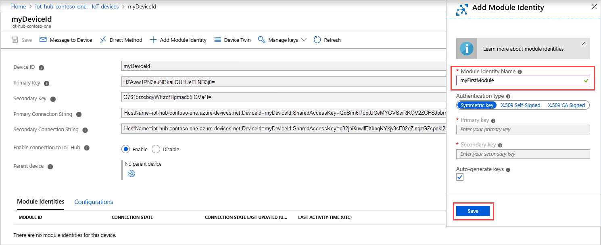
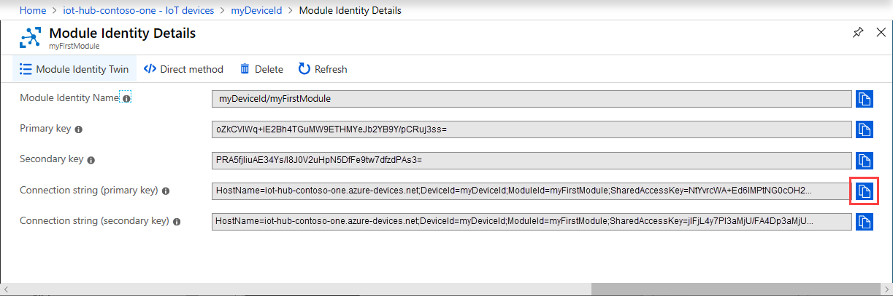
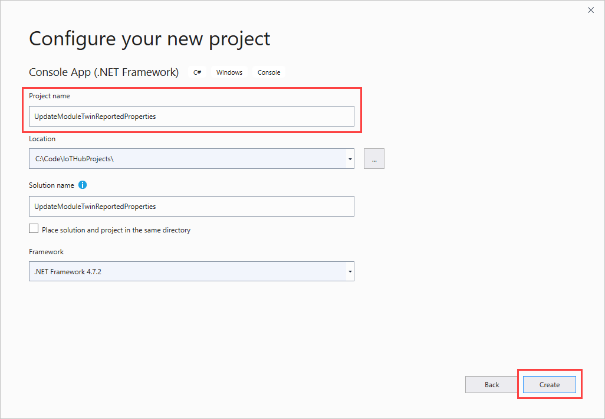

# Get started with IoT Hub module identity and module twin using the portal and .NET device

[!INCLUDE [iot-hub-selector-module-twin-getstarted](../../includes/iot-hub-selector-module-twin-getstarted.md)]

> [!NOTE]
> [Module identities and module twins](iot-hub-devguide-module-twins.md) are similar to Azure IoT Hub device identity and device twin, but provide finer granularity. While Azure IoT Hub device identity and device twin enable the back-end application to configure a device and provide visibility on the device's conditions, a module identity and module twin provide these capabilities for individual components of a device. On capable devices with multiple components, such as operating system based devices or firmware devices, module identities and module twins allow for isolated configuration and conditions for each component.
>

In this tutorial, you will learn:

* How to create a module identity in the portal.

* How to use a .NET device SDK to update the module twin from your device.

> [!NOTE]
> For information about the Azure IoT SDKs that you can use to build both applications to run on devices and your solution back end, see [Azure IoT SDKs](iot-hub-devguide-sdks.md).
>

## Prerequisites

* Visual Studio.

* An active Azure account. If you don't have an account, you can create a [free account](https://azure.microsoft.com/pricing/free-trial/) in just a couple of minutes.

## Create a hub

[!INCLUDE [iot-hub-include-create-hub](../../includes/iot-hub-include-create-hub.md)]

## Register a new device in the hub

[!INCLUDE [iot-hub-include-create-device](../../includes/iot-hub-include-create-device.md)]

## Create a module identity in the portal

Within one device identity, you can create up to 20 module identities. To add an identity, follow these steps:

1. For the device you created in the previous section, choose **Add Module Identity** to create your first module identity.

1. Enter the name *myFirstModule*. Save your module identity.

    

    Your new module identity appears at the bottom of the screen. Select it to see module identity details.

    

Save the **Connect string - primary key**. You use it in the next section to you set up your module on the device.

## Update the module twin using .NET device SDK

You've successfully created the module identity in your IoT Hub. Let's try to communicate to the cloud from your simulated device. Once a module identity is created, a module twin is implicitly created in IoT Hub. In this section, you will create a .NET console app on your simulated device that updates the module twin reported properties.

### Create a Visual Studio project

To create an app that updates the module twin reported properties, follow these steps:

1. In Visual Studio, select **Create a new project**, then choose **Console App (.NET Framework)**, and select **Next**.

1. In **Configure your new project**, enter *UpdateModuleTwinReportedProperties* as the **Project name**. Select **Create** to continue.

    

### Install the latest Azure IoT Hub .NET device SDK

Module identity and module twin is in public preview. It's only available in the IoT Hub pre-release device SDKs. To install it, follow these steps:

1. In Visual Studio, open **Tools** > **NuGet Package Manager** > **Manage NuGet Packages for Solution**.

1. Select **Browse**, and then select **Include prerelease**. Search for *Microsoft.Azure.Devices.Client*. Select the latest version and install.

    

    Now you have access to all the module features.

### Get your module connection string

You need the module connection string for your console app. Follow these steps:

1. Sign in to the [Azure portal](https://portal.azure.com/).

1. Navigate to your IoT hub and select **IoT Devices**. Open **myFirstDevice** and you see that **myFirstModule** was successfully created.

1. Select **myFirstModule** under **Module Identities**. In **Module Identity Details**, copy the **Connection string (primary key)**.

    

### Create UpdateModuleTwinReportedProperties console app

To create your app, follow these steps:

1. Add the following `using` statements at the top of the **Program.cs** file:

  ```csharp
  using Microsoft.Azure.Devices.Client;
  using Microsoft.Azure.Devices.Shared;
  using Newtonsoft.Json;
  ```

2. Add the following fields to the **Program** class. Replace the placeholder value with the module connection string.

  ```csharp
  private const string ModuleConnectionString = "<Your module connection string>";
  private static ModuleClient Client = null;
  ```

3. Add the following method **OnDesiredPropertyChanged** to the **Program** class:

  ```csharp
  private static async Task OnDesiredPropertyChanged(TwinCollection desiredProperties, object userContext)
      {
          Console.WriteLine("desired property change:");
          Console.WriteLine(JsonConvert.SerializeObject(desiredProperties));
          Console.WriteLine("Sending current time as reported property");
          TwinCollection reportedProperties = new TwinCollection
          {
              ["DateTimeLastDesiredPropertyChangeReceived"] = DateTime.Now
          };
  
          await Client.UpdateReportedPropertiesAsync(reportedProperties).ConfigureAwait(false);
      }
  ```

4. Finally, replace the **Main** method with the following code:

  ```csharp
  static void Main(string[] args)
  {
      Microsoft.Azure.Devices.Client.TransportType transport = Microsoft.Azure.Devices.Client.TransportType.Amqp;
  
      try
      {
          Client = ModuleClient.CreateFromConnectionString(ModuleConnectionString, transport);
          Client.SetConnectionStatusChangesHandler(ConnectionStatusChangeHandler);
          Client.SetDesiredPropertyUpdateCallbackAsync(OnDesiredPropertyChanged, null).Wait();
  
          Console.WriteLine("Retrieving twin");
          var twinTask = Client.GetTwinAsync();
          twinTask.Wait();
          var twin = twinTask.Result;
          Console.WriteLine(JsonConvert.SerializeObject(twin));
  
          Console.WriteLine("Sending app start time as reported property");
          TwinCollection reportedProperties = new TwinCollection();
          reportedProperties["DateTimeLastAppLaunch"] = DateTime.Now;
  
          Client.UpdateReportedPropertiesAsync(reportedProperties);
      }
      catch (AggregateException ex)
      {
          Console.WriteLine("Error in sample: {0}", ex);
      }
  
      Console.WriteLine("Waiting for Events.  Press enter to exit...");
      Console.ReadKey();
      Client.CloseAsync().Wait();
  }
  
  private static void ConnectionStatusChangeHandler(ConnectionStatus status, ConnectionStatusChangeReason reason)
  {
      Console.WriteLine($"Status {status} changed: {reason}");
  }
  ```
  
  You can build and run this app by using **F5**.

This code sample shows you how to retrieve the module twin and update reported properties with AMQP protocol. In public preview, we only support AMQP for module twin operations.

## Next steps

To continue getting started with IoT Hub and to explore other IoT scenarios, see:

* [Get started with IoT Hub module identity and module twin using .NET backup and .NET device](iot-hub-csharp-csharp-module-twin-getstarted.md)

* [Getting started with IoT Edge](../iot-edge/tutorial-simulate-device-linux.md)
