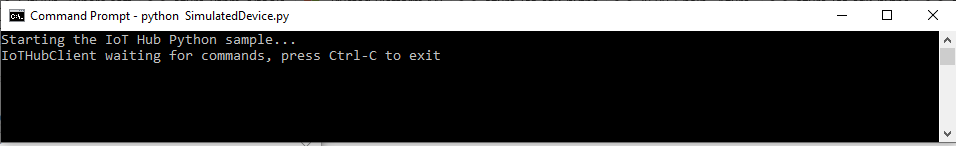
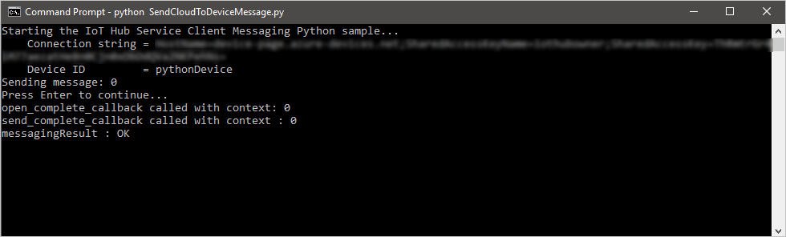
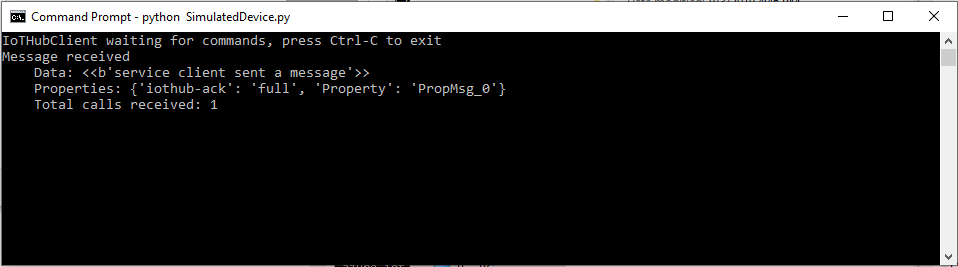

# Send cloud-to-device messages with IoT Hub (Python)

[!INCLUDE [iot-hub-selector-c2d](../../includes/iot-hub-selector-c2d.md)]

## Introduction

Azure IoT Hub is a fully managed service that helps enable reliable and secure bi-directional communications between millions of devices and a solution back end. The [Send telemetry from a device to an IoT hub](quickstart-send-telemetry-python.md) quickstart shows how to create an IoT hub, provision a device identity in it, and code a simulated device app that sends device-to-cloud messages.

[!INCLUDE [iot-hub-basic](../../includes/iot-hub-basic-whole.md)]

This tutorial builds on [Send telemetry from a device to an IoT hub](quickstart-send-telemetry-python.md). It shows you how to:

* From your solution back end, send cloud-to-device messages to a single device through IoT Hub.

* Receive cloud-to-device messages on a device.

* From your solution back end, request delivery acknowledgment (*feedback*) for messages sent to a device from IoT Hub.

You can find more information on cloud-to-device messages in the [IoT Hub developer guide](iot-hub-devguide-messaging.md).

At the end of this tutorial, you run two Python console apps:

* **SimulatedDevice.py**, a modified version of the app created in [Send telemetry from a device to an IoT hub](quickstart-send-telemetry-python.md), which connects to your IoT hub and receives cloud-to-device messages.

* **SendCloudToDeviceMessage.py**, which sends a cloud-to-device message to the simulated device app through IoT Hub, and then receives its delivery acknowledgment.

[!INCLUDE [iot-hub-include-python-sdk-note](../../includes/iot-hub-include-python-sdk-note.md)]

The following are the installation instructions for the prerequisites. For this how-to, you do not need to install the service-client package.

[!INCLUDE [iot-hub-include-python-installation-notes](../../includes/iot-hub-include-python-installation-notes.md)]

## Receive messages in the simulated device app

In this section, you create a Python console app to simulate the device and receive cloud-to-device messages from the IoT hub.

1. Using a text editor, create a **SimulatedDevice.py** file.

2. Add the following `import` statements and variables at the start of the **SimulatedDevice.py** file:

   ```python
    import time
    import sys
    import iothub_client
    from iothub_client import IoTHubClient, IoTHubClientError, IoTHubTransportProvider, IoTHubClientResult
    from iothub_client import IoTHubMessage, IoTHubMessageDispositionResult, IoTHubError

    RECEIVE_CONTEXT = 0
    WAIT_COUNT = 10
    RECEIVED_COUNT = 0
    RECEIVE_CALLBACKS = 0
    ```

3. Add the following code to **SimulatedDevice.py** file. Replace the "{deviceConnectionString}" placeholder value with the device connection string for the device you created in the [Send telemetry from a device to an IoT hub](quickstart-send-telemetry-python.md) quickstart:

    ```python
    # choose AMQP or AMQP_WS as transport protocol
    PROTOCOL = IoTHubTransportProvider.AMQP
    CONNECTION_STRING = "{deviceConnectionString}"
    ```

4. Add the following function to print received messages to the console:

    ```python
    def receive_message_callback(message, counter):
        global RECEIVE_CALLBACKS
        message_buffer = message.get_bytearray()
        size = len(message_buffer)
        print ( "Received Message [%d]:" % counter )
        print ( "    Data: <<<%s>>> & Size=%d" % (message_buffer[:size].decode('utf-8'), size) )
        map_properties = message.properties()
        key_value_pair = map_properties.get_internals()
        print ( "    Properties: %s" % key_value_pair )
        counter += 1
        RECEIVE_CALLBACKS += 1
        print ( "    Total calls received: %d" % RECEIVE_CALLBACKS )
        return IoTHubMessageDispositionResult.ACCEPTED

    def iothub_client_init():
        client = IoTHubClient(CONNECTION_STRING, PROTOCOL)

        client.set_message_callback(receive_message_callback, RECEIVE_CONTEXT)

        return client

    def print_last_message_time(client):
        try:
            last_message = client.get_last_message_receive_time()
            print ( "Last Message: %s" % time.asctime(time.localtime(last_message)) )
            print ( "Actual time : %s" % time.asctime() )
        except IoTHubClientError as iothub_client_error:
            if iothub_client_error.args[0].result == IoTHubClientResult.INDEFINITE_TIME:
                print ( "No message received" )
            else:
                print ( iothub_client_error )
    ```

5. Add the following code to initialize the client and wait to receive the cloud-to-device message:

    ```python
    def iothub_client_init():
        client = IoTHubClient(CONNECTION_STRING, PROTOCOL)

        client.set_message_callback(receive_message_callback, RECEIVE_CONTEXT)

        return client

    def iothub_client_sample_run():
        try:
            client = iothub_client_init()

            while True:
                print ( "IoTHubClient waiting for commands, press Ctrl-C to exit" )

                status_counter = 0
                while status_counter <= WAIT_COUNT:
                    status = client.get_send_status()
                    print ( "Send status: %s" % status )
                    time.sleep(10)
                    status_counter += 1

        except IoTHubError as iothub_error:
            print ( "Unexpected error %s from IoTHub" % iothub_error )
            return
        except KeyboardInterrupt:
            print ( "IoTHubClient sample stopped" )

        print_last_message_time(client)
    ```

6. Add the following main function:

    ```python
    if __name__ == '__main__':
        print ( "Starting the IoT Hub Python sample..." )
        print ( "    Protocol %s" % PROTOCOL )
        print ( "    Connection string=%s" % CONNECTION_STRING )

        iothub_client_sample_run()
    ```

7. Save and close **SimulatedDevice.py** file.

## Get the IoT hub connection string

In this article you create a backend service to send cloud-to-device messages through the IoT hub you created in [Send telemetry from a device to an IoT hub](quickstart-send-telemetry-python.md). To send cloud-to-device messages, your service needs the **service connect** permission. By default, every IoT Hub is created with a shared access policy named **service** that grants this permission.

[!INCLUDE [iot-hub-include-find-service-connection-string](../../includes/iot-hub-include-find-service-connection-string.md)]

## Send a cloud-to-device message

In this section, you create a Python console app that sends cloud-to-device messages to the simulated device app. You need the device ID of the device you added in the [Send telemetry from a device to an IoT hub](quickstart-send-telemetry-python.md) quickstart. You also need the the IoT hub connection string you copied previously in [Get the IoT hub connection string](#get-the-iot-hub-connection-string).

1. Using a text editor, create a **SendCloudToDeviceMessage.py** file.

2. Add the following `import` statements and variables at the start of the **SendCloudToDeviceMessage.py** file:

    ```python
    import random
    import sys
    import iothub_service_client
    from iothub_service_client import IoTHubMessaging, IoTHubMessage, IoTHubError

    OPEN_CONTEXT = 0
    FEEDBACK_CONTEXT = 1
    MESSAGE_COUNT = 1
    AVG_WIND_SPEED = 10.0
    MSG_TXT = "{\"service client sent a message\": %.2f}"
    ```

3. Add the following code to **SendCloudToDeviceMessage.py** file. Replace the "{iot hub connection string}" and "{device id}" placeholder values with the IoT hub connection string and device ID you noted previously:

    ```python
    CONNECTION_STRING = "{IoTHubConnectionString}"
    DEVICE_ID = "{deviceId}"
    ```

4. Add the following function to print feedback messages to the console:

    ```python
    def open_complete_callback(context):
        print ( 'open_complete_callback called with context: {0}'.format(context) )

    def send_complete_callback(context, messaging_result):
        context = 0
        print ( 'send_complete_callback called with context : {0}'.format(context) )
        print ( 'messagingResult : {0}'.format(messaging_result) )
    ```

5. Add the following code to send a message to your device and handle the feedback message when the device acknowledges the cloud-to-device message:

    ```python
    def iothub_messaging_sample_run():
        try:
            iothub_messaging = IoTHubMessaging(CONNECTION_STRING)

            iothub_messaging.open(open_complete_callback, OPEN_CONTEXT)

            for i in range(0, MESSAGE_COUNT):
                print ( 'Sending message: {0}'.format(i) )
                msg_txt_formatted = MSG_TXT % (AVG_WIND_SPEED + (random.random() * 4 + 2))
                message = IoTHubMessage(bytearray(msg_txt_formatted, 'utf8'))

                # optional: assign ids
                message.message_id = "message_%d" % i
                message.correlation_id = "correlation_%d" % i
                # optional: assign properties
                prop_map = message.properties()
                prop_text = "PropMsg_%d" % i
                prop_map.add("Property", prop_text)

                iothub_messaging.send_async(DEVICE_ID, message, send_complete_callback, i)

            try:
                # Try Python 2.xx first
                raw_input("Press Enter to continue...\n")
            except:
                pass
                # Use Python 3.xx in the case of exception
                input("Press Enter to continue...\n")

            iothub_messaging.close()

        except IoTHubError as iothub_error:
            print ( "Unexpected error {0}" % iothub_error )
            return
        except KeyboardInterrupt:
            print ( "IoTHubMessaging sample stopped" )
    ```

6. Add the following main function:

    ```python
    if __name__ == '__main__':
        print ( "Starting the IoT Hub Service Client Messaging Python sample..." )
        print ( "    Connection string = {0}".format(CONNECTION_STRING) )
        print ( "    Device ID         = {0}".format(DEVICE_ID) )

        iothub_messaging_sample_run()
    ```

7. Save and close **SendCloudToDeviceMessage.py** file.

## Run the applications

You are now ready to run the applications.

1. Open a command prompt and install the **Azure IoT Hub Device SDK for Python**.

    ```shell
    pip install azure-iothub-device-client
    ```

2. At the command prompt, run the following command to listen for cloud-to-device messages:

    ```shell
    python SimulatedDevice.py
    ```

    

3. Open a new command prompt and install the **Azure IoT Hub Service SDK for Python**.

    ```shell
    pip install azure-iothub-service-client
    ```

4. At a command prompt, run the following command to send a cloud-to-device message and wait for the message feedback:

    ```shell
    python SendCloudToDeviceMessage.py
    ```

    

5. Note the message received by the device.

    

## Next steps

In this tutorial, you learned how to send and receive cloud-to-device messages.

To see examples of complete end-to-end solutions that use IoT Hub, see [Azure IoT Remote Monitoring solution accelerator](https://azure.microsoft.com/documentation/suites/iot-suite/).

To learn more about developing solutions with IoT Hub, see the [IoT Hub developer guide](iot-hub-devguide.md).
