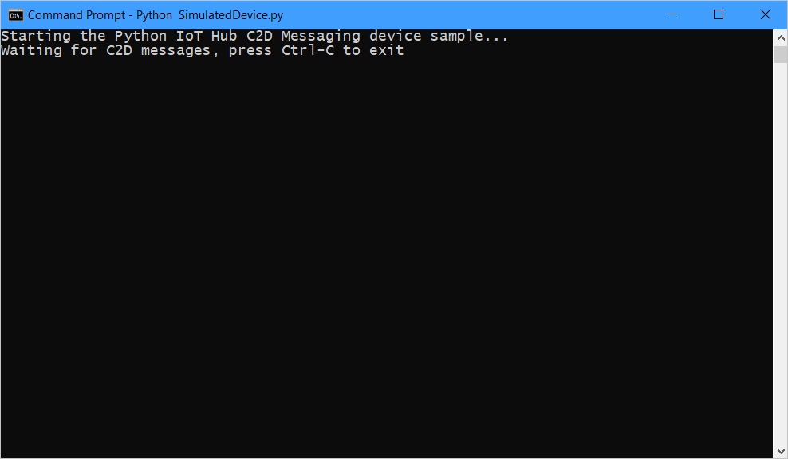
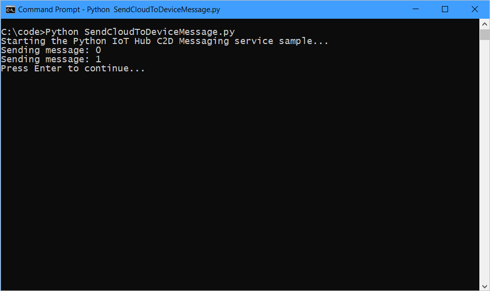
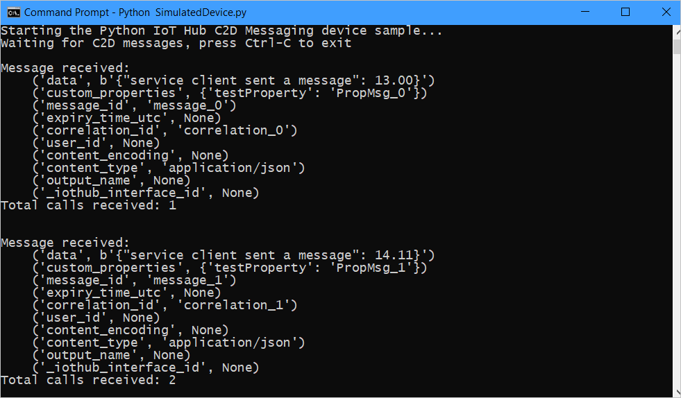

# Send cloud-to-device messages with IoT Hub (Python)

[!INCLUDE [iot-hub-selector-c2d](../../includes/iot-hub-selector-c2d.md)]

Azure IoT Hub is a fully managed service that helps enable reliable and secure bi-directional communications between millions of devices and a solution back end. The [Send telemetry from a device to an IoT hub](quickstart-send-telemetry-python.md) quickstart shows how to create an IoT hub, provision a device identity in it, and code a simulated device app that sends device-to-cloud messages.

[!INCLUDE [iot-hub-basic](../../includes/iot-hub-basic-whole.md)]

This tutorial builds on [Send telemetry from a device to an IoT hub](quickstart-send-telemetry-python.md). It shows you how to:

* From your solution back end, send cloud-to-device messages to a single device through IoT Hub.

* Receive cloud-to-device messages on a device.

You can find more information on cloud-to-device messages in the [IoT Hub developer guide](iot-hub-devguide-messaging.md).

At the end of this tutorial, you run two Python console apps:

* **SimulatedDevice.py**, a modified version of the app created in [Send telemetry from a device to an IoT hub](quickstart-send-telemetry-python.md), which connects to your IoT hub and receives cloud-to-device messages.

* **SendCloudToDeviceMessage.py**, which sends cloud-to-device messages to the simulated device app through IoT Hub.

[!INCLUDE [iot-hub-include-python-sdk-note](../../includes/iot-hub-include-python-sdk-note.md)]

## Prerequisites

[!INCLUDE [iot-hub-include-python-v2-installation-notes](../../includes/iot-hub-include-python-v2-installation-notes.md)]

* Make sure that port 8883 is open in your firewall. The device sample in this article uses MQTT protocol, which communicates over port 8883. This port may be blocked in some corporate and educational network environments. For more information and ways to work around this issue, see [Connecting to IoT Hub (MQTT)](iot-hub-mqtt-support.md#connecting-to-iot-hub).

## Receive messages in the simulated device app

In this section, you create a Python console app to simulate the device and receive cloud-to-device messages from the IoT hub.

1. From a command prompt in your working directory, install the **Azure IoT Hub Device SDK for Python**:

    ```cmd/sh
    pip install azure-iot-device
    ```

1. Using a text editor, create a file named **SimulatedDevice.py**.

1. Add the following `import` statements and variables at the start of the **SimulatedDevice.py** file:

    ```python
    import threading
    import time
    from azure.iot.device import IoTHubDeviceClient

    RECEIVED_MESSAGES = 0
    ```

1. Add the following code to **SimulatedDevice.py** file. Replace the `{deviceConnectionString}` placeholder value with the device connection string for the device you created in the [Send telemetry from a device to an IoT hub](quickstart-send-telemetry-python.md) quickstart:

    ```python
    CONNECTION_STRING = "{deviceConnectionString}"
    ```

1. Add the following function to print received messages to the console:

    ```python
    def message_listener(client):
        global RECEIVED_MESSAGES
        while True:
            message = client.receive_message()
            RECEIVED_MESSAGES += 1
            print("\nMessage received:")

            #print data and both system and application (custom) properties
            for property in vars(message).items():
                print ("    {0}".format(property))

            print( "Total calls received: {}".format(RECEIVED_MESSAGES))
            print()
    ```

1. Add the following code to initialize the client and wait to receive the cloud-to-device message:

    ```python
    def iothub_client_sample_run():
        try:
            client = IoTHubDeviceClient.create_from_connection_string(CONNECTION_STRING)

            message_listener_thread = threading.Thread(target=message_listener, args=(client,))
            message_listener_thread.daemon = True
            message_listener_thread.start()

            while True:
                time.sleep(1000)

        except KeyboardInterrupt:
            print ( "IoT Hub C2D Messaging device sample stopped" )
    ```

1. Add the following main function:

    ```python
    if __name__ == '__main__':
        print ( "Starting the Python IoT Hub C2D Messaging device sample..." )
        print ( "Waiting for C2D messages, press Ctrl-C to exit" )

        iothub_client_sample_run()
    ```

1. Save and close the **SimulatedDevice.py** file.

## Get the IoT hub connection string

In this article, you create a backend service to send cloud-to-device messages through the IoT hub you created in [Send telemetry from a device to an IoT hub](quickstart-send-telemetry-python.md). To send cloud-to-device messages, your service needs the **service connect** permission. By default, every IoT Hub is created with a shared access policy named **service** that grants this permission.

[!INCLUDE [iot-hub-include-find-service-connection-string](../../includes/iot-hub-include-find-service-connection-string.md)]

## Send a cloud-to-device message

In this section, you create a Python console app that sends cloud-to-device messages to the simulated device app. You need the device ID of the device you added in the [Send telemetry from a device to an IoT hub](quickstart-send-telemetry-python.md) quickstart. You also need the IoT hub connection string you copied previously in [Get the IoT hub connection string](#get-the-iot-hub-connection-string).

1. In your working directory, open a command prompt and install the **Azure IoT Hub Service SDK for Python**.

   ```cmd/sh
   pip install azure-iot-hub
   ```

1. Using a text editor, create a file named **SendCloudToDeviceMessage.py**.

1. Add the following `import` statements and variables at the start of the **SendCloudToDeviceMessage.py** file:

    ```python
    import random
    import sys
    from azure.iot.hub import IoTHubRegistryManager

    MESSAGE_COUNT = 2
    AVG_WIND_SPEED = 10.0
    MSG_TXT = "{\"service client sent a message\": %.2f}"
    ```

1. Add the following code to **SendCloudToDeviceMessage.py** file. Replace the `{iot hub connection string}` and `{device id}` placeholder values with the IoT hub connection string and device ID you noted previously:

    ```python
    CONNECTION_STRING = "{IoTHubConnectionString}"
    DEVICE_ID = "{deviceId}"
    ```

1. Add the following code to send messages to your device:

    ```python
    def iothub_messaging_sample_run():
        try:
            # Create IoTHubRegistryManager
            registry_manager = IoTHubRegistryManager(CONNECTION_STRING)

            for i in range(0, MESSAGE_COUNT):
                print ( 'Sending message: {0}'.format(i) )
                data = MSG_TXT % (AVG_WIND_SPEED + (random.random() * 4 + 2))

                props={}
                # optional: assign system properties
                props.update(messageId = "message_%d" % i)
                props.update(correlationId = "correlation_%d" % i)
                props.update(contentType = "application/json")

                # optional: assign application properties
                prop_text = "PropMsg_%d" % i
                props.update(testProperty = prop_text)

                registry_manager.send_c2d_message(DEVICE_ID, data, properties=props)

            try:
                # Try Python 2.xx first
                raw_input("Press Enter to continue...\n")
            except:
                pass
                # Use Python 3.xx in the case of exception
                input("Press Enter to continue...\n")

        except Exception as ex:
            print ( "Unexpected error {0}" % ex )
            return
        except KeyboardInterrupt:
            print ( "IoT Hub C2D Messaging service sample stopped" )
    ```

1. Add the following main function:

    ```python
    if __name__ == '__main__':
        print ( "Starting the Python IoT Hub C2D Messaging service sample..." )

        iothub_messaging_sample_run()
    ```

1. Save and close **SendCloudToDeviceMessage.py** file.

## Run the applications

You are now ready to run the applications.

1. At the command prompt in your working directory, run the following command to listen for cloud-to-device messages:

    ```shell
    python SimulatedDevice.py
    ```

    

1. Open a new command prompt in your working directory and run the following command to send cloud-to-device messages:

    ```shell
    python SendCloudToDeviceMessage.py
    ```

    

1. Note the messages received by the device.

    

## Next steps

In this tutorial, you learned how to send and receive cloud-to-device messages.

To see examples of complete end-to-end solutions that use IoT Hub, see [Azure IoT Remote Monitoring solution accelerator](https://azure.microsoft.com/documentation/suites/iot-suite/).

To learn more about developing solutions with IoT Hub, see the [IoT Hub developer guide](iot-hub-devguide.md).
