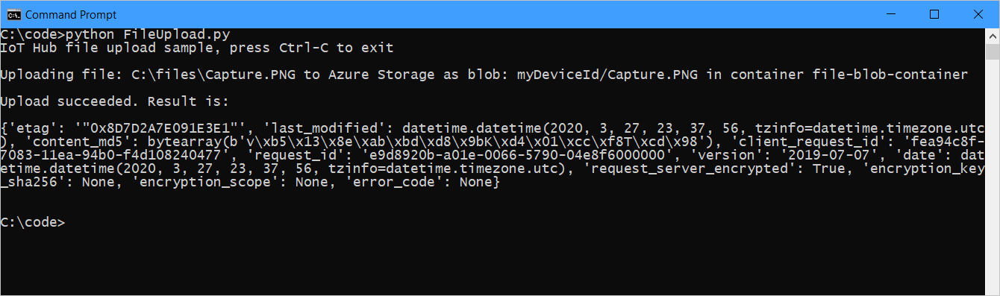
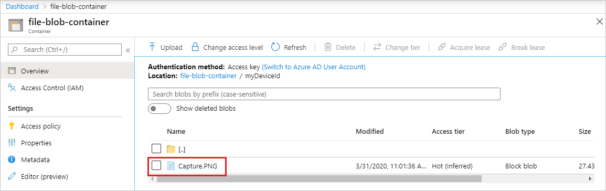

# Upload files from your device to the cloud with IoT Hub (Python)

[!INCLUDE [iot-hub-file-upload-language-selector](../../includes/iot-hub-file-upload-language-selector.md)]

This article shows how to use the [file upload capabilities of IoT Hub](iot-hub-devguide-file-upload.md) to upload a file to [Azure blob storage](../storage/index.yml). The tutorial shows you how to:

* Securely provide a storage container for uploading a file.

* Use the Python client to upload a file through your IoT hub.

The [Send telemetry from a device to an IoT hub](quickstart-send-telemetry-python.md) quickstart demonstrates the basic device-to-cloud messaging functionality of IoT Hub. However, in some scenarios you cannot easily map the data your devices send into the relatively small device-to-cloud messages that IoT Hub accepts. When you need to upland files from a device, you can still use the security and reliability of IoT Hub.

At the end of this tutorial, you run the Python console app:

* **FileUpload.py**, which uploads a file to storage using the Python Device SDK.

[!INCLUDE [iot-hub-include-python-sdk-note](../../includes/iot-hub-include-python-sdk-note.md)]

## Prerequisites

[!INCLUDE [iot-hub-include-python-v2-async-installation-notes](../../includes/iot-hub-include-python-v2-async-installation-notes.md)]

* Make sure that port 8883 is open in your firewall. The device sample in this article uses MQTT protocol, which communicates over port 8883. This port may be blocked in some corporate and educational network environments. For more information and ways to work around this issue, see [Connecting to IoT Hub (MQTT)](iot-hub-mqtt-support.md#connecting-to-iot-hub).

[!INCLUDE [iot-hub-associate-storage](../../includes/iot-hub-associate-storage.md)]

## Upload a file from a device app

In this section, you create the device app to upload a file to IoT hub.

1. At your command prompt, run the following command to install the **azure-iot-device** package. You use this package to coordinate the file upload with your IoT hub.

    ```cmd/sh
    pip install azure-iot-device
    ```

1. At your command prompt, run the following command to install the [**azure.storage.blob**](https://pypi.org/project/azure-storage-blob/) package. You use this package to perform the file upload.

    ```cmd/sh
    pip install azure.storage.blob
    ```

1. Create a test file that you'll upload to blob storage.

1. Using a text editor, create a **FileUpload.py** file in your working folder.

1. Add the following `import` statements and variables at the start of the **FileUpload.py** file.

    ```python
    import os
    import asyncio
    from azure.iot.device.aio import IoTHubDeviceClient
    from azure.core.exceptions import AzureError
    from azure.storage.blob import BlobClient

    CONNECTION_STRING = "[Device Connection String]"
    PATH_TO_FILE = r"[Full path to local file]"
    ```

1. In your file, replace `[Device Connection String]` with the connection string of your IoT hub device. Replace `[Full path to local file]` with the path to the test file that you created or any file on your device that you want to upload.

1. Create a function to upload the file to blob storage:

    ```python
    async def store_blob(blob_info, file_name):
        try:
            sas_url = "https://{}/{}/{}{}".format(
                blob_info["hostName"],
                blob_info["containerName"],
                blob_info["blobName"],
                blob_info["sasToken"]
            )

            print("\nUploading file: {} to Azure Storage as blob: {} in container {}\n".format(file_name, blob_info["blobName"], blob_info["containerName"]))

            # Upload the specified file
            with BlobClient.from_blob_url(sas_url) as blob_client:
                with open(file_name, "rb") as f:
                    result = blob_client.upload_blob(f, overwrite=True)
                    return (True, result)

        except FileNotFoundError as ex:
            # catch file not found and add an HTTP status code to return in notification to IoT Hub
            ex.status_code = 404
            return (False, ex)

        except AzureError as ex:
            # catch Azure errors that might result from the upload operation
            return (False, ex)
    ```

    This function parses the *blob_info* structure passed into it to create a URL that it uses to initialize an [azure.storage.blob.BlobClient](https://docs.microsoft.com/python/api/azure-storage-blob/azure.storage.blob.blobclient?view=azure-python). Then it uploads your file to Azure blob storage using this client.

1. Add the following code to connect the client and upload the file:

    ```python
    async def main():
        try:
            print ( "IoT Hub file upload sample, press Ctrl-C to exit" )

            conn_str = CONNECTION_STRING
            file_name = PATH_TO_FILE
            blob_name = os.path.basename(file_name)

            device_client = IoTHubDeviceClient.create_from_connection_string(conn_str)

            # Connect the client
            await device_client.connect()

            # Get the storage info for the blob
            storage_info = await device_client.get_storage_info_for_blob(blob_name)

            # Upload to blob
            success, result = await store_blob(storage_info, file_name)

            if success == True:
                print("Upload succeeded. Result is: \n") 
                print(result)
                print()

                await device_client.notify_blob_upload_status(
                    storage_info["correlationId"], True, 200, "OK: {}".format(file_name)
                )

            else :
                # If the upload was not successful, the result is the exception object
                print("Upload failed. Exception is: \n") 
                print(result)
                print()

                await device_client.notify_blob_upload_status(
                    storage_info["correlationId"], False, result.status_code, str(result)
                )

        except Exception as ex:
            print("\nException:")
            print(ex)

        except KeyboardInterrupt:
            print ( "\nIoTHubDeviceClient sample stopped" )

        finally:
            # Finally, disconnect the client
            await device_client.disconnect()


    if __name__ == "__main__":
        asyncio.run(main())
        #loop = asyncio.get_event_loop()
        #loop.run_until_complete(main())
        #loop.close()
    ```

    This code creates an asynchronous **IoTHubDeviceClient** and uses the following APIs to manage the file upload with your IoT hub:

    * **get_storage_info_for_blob** gets information from your IoT hub about the linked Storage Account you created previously. This information includes the hostname, container name, blob name, and a SAS token. The storage info is passed to the **store_blob** function (created in the previous step), so the **BlobClient** in that function can authenticate with Azure storage. The **get_storage_info_for_blob** method also returns a correlation_id, which is used in the **notify_blob_upload_status** method. The correlation_id is IoT Hub's way of marking which blob you're working on.

    * **notify_blob_upload_status** notifies IoT Hub of the status of your blob storage operation. You pass it the correlation_id obtained by the **get_storage_info_for_blob** method. It's used by IoT Hub to notify any service that might be listening for a notification on the status of the file upload task.

1. Save and close the **UploadFile.py** file.

## Run the application

Now you're ready to run the application.

1. At a command prompt in your working folder, run the following command:

    ```cmd/sh
    python FileUpload.py
    ```

2. The following screenshot shows the output from the **FileUpload** app:

    

3. You can use the portal to view the uploaded file in the storage container you configured:

    

## Next steps

In this tutorial, you learned how to use the file upload capabilities of IoT Hub to simplify file uploads from devices. You can continue to explore IoT hub features and scenarios with the following articles:

* [Create an IoT hub programmatically](iot-hub-rm-template-powershell.md)

* [Introduction to C SDK](iot-hub-device-sdk-c-intro.md)

* [Azure IoT SDKs](iot-hub-devguide-sdks.md)

Learn more about Azure Blob Storage with the following links:

* [Azure Blob Storage documentation](https://docs.microsoft.com/azure/storage/blobs/)

* [Azure Blob Storage for Python API documentation](https://docs.microsoft.com/python/api/overview/azure/storage-blob-readme?view=azure-python)
