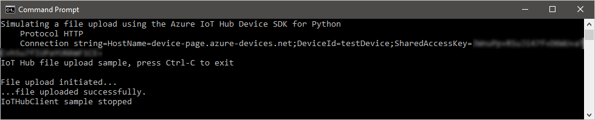
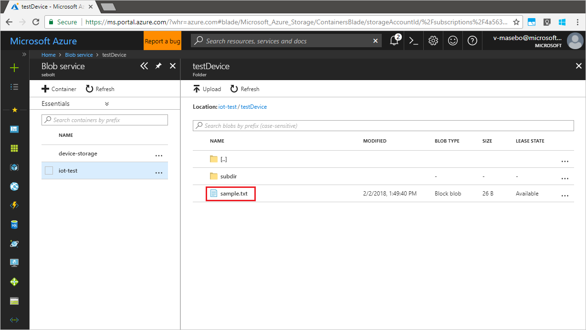

# Upload files from your device to the cloud with IoT Hub

[!INCLUDE [iot-hub-file-upload-language-selector](../../includes/iot-hub-file-upload-language-selector.md)]

This tutorial follows how to use the [file upload capabilities of IoT Hub](iot-hub-devguide-file-upload.md) to upload a file to [Azure blob storage](../storage/index.yml). The tutorial shows you how to:

- Securely provide a storage container for uploading a file.
- Use the Python client to upload a file through your IoT hub.

The [Get started with IoT Hub](quickstart-send-telemetry-node.md) tutorial demonstrates the basic device-to-cloud messaging functionality of IoT Hub. However, in some scenarios you cannot easily map the data your devices send into the relatively small device-to-cloud messages that IoT Hub accepts. When you need to upland files from a device, you can still use the security and reliability of IoT Hub.

> [!NOTE]
> IoT Hub Python SDK currently only supports uploading character-based files such as **.txt** files.

At the end of this tutorial you run the Python console app:

* **FileUpload.py**, which uploads a file to storage using the Python Device SDK.

> [!NOTE]
> IoT Hub supports many device platforms and languages (including C, .NET, Javascript, Python, and Java) through Azure IoT device SDKs. Refer to the [Azure IoT Developer Center] for step-by-step instructions on how to connect your device to Azure IoT Hub.

To complete this tutorial, you need the following:

* [Python 2.x or 3.x][lnk-python-download]. Make sure to use the 32-bit or 64-bit installation as required by your setup. When prompted during the installation, make sure to add Python to your platform-specific environment variable. If you are using Python 2.x, you may need to [install or upgrade *pip*, the Python package management system][lnk-install-pip].
* If you are using Windows OS, then [Visual C++ redistributable package][lnk-visual-c-redist] to allow the use of native DLLs from Python.
* An active Azure account. (If you don't have an account, you can create a [free account](http://azure.microsoft.com/pricing/free-trial/) in just a couple of minutes.)


[!INCLUDE [iot-hub-get-started-create-hub](../../includes/iot-hub-get-started-create-hub.md)]

[!INCLUDE [iot-hub-get-started-create-device-identity](../../includes/iot-hub-get-started-create-device-identity-portal.md)]

[!INCLUDE [iot-hub-associate-storage](../../includes/iot-hub-associate-storage.md)]


## Upload a file from a device app

In this section, you create the device app to upload a file to IoT hub.

1. At your command prompt, run the following command to install the **azure-iothub-device-client** package:

    ```cmd/sh
    pip install azure-iothub-device-client
    ```

1. Using a text editor, create a **FileUpload.py** file in your working folder.

1. Add the following `import` statements and variables at the start of the **FileUpload.py** file. Replace `deviceConnectionString` with the connection string of your IoT hub device:

    ```python
    import time
    import sys
    import iothub_client
    import os
    from iothub_client import IoTHubClient, IoTHubClientError, IoTHubTransportProvider, IoTHubClientResult, IoTHubError

    CONNECTION_STRING = "[Device Connection String]"
    PROTOCOL = IoTHubTransportProvider.HTTP

    PATHTOFILE = "[Full path to file]"
    FILENAME = "[File name on storage after upload]"
    ```

1. Create a callback for the **upload_blob** function:

    ```python
    def blob_upload_conf_callback(result, user_context):
        if str(result) == 'OK':
            print ( "...file uploaded successfully." )
        else:
            print ( "...file upload callback returned: " + str(result) )
    ```

1. Add the following code to connect the client and upload the file. Also include the `main` routine:

    ```python
    def iothub_file_upload_sample_run():
        try:
            print ( "IoT Hub file upload sample, press Ctrl-C to exit" )

            client = IoTHubClient(CONNECTION_STRING, PROTOCOL)

            f = open(PATHTOFILE, "r")
            content = f.read()

            client.upload_blob_async(FILENAME, content, len(content), blob_upload_conf_callback, 0)

            print ( "" )
            print ( "File upload initiated..." )

            while True:
                time.sleep(30)

        except IoTHubError as iothub_error:
            print ( "Unexpected error %s from IoTHub" % iothub_error )
            return
        except KeyboardInterrupt:
            print ( "IoTHubClient sample stopped" )
        except:
            print ( "generic error" )

    if __name__ == '__main__':
        print ( "Simulating a file upload using the Azure IoT Hub Device SDK for Python" )
        print ( "    Protocol %s" % PROTOCOL )
        print ( "    Connection string=%s" % CONNECTION_STRING )

        iothub_file_upload_sample_run()
    ```

1. Save and close the **UploadFile.py** file.

1. Copy a sample text file to the working folder and rename it `sample.txt`.

    > [!NOTE]
    > IoT Hub Python SDK currently only supports uploading character-based files such as **.txt** files.


## Run the application

Now you are ready to run the application.

1. At a command prompt in your working folder, run the following command:

    ```cmd/sh
    python FileUpload.py
    ```

1. The following screenshot shows the output from the **FileUpload** app:

    

1. You can use the portal to view the uploaded file in the storage container you configured:

    


## Next steps

In this tutorial, you learned how to use the file upload capabilities of IoT Hub to simplify file uploads from devices. You can continue to explore IoT hub features and scenarios with the following articles:

* [Create an IoT hub programmatically][lnk-create-hub]
* [Introduction to C SDK][lnk-c-sdk]
* [Azure IoT SDKs][lnk-sdks]

<!-- Links -->
[Azure IoT Developer Center]: http://azure.microsoft.com/develop/iot

[lnk-create-hub]: iot-hub-rm-template-powershell.md
[lnk-c-sdk]: iot-hub-device-sdk-c-intro.md
[lnk-sdks]: iot-hub-devguide-sdks.md
[lnk-python-download]: https://www.python.org/downloads/
[lnk-visual-c-redist]: http://www.microsoft.com/download/confirmation.aspx?id=48145
[lnk-install-pip]: https://pip.pypa.io/en/stable/installing/
