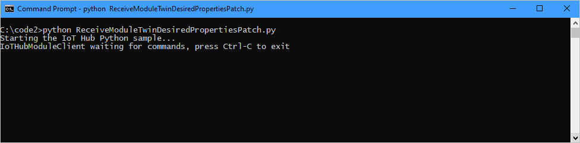
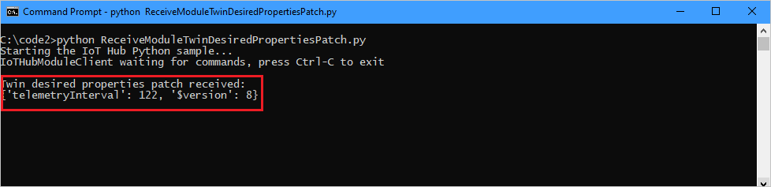

# Get started with IoT Hub module identity and module twin (Python)

[!INCLUDE [iot-hub-selector-module-twin-getstarted](../../includes/iot-hub-selector-module-twin-getstarted.md)]

> [!NOTE]
> [Module identities and module twins](iot-hub-devguide-module-twins.md) are similar to Azure IoT Hub device identities and device twins, but provide finer granularity. While Azure IoT Hub device identities and device twins enable a back-end application to configure a device and provide visibility on the device's conditions, module identities and module twins provide these capabilities for individual components of a device. On capable devices with multiple components, such as operating system based devices or firmware devices, they allow for isolated configuration and conditions for each component.
>

At the end of this tutorial, you have three Python apps:

* **CreateModule**, which creates a device identity, a module identity, and associated security keys to connect your device and module clients.

* **UpdateModuleTwinDesiredProperties**, which sends updated module twin desired properties to your IoT Hub.

* **ReceiveModuleTwinDesiredPropertiesPatch**, which receives the module twin desired properties patch on your device.

[!INCLUDE [iot-hub-include-python-sdk-note](../../includes/iot-hub-include-python-sdk-note.md)]

## Prerequisites

[!INCLUDE [iot-hub-include-python-v2-installation-notes](../../includes/iot-hub-include-python-v2-installation-notes.md)]

## Create an IoT hub

[!INCLUDE [iot-hub-include-create-hub](../../includes/iot-hub-include-create-hub.md)]

## Get the IoT hub connection string

In this article, you create a back-end service that adds a device in the identity registry and then adds a module to that device. This service requires the **registry write** permission (which also includes **registry read**). You also create a service that adds desired properties to the module twin for the newly created module. This service needs the **service connect** permission. Although there are default shared access policies that grant these permissions individually, in this section, you create a custom shared access policy that contains both of these permissions.

[!INCLUDE [iot-hub-include-find-service-regrw-connection-string](../../includes/iot-hub-include-find-service-regrw-connection-string.md)]

## Create a device identity and a module identity in IoT Hub

In this section, you create a Python service app that creates a device identity and a module identity in the identity registry in your IoT hub. A device or module can't connect to IoT hub unless it has an entry in the identity registry. For more information, see [Understand the identity registry in your IoT hub](iot-hub-devguide-identity-registry.md). When you run this console app, it generates a unique ID and key for both device and module. Your device and module use these values to identify itself when it sends device-to-cloud messages to IoT Hub. The IDs are case-sensitive.

1. At your command prompt, run the following command to install the **azure-iot-hub** package:

    ```cmd/sh
    pip install azure-iot-hub
    ```

1. At your command prompt, run the following command to install the **msrest** package. You need this package to catch **HTTPOperationError** exceptions.

    ```cmd/sh
    pip install msrest
    ```

1. Using a text editor, create a file named **CreateModule.py** in your working directory.

1. Add the following code to your Python file. Replace *YourIoTHubConnectionString* with the connection string you copied in [Get the IoT hub connection string](#get-the-iot-hub-connection-string).

    ```python
    import sys
    from msrest.exceptions import HttpOperationError
    from azure.iot.hub import IoTHubRegistryManager

    CONNECTION_STRING = "YourIotHubConnectionString"
    DEVICE_ID = "myFirstDevice"
    MODULE_ID = "myFirstModule"

    try:
        # RegistryManager
        iothub_registry_manager = IoTHubRegistryManager(CONNECTION_STRING)

        try:
            # CreateDevice - let IoT Hub assign keys
            primary_key = ""
            secondary_key = ""
            device_state = "enabled"
            new_device = iothub_registry_manager.create_device_with_sas(
                DEVICE_ID, primary_key, secondary_key, device_state
            )
        except HttpOperationError as ex:
            if ex.response.status_code == 409:
                # 409 indicates a conflict. This happens because the device already exists.
                new_device = iothub_registry_manager.get_device(DEVICE_ID)
            else:
                raise

        print("device <" + DEVICE_ID +
              "> has primary key = " + new_device.authentication.symmetric_key.primary_key)

        try:
            # CreateModule - let IoT Hub assign keys
            primary_key = ""
            secondary_key = ""
            managed_by = ""
            new_module = iothub_registry_manager.create_module_with_sas(
                DEVICE_ID, MODULE_ID, managed_by, primary_key, secondary_key
            )
        except HttpOperationError as ex:
            if ex.response.status_code == 409:
                # 409 indicates a conflict. This happens because the module already exists.
                new_module = iothub_registry_manager.get_module(DEVICE_ID, MODULE_ID)
            else:
                raise

        print("device/module <" + DEVICE_ID + "/" + MODULE_ID +
              "> has primary key = " + new_module.authentication.symmetric_key.primary_key)

    except Exception as ex:
        print("Unexpected error {0}".format(ex))
    except KeyboardInterrupt:
        print("IoTHubRegistryManager sample stopped")
    ```

1. At your command prompt, run the following command:

    ```cmd/sh
    python CreateModule.py
    ```

This app creates a device identity with ID **myFirstDevice** and a module identity with ID **myFirstModule** under device **myFirstDevice**. (If the device or module ID already exists in the identity registry, the code simply retrieves the existing device or module information.) The app displays the ID and primary key for each identity.

> [!NOTE]
> The IoT Hub identity registry only stores device and module identities to enable secure access to the IoT hub. The identity registry stores device IDs and keys to use as security credentials. The identity registry also stores an enabled/disabled flag for each device that you can use to disable access for that device. If your application needs to store other device-specific metadata, it should use an application-specific store. There is no enabled/disabled flag for module identities. For more information, see [Understand the identity registry in your IoT hub](iot-hub-devguide-identity-registry.md).
>

## Update the module twin using Python service SDK

In this section, you create a Python service app that updates the module twin desired properties.

1. At your command prompt, run the following command to install the **azure-iot-hub** package. You can skip this step if you installed the **azure-iot-hub** package in the previous section.

    ```cmd/sh
    pip install azure-iot-hub
    ```

1. Using a text editor, create a file named **UpdateModuleTwinDesiredProperties.py** in your working directory.

1. Add the following code to your Python file. Replace *YourIoTHubConnectionString* with the connection string you copied in [Get the IoT hub connection string](#get-the-iot-hub-connection-string).

    ```python
    import sys
    from azure.iot.hub import IoTHubRegistryManager
    from azure.iot.hub.models import Twin, TwinProperties

    CONNECTION_STRING = "YourIoTHubConnectionString"
    DEVICE_ID = "myFirstDevice"
    MODULE_ID = "myFirstModule"

    try:
        # RegistryManager
        iothub_registry_manager = IoTHubRegistryManager(CONNECTION_STRING)

        module_twin = iothub_registry_manager.get_module_twin(DEVICE_ID, MODULE_ID)
        print ( "" )
        print ( "Module twin properties before update    :" )
        print ( "{0}".format(module_twin.properties) )

        # Update twin
        twin_patch = Twin()
        twin_patch.properties = TwinProperties(desired={"telemetryInterval": 122})
        updated_module_twin = iothub_registry_manager.update_module_twin(
            DEVICE_ID, MODULE_ID, twin_patch, module_twin.etag
        )
        print ( "" )
        print ( "Module twin properties after update     :" )
        print ( "{0}".format(updated_module_twin.properties) )

    except Exception as ex:
        print ( "Unexpected error {0}".format(ex) )
    except KeyboardInterrupt:
        print ( "IoTHubRegistryManager sample stopped" )
    ```

## Get updates on the device side

In this section, you create a Python app to get the module twin desired properties update on your device.

1. Get your module connection string. In [Azure portal](https://portal.azure.com/), navigate to your IoT Hub and select **IoT devices** in the left pane. Select **myFirstDevice** from the list of devices and open it. Under **Module identities**, select **myFirstModule**. Copy the module connection string. You need it in a following step.

   

1. At your command prompt, run the following command to install the **azure-iot-device** package:

    ```cmd/sh
    pip install azure-iot-device
    ```

1. Using a text editor, create a file named **ReceiveModuleTwinDesiredPropertiesPatch.py** in your working directory.

1. Add the following code to your Python file. Replace *YourModuleConnectionString* with the module connection string you copied in step 1.

    ```python
    import time
    import threading
    from azure.iot.device import IoTHubModuleClient

    CONNECTION_STRING = "YourModuleConnectionString"


    def twin_update_listener(client):
        while True:
            patch = client.receive_twin_desired_properties_patch()  # blocking call
            print("")
            print("Twin desired properties patch received:")
            print(patch)

    def iothub_client_sample_run():
        try:
            module_client = IoTHubModuleClient.create_from_connection_string(CONNECTION_STRING)

            twin_update_listener_thread = threading.Thread(target=twin_update_listener, args=(module_client,))
            twin_update_listener_thread.daemon = True
            twin_update_listener_thread.start()

            while True:
                time.sleep(1000000)

        except KeyboardInterrupt:
            print("IoTHubModuleClient sample stopped")


    if __name__ == '__main__':
        print ( "Starting the IoT Hub Python sample..." )
        print ( "IoTHubModuleClient waiting for commands, press Ctrl-C to exit" )

        iothub_client_sample_run()
    ```

## Run the apps

In this section, you run the **ReceiveModuleTwinDesiredPropertiesPatch** device app and then run the **UpdateModuleTwinDesiredProperties** service app to update the desired properties of your module.

1. Open a command prompt and run the device app:

    ```cmd/sh
    python ReceiveModuleTwinDesiredPropertiesPatch.py
    ```

   

1. Open a separate command prompt and run the service app:

    ```cmd/sh
    python UpdateModuleTwinDesiredProperties.py
    ```

    Notice that the **TelemetryInterval** desired property appears in the updated module twin in your service app output:

   

    The same property appears in the desired properties patch received in your device app output:

   

## Next steps

To continue getting started with IoT Hub and to explore other IoT scenarios, see:

* [Getting started with device management](iot-hub-node-node-device-management-get-started.md)

* [Getting started with IoT Edge](../iot-edge/tutorial-simulate-device-linux.md)
