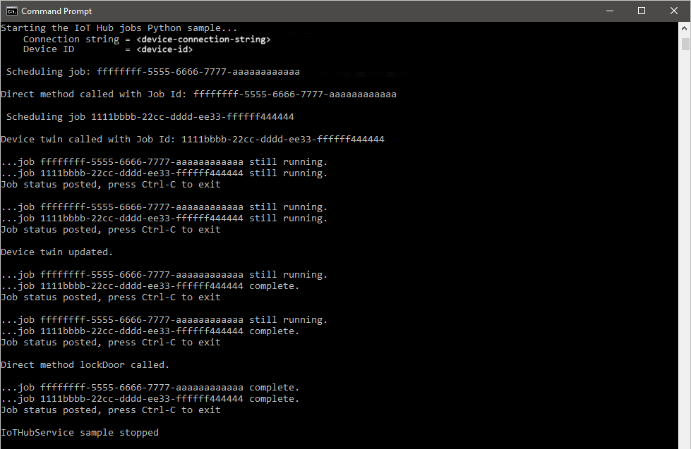

# Schedule and broadcast jobs (Python)

[!INCLUDE [iot-hub-selector-schedule-jobs](../../includes/iot-hub-selector-schedule-jobs.md)]

Azure IoT Hub is a fully managed service that enables a back-end app to create and track jobs that schedule and update millions of devices.  Jobs can be used for the following actions:

* Update desired properties
* Update tags
* Invoke direct methods

Conceptually, a job wraps one of these actions and tracks the progress of execution against a set of devices, which is defined by a device twin query.  For example, a back-end app can use a job to invoke a reboot method on 10,000 devices, specified by a device twin query and scheduled at a future time.  That application can then track progress as each of those devices receive and execute the reboot method.

Learn more about each of these capabilities in these articles:

* Device twin and properties: [Get started with device twins](iot-hub-python-twin-getstarted.md) and [Tutorial: How to use device twin properties](tutorial-device-twins.md)

* Direct methods: [IoT Hub developer guide - direct methods](iot-hub-devguide-direct-methods.md) and [Tutorial: direct methods](quickstart-control-device-python.md)

[!INCLUDE [iot-hub-basic](../../includes/iot-hub-basic-whole.md)]

This tutorial shows you how to:

* Create a Python simulated device app that has a direct method, which enables **lockDoor**, which can be called by the solution back end.

* Create a Python console app that calls the **lockDoor** direct method in the simulated device app using a job and updates the desired properties using a device job.

At the end of this tutorial, you have two Python apps:

**simDevice.py**, which connects to your IoT hub with the device identity and receives a **lockDoor** direct method.

**scheduleJobService.py**, which calls a direct method in the simulated device app and updates the device twin's desired properties using a job.

> [!NOTE]
> The **Azure IoT SDK for Python** does not directly support **Jobs** functionality. Instead this tutorial offers an alternate solution utilizing asynchronous threads and timers. For further updates, see the **Service Client SDK** feature list on the [Azure IoT SDK for Python](https://github.com/Azure/azure-iot-sdk-python) page.
>

[!INCLUDE [iot-hub-include-python-sdk-note](../../includes/iot-hub-include-python-sdk-note.md)]

## Prerequisites

[!INCLUDE [iot-hub-include-python-v2-installation-notes](../../includes/iot-hub-include-python-v2-installation-notes.md)]

## Create an IoT hub

[!INCLUDE [iot-hub-include-create-hub](../../includes/iot-hub-include-create-hub.md)]

## Register a new device in the IoT hub

[!INCLUDE [iot-hub-include-create-device](../../includes/iot-hub-include-create-device.md)]

## Create a simulated device app

In this section, you create a Python console app that responds to a direct method called by the cloud, which triggers a simulated **lockDoor** method.

1. At your command prompt, run the following command to install the **azure-iot-device** package:

    ```cmd/sh
    pip install azure-iot-device
    ```

2. Using a text editor, create a new **simDevice.py** file in your working directory.

3. Add the following `import` statements and variables at the start of the **simDevice.py** file. Replace `deviceConnectionString` with the connection string of the device you created above:

    ```python
    import threading
    import time
    from azure.iot.device import IoTHubDeviceClient, MethodResponse

    CONNECTION_STRING = "{deviceConnectionString}"
    ```

4. Add the following function callback to handle the **lockDoor** method:

    ```python
    def lockdoor_listener(client):
        while True:
            # Receive the direct method request
            method_request = client.receive_method_request("lockDoor")  # blocking call
            print( "Locking Door!" )

            resp_status = 200
            resp_payload = {"Response": "lockDoor called successfully"}
            method_response = MethodResponse(method_request.request_id, resp_status, resp_payload)
            client.send_method_response(method_response)
    ```

5. Add another function callback to handle device twins updates:

    ```python
    def twin_update_listener(client):
        while True:
            patch = client.receive_twin_desired_properties_patch()  # blocking call
            print ("")
            print ("Twin desired properties patch received:")
            print (patch)
    ```

6. Add the following code to register the handler for the **lockDoor** method. Also include the `main` routine:

    ```python
    def iothub_jobs_sample_run():
        try:
            client = IoTHubDeviceClient.create_from_connection_string(CONNECTION_STRING)

            print( "Beginning to listen for 'lockDoor' direct method invocations...")
            lockdoor_listener_thread = threading.Thread(target=lockdoor_listener, args=(client,))
            lockdoor_listener_thread.daemon = True
            lockdoor_listener_thread.start()

            # Begin listening for updates to the Twin desired properties
            print ( "Beginning to listen for updates to Twin desired properties...")
            twin_update_listener_thread = threading.Thread(target=twin_update_listener, args=(client,))
            twin_update_listener_thread.daemon = True
            twin_update_listener_thread.start()
            
            while True:
                time.sleep(1000)

        except KeyboardInterrupt:
            print ( "IoTHubDeviceClient sample stopped" )

    if __name__ == '__main__':
        print ( "Starting the IoT Hub Python jobs sample..." )
        print ( "IoTHubDeviceClient waiting for commands, press Ctrl-C to exit" )

        iothub_jobs_sample_run()
    ```

7. Save and close the **simDevice.py** file.

> [!NOTE]
> To keep things simple, this tutorial does not implement any retry policy. In production code, you should implement retry policies (such as an exponential backoff), as suggested in the article, [Transient Fault Handling](/azure/architecture/best-practices/transient-faults).
>

## Get the IoT hub connection string

In this article, you create a backend service that invokes a direct method on a device and updates the device twin. The service needs the **service connect** permission to call a direct method on a device. The service also needs the **registry read** and **registry write** permissions to read and write the identity registry. There is no default shared access policy that contains only these permissions, so you need to create one.

To create a shared access policy that grants **service connect**, **registry read**, and **registry write** permissions and to get a connection string for this policy, follow these steps:

1. Open your IoT hub in the [Azure portal](https://portal.azure.com). The easiest way to get to your IoT hub is to select **Resource groups**, select the resource group where your IoT hub is located, and then select your IoT hub from the list of resources.

2. On the left-side pane of your IoT hub, select **Shared access policies**.

3. From the top menu above the list of policies, select **Add**.

4. On the **Add a shared access policy** pane, enter a descriptive name for your policy; for example: *serviceAndRegistryReadWrite*. Under **Permissions**, select **Service connect** and **Registry write** (**Registry read** is automatically selected when you select **Registry write**). Then select **Create**.

    

5. Back on the **Shared access policies** pane, select your new policy from the list of policies.

6. Under **Shared access keys**, select the copy icon for the **Connection string -- primary key** and save the value.

    

For more information about IoT Hub shared access policies and permissions, see [Access control and permissions](./iot-hub-devguide-security.md#access-control-and-permissions).

## Schedule jobs for calling a direct method and updating a device twin's properties

In this section, you create a Python console app that initiates a remote **lockDoor** on a device using a direct method and also updates the device twin's desired properties.

1. At your command prompt, run the following command to install the **azure-iot-hub** package:

    ```cmd/sh
    pip install azure-iot-hub
    ```

2. Using a text editor, create a new **scheduleJobService.py** file in your working directory.

3. Add the following `import` statements and variables at the start of the **scheduleJobService.py** file. Replace the `{IoTHubConnectionString}` placeholder with the IoT hub connection string you copied previously in [Get the IoT hub connection string](#get-the-iot-hub-connection-string). Replace the `{deviceId}` placeholder with the device ID you registered in [Register a new device in the IoT hub](#register-a-new-device-in-the-iot-hub):

    ```python
    import sys
    import time
    import threading
    import uuid

    from azure.iot.hub import IoTHubRegistryManager
    from azure.iot.hub.models import Twin, TwinProperties, CloudToDeviceMethod, CloudToDeviceMethodResult, QuerySpecification, QueryResult

    CONNECTION_STRING = "{IoTHubConnectionString}"
    DEVICE_ID = "{deviceId}"

    METHOD_NAME = "lockDoor"
    METHOD_PAYLOAD = "{\"lockTime\":\"10m\"}"
    UPDATE_PATCH = {"building":43,"floor":3}
    TIMEOUT = 60
    WAIT_COUNT = 5
    ```

4. Add the following function that is used to query for devices:

    ```python
    def query_condition(iothub_registry_manager, device_id):

        query_spec = QuerySpecification(query="SELECT * FROM devices WHERE deviceId = '{}'".format(device_id))
        query_result = iothub_registry_manager.query_iot_hub(query_spec, None, 1)

        return len(query_result.items)
    ```

5. Add the following methods to run the jobs that call the direct method and device twin:

    ```python
    def device_method_job(job_id, device_id, wait_time, execution_time):
        print ( "" )
        print ( "Scheduling job: " + str(job_id) )
        time.sleep(wait_time)

        iothub_registry_manager = IoTHubRegistryManager(CONNECTION_STRING)


        if query_condition(iothub_registry_manager, device_id):
            deviceMethod = CloudToDeviceMethod(method_name=METHOD_NAME, payload=METHOD_PAYLOAD)

            response = iothub_registry_manager.invoke_device_method(DEVICE_ID, deviceMethod)

            print ( "" )
            print ( "Direct method " + METHOD_NAME + " called." )

    def device_twin_job(job_id, device_id, wait_time, execution_time):
        print ( "" )
        print ( "Scheduling job " + str(job_id) )
        time.sleep(wait_time)

        iothub_registry_manager = IoTHubRegistryManager(CONNECTION_STRING)

        if query_condition(iothub_registry_manager, device_id):

            twin = iothub_registry_manager.get_twin(DEVICE_ID)
            twin_patch = Twin(properties= TwinProperties(desired=UPDATE_PATCH))
            twin = iothub_registry_manager.update_twin(DEVICE_ID, twin_patch, twin.etag)

            print ( "" )
            print ( "Device twin updated." )
    ```

6. Add the following code to schedule the jobs and update job status. Also include the `main` routine:

    ```python
    def iothub_jobs_sample_run():
        try:
            method_thr_id = uuid.uuid4()
            method_thr = threading.Thread(target=device_method_job, args=(method_thr_id, DEVICE_ID, 20, TIMEOUT), kwargs={})
            method_thr.start()

            print ( "" )
            print ( "Direct method called with Job Id: " + str(method_thr_id) )

            twin_thr_id = uuid.uuid4()
            twin_thr = threading.Thread(target=device_twin_job, args=(twin_thr_id, DEVICE_ID, 10, TIMEOUT), kwargs={})
            twin_thr.start()

            print ( "" )
            print ( "Device twin called with Job Id: " + str(twin_thr_id) )

            while True:
                print ( "" )

                if method_thr.is_alive():
                    print ( "...job " + str(method_thr_id) + " still running." )
                else:
                    print ( "...job " + str(method_thr_id) + " complete." )

                if twin_thr.is_alive():
                    print ( "...job " + str(twin_thr_id) + " still running." )
                else:
                    print ( "...job " + str(twin_thr_id) + " complete." )

                print ( "Job status posted, press Ctrl-C to exit" )

                status_counter = 0
                while status_counter <= WAIT_COUNT:
                    time.sleep(1)
                    status_counter += 1

        except Exception as ex:
            print ( "" )
            print ( "Unexpected error {0}" % ex )
            return
        except KeyboardInterrupt:
            print ( "" )
            print ( "IoTHubService sample stopped" )

    if __name__ == '__main__':
        print ( "Starting the IoT Hub jobs Python sample..." )
        print ( "    Connection string = {0}".format(CONNECTION_STRING) )
        print ( "    Device ID         = {0}".format(DEVICE_ID) )

        iothub_jobs_sample_run()
    ```

7. Save and close the **scheduleJobService.py** file.

## Run the applications

You are now ready to run the applications.

1. At the command prompt in your working directory, run the following command to begin listening for the reboot direct method:

    ```cmd/sh
    python simDevice.py
    ```

2. At another command prompt in your working directory, run the following command to trigger the jobs to lock the door and update the twin:
  
    ```cmd/sh
    python scheduleJobService.py
    ```

3. You see the device responses to the direct method and device twins update in the console.

    

    

## Next steps

In this tutorial, you used a job to schedule a direct method to a device and the update of the device twin's properties.

To continue getting started with IoT Hub and device management patterns such as remote over the air firmware update, see [How to do a firmware update](tutorial-firmware-update.md).
