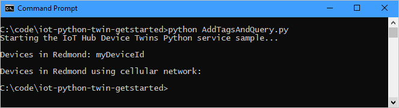
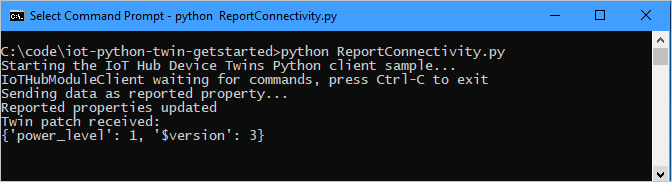
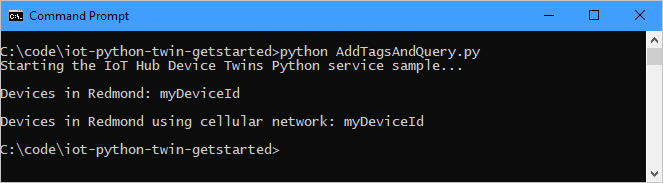

# Get started with device twins (Python)

[!INCLUDE [iot-hub-selector-twin-get-started](../../includes/iot-hub-selector-twin-get-started.md)]

At the end of this tutorial, you will have two Python console apps:

* **AddTagsAndQuery.py**, a Python back-end app, which adds tags and queries device twins.

* **ReportConnectivity.py**, a Python app, which simulates a device that connects to your IoT hub with the device identity created earlier, and reports its connectivity condition.

[!INCLUDE [iot-hub-include-python-sdk-note](../../includes/iot-hub-include-python-sdk-note.md)]

## Prerequisites

[!INCLUDE [iot-hub-include-python-v2-installation-notes](../../includes/iot-hub-include-python-v2-installation-notes.md)]

* Make sure that port 8883 is open in your firewall. The device sample in this article uses MQTT protocol, which communicates over port 8883. This port may be blocked in some corporate and educational network environments. For more information and ways to work around this issue, see [Connecting to IoT Hub (MQTT)](iot-hub-mqtt-support.md#connecting-to-iot-hub).

## Create an IoT hub

[!INCLUDE [iot-hub-include-create-hub](../../includes/iot-hub-include-create-hub.md)]

## Register a new device in the IoT hub

[!INCLUDE [iot-hub-include-create-device](../../includes/iot-hub-include-create-device.md)]

## Get the IoT hub connection string

[!INCLUDE [iot-hub-howto-twin-shared-access-policy-text](../../includes/iot-hub-howto-twin-shared-access-policy-text.md)]

[!INCLUDE [iot-hub-include-find-custom-connection-string](../../includes/iot-hub-include-find-custom-connection-string.md)]

## Create the service app

In this section, you create a Python console app that adds location metadata to the device twin associated with your **{Device ID}**. It then queries the device twins stored in the IoT hub selecting the devices located in Redmond, and then the ones that are reporting a cellular connection.

1. In your working directory, open a command prompt and install the **Azure IoT Hub Service SDK for Python**.

   ```cmd/sh
   pip install azure-iot-hub
   ```

2. Using a text editor, create a new **AddTagsAndQuery.py** file.

3. Add the following code to import the required modules from the service SDK:

   ```python
   import sys
   from time import sleep
   from azure.iot.hub import IoTHubRegistryManager
   from azure.iot.hub.models import Twin, TwinProperties, QuerySpecification, QueryResult
   ```

4. Add the following code. Replace `[IoTHub Connection String]` with the IoT hub connection string you copied in [Get the IoT hub connection string](#get-the-iot-hub-connection-string). Replace `[Device Id]` with the device ID you registered in [Register a new device in the IoT hub](#register-a-new-device-in-the-iot-hub).
  
    ```python
    IOTHUB_CONNECTION_STRING = "[IoTHub Connection String]"
    DEVICE_ID = "[Device Id]"
    ```

5. Add the following code to the **AddTagsAndQuery.py** file:

    ```python
    def iothub_service_sample_run():
        try:
            iothub_registry_manager = IoTHubRegistryManager(IOTHUB_CONNECTION_STRING)

            new_tags = {
                    'location' : {
                        'region' : 'US',
                        'plant' : 'Redmond43'
                    }
                }

            twin = iothub_registry_manager.get_twin(DEVICE_ID)
            twin_patch = Twin(tags=new_tags, properties= TwinProperties(desired={'power_level' : 1}))
            twin = iothub_registry_manager.update_twin(DEVICE_ID, twin_patch, twin.etag)

            # Add a delay to account for any latency before executing the query
            sleep(1)

            query_spec = QuerySpecification(query="SELECT * FROM devices WHERE tags.location.plant = 'Redmond43'")
            query_result = iothub_registry_manager.query_iot_hub(query_spec, None, 100)
            print("Devices in Redmond43 plant: {}".format(', '.join([twin.device_id for twin in query_result.items])))

            print()

            query_spec = QuerySpecification(query="SELECT * FROM devices WHERE tags.location.plant = 'Redmond43' AND properties.reported.connectivity = 'cellular'")
            query_result = iothub_registry_manager.query_iot_hub(query_spec, None, 100)
            print("Devices in Redmond43 plant using cellular network: {}".format(', '.join([twin.device_id for twin in query_result.items])))

        except Exception as ex:
            print("Unexpected error {0}".format(ex))
            return
        except KeyboardInterrupt:
            print("IoT Hub Device Twin service sample stopped")
    ```

    The **IoTHubRegistryManager** object exposes all the methods required to interact with device twins from the service. The code first initializes the **IoTHubRegistryManager** object, then updates the device twin for **DEVICE_ID**, and finally runs two queries. The first selects only the device twins of devices located in the **Redmond43** plant, and the second refines the query to select only the devices that are also connected through a cellular network.

6. Add the following code at the end of  **AddTagsAndQuery.py** to implement the **iothub_service_sample_run** function:

    ```python
    if __name__ == '__main__':
        print("Starting the Python IoT Hub Device Twin service sample...")
        print()

        iothub_service_sample_run()
    ```

7. Run the application with:

    ```cmd/sh
    python AddTagsAndQuery.py
    ```

    You should see one device in the results for the query asking for all devices located in **Redmond43** and none for the query that restricts the results to devices that use a cellular network.

    

In the next section, you create a device app that reports the connectivity information and changes the result of the query in the previous section.

## Create the device app

In this section, you create a Python console app that connects to your hub as your **{Device ID}**, and then updates its device twin's reported properties to contain the information that it is connected using a cellular network.

1. From a command prompt in your working directory, install the **Azure IoT Hub Device SDK for Python**:

    ```cmd/sh
    pip install azure-iot-device
    ```

2. Using a text editor, create a new **ReportConnectivity.py** file.

3. Add the following code to import the required modules from the device SDK:

    ```python
    import time
    import threading
    from azure.iot.device import IoTHubModuleClient
    ```

4. Add the following code. Replace the `[IoTHub Device Connection String]` placeholder value with the device connection string you copied in [Register a new device in the IoT hub](#register-a-new-device-in-the-iot-hub).

    ```python
    CONNECTION_STRING = "[IoTHub Device Connection String]"
    ```

5. Add the following code to the **ReportConnectivity.py** file to implement the device twins functionality:

    ```python
    def twin_update_listener(client):
        while True:
            patch = client.receive_twin_desired_properties_patch()  # blocking call
            print("Twin patch received:")
            print(patch)

    def iothub_client_init():
        client = IoTHubModuleClient.create_from_connection_string(CONNECTION_STRING)
        return client

    def iothub_client_sample_run():
        try:
            client = iothub_client_init()

            twin_update_listener_thread = threading.Thread(target=twin_update_listener, args=(client,))
            twin_update_listener_thread.daemon = True
            twin_update_listener_thread.start()

            # Send reported 
            print ( "Sending data as reported property..." )
            reported_patch = {"connectivity": "cellular"}
            client.patch_twin_reported_properties(reported_patch)
            print ( "Reported properties updated" )

            while True:
                time.sleep(1000000)
        except KeyboardInterrupt:
            print ( "IoT Hub Device Twin device sample stopped" )
    ```

    The **IoTHubModuleClient** object exposes all the methods you require to interact with device twins from the device. The previous code, after it initializes the **IoTHubModuleClient** object, retrieves the device twin for your device and updates its reported property with the connectivity information.

6. Add the following code at the end of  **ReportConnectivity.py** to implement the **iothub_client_sample_run** function:

    ```python
    if __name__ == '__main__':
        print ( "Starting the Python IoT Hub Device Twin device sample..." )
        print ( "IoTHubModuleClient waiting for commands, press Ctrl-C to exit" )

        iothub_client_sample_run()
    ```

7. Run the device app:

    ```cmd/sh
    python ReportConnectivity.py
    ```

    You should see confirmation the device twin reported properties were updated.

    

8. Now that the device reported its connectivity information, it should appear in both queries. Go back and run the queries again:

    ```cmd/sh
    python AddTagsAndQuery.py
    ```

    This time your **{Device ID}** should appear in both query results.

    

    In your device app, you'll see confirmation that the desired properties twin patch sent by the service app was received.

    

## Next steps

In this tutorial, you configured a new IoT hub in the Azure portal, and then created a device identity in the IoT hub's identity registry. You added device metadata as tags from a back-end app, and wrote a simulated device app to report device connectivity information in the device twin. You also learned how to query this information using the registry.

Use the following resources to learn how to:

* Send telemetry from devices with the [Get started with IoT Hub](quickstart-send-telemetry-python.md) tutorial.

* Configure devices using device twin's desired properties with the [Use desired properties to configure devices](tutorial-device-twins.md) tutorial.

* Control devices interactively (such as turning on a fan from a user-controlled app), with the [Use direct methods](quickstart-control-device-python.md) tutorial.
