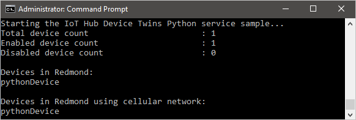

# Get started with device twins (Python)

[!INCLUDE [iot-hub-selector-twin-get-started](../../includes/iot-hub-selector-twin-get-started.md)]

At the end of this tutorial, you will have two Python console apps:

* **AddTagsAndQuery.py**, a Python back-end app, which adds tags and queries device twins.

* **ReportConnectivity.py**, a Python app, which simulates a device that connects to your IoT hub with the device identity created earlier, and reports its connectivity condition.

> [!NOTE]
> The article [Azure IoT SDKs](iot-hub-devguide-sdks.md) provides information about the Azure IoT SDKs that you can use to build both device and back-end apps.

To complete this tutorial you need the following:

* [Python 2.x or 3.x](https://www.python.org/downloads/). Make sure to use the 32-bit or 64-bit installation as required by your setup. When prompted during the installation, make sure to add Python to your platform-specific environment variable. If you are using Python 2.x, you may need to [install or upgrade *pip*, the Python package management system](https://pip.pypa.io/en/stable/installing/).

* If you are using Windows OS, then [Visual C++ redistributable package](https://www.microsoft.com/download/confirmation.aspx?id=48145) to allow the use of native DLLs from Python.

* An active Azure account. (If you don't have an account, you can create a [free account](https://azure.microsoft.com/pricing/free-trial/) in just a couple of minutes.)

> [!NOTE]
> The *pip* packages for `azure-iothub-service-client` and `azure-iothub-device-client` are currently available only for Windows OS. For Linux/Mac OS, please refer to the Linux and Mac OS-specific sections on the [Prepare your development environment for Python](https://github.com/Azure/azure-iot-sdk-python/blob/master/doc/python-devbox-setup.md) post.
>

## Create an IoT hub

[!INCLUDE [iot-hub-include-create-hub](../../includes/iot-hub-include-create-hub.md)]

### Retrieve connection string for IoT hub

[!INCLUDE [iot-hub-include-find-connection-string](../../includes/iot-hub-include-find-connection-string.md)]

## Register a new device in the IoT hub

[!INCLUDE [iot-hub-include-create-device](../../includes/iot-hub-include-create-device.md)]

## Create the service app

In this section, you create a Python console app that adds location metadata to the device twin associated with your **{Device ID}**. It then queries the device twins stored in the IoT hub selecting the devices located in Redmond, and then the ones that are reporting a cellular connection.

1. Open a command prompt and install the **Azure IoT Hub Service SDK for Python**. Close the command prompt after you install the SDK.

   ```
   pip install azure-iothub-service-client
   ```

2. Using a text editor, create a new **AddTagsAndQuery.py** file.

3. Add the following code to import the required modules from the service SDK:

   ```python
   import sys
   import iothub_service_client
   from iothub_service_client import IoTHubRegistryManager, IoTHubRegistryManagerAuthMethod
   from iothub_service_client import IoTHubDeviceTwin, IoTHubError
   ```

4. Add the following code, replacing the placeholder for `[IoTHub Connection String]` and `[Device Id]` with the connection string for the IoT hub and the device ID you created in the previous sections.
  
    ```python
    CONNECTION_STRING = "[IoTHub Connection String]"
    DEVICE_ID = "[Device Id]"

    UPDATE_JSON = "{\"properties\":{\"desired\":{\"location\":\"Redmond\"}}}"

    UPDATE_JSON_SEARCH = "\"location\":\"Redmond\""
    UPDATE_JSON_CLIENT_SEARCH = "\"connectivity\":\"cellular\""
    ```

5. Add the following code to the **AddTagsAndQuery.py** file:

     ```python
    def iothub_service_sample_run():
        try:
            iothub_registry_manager = IoTHubRegistryManager(CONNECTION_STRING)

            iothub_registry_statistics = iothub_registry_manager.get_statistics()
            print ( "Total device count                       : {0}".format(iothub_registry_statistics.totalDeviceCount) )
            print ( "Enabled device count                     : {0}".format(iothub_registry_statistics.enabledDeviceCount) )
            print ( "Disabled device count                    : {0}".format(iothub_registry_statistics.disabledDeviceCount) )
            print ( "" )

            number_of_devices = iothub_registry_statistics.totalDeviceCount
            dev_list = iothub_registry_manager.get_device_list(number_of_devices)

            iothub_twin_method = IoTHubDeviceTwin(CONNECTION_STRING)

            for device in range(0, number_of_devices):
                if dev_list[device].deviceId == DEVICE_ID:
                    twin_info = iothub_twin_method.update_twin(dev_list[device].deviceId, UPDATE_JSON)

            print ( "Devices in Redmond: " )
            for device in range(0, number_of_devices):
                twin_info = iothub_twin_method.get_twin(dev_list[device].deviceId)

                if twin_info.find(UPDATE_JSON_SEARCH) > -1:
                    print ( dev_list[device].deviceId )

            print ( "" )

            print ( "Devices in Redmond using cellular network: " )
            for device in range(0, number_of_devices):
                twin_info = iothub_twin_method.get_twin(dev_list[device].deviceId)

                if twin_info.find(UPDATE_JSON_SEARCH) > -1:
                    if twin_info.find(UPDATE_JSON_CLIENT_SEARCH) > -1:
                        print ( dev_list[device].deviceId )

        except IoTHubError as iothub_error:
            print ( "Unexpected error {0}".format(iothub_error) )
            return
        except KeyboardInterrupt:
            print ( "IoTHub sample stopped" )
    ```

    The **Registry** object exposes all the methods required to interact with device twins from the service. The code first initializes the **Registry** object, then updates the device twin for **deviceId**, and finally runs two queries. The first selects only the device twins of devices located in the **Redmond43** plant, and the second refines the query to select only the devices that are also connected through cellular network.

6. Add the following code at the end of  **AddTagsAndQuery.py** to implement the **iothub_service_sample_run** function:

    ```python
    if __name__ == '__main__':
        print ( "Starting the IoT Hub Device Twins Python service sample..." )

        iothub_service_sample_run()
    ```

7. Run the application with:

    ```cmd/sh
    python AddTagsAndQuery.py
    ```

    You should see one device in the results for the query asking for all devices located in **Redmond43** and none for the query that restricts the results to devices that use a cellular network.

    

In the next section, you create a device app that reports the connectivity information and changes the result of the query in the previous section.

## Create the device app

In this section, you create a Python console app that connects to your hub as your **{Device ID}**, and then updates its device twin's reported properties to contain the information that it is connected using a cellular network.

1. Open a command prompt and install the **Azure IoT Hub Service SDK for Python**. Close the command prompt after you install the SDK.

    ```
    pip install azure-iothub-device-client
    ```

2. Using a text editor, create a new **ReportConnectivity.py** file.

3. Add the following code to import the required modules from the service SDK:

    ```python
    import time
    import iothub_client
    from iothub_client import IoTHubClient, IoTHubClientError, IoTHubTransportProvider, IoTHubClientResult, IoTHubError
    ```

4. Add the following code, replacing the placeholder for `[IoTHub Device Connection String]` with the connection string for the IoT hub device you created in the previous sections.

    ```python
    CONNECTION_STRING = "[IoTHub Device Connection String]"

    # choose HTTP, AMQP, AMQP_WS or MQTT as transport protocol
    PROTOCOL = IoTHubTransportProvider.MQTT

    TIMER_COUNT = 5
    TWIN_CONTEXT = 0
    SEND_REPORTED_STATE_CONTEXT = 0
    ```

5. Add the following code to the **ReportConnectivity.py** file to implement the device twins functionality:

    ```python
    def device_twin_callback(update_state, payload, user_context):
        print ( "" )
        print ( "Twin callback called with:" )
        print ( "    updateStatus: %s" % update_state )
        print ( "    payload: %s" % payload )

    def send_reported_state_callback(status_code, user_context):
        print ( "" )
        print ( "Confirmation for reported state called with:" )
        print ( "    status_code: %d" % status_code )

    def iothub_client_init():
        client = IoTHubClient(CONNECTION_STRING, PROTOCOL)

        if client.protocol == IoTHubTransportProvider.MQTT or client.protocol == IoTHubTransportProvider.MQTT_WS:
            client.set_device_twin_callback(
                device_twin_callback, TWIN_CONTEXT)

        return client

    def iothub_client_sample_run():
        try:
            client = iothub_client_init()

            if client.protocol == IoTHubTransportProvider.MQTT:
                print ( "Sending data as reported property..." )

                reported_state = "{\"connectivity\":\"cellular\"}"

                client.send_reported_state(reported_state, len(reported_state), send_reported_state_callback, SEND_REPORTED_STATE_CONTEXT)

            while True:
                print ( "Press Ctrl-C to exit" )

                status_counter = 0
                while status_counter <= TIMER_COUNT:
                    status = client.get_send_status()
                    time.sleep(10)
                    status_counter += 1	
        except IoTHubError as iothub_error:
            print ( "Unexpected error %s from IoTHub" % iothub_error )
            return
        except KeyboardInterrupt:
            print ( "IoTHubClient sample stopped" )
     ```

    The **Client** object exposes all the methods you require to interact with device twins from the device. The previous code, after it initializes the **Client** object, retrieves the device twin for your device and updates its reported property with the connectivity information.

6. Add the following code at the end of  **ReportConnectivity.py** to implement the **iothub_client_sample_run** function:

    ```python
    if __name__ == '__main__':
        print ( "Starting the IoT Hub Device Twins Python client sample..." )

        iothub_client_sample_run()
    ```

7. Run the device app:

    ```cmd/sh
    python ReportConnectivity.py
    ```

    You should see confirmation the device twins were updated.

    

8. Now that the device reported its connectivity information, it should appear in both queries. Go back and run the queries again:

    ```cmd/sh
    python AddTagsAndQuery.py
    ```

    This time your **{Device ID}** should appear in both query results.

    

## Next steps

In this tutorial, you configured a new IoT hub in the Azure portal, and then created a device identity in the IoT hub's identity registry. You added device metadata as tags from a back-end app, and wrote a simulated device app to report device connectivity information in the device twin. You also learned how to query this information using the registry.

Use the following resources to learn how to:

* Send telemetry from devices with the [Get started with IoT Hub](quickstart-send-telemetry-python.md) tutorial.

* Configure devices using device twin's desired properties with the [Use desired properties to configure devices](tutorial-device-twins.md) tutorial.

* Control devices interactively (such as turning on a fan from a user-controlled app), with the [Use direct methods](quickstart-control-device-python.md) tutorial.